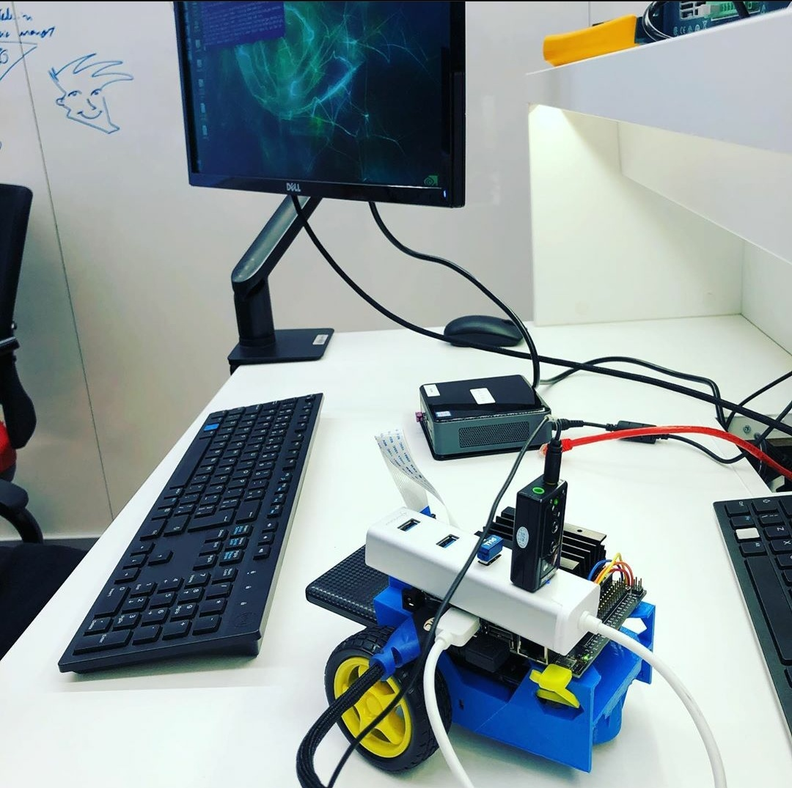

# TensorFlow

- Aluno: Gabriel Moreira
- Curso: Engenharia da Computação
- Semestre: 9
- Contato: 
- Link tutorial oficial: https://github.com/gabsmoreira/speech_recognition
- Ano: 2019

!!! example "Hardware utilizado no tutorial"
    - Jetson Nano
    - JetBot

O objetivo do tutorial é implementar um simples sistema de reconhecimento de comandos por voz com alguns ajustes em uma placa da NVIDIA Jetson Nano.
Tal placa possui uma GPU incluida, o que a torna ideal para executar programas que fazem uso de redes neurais.


## Configurando Jetson Nano

### ISO

Antes de tudo, precisamos preparar a placa Jetson Nano para a prototipação. Para isso, é necessário fazer o download da imagem do sistema operacional oferecido pela própria NVIDIA.

Faça o download da imagem nesse link: https://developer.nvidia.com/jetson-nano-sd-card-image-r3223

Em seguida, faça o download do programa que escreve a imagem no cartão SD, chamado Etcher. Isso facilitará muito o desenvolvimento.

Link do Etcher: https://www.balena.io/etcher

Instale o Etcher e execute-o. A seguinte tela irá aparecer.


Selecione a imagem e o disco corretamente e clique em Flash!


Isso pode levar de 10-15 minutos para ser feito. Vá tomar um café! ☕

Assim que o processo for concluído, remova o cartão do computador e coloque na placa.

### Conectar o hardware

Antes de tudo, conecte a placa Jetson em um monitor usando a saída HDMI. Conecte também o mouse, teclado e o cabo Ethernet.

Está na hora de completar os passos para a configuração do sistema operacional. Isso requer a escolha de um usuário, senha e mais algumas configurações que não são relevantes para o projeto.

Conecte agora o microfone na placa usando um adaptador USB. Para verificar se o microfone foi devidamente reconhecido pelo sistema operacional execute o comando `dmesg`.

```bash
$ sudo dmesg | tail -n10
```

### Atualizando e instalando dependências 

No linux da Jetson Nano, executar:

Update de libs e packages:

```bash
$ sudo apt update
$ sudo apt upgrade
```

Instalar Pip3: 

```bash
$ sudo apt install python3-pip
$ sudo pip3 install -U pip
```

- Instalar dependências do TensorFlow:

```bash
$ sudo apt install libhdf5-serial-dev hdf5-tools libhdf5-dev zlib1g-dev zip libjpeg8-dev
$ sudo pip3 install -U numpy==1.16.1 future==0.17.1 mock==3.0.5 h5py==2.9.0 keras_preprocessing==1.0.5 keras_applications==1.0.6 enum34 futures testresources setuptools protobuf
```

- Instalar Tensorflow:

```bash
$ sudo pip3 install --pre --extra-index-url https://developer.download.nvidia.com/compute/redist/jp/v42 tensorflow-gpu
$ sudo pip3 install -U pip
```

### Testando

Testar instalação do TensorFlow:

```bash
$ python3
```
```python
>>> import tensorflow as tf
```

O comando acima deve executar sem nenhum erro se o TensorFlow tiver sido instalado corretamente.

## Download do exemplo do TensorFlow

O TensorFlow possui um exemplo em seu repositório de utilização de redes neurais para reconhecimento de comandos por voz. Nesse tutorial, utilizaremos esse mesmo exemplo com algumas adaptações, uma vez que o modelo fornecido recebe como input um arquivo de áudio _.wav_. Nosso objetivo é criar um programa que recebe um stream de áudio que deve ser processado continuamente, assim como é visto em assistentes de voz (Google e Siri).

O primeiro passo é clonar o repositório raiz do TensorFlow.

```bash
$ git clone https://github.com/tensorflow/tensorflow.git
```
Esse comando pode demorar um pouco para ser executado, uma vez que o repositório é grande. Vá tomar um café! ☕

Vá até a pasta do exemplo que queremos executar.

```bash
$ cd tensorflow/tensorflow/examples/speech_commands/
```

Note que na pasta existem diversos arquivos, os principais são:

- `train.py` : utilizado para treinar o modelo.

- `freeze.py` : utilizado para compilar o modelo treinado.

- `label_wav.py` : utilizado para reconhecer um comando, dado um arquivo .wav de input e um modelo previamente treinado

O segundo passo é treinar a rede neural para que fique com uma boa acurácia e consiga processar os nossos comandos de voz. Para isso execute o script `train.py` com os seguintes parâmetros.

```bash
$ python3 train.py
```

Para que o modelo fique aceitável, é necessário deixar pelo menos 8 horas treinando. Caso você não tenha esse tempo, o link para o modelo treinado (e compilado) está aqui: https://github.com/gabsmoreira/speech_recognition/raw/master/my_frozen_graph.pb

A placa Jetson não foi projetada para treinar redes neurais, o ideal seria fazer isso em um computador mais potente e depois transferir o arquivo contento os pesos da rede neural via _SCP_.

Com o modelo treinado, agora compile usando o checkpoint que quiser:

```bash
$ python3 freeze.py --start_checkpoint=conv.ckpt-12000 --output_file=my_frozen_graph.pb
```

Agora teste o modelo treinado. Para isso, é necessário ter o path das labels do modelo (que normalmente está localizado no `/tmp/speech_commands_train/conv_labels.txt`)

```bash
$  python3 label_wav.py --graph=my_frozen_graph.pb --labels={PATH DAS LABELS} --wav={PATH DO WAV FILE}
```

### Modificando o script

O primeiro passo é criar um pequeno exemplo de captura e processamento de stream de áudio usando o `pyaudio`.
Antes de criar o novo arquivo, instale a biblioteca acima.

```bash
$ pip3 install pyaudio
```

Crie um arquivo com o nome audio_stream.py e coloque o seguinte código:

```python
from __future__ import absolute_import
from __future__ import division
from __future__ import print_function

import argparse
import sys
import pyaudio
import numpy as np
import audioop
import wave
import tensorflow as tf
import time

FLAGS = None
CHUNK = 4096 # number of data points to read at a time
RATE = 16000 # time resolution of the recording device (Hz)
CHANNELS = 1 # number of channels

FORMAT = pyaudio.paInt16 # audio format from pyaudio
p=pyaudio.PyAudio() # start the PyAudio class
devinfo = p.get_device_info_by_index(0) # get the first recorder device

# stream from pyaudio
stream=p.open(format=FORMAT, channels=CHANNELS, rate=RATE, input=True,
              frames_per_buffer=CHUNK)


while True:
    # transform data into a numpy array
    data = np.fromstring(stream.read(CHUNK), dtype=np.int16)

    # get audio rms
    rms = audioop.rms(data, 2)

    # if audio rms reaches 900 or more set recording for true
    # and start appending the data into the frames array.

    # this means someone is talking 
    if rms > 900: 
        if recording == False:
            recording = True
        frames.append(data)
    else:
        if recording == True:
            time_from_previous = time.time()

            # get data from stream for the next 0.5 seconds
            # after the volume 
            while time.time() - time_from_previous < 0.5:
                data = np.fromstring(stream.read(CHUNK),dtype=np.int16)
                frames.append(data)

            # write frames inside wav file
            _file = wave.open("out.wav","wb")
            _file.setnchannels(CHANNELS)
            _file.setsampwidth(p.get_sample_size(FORMAT))
            _file.setframerate(RATE)
            _file.writeframes(b''.join(frames))
            _file.close()

            # clear frames array since the data was
            # written inside wav file
            frames = []

        recording = False
```

A ideia é criar um stream que comeca a gravar os dados do áudio em uma array assim que o "volume" do áudio passa de 900 (isso pode depender do microfone usado) e para depois de 0.5 segundos assim que o audio volta a ficar com um valor menor que 900. Tal array é escrita em um arquivo .wav constantemente.

Com esse código, transformamos um stream de áudio em diversos .wav que agora podem ser usados no modelo treinado. O que falta então é unir esse código do stream de áudio com a predição do modelo.

??? note "Código fonte, python"

      ```python
      from __future__ import absolute_import
      from __future__ import division
      from __future__ import print_function

      import argparse
      import sys
      import pyaudio
      import numpy as np
      import audioop
      import wave
      import tensorflow as tf
      import time

      FLAGS = None
      CHUNK = 4096 # number of data points to read at a time
      RATE = 16000 # time resolution of the recording device (Hz)
      CHANNELS = 1 # number of channels

      FORMAT = pyaudio.paInt16 # audio format from pyaudio
      p=pyaudio.PyAudio() # start the PyAudio class
      devinfo = p.get_device_info_by_index(0) # get the first recorder device

      # stream from pyaudio
      stream=p.open(format=FORMAT, channels=CHANNELS, rate=RATE, input=True,
                    frames_per_buffer=CHUNK)


      def load_graph(filename):
          """Unpersists graph from file as default graph."""
          with tf.io.gfile.GFile(filename, 'rb') as f:
              graph_def = tf.compat.v1.GraphDef()
              graph_def.ParseFromString(f.read())
              tf.import_graph_def(graph_def, name='')


      def load_labels(filename):
          """Read in labels, one label per line."""
          return [line.rstrip() for line in tf.io.gfile.GFile(filename)]


      def run_graph(wav_data, labels, input_layer_name, output_layer_name,
                    num_top_predictions):
        """Runs the audio data through the graph and prints predictions."""
        with tf.compat.v1.Session() as sess:
          # Feed the audio data as input to the graph.
          #   predictions  will contain a two-dimensional array, where one
          #   dimension represents the input image count, and the other has
          #   predictions per class
          softmax_tensor = sess.graph.get_tensor_by_name(output_layer_name)
          predictions, = sess.run(softmax_tensor, {input_layer_name: wav_data})

          # Sort to show labels in order of confidence
          top_k = predictions.argsort()[-num_top_predictions:][::-1]
          for node_id in top_k:
              human_string = labels[node_id]
              score = predictions[node_id]
              print('%s (score = %.5f)' % (human_string, score))

          return 0


      def label_wav(wav, labels, graph, input_name, output_name, how_many_labels):
          """Loads the model and labels, and runs the inference to print predictions."""
          if not wav or not tf.io.gfile.exists(wav):
              tf.compat.v1.logging.fatal('Audio file does not exist %s', wav)

          if not labels or not tf.io.gfile.exists(labels):
              tf.compat.v1.logging.fatal('Labels file does not exist %s', labels)

          if not graph or not tf.io.gfile.exists(graph):
              tf.compat.v1.logging.fatal('Graph file does not exist %s', graph)

          labels_list = load_labels(labels)

          # load graph, which is stored in the default session
          load_graph(graph)

          with open(wav, 'rb') as wav_file:
              wav_data = wav_file.read()

          run_graph(wav_data, labels_list, input_name, output_name, how_many_labels)


      def prepare(graph, labels):
          """Loads data labels and tensor graphs"""
          labels_list = load_labels(labels)
          load_graph(graph)
          return labels_list

      def main(_):

          # initialize variables and prepare graph
          labels = prepare(FLAGS.graph, FLAGS.labels)
          recording = False
          frames = []
          time_from_previous = 0

          with tf.compat.v1.Session() as sess:

              # loads softmax tensor
              softmax_tensor = sess.graph.get_tensor_by_name(FLAGS.output_name)

              while True:
                  # transform data into a numpy array
                  data = np.fromstring(stream.read(CHUNK), dtype=np.int16)

                  # get audio rms
                  rms = audioop.rms(data, 2)

                  # if audio rms reaches 900 or more set recording for true
                  # and start appending the data into the frames array.

                  # this means someone is talking 
                  if rms > 900: 
                      if recording == False:
                          recording = True
                      frames.append(data)
                  else:
                      if recording == True:
                          time_from_previous = time.time()

                          # get data from stream for the next 0.5 seconds
                          # after the volume 
                          while time.time() - time_from_previous < 0.5:
                              data = np.fromstring(stream.read(CHUNK),dtype=np.int16)
                              frames.append(data)

                          # write frames inside wav file
                          _file = wave.open("out.wav","wb")
                          _file.setnchannels(CHANNELS)
                          _file.setsampwidth(p.get_sample_size(FORMAT))
                          _file.setframerate(RATE)
                          _file.writeframes(b''.join(frames))
                          _file.close()

                          # clear frames array since the data was
                          # written inside wav file
                          frames = []

                          # read wav file to get the input data for
                          # our neural network
                          with open('out.wav', 'rb') as wav_file:
                              wav_data = wav_file.read()

                          # this is where the model predicts based on the input data
                          predictions, = sess.run(softmax_tensor, {FLAGS.input_name: wav_data})

                          # Sort to show labels in order of confidence
                          top_k = predictions.argsort()[-FLAGS.how_many_labels:][::-1]
                          for node_id in top_k:
                              human_string = labels[node_id]
                              score = predictions[node_id]
                              print('%s (score = %.5f)' % (human_string, score))
                      recording = False

      if __name__ == '__main__':
          parser = argparse.ArgumentParser()
          parser.add_argument(
              '--wav', type=str, default='', help='Audio file to be identified.')
          parser.add_argument(
              '--graph', type=str, default='', help='Model to use for identification.')
          parser.add_argument(
              '--labels', type=str, default='', help='Path to file containing labels.')
          parser.add_argument(
              '--input_name',
              type=str,
              default='wav_data:0',
              help='Name of WAVE data input node in model.')
          parser.add_argument(
              '--output_name',
              type=str,
              default='labels_softmax:0',
              help='Name of node outputting a prediction in the model.')
          parser.add_argument(
              '--how_many_labels',
              type=int,
              default=1,
              help='Number of results to show.')

          FLAGS, unparsed = parser.parse_known_args()
          tf.compat.v1.app.run(main=main, argv=[sys.argv[0]] + unparsed)

      ```

Agora para testar o script, basta executar o arquivo python.

```bash
$ python3 audio_stream.py
```

Veja o vídeo da demonstração

<iframe width="560" height="315" src="https://www.youtube.com/embed/7bi1eVpFSaA?controls=0" frameborder="0" allow="accelerometer; autoplay; encrypted-media; gyroscope; picture-in-picture" allowfullscreen></iframe>


## Extra - controle do JetBot por comando de voz

Para fazer essa parte do tutorial, é necessário ter o mesmo material/recursos propostos no link do JetBot.

Link do tutorial do JetBot: https://github.com/NVIDIA-AI-IOT/jetbot/wiki/bill-of-materials

Para montar a parte de hardware, basta seguir esse tutorial: https://github.com/NVIDIA-AI-IOT/jetbot/wiki/Hardware-Setup

A parte de software já temos, basta instalar só mais alguns pacotes.

### Intalar bibliotecas adicionais

```bash
$ cd 
$ wget https://nvidia.box.com/shared/static/phqe92v26cbhqjohwtvxorrwnmrnfx1o.whl -O torch-1.3.0-cp36-cp36m-linux_aarch64.whl
$ pip3 install numpy torch-1.3.0-cp36-cp36m-linux_aarch64.whl
$ pip3 install traitlets
```

### Instalar biblioteca do JetBot

```bash
$ git clone https://github.com/NVIDIA-AI-IOT/jetbot
$ cd jetbot
$ sudo python3 setup.py install
```
Para transformar o código anterior que temos para controlar o robo é bem simples:

Basta instanciar um objeto `robot` antes de todo o script, lembrando sempre de importar a biblioteca do JetBot.
Eu também optei por fazer um dicionário de ações possíveis do robô, para ser mais econômico nos "ifs".

```python
from jetbot import Robot
robot = Robot()
function_chooser = {'left': robot.left, 'right': robot.right, 'go': robot.forward, 'down': robot.backward}
```
Agora o que resta é fazer o robô executar a ação assim que ele reconhece o comando.

```python
for node_id in top_k:
    human_string = labels[node_id]
    score = predictions[node_id]
    if human_string in ['left', 'right', 'go', 'down']:

        # run robot action
        function_chooser[human_string](velocity=0.3)
        time.sleep(0.5)
        robot.stop()
```

O código inteiro do movimento do robô está no arquivo chamado `robot_control.py`

A foto da montagem final ficou assim:



Veja o vídeo da demonstração: 

<iframe width="630" height="315" src="https://www.youtube.com/embed/PZBYRiQEusU" frameborder="0" allow="accelerometer; autoplay; encrypted-media; gyroscope; picture-in-picture" allowfullscreen></iframe>
