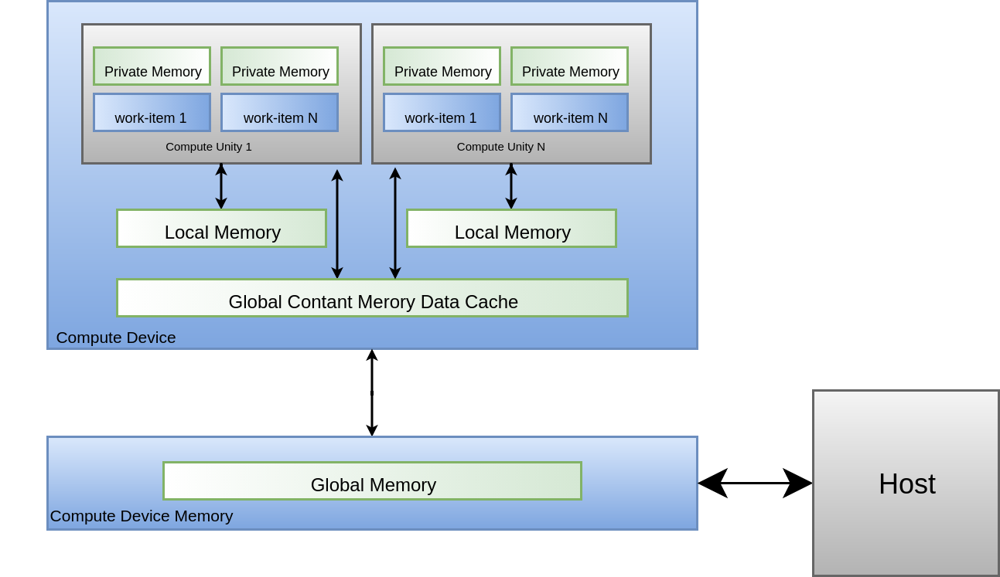

# Leonardo Medeiros  - Tutorial OpenCL

- Aluno: Leonardo Medeiros
- Curso: Engenharia da Computação
- Semestre: 9
- Contato: 
- Link tutorial oficial: https://github.com/Leotayner/Tutorial-OpenCL
- Ano: 2019

!!! example "Hardware utilizado no tutorial"
    - DE10-Standard
    
## OpenCL

[OpenCL](https://software.intel.com/en-us/opencl-sdk) (Open Computing Language) é uma API de baixo nível para programação de alto desempenho em ambientes computacionais heterogêneos compostos por CPUs, GPUs, e outros processadores paralelos como FPGA, permitindo desenvolver aplicações portáveis e eficientes.

### Arquitetura OpenCL

O padrão OpenCL propõe uma arquitetura em que há um host que agrega um ou mais devices, cada device possui unidades de computação que contém elementos de processamento.

O host é responsável pelo reconhecimento e inicialização dos dispositivos, bem como pela transferência de dados e tarefas para execução.

O device é responsável por processar todos esses dados ao executar as tarefas programadas.

Na arquitetura do device, considerando o contexto de programação paralela, o equivalente a uma thread é o work-item, que representa a menor unidade de tarefa. Esses works-itens são agrupados em blocos denominados work-group, onde os works-itens de um mesmo bloco podem se comunicar e se sincronizar

Os work-groups por sua vez são organizados em grids, onde deverão ter a mesma dimensão, podendo a grid ser unidimensional, bidimensional ou tridimensional.


*Figura 1 - Arquitetura OpenCL*
 
De forma geral essa estrutura possui três tipos de memórias:

* Private Memory 
   Estritamente atrelada ao seu respectivo worker, apenas seu worker pode acessa-la
 
* Local memory 
   Estritamente atrelada ao seu respectivo bloco, todos os workers dentro do bloco podem acessá-la
 
* Global Constant Memory data Cache 
   Cache da memoria global do device, todos os blocos podem acessa-la
 
* Global Constant Memory 
   memoria global do device
 
 
 
*Figura 1 - Arquitetura OpenCL*

### FPGA vs CPU

A arquitetura de funcionamento de acessos de memória e configuração do programa na estrutura OpenCL é um pouco diferente da estrutura geral apresentada anteriormente, a única diferença é que a memória do host e do device estão contidas no mesmo dispositivo, consequentemente o tempo de transferência dos dados entre Host e o device é muito menor, nessa estrutura o ARM é responsável por programar a FPGA através do barramento AxI, e transmitir dados para a memória global DDR3, da qual a FPGA faz uso para executar suas tarefas como device.
 
Ao analisar os ganhos ao utilizar o OpenCL em FPGA, além da vantagem do baixo tempo de transferência de dados citado anteriormente, também há as vantagens características desse processador, como flexibilidade de hardware e sua quantidade massiva de cores.
 
  
*Figura 2 - Arquitetura OpenCL-FPGA* 
 
Enquanto que a estrutura em CPU, possui uma quantidade reduzida de cores com unidades aritméticas potentes para reduzir latência de operações.
    
  
*Figura 4 - Arquitetura CPU*
 
Logo a estrutura em FPGA apresenta maior desempenho comparada a CPU para programas paralelos, devido a seu grande número de cores e baixo tempo de transferência de dados, enquanto a CPU apresenta maior desempenho que a fpga para programas sequenciais, devido a suas unidades aritméticas potentes.
 
## Tutorial OpenCL-DE-10

### 1. Requerimentos de Sistema
* Placa Terasic DE10-Standard
* Cartão microSD com ao menos 4GB
* Leitor de cartão microSD
* Cabo USB (tipo A para mini-B)
* Host PC com
  * Porta USB
  * 64-bit Windows 7 ou Linux ( este tutorial utiliza linux)
  * 32GB de memoria é recomendado
  * PuTTY ou Minicom(Linux) utility
  * Intel Quartus Prime v18.1 instalado com licença valida
  * Intel OpenCL v18.1 instalado com licença valida
  * Intel SoC EDS v18.1 instalado

### 2. Configurando a Infra Estrutura

Essa etapa descreve como configurar o ambiente de desenvolvimento do OpenCL no Padrão DE10-Standard.

#### 2.1 Instalação de Software
É necessário instalar os seguintes softwares:

* [Intel Quartus Standard e OpenCL SDK](http://dl.altera.com/opencl)

* [Intel SoC EDS](http://dl.altera.com/soceds)

* [DE10-Standard OpenCL Board Support Package (BSP)](http://de10-standard.terasic.com/cd)

Após a instalação do Quartus Prime e do OpenCL SDK, crie uma pasta com o nome terasic, a qual deve conter a pasta DE10-Standard-Opencl. A pasta criada deve estar no diretório board:

`/intelFPGA/18.1/hld/board`

#### 2.2 Instalação da Licensa Opencl

É necessária uma licença OpenCL para o Intel OpenCL SDK compilar o projeto. Em posse da licença é necessário criar uma variável de ambiente LM_LICENSE_FILE com a atribuição do diretório da licença.

#### 2.3 Configurando variaveis de ambiente
As seguintes variáveis de ambiente devem ser configuradas para o funcionamento do projeto, isso pode ser feito adicionando as variáveis a seguir ao arquivo .bash-rc (configuração permanente), ou em um `arquivo.sh` (configuração temporaria, utilizar `$source arquivo.sh` para ativar o ambiente).

```bash
echo Opencl 18.1
export LOCAL= /media/leonardo
export QUARTUS_ROOTDIR=$LOCAL/FPGA/intelFPGA/18.1/quartus
export ALTERAOCLSDKROOT=$LOCAL/FPGA/intelFPGA/18.1/hld
export PATH=$PATH:$QUARTUS_ROOTDIR/bin:$LOCAL/FPGA/intelFPGA/18.1/embedded/ds-5/bin:$LOCAL/FPGA/intelFPGA/18.1/embedded/ds-5/sw/gcc/bin:$ALTERAOCLSDKROOT/bin:$ALTERAOCLSDKROOT/linux64/bin:
export LD_LIBRARY_PATH=$ALTERAOCLSDKROOT/linux64/lib
export AOCL_BOARD_PACKAGE_ROOT=$ALTERAOCLSDKROOT/board/terasic/de10_standard
export QUARTUS_64BIT=1
export LM_LICENSE_FILE="/home/leonardo/Downloads/1-R3OQLF_License.dat"
export INTELFPGAOCLSDKROOT=$LOCAL/FPGA/intelFPGA/18.1/hld
```

#### 2.3 Verificação do Ambiente

Esta seção mostra como verificar se o ambiente OpenCL está configurado corretamente.

* Verificar Versão 
  
```
  $ aocl version
      aocl 18.1.0.625 (Intel(R) FPGA SDK for OpenCL(TM), Version 18.1.0 Build 625 Standard Edition, Copyright (C) 2018 Intel Corporation)
```

* Verificar placa de destino 
```
$ aoc -list-boards
   Board list:
      de10_standard_sharedonly```
          Board Package: /media/leonardo/FPGA/intelFPGA/18.1/hld/board/terasic/de10_standard
```

### 3. Compilar Projeto

Esta seção mostra como compilar o kernel e o programa host do OpenCL, necessários para executar um programa em OpenCL.

* Compilar Kernel

    * `$ cd /media/leonardo/FPGA/intelFPGA/18.1/hld/board/terasic/de10_standard/test/vector_add_2`

    * `$ aoc device/vector_add.cl -o bin/vector_add.aocx --sw-dimm-partition -board=de10_standard_sharedonly -report`

    * Um arquivo `.aocx` será gerado, este é utilizado para a configuração dos kernels programados, configurando a execução de tarefas e troca de informações entre FPGA e sistema host.

!!! warning
    A copilação do kernel é muito lenta, pode levar horas.

* Compilar Programa Host

    * `$ cd /media/leonardo/FPGA/intelFPGA/18.1/embedded`

    * `$ embedded_command_shell.sh`

    * `$ cd /media/leonardo/FPGA/intelFPGA/18.1/hld/board/terasic/de10_standard/test/vector_add_2`

    * ```$ make ```

    * Um arquivo host será gerado, esse arquivo é basicamente o .o usual de uma compilação do GCC, arquivo intermediário que será utilizado em estágios de execução.

    * Se ao executar o comando make ocorrer erros de include na biblioteca Cl adicione o parâmetro ```../../../../../host/include/``` ao ```INC_DIRS``` no arquivo makefile

### 4. Embarcar Kernel

Utilizaremos uma imagem `.iso` já gerada com as especificações e que já possui todo o sistema necessário para executar o linux com OpenCL.
Através da pasta DE10_standard_opencl extraia o arquivo de10_standard_opencl.img, esse arquivo é uma cópia bit a bit do que deve ser salvo no SDCard.

Quando inserirmos um disco externo no linux o mesmo o associa a um 'device' na pasta '/dev/', para sabermos qual o nome do device que foi atribuído ao SDcard, podemos usar o comando dmesg, que exibe o log do sistema operacional e nele podemos ver qual foi o último hardware detectado e qual device foi atribuído:

```
$ dmesg | tail
  4789.207972] mmc0: new ultra high speed SDR50 SDHC card at address aaaa
  [4789.211680] mmcblk0: mmc0:aaaa SL16G 14.8 GiB
  [ 4789.215857]  mmcblk0: p1 p2 p3
  [ 4988.443942]  mmcblk0: p1 p2 p3
```  

Agora vamos salvar a .iso no SDcard.
 
```
$ sudo dd bs=1M if=de10_standard_opencl.img of=/dev/sdc conv=fsync status=progress
$ sync
```
 
O sync é necessário para que o kernel faça um flush do cache escrevendo realmente no SDCard todos os dados que foram endereçados a ele.

Agora devemos ter duas partições visíveis:

* 524 MiB: FAT32
  
  * Script de configuração do uboot; Kernel comprimido; Device Tree Blob file
  
  * u-boot.scr; zImage; socfpga.dtb

* 1 GiB:
  Filesystem (/)
 
Os arquivos obtidos na compilação do kernel e host, respectivamente `arquivo.ocx` e `host` devem ser colocados na pasta /home/root/ da partição de 1GiB, para serem executadas posteriormente na placa.
 
### 5. Ajustar a placa

Verifique se o interruptor DIP (SW10) MSEL [4: 0] = 01010.


### 5. Conectar-se a placa

Com a placa conectada ao USB do computador, para conectar-se ao kernel da sistema, deve-se utilizar o seguinte comando:
 
```
$ screen /dev/ttyUSB0 115200,cs8
```
### 6. Executar o projeto

Dentro do terminal do sistema:
 
```
$ source ./init_opencl.sh
$ aocl program /dev/acl0 vector_add.aocx
$ ./host
```
 
## Análises de Desempenho CPU vs OPENCL

Ao comparar o tempo de execução do programa `vector_add`, que realiza uma simples soma de vetores, entre a CPU e a FPGA foram obtidos os seguintes resultados.

|Size-Vector   |CPU     |FPGA    |
| -------------|:------:|-------:|
|1000000       |32.011  |6.924   |
|5000000       |159.805 |34.278  |
|10000000      |304.255 |68.462  |
|20000000      |617.676 |180.13  |
 

 
Como pode-se observar o desempenho da execução na FPGA é muito maior, embora a diferença numérica seja pequena, deve-se lembrar que o arquivo de teste realiza uma simples operação de soma de vetor, logo para programas mais complexos, o ganho de desempenho na FPGA seria mais expressivo.

!!! note
    O teste da CPU é single thread
