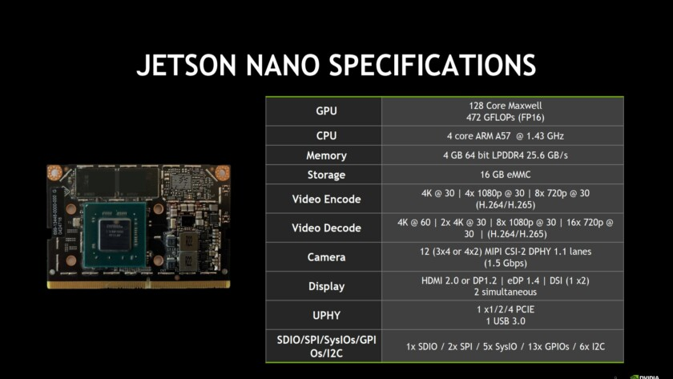
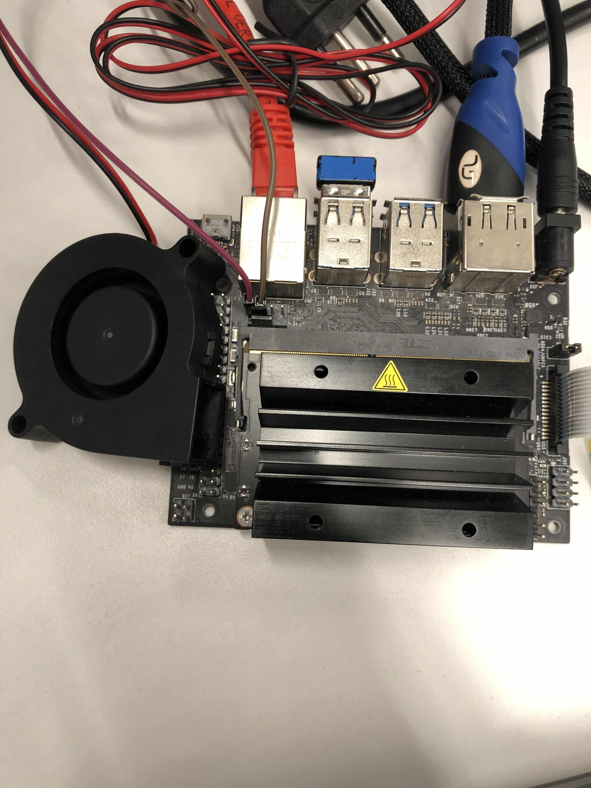
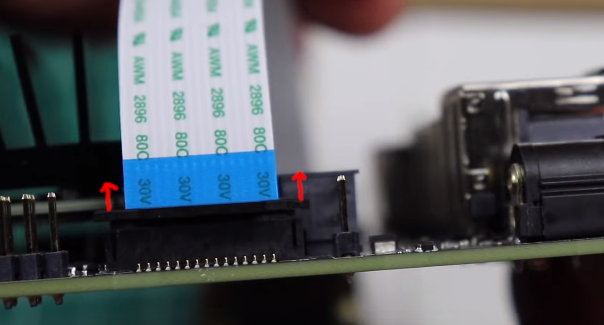

# Pedro de la Penã - Jetson Nano GPU 

- Aluno: Pedro de la Penã
- Curso: Engenharia da Computação
- Semestre: 9
- Contato: 
- Link tutorial oficial: https://github.com/pedrodelapena/TutorialEmbarcados
- Ano: 2019

!!! example "Hardware utilizado no tutorial"
    - Jetson Nano
    - Câmera raspberry pi

Neste projeto iremos utilizar uma placa Jetson Nano para comparar a diferença no desempenho de um código sendo executado em CPU VS GPU.

## Pré Requisitos

Para seguir este tutorial, é necessário:

**- Conexão com a internet**; 
**- Hardware**: Jetson Nano; 
**- Hardware**: SD Card 16 GB OU 32 GB (preferível);  **- Hardware**: Teclado e Mouse USB;  
**- Hardware**: Monitor com entrada HDMI; 
**- Hardware**: Câmera Raspberry Pi 2.1 OU Câmera USB; 
**- Software**: Baixar imagem https://developer.nvidia.com/jetson-nano-sd-card-image-r3221 

## Arquitetura da placa Jetson Nano

A placa Jetson Nano possui uma GPU integrada além de sua CPU ARM Cortex-A57 Quad-Core, o que a faz ser muito utilizada em aplicações de processamento de imagens e também em *Machine Learning* com o uso de redes neurais. 
A lista completa de seus componentes e especificações está a seguir:


### NVIDIA Tegra X1 SoC (GPU)

A Jetson Nano possui um *System On a Chip* (SoC) Tegra X1 Maxell, frequentemente encontrado em tablets que são baseados no sistema Android. Este SoC possibilita o uso softwares como OpenGL, CUDA e também DirectX. Com um *clock* máximo de até 1000 MHz, a GPU oferece 256 *shader-cores* e é capaz de codificar vídeos em 30fps e decodificar em 60fps.

## Gravando um SDCard e inicializando o Linux

### Configurando o sistema operacional no SD card

Após realizar o download da imagem, conecte o SD card em um adaptador e então no seu computador. Agora é preciso extrair a imagem e copiá-la para o driver de maneira que o sistema operacional funcione. Para realizar o processo utilizando utilizando uma interface gráfica, [faça o dowload do Etcher](https://www.balena.io/etcher/). O processo de *flashing* é um pouco demorado, levando cerca de 10-15 minutos. Você pode meditar um pouco ou então pode ir dar uma volta e tomar um café!


Caso você prefira realizar o processo de forma mais *raiz*, você também o pode fazer pela linha de comando. Para isto, descubra o nome e localização do seu flash drive com `dmesg | tail`. Após encontrar o drive, extraia o arquivo para o SD card com o comando:

```bash
$ /usr/bin/unzip -p ~/[LOCAL_DE_DOWNLOAD]/jetson_nano_devkit_sd_card.zip 
$ sudo /bin/dd of=/dev/sd[NOME_DO_DRIVE] bs=1M status=progress
```
Após finalizado o processo, remova o drive de seu computador.

### Inserindo o SD card na placa Jetson Nano

A entrada do cartão de memória não é muito visível para aqueles que estão tendo o primeiro contato com a placa. Aqui há uma imagem para auxilia-lo(a) a encontrar a entrada do cartão: 


### Primeiro boot

Com o cartão de memória já inserido, é preciso conectar os cabos na placa. Não há "botão de ligar ou desligar" na placa, e o boot começa automaticamente quando o cabo de alimentação (supply de 5V (USB) OU fonte) estiver conectado. Além disso, lembre-se que <u>será preciso conexão com a internet para os próximos passos</u>.

Após inserir as configurações de formato de teclado, região e informações 'pessoais' do ambiente Linux, a placa reiniciará e então estará pronta para uso.


Para maior comodidade, recomenda-se que a suspensão automática e *screen lock* sejam desativadas em `All Settings -> Brightness & Lock`, dado que alguns downloads e instalações possam demorar *um pouco*.

### Atualizando libs e packages

Já que acabamos de configurar o sistema operacional, é necessário executar os comandos `sudo apt-get update` e `sudo apt-get upgrade`.

### Configurando o ambiente Python

Para instalar bibliotecas adicionais, é preciso instalar o pip. Para isto, execude os comandos a seguir:

```
$ wget https://bootstrap.pypa.io/get-pip.py
$ sudo python3 get-pip.py
```

### Configurando o ambiente CUDA

```
$ wget http://developer.download.nvidia.com/compute/cuda/10.2/Prod/local_installers/cuda_10.2.89_440.33.01_linux.run
$ sudo sh cuda_10.2.89_440.33.01_linux.run
```

## Configurando o Ambiente OpenCV

!!! note
    Esse aqui demora... E MUITO! (~4 horas) 

!!! warning
    **IMPORTANTE!**  Conecte um cooler à placa e faça questão de utilizar a fonte de alimentação normal em relação à USB para este processo, já que ele demanda MUITA potência e a placa atingir altas temperaturas, o que pode levar ao seu superaquecimento.



Com o cooler instalado, rode as seguintes linhas de comando para instalar e compilar o OpenCV. E lembrando, é uma looooooonga espera.

```
$ wget https://github.com/AastaNV/JEP/blob/master/script/install_opencv4.1.1_Jetson.sh
$ sudo sh install_opencv4.1.1_Jetson.sh
$ export PYTHONPATH=/usr/local/python
```

Após realizada a build, abra um terminal python3 e rode o seguinte código para testar o OpenCV:

```python
import cv2
print(cv2.getBuildInformation())
```

A partir deste comando, é possivel visualizar se o CUDA OpenCV está configurado, no campo `NVIDIA CUDA`


## Instalação Pytorch

A biblioteca Pytorch possui funções que tornam possível a utilização da GPU no ambiente Python. Esta biblioteca será utilizada para fazer alguns testes e comparações mais para frente no tutorial.

```
$ wget https://nvidia.box.com/shared/static/phqe92v26cbhqjohwtvxorrwnmrnfx1o.whl -O torch-1.3.0-cp36-cp36m-linux_aarch64.whl
$ pip3 install numpy torch-1.3.0-cp36-cp36m-linux_aarch64.whl
```

Caso algum erro de dependência relacionado ao numpy ocorra, reinstale-o.

```
$ sudo pip uninstall numpy
$ pip3 install numpy --user
```

### CPU vs GPU
A diferença no desempenho de certos códigos executados em CPU ou GPU é dada pela quantidade de cálculos em paralelo que cada um dos hardwares consegue realizar. Dependendo da arquitetura dos hardwares, uma GPU pode executar centenas - ou até milhares - de vezes mais instruções por *clock* em relação à CPU. Por conta disto, GPUs são largamente utilizadas em processos que podem ser amplamente divididos e paralelizados em blocos, como é o caso da multiplicação de matrizes com muitas linhas e colunas. O simples exemplo a seguir deixa evidente a diferença no desempenho.


Código em CPU:

```python
import numpy as np
import time

x = np.random.rand(7000,16)
y = np.random.rand(16, 7000)
start = time.time()
z = np.matmul(x,y)
end = time.time()

print(z)
print("\nElapsed time CPU:",end-start,"seconds")
```

Código em GPU:

``` python
import torch
import time

x = torch.randn(7000,16)
y = torch.randn(16, 7000)
start = time.time()
z = torch.matmul(x, y)
end = time.time()

print(z)
print("\nElapsed time GPU:",end-start,"seconds")
```

## CUDA OpenCV

A GPU também é de fundamental uso em outras aplicações como a rederização de vídeos e imagens e também no treinamento de modelos de Machine Learning e redes neurais. Desta forma,a biblioteca OpenCV pode ser utilizada para realizar tais tarefas na GPU. 

### Instalação da Câmera

Caso esteja utilizando uma câmera USB, pule esta etapa.

Com a Jetson Nano <u>desligada de todas as fontes de energia</u> e com a câmera Raspberry Pi 2.1 (1.3 não funciona), levante a trava localzada em um dos cantos da placa, forçando-a para cima.



Em seguida, insira o conector da câmera (com "a parte azul voltada para fora") e então pressione a trava novamente para baixo.

### Testando a Câmera Raspberry Pi

Após conectada, teste a câmera para checar se ela realmente está funcional com a seguinte linha de código no terminal.

```bash
$ gst-launch-1.0 nvarguscamerasrc ! 'video/x-raw(memory:NVMM),width=3820, height=2464, framerate=21/1, format=NV12' ! nvvidconv flip-method=0 ! 'video/x-raw,width=960, height=616' ! nvvidconv ! nvegltransform ! nveglglessink -e
```

### Exemplo e comparação OpenCV vs OpenCV CUDA


O código à seguir foi adaptado do Jetson Nano Hacks, sendo que o original pode ser encontrado [neste link](https://github.com/JetsonHacksNano/CSI-Camera/blob/master/simple_camera.py). Neste código é testada a diferença de desempenho da CPU em relação à GPU.

```python
import cv2
import time

def gstreamer_pipeline(
    capture_width=640,
    capture_height=360,
    display_width=640,
    display_height=360,
    framerate=60,
    flip_method=0,
):
    return (
        "nvarguscamerasrc ! "
        "video/x-raw(memory:NVMM), "
        "width=(int)%d, height=(int)%d, "
        "format=(string)NV12, framerate=(fraction)%d/1 ! "
        "nvvidconv flip-method=%d ! "
        "video/x-raw, width=(int)%d, height=(int)%d, format=(string)BGRx ! "
        "videoconvert ! "
        "video/x-raw, format=(string)BGR ! appsink"
        % (
            capture_width,
            capture_height,
            framerate,
            flip_method,
            display_width,
            display_height,
        )
    )


def show_camera():
    # To flip the image, modify the flip_method parameter (0 and 2 are the most common)
    print(gstreamer_pipeline(flip_method=0))
    cap = cv2.VideoCapture(gstreamer_pipeline(flip_method=0), cv2.CAP_GSTREAMER)
    if cap.isOpened():
        window_handle = cv2.namedWindow("CSI Camera", cv2.WINDOW_AUTOSIZE)
        # Window
        while cv2.getWindowProperty("CSI Camera", 0) >= 0:
            ret_val, img = cap.read(); 
            start = time.time()
            #Alterar aqui para "c2.cuda.flip()" ou "cv2.flip()"
            img2 = cv2.cuda.flip(img, 1)
            end = time.time()
            print("Elapsed time",end-start)
            cv2.imshow("CSI Camera", img2)
            keyCode = cv2.waitKey(30) & 0xFF
            # Stop the program on the ESC key
            if keyCode == 27:
                break
        cap.release()
        cv2.destroyAllWindows()
    else:
        print("Unable to open camera")


if __name__ == "__main__":
    show_camera()
```

Neste caso, devido ao fato de ser uma simples alteração na imagem como um *flip*, o programa demora mais para enviar a imagem para a GPU que realizar todo o processo na CPU. Contudo, com mais processos e operações, o ganho de desempenho da GPU fica evidente. Além disso, para descobrir todas as funções do módulo CUDA, abra um terminal Python3 e insira a linha `dir(cv2.cuda)`. 
