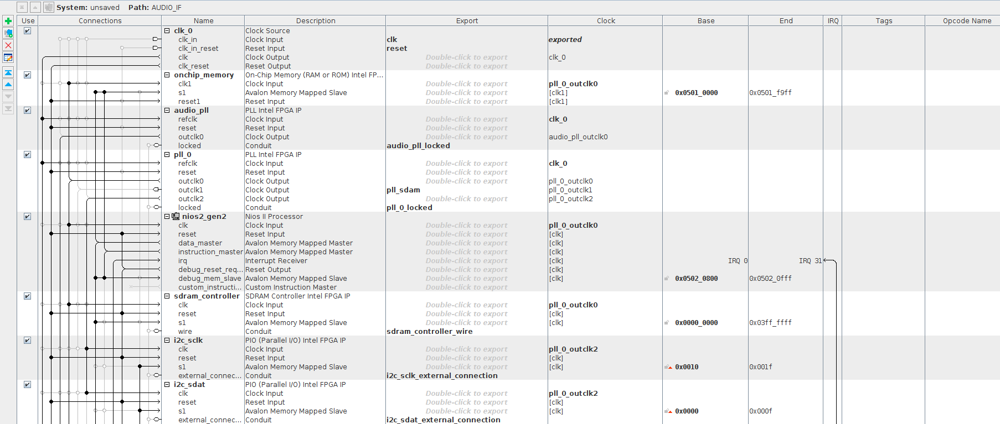
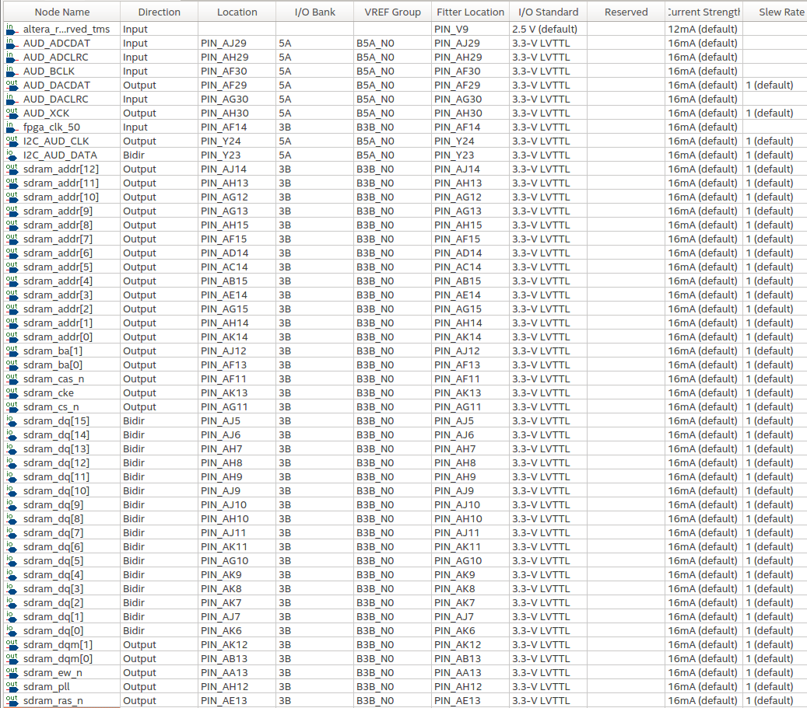

# Coloque aqui o nome do tutorial de vocês

- **Alunes:** Francisco Ciol R. Aveiro
- **Curso:** Engenharia da Computação
- **Semestre:** 9
- **Contato:** franciscocra@al.insper.edu.br
- **Ano:** 2020

## Começando

Para seguir esse tutorial é necessário:

- **Hardware:** 
    - DE10-Standard e acessórios
    - Cabo auxiliar de audio(P2)
- **Softwares:** Quartus 18.01
- **Documentos:** [DE10-Standard_User_manual.pdf](https://github.com/Insper/DE10-Standard-v.1.3.0-SystemCD/tree/master/Manual)

## Motivação

A motivação desse projeto é poder trabalhar com processamento de Audio em tempo real usando o o CODEC de audio do DE10-Standard. Por conta da complexidade necessária para desenvolver todas as partes necessárias para esse projeto, esse tutorial vai se basear no exemplo de Audio da propria placa 'Audio Recording and Playing', e com isso criar um projeto que dê base para tratar o audio em tempo real.

----------------------------------------------

## Periférico Inicial

Para começar, crie um novo projeto vazio no Quartus. Uma vez criado o projeto, vamos começar criando o IP do próprio exemplo da Terasic('Audio Recording and Playing'). Para criar o IP, baixe o arquivo compactado a seguir: 
    
[TERASIC AUDIO](Files/TERASIC_.zip)

Descompacte e coloque a pasta dentro do diretório **IP** do projeto(caso não exista, crie ele). Dentro de **TERASIC_AUDIO** use os arquivos **AUDIO_IF.v**, **AUDIO_DAC.v**, **AUDIO_ADC.v** e **audio_fifo.v** na criação do IP, garantindo que o **AUDIO_IF.v** seja o **TOP level**. 


## Platform Designer
Uma vez que o IP foi adicionado ao projeto, dentro da pasta 'IP', vamos cuidar do PD(Platform Designer) desse projeto.
Para isso precisamos adicionar os seguintes componentes:

- AUDIO_IF: (**AUDIO_IF**)


- On-Chip Memory(RAM or ROM) Intel FPGA IP: (**onchip_memory**)
    - Alterar o **Total memory size** para **64000**.

- PLL Intel FPGA IP: (**audio_pll**)
    - PLL de Audio.
    - Alterar o **PLL Mode** para **Fractional-N PLL**.
    - Alterar **Reference Clock Frequency** para **50.0 MHz**.
    - Alterar **Number of Clocks** para **1**.
    - Alterar o **Desired Frequency** para **18.432 MHz**.

- PLL Intel FPGA IP: (**pll_0**)
    - PLL dos outros componentes.
    - Alterar o **PLL Mode** para **Fractional-N PLL**.
    - Alterar **Reference Clock Frequency** para **50.0 MHz**.
    - Alterar **Number of Clocks** para **3**.
    - Alterar o **Desired Frequency** do **outclk0** para **100 MHz**.
    - Alterar o **Desired Frequency** do **outclk1** para **100 MHz**.
        - Alterar o **Phase Shift units** do **outclk1** para **degrees**.
        - Alterar o **Phase Shift** do **outclk1** para **-90**.
    - Alterar o **Desired Frequency** do **outclk2** para **10 MHz**.

- Nios II Processor: (**nios2_gen2**)
    - Precessador NIOS.
    - Escolher o **Nios II/e**.

- SDRAM Controller Intel FPGA IP: (**sdram_controller**)
    - Alterar **Data Width** para **16 Bits**.
    - Alterar **ROW** para **13**.
    - Alterar **Column** para **10**.

- PIO (Parallel I/O) Intel FPGA IP: (**i2c_sclk**)
    - Alterar **Width** para **1**.
    - Alterar **Direction** para **Output**.

- PIO (Parallel I/O) Intel FPGA IP: (**i2c_sdat**)
    - Alterar **Width** para **1**.
    - Alterar **Direction** para **Bidir**.

- Avalon-MM Clock Crossing Bridge: (**crossing_bridge**)
    - Alterar **Data width** para **32**.
    - Alterar **Symbol width** para **8**.
    - Alterar **Address width** para **9**.
    - Alterar **Command FIFO depth** para **32**.
    - Alterar **Response FIFO depth** para **64**.
    - Alterar **Master clock domainsynchronizer depth** para **3**.
    - Alterar **Slave clock domainsynchronizer depth** para **3**.
    

- JTAG UART Intel FPGA IP: (**jtag_uart_0**)


Conectar as periféricos conforme as seguintes imagens:




Uma vez feito isso, gere o HDL. 

Esse projeto faz uso do ==Avalon-MM Clock Crossing Bridge== para que os dados do periférico de audio fiquem assincronos ao processador. Então o PIO ==I2C== alimenta o  ==Avalon-MM Clock Crossing Bridge== e quando o 'buffer' dele estiver cheio, o processador pode puxar essa informação. Da mesma forma o processador pode enviar toda a informação de audio em um grande pacote e esse pacote é então tocado de forma assincrona do processador.


## Main VHDL

Assim que for gerado o PD, volte para o **TOP-FILE** do seu projeto VHDL e coloque o seguinte código

??? codigo
    ``` vhdl
    library IEEE;
    use IEEE.std_logic_1164.all;

    entity AUDIO_LIVE is
        port (
            fpga_clk_50			:	in		std_logic;
            
            AUD_XCK				:	out 	std_logic;
            AUD_ADCDAT			:	in		std_logic;
            AUD_ADCLRC			:	in		std_logic;
            AUD_DACDAT			:	out	std_logic;
            AUD_DACLRC			:	in		std_logic;
            AUD_BCLK				:	in		std_logic;
                    
            I2C_AUD_DATA		:	inout	std_logic;
            I2C_AUD_CLK			:	out	std_logic;
            
            sdram_addr			:	out	std_logic_vector(12 downto 0);
            sdram_ba				:	out	std_logic_vector(1 downto 0);
            sdram_cas_n			:	out	std_logic;
            sdram_cke			:	out	std_logic;
            sdram_cs_n			:	out	std_logic;
            sdram_dq				:	inout	std_logic_vector(15 downto 0) := (others => 'X');
            sdram_dqm			:	out	std_logic_vector(1 downto 0);
            sdram_ras_n			:	out	std_logic;
            sdram_ew_n			:	out	std_logic;
            
            sdram_pll			:	out	std_logic
            );


    end entity;

    architecture lv1 of AUDIO_LIVE is

        component PD_AUDIO_LIVE_F is
            port (
                audio_if_conduit_end_XCK          : out   std_logic;                                        -- XCK
                audio_if_conduit_end_ADCDAT       : in    std_logic                     := 'X';             -- ADCDAT
                audio_if_conduit_end_ADCLRC       : in    std_logic                     := 'X';             -- ADCLRC
                audio_if_conduit_end_DACDAT       : out   std_logic;                                        -- DACDAT
                audio_if_conduit_end_DACLRC       : in    std_logic                     := 'X';             -- DACLRC
                audio_if_conduit_end_BCLK         : in    std_logic                     := 'X';             -- BCLK
                
                clk_clk                             : in    std_logic                     := 'X';             -- clk
                
                i2c_sclk_external_connection_export : out   std_logic;                                        -- export
                i2c_sdat_external_connection_export : inout std_logic                     := 'X';             -- export
                
                sdram_controller_wire_addr    : out   std_logic_vector(12 downto 0);                    -- addr
                sdram_controller_wire_ba      : out   std_logic_vector(1 downto 0);                     -- ba
                sdram_controller_wire_cas_n   : out   std_logic;                                        -- cas_n
                sdram_controller_wire_cke     : out   std_logic;                                        -- cke
                sdram_controller_wire_cs_n    : out   std_logic;                                        -- cs_n
                sdram_controller_wire_dq      : inout std_logic_vector(15 downto 0) := (others => 'X'); -- dq
                sdram_controller_wire_dqm     : out   std_logic_vector(1 downto 0);                     -- dqm
                sdram_controller_wire_ras_n   : out   std_logic;                                        -- ras_n
                sdram_controller_wire_we_n    : out   std_logic;                                        -- we_n
                                
                pll_sdam_clk                        : out   std_logic;                                        -- clk
                
                reset_reset_n                       : in    std_logic                     := 'X'              -- reset_n
            );
        end component PD_AUDIO_LIVE_F;
    begin
        u0 : component PD_AUDIO_LIVE_F
            port map (
                audio_if_conduit_end_XCK          => AUD_XCK,          --       audio_if_0_conduit_end.XCK
                audio_if_conduit_end_ADCDAT       => AUD_ADCDAT,       --                             .ADCDAT
                audio_if_conduit_end_ADCLRC       => AUD_ADCLRC,       --                             .ADCLRC
                audio_if_conduit_end_DACDAT       => AUD_DACDAT,       --                             .DACDAT
                audio_if_conduit_end_DACLRC       => AUD_DACLRC,       --                             .DACLRC
                audio_if_conduit_end_BCLK         => AUD_BCLK,         --                             .BCLK
                clk_clk                             => fpga_clk_50,                             --                          clk.clk
                i2c_sclk_external_connection_export => I2C_AUD_CLK, -- i2c_sclk_external_connection.export
                i2c_sdat_external_connection_export => I2C_AUD_DATA, -- i2c_sdat_external_connection.export
                
                sdram_controller_wire_addr    => sdram_addr,    --  new_sdram_controller_0_wire.addr
                sdram_controller_wire_ba      => sdram_ba,      --                             .ba
                sdram_controller_wire_cas_n   => sdram_cas_n,   --                             .cas_n
                sdram_controller_wire_cke     => sdram_cke,     --                             .cke
                sdram_controller_wire_cs_n    => sdram_cs_n,    --                             .cs_n
                sdram_controller_wire_dq      => sdram_dq,      --                             .dq
                sdram_controller_wire_dqm     => sdram_dqm,     --                             .dqm
                sdram_controller_wire_ras_n   => sdram_ras_n,   --                             .ras_n
                sdram_controller_wire_we_n    => sdram_ew_n,    --                             .we_n
                
                pll_sdam_clk                        => sdram_pll,                        --                     pll_sdam.clk
                reset_reset_n                       => '1'                        --                        reset.reset_n
            );

    end lv1;
    ```

Esse código faz a ligação de todas as portas do PD que foi feito, com as saídas necessárias para funcionar o projeto. 

Após isso, faça o **PIN PLANNER** da conforme a seguinte imagem:




Compile o projeto e coloque na placa.
!!! Nota
    Essa parte pode demorar por volta de 10 minutos, portanto aproveite para tomar uma água.

## Software

Abra o **NIOS II SOdtware build tools for Eclipse** e inicie um projeto novo com template de **hello_world**. Feito isso, configure o **BSP_EDITOR**. Com o BSP configurado e gerado, adicione os arquivos a seguir no projeto. 

- [Software](Files/SOFTWARE.zip)

Esse arquivos são os que interfaceiam diretamente com o hardware e é a partir das funções deles que faremos o projeto. 
    - O **AUDIO_REG.h** serve para interfacear diretamente com o componente **AUDIO_IF**. Dali ele busca os dados de audio e envia de volta.
    - O **I2C.h** e o **I2C.c** servem para fazer a configuração e interface com os componentes **I2C**. 
    - O **AUDIO.c** e o **AUDIO.h** usam as funções dos arquivos acima para facilitar e criar as funções que usaremos diretamente no nosso código. A partir deles configuraremos o hardware de audio.

!!! Info
    Talvez seja necessário verificar nos arquivos que vieram do projeto original, se os endereços de **SDRAM**, **AUDIO_IF**, e outros periféricos estão definidos corretamente, conforme apresentado no arquivo **system.h**.


Para começar, importamos tudo o que é preciso e definimos o tamnho dos blocos associados 
```c
    #include <stdio.h>
    #include "terasic_includes.h"
    #include "AUDIO.h"
    #include <math.h>


    #define RECORD_BLOCK_SIZE   250    // ADC FIFO: 512 byte
    #define PLAY_BLOCK_SIZE     250    // DAC FIFO: 512 byte
```

Depois entramos na função ==main==. Começamos declarando as variaveis a serem usadas, e tambem já usamos as funções dos arquivos de cima para configurar a interface.

```c
    alt_u32 *pBuf, *pPlaying, *pRecording, buf_sample_size, data, RecordLen;
    int i = 0;
    pBuf = (alt_u32 *)NEW_SDRAM_CONTROLLER_0_BASE;

    printf("Hello from THE Nios II!\n\na\n");
    alt_u16 ch_right, ch_left;

    AUDIO_Init(); // Inicializa a interface
    AUDIO_FifoClear(); // Limpa o Buffer do FIFO
    AUDIO_InterfaceActive(FALSE); // Desabilita a interface para poder alterar configuração
    AUDIO_SetInputSource(SOURCE_LINEIN); // seleciona o input
    AUDIO_DacEnableSoftMute(TRUE); // muta para não dar picos no audio
    AUDIO_MicMute(TRUE); // Muta a entrada que não vai usar
    AUDIO_LineInMute(FALSE); // Deixa aberta aentrada a ser usada
    AUDIO_SetLineInVol(0x17, 0x17); // Configura o volume de saída
    AUDIO_SetSampleRate(RATE_ADC32K_DAC32K); // Configura o Sample rate a ser usado
    AUDIO_DacEnableZeroCross(FALSE); 
    AUDIO_SetLineOutVol(0x64, 0x7F); // max 7F, min: 30, 0x79: 0 db
    AUDIO_DacEnableSoftMute(FALSE); // Desabilita o mute pós configuracao
    AUDIO_FifoClear(); // Limpa o Buffer do FIFO
    AUDIO_InterfaceActive(TRUE); // Ativa a interface

    int idx_1,idx_2 = 0; // Index dentro da memoria
    pRecording = pBuf; // espaco de memoria a receber a gravacao
    pPlaying = pBuf; // Espaco da memoria a ser lido

```

Depois disso, entramos no loop que vai ficar rodando. Nele podemos verificar se tem dados de audio para puxar, e então enviar de volta para a saída esses dados.

```c
    if(AUDIO_AdcFifoNotEmpty()){ // verifica se tem informação de audio a ser lida
        AUDIO_AdcFifoGetData(&ch_left, &ch_right); // le o audio
    }

    if (AUDIO_DacFifoNotFull()) { // verifica se pode escrever na entrada
        AUDIO_DacFifoSetData(ch_right, ch_left); // envia o audio 
    }
        
        
```
Nesse formato, os dados de audio vão passar diretamente pelo sistema, sem alterar. Nesse momento pode já tentar alterar o dado de áudio, caso a alteração seja feita em menos tempo que uma nova leitura. Se a alteração for muito devagar, dá para alterar o "sampleRate" do projeto nas configurações acima. Outra forma de trabalhar com o audio é salvar esse audio na memoria e processar ele com um certo delay. Para isso seria nescessario salvar essa informação na SDRAM, pois é a forma mais rapida de armazenar esses dados.

```c
if(AUDIO_AdcFifoNotEmpty()){ // verifica se tem informação de audio a ser lida
    AUDIO_AdcFifoGetData(&ch_left, &ch_right); // le o audio
    data = (ch_left << 16) | ch_right; // prepara para gravar
    *pRecording++ = data; // grava e já ajusta para a proxima posição
    idx_1++; // move o indice 1
    if(idx_1>=RECORD_BLOCK_SIZE){ // caso termine o espaco de memoria, volte para o comeco e sobreescreve lá
        idx_1 = 1;
        pRecording = pBuf;
    }
}


// Espaço de processamento do audio


if(AUDIO_DacFifoNotFull() & (idx_1 > 0 & idx_1-idx_2 != 0)) // verifica se pode escrever na entrada e se já tem o que ler na memoria
{
    data = *pPlaying++; // le a memoria e prepara para proximo pedaco de memoria

    ch_left = data >> 16; // separa os canais
    ch_right = data & 0xFFFF;

    AUDIO_DacFifoSetData(ch_right, ch_left); // envia o audio 

    idx_2++; // atualiza o index do player
    if(idx_2>=PLAY_BLOCK_SIZE){  // caso termine o espaco de memoria, volte para o comeco e lê de lá
        idx_2 = 1;
        pPlaying = pBuf;
    }
}
```

Assim salvamos esses dados na sdram, e podemos processar eles a parte, causando um pequeno atraso na saída do sinal.

Abaixo segue o código completo.


=== "C"

    ```c

    #include <stdio.h>
    #include "terasic_includes.h"
    #include "AUDIO.h"
    #include <math.h>


    #define RECORD_BLOCK_SIZE   250    // ADC FIFO: 512 byte
    #define PLAY_BLOCK_SIZE     250    // DAC FIFO: 512 byte


    int main()
    {
    alt_u32 *pBuf, *pPlaying, *pRecording, buf_sample_size, data, RecordLen;
    int i = 0;
    pBuf = (alt_u32 *)NEW_SDRAM_CONTROLLER_0_BASE;

    printf("Hello from THE Nios II!\n\na\n");
    alt_u16 ch_right, ch_left;

    AUDIO_Init(); // Inicializa a interface
    AUDIO_FifoClear(); // Limpa o Buffer do FIFO
    AUDIO_InterfaceActive(FALSE); // Desabilita a interface para poder alterar configuração
    AUDIO_SetInputSource(SOURCE_LINEIN); // seleciona o input
    AUDIO_DacEnableSoftMute(TRUE); // muta para não dar picos no audio
    AUDIO_MicMute(TRUE); // Muta a entrada que não vai usar
    AUDIO_LineInMute(FALSE); // Deixa aberta aentrada a ser usada
    AUDIO_SetLineInVol(0x17, 0x17); // Configura o volume de saída
    AUDIO_SetSampleRate(RATE_ADC32K_DAC32K); // Configura o Sample rate a ser usado
    AUDIO_DacEnableZeroCross(FALSE); 
    AUDIO_SetLineOutVol(0x64, 0x7F); // max 7F, min: 30, 0x79: 0 db
    AUDIO_DacEnableSoftMute(FALSE); // Desabilita o mute pós configuracao
    AUDIO_FifoClear(); // Limpa o Buffer do FIFO
    AUDIO_InterfaceActive(TRUE); // Ativa a interface

    int idx_1,idx_2 = 0; // Index dentro da memoria
    pRecording = pBuf; // espaco de memoria a receber a gravacao
    pPlaying = pBuf; // Espaco da memoria a ser lido

    while (1)
    {
        if(AUDIO_AdcFifoNotEmpty()){ // verifica se tem informação de audio a ser lida
            AUDIO_AdcFifoGetData(&ch_left, &ch_right); // le o audio
            data = (ch_left << 16) | ch_right; // prepara para gravar
            *pRecording++ = data; // grava e já ajusta para a proxima posição
            idx_1++; // move o indice 1
            if(idx_1>=RECORD_BLOCK_SIZE){ // caso termine o espaco de memoria, volte para o comeco e sobreescreve lá
                idx_1 = 1;
                pRecording = pBuf;
            }
        }


        // Espaço de processamento do audio


        if(AUDIO_DacFifoNotFull() & (idx_1 > 0 & idx_1-idx_2 != 0)) // verifica se pode escrever na entrada e se já tem o que ler na memoria
        {
            data = *pPlaying++; // le a memoria e prepara para proximo pedaco de memoria

            ch_left = data >> 16; // separa os canais
            ch_right = data & 0xFFFF;

            AUDIO_DacFifoSetData(ch_right, ch_left); // envia o audio 

            idx_2++; // atualiza o index do player
            if(idx_2>=PLAY_BLOCK_SIZE){  // caso termine o espaco de memoria, volte para o comeco e lê de lá
                idx_2 = 1;
                pPlaying = pBuf;
            }
        }
    }

    return 0;
    }

    ```
