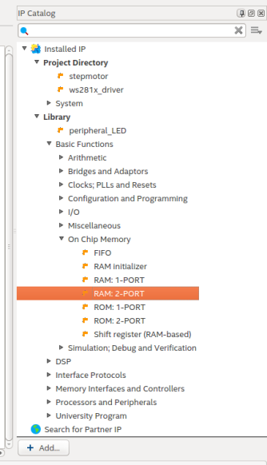
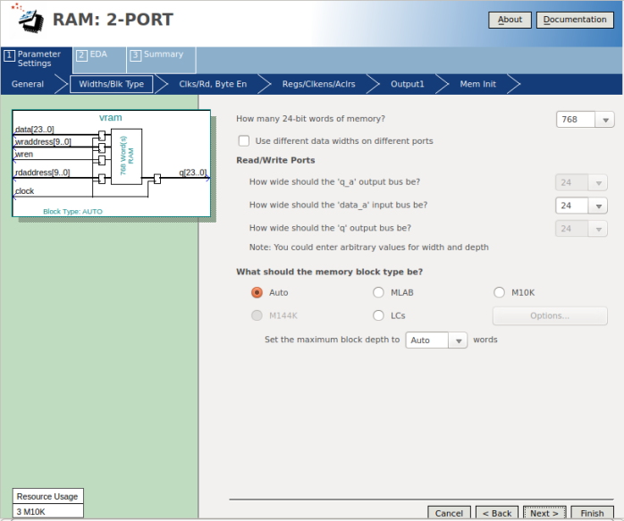
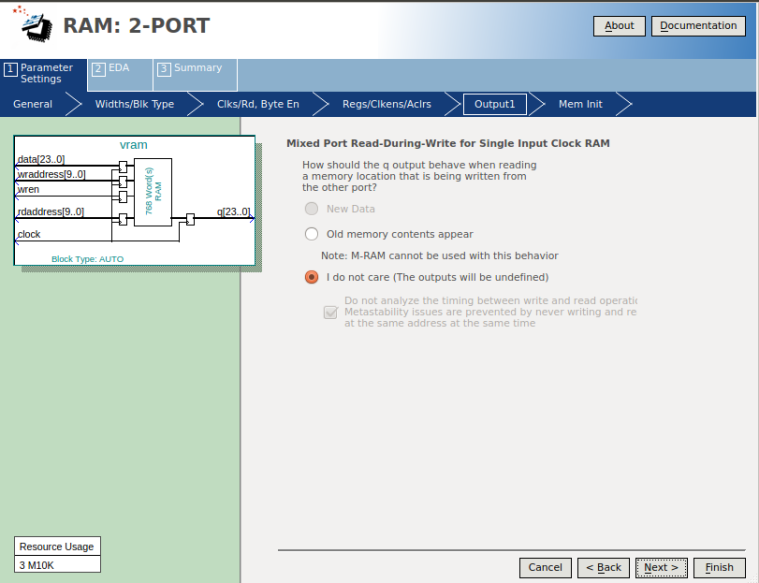

# Periférico para controlar matriz de led da família WS281x

- **Alunos:** Manoela Cirne Lima de Campos / Wesley Gabriel Albano da Silva
- **Curso:** Engenharia da Computação
- **Semestre:** 9
- **Contato:** manoelaclc@al.insper.edu.br / wesleygas@al.insper.edu.br
- **Ano:** 2020

## Começando

Para seguir esse tutorial é necessário:

- **Hardware:** DE10-Standard e matriz de leds WS2812 AdaFruit
- **Softwares:** Quartus 18.01
- **Documentos:** [DE10-Standard_User_manual.pdf](https://github.com/Insper/DE10-Standard-v.1.3.0-SystemCD/tree/master/Manual)
[Funcionamento dos leds](https://cpldcpu.wordpress.com/2014/01/14/light_ws2812-library-v2-0-part-i-understanding-the-ws2812/#:~:text=The%20cycle%20time%20of%20a,ns%20(maximum%20on%20WS2812))


## Como funciona a matriz de leds

A fita que foi utilizada tem 276 leds e em cada led existem 3 pixeis (RGB na orgem GBR). A intensidade com que cada pixel será acionado ditará a cor de cada led.

Os leds são independentes e têm 24 bits programáveis, 8 para verde, 8 para o azul e 8 para o vermelho. Cada LED coleta os dados utilizando os primeiros 24 bits enviados ao pino DIN, os próximos bits são enviados diretamente para o DOUT, podendo ser utilizado por um outro LED e assim por diante. 
Cada bit é representado por um sinal de aproximadamente 1300 nano segundos. Um bit 1 corresponde a um sinal com 950 nano segundos em high e 250 nano segundos em low e um bit 0 corresponde a um sinal com 333 nano segundo em high e 977 nano segundos em low.
<center style="font-size:12px;">


Figura 1 - Tempo de high e low para a escrita do bit 1
</center>

Para reiniciar a escrita no led0 deve existir um espaço de tempo entre os pulsos igual ou maior que 70 micro segundos.

<center style="font-size:12px;">


figura 2 - Espaço de tempo entre dados para voltar para o led 0
</center>

Para converter isso para a <spam style="color:purple">*FPGA*</spam>, que tem clock de 50Mhz a informação enviada deve permanecer a mesma por alguns clocks. Para executar um bit com valor 1 é necessário descartar 40 clock depois de acionado o high e 20 clocks depois do low e para o bit 0 é preciso descartar 17 clocks depois do high e 43 depois do low. Para voltar a escrever no led0 20000 clocks são descartados.

Na tabela abaixo:

* **T0H** é tempo em high para bit 0
* **T0L** é tempo em low para bit 0
* **T1H** é tempo em high para bit 1
* **T1L** é tempo em low para bit 1
* **RES** é tempo em low para voltar ao led0

<center>

|                 |  **Tempo (ns)** |  **Clock (u)**  |
| --------------- | --------------- | --------------- |
| **T0H**         | 333             | 17              |
| **T0L**         | 937             | 43              |
| **T1H**         | 958             | 40              |
| **T1L**         | 252             | 20              |
| **RES**         | 70000           | 20000           |

</center>

----------------------------------------------

## Conectando a matriz de leds na FPGA

Para conectar a matriz de led na <spam style="color:purple">*FPGA*</spam> o pino de data deve ser configurado no pin planer. Lembrando que a <spam style="color:purple">*FPGA*</spam> já tem um pino 5V e o ground.

!!! note 
    - Lembre-se que o ground da placa e da matriz devem estar conectados para que os pulsos sejam detectados corretamente.


<center style="font-size:12px;">

figura 4 - Conectores da matriz de led</center>

----------------------------------------------

## Códigos em VHDL

Serão necessário 4 códigos em <spam style="color:blue">*vhdl*</spam>:

* Máquina de estados: Define e aplica os tempos de delay dependendo das informações contidas na memória.
* Driver: Conecta a memória e a máquina de estados.
* GlueLogic: Logica de conexão do perifério no barramento Avalon.
* Vram: Memória 

Para criar a RAM é necessário seguir os passos a seguir.

Na janela **IP Catalog** à direita no quartus você encontra a RAM que deve ser configurada.

<center style="font-size:12px;">

figura 5 - Modelo da RAM</center>

Na próxima etapa deve ser ecolhida uma RAM com escrita e leitura e o tipo de dado deve ser words, para organizar de maneira a facilitar a visualização dos dados.

<center style="font-size:12px;">

figura 6 - Modelo da RAM</center>

Na próxima etapa deve ser escolhidos dados de 24 bits, que é a informação completa de cada led, como descrito acima.

<center style="font-size:12px;">

figura 7 - Modelo da RAM</center>

Como só temos um clock na FPGA e todas, manteremos com 1 clock essa configuração.

<center style="font-size:12px;">

figura 8 - Modelo da RAM</center>

A chance de acontecer uma leitura e uma escrita ao mesmo tempo é baixa e os problemas gerados caso isso aconteça não são relevantes.

<center style="font-size:12px;">

figura 9 - Modelo da RAM</center>

Um arquivo <spam style="color:green">.mif</spam> deve ser criado para que o periférico seja incializado corretamente. Se esse arquivo for modificado antes da programação da placa os leds devem ficar acesos logo na inicialização.

<center style="font-size:12px;">

figura 10 - Criar arquivo .mif</center>


<center style="font-size:12px;">

figura 11 - Arquivo .mif criado </center>

A memória criada acima foi modificada para aceitar leitura e escrita simultanemante. O código pronto se encontra abaixo, junto com os outros <spam style="color:blue">*vhdls*</spam> necessários para a implementação do periférico.

=== "Código da máquina de estados"
    ``` VHDL
    library ieee;
    use ieee.std_logic_1164.all;
    use ieee.numeric_std.all;

    entity WS2812 is
        generic (
            pixel_count 	 : integer := 768;
            clock_frequency : integer := 50_000_000 -- Hertz
        );
        port (
            clk  : in std_logic;
            rst  : in std_logic;
            data : in std_logic_vector(23 downto 0); -- for testbench validation only
            addr : out std_logic_vector(9 downto 0);
            serial : out std_logic
        );
    end entity WS2812;

    architecture arch of WS2812 is

        constant T0H : integer := 17;
        constant T0L : integer := 43; -- compensate for state changes
        constant T1H : integer := 40;
        constant T1L : integer := 20; -- compensate for state changes
        constant RES : integer := 20000;
        
        --type LED_ring is array (0 to (pixel_count - 1)) of std_logic_vector(23 downto 0);
        type state_machine is (load, sending, send_bit, reset);

    begin
        process
            variable state : state_machine := reset;
            variable GRB : std_logic_vector(23 downto 0) := x"000000";
            variable delay_high_counter : integer := 0;
            variable delay_low_counter : integer := 0;
            variable index : integer := 0;
            variable bit_counter : integer := 0;

        begin
            wait until rising_edge(clk);
            case state is						
                when load => -- Update GRB with data coming from RAM
                            GRB := data;
                            bit_counter := 24;
                            state := sending;
                when sending =>
                        if (bit_counter > 0) then
                            bit_counter := bit_counter - 1;
                            if GRB(bit_counter) = '1' then
                                delay_high_counter := T1H;
                                delay_low_counter := T1L;
                            else
                                delay_high_counter := T0H;
                                delay_low_counter := T0L;
                            end if;
                            state := send_bit;
                        else
                            if (index < (pixel_count - 1)) then
                                index := index + 1;
                                addr <= std_logic_vector(to_unsigned(index, addr'length));
                                state := load;
                            else
                                delay_low_counter := RES;
                                state := reset;
                            end if;
                        end if;
                when send_bit =>
                        if (delay_high_counter > 0) then
                            serial <= '1';
                            delay_high_counter := delay_high_counter - 1;
                        elsif (delay_low_counter > 0) then
                                serial <= '0';
                                delay_low_counter := delay_low_counter - 1;
                        else
                            state := sending;
                        end if;
                when reset =>
                        if (delay_low_counter > 0) then
                            serial <= '0';
                            delay_low_counter := delay_low_counter - 1;
                        else
                            index := 0;
                            addr <= std_logic_vector(to_unsigned(index, addr'length));
                            state := load;
                        end if;
                when others => null;
            end case;
        end process;
    end arch;
    ```
=== "Código do Driver"
    ``` VHDL
    library IEEE;
    use IEEE.std_logic_1164.all;

    entity WS2812Driver is
        port (
            -- Gloabals
            clock   : in  std_logic;  
            reset	 : in std_logic;

            -- I/Os
            led_serial_out : out std_logic;
            wraddress		 : in std_logic_vector(9 downto 0);
            input_data	 : in std_logic_vector(23 downto 0);
            wren			 :	in std_logic
            
    );
    end entity WS2812Driver;

    architecture rtl of WS2812Driver is

    signal debug_led : std_logic_vector(23 downto 0) := (others => '0');
    signal driver_data : std_logic_vector(23 downto 0) := (others => 'X');
    signal raddress : std_logic_vector(9 downto 0);

    component WS2812 is
        generic (
            pixel_count 	 : integer := 768;
            clock_frequency : integer := 50_000_000 -- Hertz
        );
        port (
            clk : in std_logic := 'X';
            rst : in std_logic := '0';
            data : in std_logic_vector(23 downto 0) := (others => 'X');
            addr : out std_logic_vector(9 downto 0);
            serial : out std_logic := '1'
        );
    end component WS2812;

    component vram
        PORT
        (
            clock		: IN STD_LOGIC  := '1';
            data		: IN STD_LOGIC_VECTOR (23 DOWNTO 0);
            rdaddress		: IN STD_LOGIC_VECTOR (9 DOWNTO 0);
            wraddress		: IN STD_LOGIC_VECTOR (9 DOWNTO 0);
            wren		: IN STD_LOGIC  := '0';
            q		: OUT STD_LOGIC_VECTOR (23 DOWNTO 0)
        );
    end component;

    begin
        
        d0 : component vram
            port map (
                clock => clock,
                data => input_data,
                rdaddress => raddress,
                wraddress => wraddress,
                wren => wren,
                q => driver_data
            );
        
        d1 : component WS2812 
            generic map (
                pixel_count => 768,
                clock_frequency => 50_000_000
            )
            port map (
                clk => clock,
                rst => reset,
                data => driver_data,
                addr => raddress,
                serial => led_serial_out
            );

    end rtl;
    ```
=== "GlueLogic"
    ```VHDL
    library IEEE;
    use IEEE.std_logic_1164.all;

    entity ws281x_MM is
        port (
            -- Globals
            clk                : in  std_logic                     := '0';             
            reset              : in  std_logic                     := '0';      
            serial_out : out std_logic;
            -- Avalon Memmory Mapped Slave
            avs_address     : in  std_logic_vector(9 downto 0)  := (others => '0'); 
            avs_read        : in  std_logic                     := '0';             
            avs_readdata    : out std_logic_vector(31 downto 0) := (others => '0'); 
            avs_write       : in  std_logic                     := '0';           
            avs_writedata   : in  std_logic_vector(31 downto 0) := (others => '0')  
        );
    end entity ws281x_MM;

    architecture rtl of ws281x_MM is

    component WS2812Driver is
        port (
            -- Gloabals
            clock   : in  std_logic;
            reset	 : in std_logic;

            -- I/Os
            led_serial_out : out std_logic;
            wraddress		 : in std_logic_vector(9 downto 0);
            input_data	 : in std_logic_vector(23 downto 0);
            wren			 :	in std_logic
            
    );
    end component WS2812Driver;

    begin
        dd : component WS2812Driver
            port map (
                clock => clk,
                reset => reset,
                led_serial_out => serial_out,
                wraddress => avs_address,
                input_data => avs_writedata(23 downto 0),
                wren => avs_write
            );
    end rtl;
    ```
=== "VRAM"
    ```VHDL
    -- megafunction wizard: %RAM: 2-PORT%
    -- GENERATION: STANDARD
    -- VERSION: WM1.0
    -- MODULE: altsyncram 

    -- ============================================================
    -- File Name: vram.vhd
    -- Megafunction Name(s):
    -- 			altsyncram
    --
    -- Simulation Library Files(s):
    -- 			altera_mf
    -- ============================================================
    -- ************************************************************
    -- THIS IS A WIZARD-GENERATED FILE. DO NOT EDIT THIS FILE!
    --
    -- 18.1.0 Build 625 09/12/2018 SJ Standard Edition
    -- ************************************************************


    --Copyright (C) 2018  Intel Corporation. All rights reserved.
    --Your use of Intel Corporation's design tools, logic functions 
    --and other software and tools, and its AMPP partner logic 
    --functions, and any output files from any of the foregoing 
    --(including device programming or simulation files), and any 
    --associated documentation or information are expressly subject 
    --to the terms and conditions of the Intel Program License 
    --Subscription Agreement, the Intel Quartus Prime License Agreement,
    --the Intel FPGA IP License Agreement, or other applicable license
    --agreement, including, without limitation, that your use is for
    --the sole purpose of programming logic devices manufactured by
    --Intel and sold by Intel or its authorized distributors.  Please
    --refer to the applicable agreement for further details.


    LIBRARY ieee;
    USE ieee.std_logic_1164.all;

    LIBRARY altera_mf;
    USE altera_mf.altera_mf_components.all;

    ENTITY vram IS
        PORT
        (
            clock		: IN STD_LOGIC  := '1';
            data		: IN STD_LOGIC_VECTOR (23 DOWNTO 0);
            rdaddress		: IN STD_LOGIC_VECTOR (9 DOWNTO 0);
            wraddress		: IN STD_LOGIC_VECTOR (9 DOWNTO 0);
            wren		: IN STD_LOGIC  := '0';
            q		: OUT STD_LOGIC_VECTOR (23 DOWNTO 0)
        );
    END vram;


    ARCHITECTURE SYN OF vram IS

        SIGNAL sub_wire0	: STD_LOGIC_VECTOR (23 DOWNTO 0);

    BEGIN
        q    <= sub_wire0(23 DOWNTO 0);

        altsyncram_component : altsyncram
        GENERIC MAP (
            address_aclr_b => "NONE",
            address_reg_b => "CLOCK0",
            clock_enable_input_a => "BYPASS",
            clock_enable_input_b => "BYPASS",
            clock_enable_output_b => "BYPASS",
            init_file => "WS2812Driver.mif",
            intended_device_family => "Cyclone V",
            lpm_type => "altsyncram",
            numwords_a => 768,
            numwords_b => 768,
            operation_mode => "DUAL_PORT",
            outdata_aclr_b => "NONE",
            outdata_reg_b => "CLOCK0",
            power_up_uninitialized => "FALSE",
            read_during_write_mode_mixed_ports => "DONT_CARE",
            widthad_a => 10,
            widthad_b => 10,
            width_a => 24,
            width_b => 24,
            width_byteena_a => 1
        )
        PORT MAP (
            address_a => wraddress,
            address_b => rdaddress,
            clock0 => clock,
            data_a => data,
            wren_a => wren,
            q_b => sub_wire0
        );


    END SYN;

    -- ============================================================
    -- CNX file retrieval info
    -- ============================================================
    -- Retrieval info: PRIVATE: ADDRESSSTALL_A NUMERIC "0"
    -- Retrieval info: PRIVATE: ADDRESSSTALL_B NUMERIC "0"
    -- Retrieval info: PRIVATE: BYTEENA_ACLR_A NUMERIC "0"
    -- Retrieval info: PRIVATE: BYTEENA_ACLR_B NUMERIC "0"
    -- Retrieval info: PRIVATE: BYTE_ENABLE_A NUMERIC "0"
    -- Retrieval info: PRIVATE: BYTE_ENABLE_B NUMERIC "0"
    -- Retrieval info: PRIVATE: BYTE_SIZE NUMERIC "8"
    -- Retrieval info: PRIVATE: BlankMemory NUMERIC "0"
    -- Retrieval info: PRIVATE: CLOCK_ENABLE_INPUT_A NUMERIC "0"
    -- Retrieval info: PRIVATE: CLOCK_ENABLE_INPUT_B NUMERIC "0"
    -- Retrieval info: PRIVATE: CLOCK_ENABLE_OUTPUT_A NUMERIC "0"
    -- Retrieval info: PRIVATE: CLOCK_ENABLE_OUTPUT_B NUMERIC "0"
    -- Retrieval info: PRIVATE: CLRdata NUMERIC "0"
    -- Retrieval info: PRIVATE: CLRq NUMERIC "0"
    -- Retrieval info: PRIVATE: CLRrdaddress NUMERIC "0"
    -- Retrieval info: PRIVATE: CLRrren NUMERIC "0"
    -- Retrieval info: PRIVATE: CLRwraddress NUMERIC "0"
    -- Retrieval info: PRIVATE: CLRwren NUMERIC "0"
    -- Retrieval info: PRIVATE: Clock NUMERIC "0"
    -- Retrieval info: PRIVATE: Clock_A NUMERIC "0"
    -- Retrieval info: PRIVATE: Clock_B NUMERIC "0"
    -- Retrieval info: PRIVATE: IMPLEMENT_IN_LES NUMERIC "0"
    -- Retrieval info: PRIVATE: INDATA_ACLR_B NUMERIC "0"
    -- Retrieval info: PRIVATE: INDATA_REG_B NUMERIC "0"
    -- Retrieval info: PRIVATE: INIT_FILE_LAYOUT STRING "PORT_B"
    -- Retrieval info: PRIVATE: INIT_TO_SIM_X NUMERIC "0"
    -- Retrieval info: PRIVATE: INTENDED_DEVICE_FAMILY STRING "Cyclone V"
    -- Retrieval info: PRIVATE: JTAG_ENABLED NUMERIC "0"
    -- Retrieval info: PRIVATE: JTAG_ID STRING "NONE"
    -- Retrieval info: PRIVATE: MAXIMUM_DEPTH NUMERIC "0"
    -- Retrieval info: PRIVATE: MEMSIZE NUMERIC "18432"
    -- Retrieval info: PRIVATE: MEM_IN_BITS NUMERIC "0"
    -- Retrieval info: PRIVATE: MIFfilename STRING "WS2812Driver.mif"
    -- Retrieval info: PRIVATE: OPERATION_MODE NUMERIC "2"
    -- Retrieval info: PRIVATE: OUTDATA_ACLR_B NUMERIC "0"
    -- Retrieval info: PRIVATE: OUTDATA_REG_B NUMERIC "1"
    -- Retrieval info: PRIVATE: RAM_BLOCK_TYPE NUMERIC "0"
    -- Retrieval info: PRIVATE: READ_DURING_WRITE_MODE_MIXED_PORTS NUMERIC "2"
    -- Retrieval info: PRIVATE: READ_DURING_WRITE_MODE_PORT_A NUMERIC "3"
    -- Retrieval info: PRIVATE: READ_DURING_WRITE_MODE_PORT_B NUMERIC "3"
    -- Retrieval info: PRIVATE: REGdata NUMERIC "1"
    -- Retrieval info: PRIVATE: REGq NUMERIC "0"
    -- Retrieval info: PRIVATE: REGrdaddress NUMERIC "1"
    -- Retrieval info: PRIVATE: REGrren NUMERIC "1"
    -- Retrieval info: PRIVATE: REGwraddress NUMERIC "1"
    -- Retrieval info: PRIVATE: REGwren NUMERIC "1"
    -- Retrieval info: PRIVATE: SYNTH_WRAPPER_GEN_POSTFIX STRING "0"
    -- Retrieval info: PRIVATE: USE_DIFF_CLKEN NUMERIC "0"
    -- Retrieval info: PRIVATE: UseDPRAM NUMERIC "1"
    -- Retrieval info: PRIVATE: VarWidth NUMERIC "0"
    -- Retrieval info: PRIVATE: WIDTH_READ_A NUMERIC "24"
    -- Retrieval info: PRIVATE: WIDTH_READ_B NUMERIC "24"
    -- Retrieval info: PRIVATE: WIDTH_WRITE_A NUMERIC "24"
    -- Retrieval info: PRIVATE: WIDTH_WRITE_B NUMERIC "24"
    -- Retrieval info: PRIVATE: WRADDR_ACLR_B NUMERIC "0"
    -- Retrieval info: PRIVATE: WRADDR_REG_B NUMERIC "0"
    -- Retrieval info: PRIVATE: WRCTRL_ACLR_B NUMERIC "0"
    -- Retrieval info: PRIVATE: enable NUMERIC "0"
    -- Retrieval info: PRIVATE: rden NUMERIC "0"
    -- Retrieval info: LIBRARY: altera_mf altera_mf.altera_mf_components.all
    -- Retrieval info: CONSTANT: ADDRESS_ACLR_B STRING "NONE"
    -- Retrieval info: CONSTANT: ADDRESS_REG_B STRING "CLOCK0"
    -- Retrieval info: CONSTANT: CLOCK_ENABLE_INPUT_A STRING "BYPASS"
    -- Retrieval info: CONSTANT: CLOCK_ENABLE_INPUT_B STRING "BYPASS"
    -- Retrieval info: CONSTANT: CLOCK_ENABLE_OUTPUT_B STRING "BYPASS"
    -- Retrieval info: CONSTANT: INIT_FILE STRING "WS2812Driver.mif"
    -- Retrieval info: CONSTANT: INTENDED_DEVICE_FAMILY STRING "Cyclone V"
    -- Retrieval info: CONSTANT: LPM_TYPE STRING "altsyncram"
    -- Retrieval info: CONSTANT: NUMWORDS_A NUMERIC "768"
    -- Retrieval info: CONSTANT: NUMWORDS_B NUMERIC "768"
    -- Retrieval info: CONSTANT: OPERATION_MODE STRING "DUAL_PORT"
    -- Retrieval info: CONSTANT: OUTDATA_ACLR_B STRING "NONE"
    -- Retrieval info: CONSTANT: OUTDATA_REG_B STRING "CLOCK0"
    -- Retrieval info: CONSTANT: POWER_UP_UNINITIALIZED STRING "FALSE"
    -- Retrieval info: CONSTANT: READ_DURING_WRITE_MODE_MIXED_PORTS STRING "DONT_CARE"
    -- Retrieval info: CONSTANT: WIDTHAD_A NUMERIC "10"
    -- Retrieval info: CONSTANT: WIDTHAD_B NUMERIC "10"
    -- Retrieval info: CONSTANT: WIDTH_A NUMERIC "24"
    -- Retrieval info: CONSTANT: WIDTH_B NUMERIC "24"
    -- Retrieval info: CONSTANT: WIDTH_BYTEENA_A NUMERIC "1"
    -- Retrieval info: USED_PORT: clock 0 0 0 0 INPUT VCC "clock"
    -- Retrieval info: USED_PORT: data 0 0 24 0 INPUT NODEFVAL "data[23..0]"
    -- Retrieval info: USED_PORT: q 0 0 24 0 OUTPUT NODEFVAL "q[23..0]"
    -- Retrieval info: USED_PORT: rdaddress 0 0 10 0 INPUT NODEFVAL "rdaddress[9..0]"
    -- Retrieval info: USED_PORT: wraddress 0 0 10 0 INPUT NODEFVAL "wraddress[9..0]"
    -- Retrieval info: USED_PORT: wren 0 0 0 0 INPUT GND "wren"
    -- Retrieval info: CONNECT: @address_a 0 0 10 0 wraddress 0 0 10 0
    -- Retrieval info: CONNECT: @address_b 0 0 10 0 rdaddress 0 0 10 0
    -- Retrieval info: CONNECT: @clock0 0 0 0 0 clock 0 0 0 0
    -- Retrieval info: CONNECT: @data_a 0 0 24 0 data 0 0 24 0
    -- Retrieval info: CONNECT: @wren_a 0 0 0 0 wren 0 0 0 0
    -- Retrieval info: CONNECT: q 0 0 24 0 @q_b 0 0 24 0
    -- Retrieval info: GEN_FILE: TYPE_NORMAL vram.vhd TRUE
    -- Retrieval info: GEN_FILE: TYPE_NORMAL vram.inc FALSE
    -- Retrieval info: GEN_FILE: TYPE_NORMAL vram.cmp TRUE
    -- Retrieval info: GEN_FILE: TYPE_NORMAL vram.bsf FALSE
    -- Retrieval info: GEN_FILE: TYPE_NORMAL vram_inst.vhd TRUE
    -- Retrieval info: LIB_FILE: altera_mf
    ```

Como vamos criar o periférico no PD (Plataform Designer), vamos colocar todos esses arquivos em uma pasta chamada IP localizada na raíz do projeto, já que o PD integra IPs.

!!! example "O que temos em cada arquivo"
    ### Máquina de estados:
    * **pixel_count**: A quantidade de pixeis que serão modificados. No nosso caso o total da matriz.
    * **clock_frequency**: A frequência do clock da <spam style="color:purple">*FPGA*</spam> (para ser utilizado nos cálculos de espaço de tempo entre os bits 1 e 0 para representar a informação que será recebida pela matriz)
    * **clk**: Entrada do clock.
    * **rst**: É necessário para criar o periférico, mas não faz nada a princípio
    * **data**: Informação vinda da mamória para ser processada e enviada para a matriz de led.
    * **addr**: Endereço da memória que deve ser acessado.
    * **serial**: Saída que vai para a matriz de led com os dados já processados.
    ### Driver:
    * **clk**: Entrada do clock.
    * **reset**: É necessário para criar o periférico, mas não faz nada a princípio
    * **led_serial_out**: Saída da máquina de estados que será enviada para placa com dados processados (um bit por vez).
    * **input_data**: Informação que será escrita na memória.
    * **raddress**: Endereço de leitura da memória.
    * **wraddress**: Endereço da memória que deve ser acessado para escrita de informações vinda do avalon.
    * **wren**: Enable para escrever na mamória.
    * Esse VHDL fará as conexões entre a memória e a máquina de estados que processa a informação para entregar os dados corretamente para a matriz de leds
    ### Glue-Logic:
    * **clk**: Entrada do clock.
    * **rst**: É necessário para criar o periférico, mas não faz nada a princípio
    * **serial_out**: Saída que vai para a matriz de led com um bit de cada vez processados pelo driver.
    * **avs_address**: Endereço que deve ser acessado na memória.
    * **avs_read**: Enable de leitura da memória.
    * **avs_readdata**: Saída da informação lida da memória que deve ser passada para o driver
    * **avs_write**: Enable de escrita da memória
    * **avs_writedata**: Informação que deve ser ecrita na memória
    * O Glue Logic faz a abstração do acesso à memória pelo periférico. Dessa forma cada funcionalidade necessária (write, read) tem um offset na mamória para que seja utilizado.


----------------------------------------------

## Criação do pereférico no plataform designer

Abra o Plataform designer e adicione os seguintes componentes:

    * On-Chip Memory (RAM or ROM Intel FPGA IP)
        * Type: RAM
        * Total Memory size: 65536 bytes
    * On-Chip Memory (RAM or ROM Intel FPGA IP)
        * Type: RAM
        * Total Memory size: 65536 bytes
    * Jtag UART Intel FPGA IP
        * Default
    * NIOS II Processor
        * Type: NIOS II/e

Para inciar a criação do componente que controlará a matriz de leds será necessário "avisar" o plataform designer que a pasta IP guarda os arquivos que devem ser buscados. Para isso isso vá em **tools** --> **options** --> **IP Search Path** e adicione a pasta criada acima.

Depois crie o seguinte componente:

Na primeira aba nomeie o componente e preencha sua descrição.

<center style="font-size:12px;">


Figura 12 - plataform designer - parte1
</center>

Na aba **files** --> **Syntesis Files** --> **add file** adicione os arquivos .vhd descritos na seção anterior. Na janela **VHDL Simulation Files** selecione a opção **Copy From Syntesis Files**.

<center style="font-size:12px;">


Figura 13 - plataform designer - parte2
</center>

Na aba signals coloque **conduit_end** na serial_out para que esse sinal seja reconhecido como uma saída do periférico na <spam style="color:purple">*FPGA*</spam>.

<center style="font-size:12px;">


Figura 14 - plataform designer - parte3
</center>

Na aba **signal & interfaces** o reset deve ser atrelado ao avalon_slave_0.

<center style="font-size:12px;">


Figura 15 - plataform designer - parte4
</center>

clique em **finish**.

O componente aparecerá na janela **IP Catalog**. Um arquivo <spam style="color:green">*.tcl*</spam> deve ter sdo criado na pasta raíz do projeto. Leve esse arquivo para a pasta IP e modifique-o para que o caminho até o componente esteja correto.

=== "Antes"
    ```
    add_fileset_file nomedoarquivo.vhd VHDL PATH IP/nomedoarquivo.vhd TOP_LEVEL_FILE
    ...
    add_fileset_file nomedoarquivo.vhd VHDL PATH IP/nomedoarquivo.vhd
    ```
=== "Depois"
    ```
    add_fileset_file nomedoarquivo.vhd VHDL PATH nomedoarquivo.vhd TOP_LEVEL_FILE
    ...
    add_fileset_file nomedoarquivo.vhd VHDL PATH nomedoarquivo.vhd
    ```

Adicione o periférico criado e faça as conexões com os outros periféricos como no exemplo abaixo:

<center style="font-size:12px;">


Figura 16 - plataform designer - parte5
</center>

Clique em **Generate HDL** --> **Generate** para gerar o componente e use a opção **create simulation model** com <spam style="color:blue">*vhdl*</spam> para que seja criado os arquivos auxiliares configurados de acordo com o que está no platform designer.

No **Generate** --> **Show Instatiation Template** --> **VHDL** o modelo de código do periférico será apresentado e deve ser copiado para o uso do periférico.
Como esse projeto foi criado sobre um feito anteriormente o nome da entidade não o ideal. O código abaixo já foi modificado para funcionar corretamente com o NIOS.

!!! warning
    Ao copiar o código lembre de trocar os nomes para que eles correspondam com o seu projeto.

```VHDL
    library IEEE;
    use IEEE.std_logic_1164.all;

    entity LAB2_FPGA_NIOS is
        port (
            -- Gloabals
            fpga_clk_50        : in  std_logic;             -- clock.clk

            -- I/Os
            stepmotor_pio : out std_logic_vector(3 downto 0) := (others => '0')
    );
    end entity LAB2_FPGA_NIOS;

    architecture rtl of LAB2_FPGA_NIOS is


    signal led_serial : std_logic;

    component niosLab2 is
        port (
                clk_clk           : in  std_logic                    := 'X';             -- clk
                reset_reset_n     : in  std_logic                    := 'X';             -- reset_n
                ws_led_serial_out : out std_logic                                        -- serial_out
        );
    end component niosLab2;

    begin

        stepmotor_pio(0) <= led_serial;

    u0 : component niosLab2 port map (
    clk_clk       => fpga_clk_50,    --  clk.clk
    reset_reset_n => '1',            --  reset.reset_n
    ws_led_serial_out => led_serial  -- ws_led.serial_out
    );


    end rtl;
```

Depois de criar o novo arquivo de top level compile o projeto e programe a <spam style="color:purple">*FPGA*</spam>.
O resultado do RTL deve ser semelhante à este:

<center style="font-size:12px;">


Figura 17 - RTL
</center>

O componente **WS2812** deve ler os endereços da memória, processar a informação como descrito nos códigos em <spam style="color:blue">*vhdl*</spam> e passar os dados para a matriz de led pelo serial. A NIOS deve ser capaz de modificar a ram com o wren (permitindo escrita), data (o dado a ser Escrito) e address (o endereço que deve ser moficado).

----------------------------------------------

## Firmware (NIOS)

Abra o **NIOS II Software Build** para criar um código que utiliza o periférico criado.
Um código de exemplo pode ser encontrado abaixo.


hello_world.c
```C
#include "system.h"
#include <stdio.h>
#include <io.h> /* Leiutura e escrita no Avalon */
#include <unistd.h>

int main()
{
  printf("Hello from Nios II!\n");
  volatile unsigned int *led_driver = (unsigned int *) WS281X_DRIVER_0_BASE;
  while(1){
	  unsigned int led_data = 0x000F0005; //Cor inicial

	  unsigned int max_led = 24;
	  for(unsigned int i = 0; i < max_led; i++){
		  IOWR_32DIRECT(WS281X_DRIVER_0_BASE, i, led_data);
		  printf("writing to LED %d!\n");
		  //
	  }
	  usleep(1000000);
	  led_data = 0x0000FFFF; //Cor segundária
	  for(unsigned int i = 0; i < max_led; i++){
		  IOWR_32DIRECT(WS281X_DRIVER_0_BASE, i, led_data);
		  printf("writing to LED\n");
		  usleep(500000);
	   }
  }

  return 0;
}
```

Para usar esse periférico diretamente com um driver do linux algumas modificações precisam ser feitas. Faça o download do projeto necessário [aqui](https://github.com/Insper/DE10-Standard-v.1.3.0-SystemCD/tree/master/Demonstration/SoC_FPGA/DE10_Standard_GHRD). Baixe o projeto e inclua o seu periférico nele.

Na imagem abaixo é possível ver como as conexões devem ser feitas. A mm_bridge_0 faz o processamento dos dados para que tudo funcione corretamente no linux.

<center style="font-size:12px;">


Figura 18 - Plataform designer para periférico funcinando para driver do linux
</center>

Para criar o driver de linux que funcione com esse periférico existe um tutorial pronto feito pelos alunos Andre Ejsenmesser e Paulo Tozzo Ponciano para a matéria de SOC e Linux Embarcado no ano de 2020.
