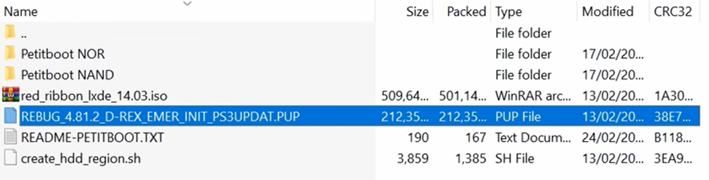

# PS3 Hack

- **Alunes:** Gabriel Monteiro / Guilherme Leite / Hugo Carl
- **Curso:** Engenharia da Computação
- **Semestre:** 9
- **Contato:** corsiferrao@gmail.com, guilhermepl3@al.insper.edu.br
- **Ano:** 2020

!!! info
    Original repo: https://github.com/guipleite/PS3-Linux-Tutorial

## Starting

To follow this tutorial you will need:

- **Hardware:** PS3 (Jailbroken), USB Flash Drive, Keyboard, Mouse
- **Software:** A Linux distribution, we will be using Ubuntu

??? info 
    If you need to Jailbreak your PS3 you can follow this tutorial:
	
    https://www.youtube.com/watch?v=q-06YPB18N4&t=12s&has_verified=1

## Motivation

Many people tend to buy new gaming consoles in their launch, meanig a large number of obsolete consoles are left unused the objective of this tutorial is to repurpose these old pieces of hardware by installing GNU/Linux enabliing them to be used for a vast number of applications.

----------------------------------------------

## Linux on the PS3
The history of Linux in PlayStation started with researchers messing with ideas of using graphics processors to boost their computing powers for years. The main idea is that you can use the same power that is used to run heavy games to run nearly everything, including massive calculations like complicated mathematic models. The necessity of cheap hardware in a moment when supercomputers were very expensive created the plan to use PlayStations as cluster computers. This idea born in 2002 when Sony released a kit called Linux for the Playstation 2, making it easy to create applications using PS2. Things didn't go very well for the PS2 since they started to get unstable when used as clusters to process any kind of data. Only with the PS3 entering the scene in 2006 the applications started to get more interesting.  

PlayStations 3 have more powerful and stable hardware in comparison to PlayStation 2, and also Sony made available a feature called OtherOS, capable of booting Linux in an easy way. With this new piece of hardware, a lot of researches tried to work with PS3 in order to build supercomputers, like Gaurav Khanna at UMass Dartmouth, that built a cluster of PS3s to make a pure period simulation work on black holes and the United States Air Force that made a project with more than 1700 PS3s to process images of surveillance drones. Things didn't go very well for the PlayStations 3 also, because in March 2010 Sony removed the OtherOS feature due to security concerns. This pretty much ended the era of PlayStation supercomputers because when Sony blocked the use of the OtherOS they also blocked the access of the RSX Nvidia GPU chip, making unable to use any kind of hardware acceleration limiting the use of Linux in PS3s as only a regular not so much powerful computer. 

So the idea of making a PS3 boot a Linux kernel is possible but not so powerful or interesting if you want to play with more complex applications, but for any uses in general you can turn a PS3 into a fully functional PC as shown in this tutorial. 

??? info 
    If you want to know more about the history of PlayStations as supercomputers check out the link below:
  
    https://www.theverge.com/2019/12/3/20984028/playstation-supercomputer-ps3-umass-dartmouth-astrophysics-25th-anniversary

----------------------------------------------

## Setting Up the PS3 and Booting from a Live Image

To follow this part of the tutorial you will need:

- **Download:** REBUG 4.81.2 Linux package. https://mega.nz/#!tTBl3CxA!Zr4cqwmFUsfq_oZi89JZWKmJ1pJWXCV-o7WLH2IU09k

### Downgrade PS3 version

In this part of the tutorial we need to install REBUG_4.81.2.PUP in the PS3, this file should be inside the downloaded archive.

!!! note 
    In order to downgrade the firmware of the PS3 you need to have the package `Rebug Toolbox`installed in the PS3.

First of all you need to check in your device if it is possible to downgrade your firmware:

1. `Game` :arrow_right: `Rebug Toolbox` :arrow_right: `Utilities` :arrow_right: `Toggle QA.Flag` :arrow_right: `Enabled`
2. `Game` :arrow_right: `Rebug Toolbox` :arrow_right: `System` :arrow_right: `Information system`  
    - Make sure the line `PS3 System: Firmware [version] DEX` contains DEX.
    - In case the version of the firmware is CEX you will need to change the version. This following tutorial can be useful: https://www.youtube.com/watch?v=0YJBCl4PjCo&t=758s.

After making sure your device match the downgrade requeriments you can proceed the tutorial.

**1. In your computer:**

- Plug in your empty USB stick in your PC and crate the folder `PS3`. Inside of the `PS3` folder create another folder `UPDATE`.
- Extract the file `REBUG_4.81.2_D-REX_EMER_INIT_PS3UPDAT.PUP` into your `../PS3/UPDATE` folder.

!!!warning
    Make sure your USB drive is formatted to `FAT32` before extracting the file. If not you can do so by using the option format in any OS or by using a third-party format software like `Rufus`.

**2. In your PS3:**

- Plug your USB drive with the file `.PUP` file on it.
- Go to  `Settings` :arrow_right: `System Update` :arrow_right: `Update via Storage Media` :arrow_right: `4.81.2 PS3UPDAT.PUP`.

When the installation completes, check if the older version is installed correctly at: `Settings` :arrow_right: `System Settings` :arrow_right: `System Information`.

### Repartitioning PS3 Hard Drive

In this section of the tutorial we will format our device in order to create a second partition to hold our Linux, so make sure you make a backup of all the data inside the PS3. 

- Turn Off your PS3 and boot it in the `Safe Mode`.
- Press the `PS Button`(controller) and then go to: `Restore PS3 System` :arrow_right: `Yes`.

!!! note 
    After finishing the reset you will notice a decrease in the PS3 storage space, this happens because the 4.81.2 update is a modified version of the system that creates a new partition when formated.

### Installing Petitboot

**1. In your computer:**

- To install petitboot first delete the `../PS3` folder in the USB drive. 
- In the downloaded archive you have 2 folders `Petitboot NOR/` and `Petitboot NAND/` you need to find out what architeture correspond correspond to your model of PS3 you can do so by checking your model number in this link: https://www.psdevwiki.com/ps3/SKU_Models (All Slim models are NOR).
- With this information copy the binary file inside the corect petitboot folder to your empty `../USB` folder.

**2. In your PS3:**

- You can now plug the USB in your PS3 but first you will need to install again the `Rebug Toolbox`, aceess: `Game` :arrow_right: `Package Manager` :arrow_right: `Install Package Files` :arrow_right: `PS3 System Storage` :arrow_right: `REBUG_TOOLBOX`.
- With Rebug Toolbox installed: `Game` :arrow_right: `Rebug Toolbox` :arrow_right: `Utilities` :arrow_right: `Resize VFLASH/NAND Regions` :arrow_right: `Yes`.
- Reboot the PS3. 
- `Game` :arrow_right: `Rebug Toolbox` :arrow_right: `Utilities` :arrow_right: `Install petitboot` :arrow_right: `Yes`.
- Reboot again. 

### Installing Red Ribbon Linux

After installing petitboot in our PS3 we basically installed OtherOS in the system creating the possibility to boot another OS inside the created partition on the PS3 Hard Drive so now we can proceed to install our Linux version.

**1. In your computer:**

- Delete again the file from the `../USB` folder and extract the contents inside the `red_ribbon_lxde_14.03.iso` from the archive to the `../USB` folder.

!!! tip
    You can use Winrar to extract the contents from the `.iso` to the desired folder.

- Copy also the file `create_hdd_region.sh` from the archive to `../USB`.

**2. In your PS3:**

In this moment we will boot a live version of linux in the PS3 so you need to use a mouse and a keyboard in order to navigate in the Red Ribbon interface.

- Plug the USB Stick, the mouse and the keyboard into the PS3.
- `Game` :arrow_right: `Rebug Toolbox` :arrow_right: `System` :arrow_right: `Boot OtherOS` :arrow_right: `Boot (LV1 patches: Use current)` :arrow_right: `Yes`.

At this point you will be able to see the Petitboot screen with some boot options.

Press `ESC` on the plugged keyboard, you should be able to access this Linux terminal.

In the terminal execute:

	$ cd /tmp/petitboot/mnt/sda1/ (sda1 for NOR PS3 if you have a NAND PS3 replace sda1 for sdd1)
	$ ./create_hdd_region.sh
	$ exit
	$ petitboot

??? info 
    If you are interested in compilating your own Linux Kernel, stop right here and jump to read the section "Using buildroot for Cross-Compilation", this tutorial did not achieve complete success, but shows some possible ways to start.

Executing these commands will take you back to the Petitboot screen with the boot options, select with the keyboard the first one (Live) and press `Enter`. If everything goes right you will boot the live version of Red Ribbon Linux in the PS3.

The live version of linux doesn't give full access to the system and format the system after a normal reboot so we still need to install the full version of linux into the system.

- At the Desktop click in the only icon `Install Red Ribbon`, it should open the installation screen.

- `Select continent` :arrow_right: `Select language` :arrow_right: `Enter system's hostname` :arrow_right: `Automatic partitioning` :arrow_right: `Yes`.
- Finish the installation process and press the upper right On/Off icon in the taskbar, you will be able to see the Logout Menu.

When selecting the `Boot GameOS` option you will need to remove the USB Stick from the PS3 and you won't need to use it again to boot the linux because now it is installed inside the PS3 partition. If everything goes as planned you shoud be back to the PS3 main OS screen and be able to go back to Linux easily from OtherOS.

!!! note 
    After finishing the installation process you can update your old PS3 firmware version installed in the process back to a newer version if you want to. This change will not affect the new installed system.

----------------------------------------------

## Using buildroot for Cross-Compilation

Buildroot is a set of Makefiles and patches that simplifies and automates the process of building a complete and bootable Linux environment for an embedded system, while using cross-compilation to allow building for multiple target platforms on a single Linux-based development system. Buildroot can automatically build the required cross-compilation toolchain, create a root file system, compile a Linux kernel image, and generate a boot loader for the targeted embedded system, or it can perform any independent combination of these steps. For example, an already installed cross-compilation toolchain can be used independently, while Buildroot only creates the root file system.

This means we can create compile a Linux enviroment that will run on the PS3 from our Desktop, this is great because now we don't need to rely on whatever packages, applications and configurations the pre-compiled distribution comes with.

We will be using the [petitboot--buildroot](https://github.com/glevand/petitboot--buildroot) project wich is basically buildroot with updates to generate a bootable *petitboot* image. This is because the bootloader, wich is a progtam that loads the operating system into the working memory of a computer on start-up, is called petitboot and is not availabe on the original buildroot

    $ git clone https://github.com/glevand/petitboot--buildroot.git
    $ cd petitboot--buildroot

Now we can configure what we want the buildroot to include in our own linux

    $ make menuconfig

This command should bring up an interface like the one shown below that can be navigated using the arrow keys, Enter and Esc:

Under Target options we need to change the __Target Architecture__ to the one of the PS3, wich is big endian PowerPC64.

After that you can press the Escape key twice to go back to the main menu and then enter the __Kernel__ submenu. There we can select our kernel's verion or specify one to be downloaded. We will also set the Defconfig name as PS3 under the Kernel Configuration option, this will automatically set some configurations specific to the PS3. Also change the Kernel binary format to __vmlinux__ and enable the __Install kernel image to /boot in target__  option.

You can also change options under __System Configurations__ and __Target packages__ to personalize your linux and also compile it with some additional programs such as Python or even some emulators.

Finally we can compile it, fot that we will use the commands bellow, the `clean` argument is important if you've alredy tried to compile the os before since it will delete the files generated from previous attempts. The `-j 8` argument means the compiller will use 8 threads from the CPU to compile everything, you can change that value depending on your hardware, the more threads you give the compiller the faster the processing will be.

    $ make clean
    $ make all -j 8

The compiled Filesystem and kernel will be in `/output/images/` .Inside there, we can find this three outputs:

- rootfs.tar: This is just our Linux Filesystem

- vmlinux: This archive can be found in the /output/images folder like the others or already inside the /rootfs/boot/. This is essentially our kernel .

- rootfs.cpio.gz: This archive relates to the initial ramdisk for our filesystem. This stands for a temporary root file system that will load in memory to help the Linux startup process.

Now, to finalize we need to copy all this to the PS3. First we will put everything in a pen drive and plug in. At the PS3 shell, we should find the pendrive content in the path /tmp/petitboot/mnt/sda(this name can variate)/. 

First we need to mount where our linux will be located.

    mkfs.ext4 -m 0 /dev/ps3dd2
    mkswap /dev/ps3dd1
    mkdir linux
    mount /dev/ps3dd2 /linux

Now we should tar our file system into /dev/ps3dd2 which is mounted at /linux.

    tar xvf /tmp/petitboot/mnt/sda/rootfs.tar -C /linux

We now have our file system properly ready to go. We are only left with the initial ramdisk image and possibly the kernel to finalize.

    cp /tmp/petitboot/mnt/sda/rootfs.cpio.gz /linux/boot
    
    !!! warning
        Check first if the /linux/boot doesn't already have the vmlinux(kernel) inside before executing the next command.

    cp /tmp/petiboot/mnt/sda/vmlinux /linux/boot

Nice, we should have all set to boot our linux right? Yeah kind of....
If you followed our advice, you know that we didn't succeed in this last attempt and here where things went wrong. To boot our own cross-compiled kernel we needed to only execute the next line:

    kexec -l /linux/boot/vmlinux --initrd=/linux/boot/rootfs.cpio.gz --append="root=/dev/ps3dd2"

Kexec is the bootloader which petitboot is based on. But this didn't work out for us. So now you can choose between searching on how to make it work, or install an already stable distro for the ps3 called Red Ribbon that you saw in the first part of this tutorial. If you are a thrilled to make this work, we recommend René Rebe works to follow on:

- https://www.youtube.com/user/renerebe
- https://rene.rebe.de/?s=ps3
- http://t2sde.org/hardware/console/Sony/PS3/

<iframe width="560" height="315" src="https://www.youtube.com/embed/FgktHdfhw4g" frameborder="0" allow="accelerometer; autoplay; clipboard-write; encrypted-media; gyroscope; picture-in-picture" allowfullscreen></iframe>

----------------------------------------------

