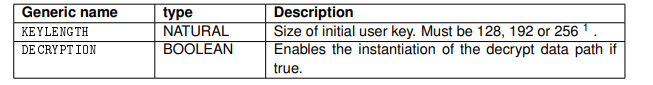
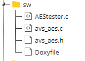

# Criptografia em Hardware Fpga

- **Alunos:** 
    - Antonio Andraues 
    - Gabriel Francato
    - Samuel Granato
- **Curso:** Engenharia da Computação
- **Semestre:** 8
- **Contato:**
    - gabrielvf@al.insper.edu.br
    - samuelvgb@al.insper.edu.br
    - Antoniojaj@al.insper.edu.br
- **Ano:** 2020
&nbsp;

## Começando

Para seguir esse tutorial é necessário:

- **Hardware:** DE10-Standard e acessórios
- **Softwares:** Quartus 18.01
- **Documentos:** [DE10-Standard_User_manual.pdf](https://github.com/Insper/DE10-Standard-v.1.3.0-SystemCD/tree/master/Manual)
&nbsp;

## Motivação
<p align="center">
  
</p>

<div style="text-align: justify"> 
&nbsp;&nbsp;&nbsp;Segurança de dados é um dos principais pilares da Tecnologia da Informação, e existem várias formas em que ela está presente no nosso cotidiano, desde autenticações com usuário e senha, limite de tentativas de acesso, reconhecimento facial entre muitos outros métodos utilizados hoje em dia. 
</div>


<div style="text-align: justify"> 
&nbsp;&nbsp;&nbsp;A criptografia tem como principal motivo oferecer segurança algum dado ou fluxo de dados, fazendo com que só quem tenha a devida permissão consiga ler e modificar esses dados. 
</div>
<br>

### Tipos de Encriptografia

- #### Simetrica:
<div style="text-align: justify"> 
&nbsp;&nbsp;&nbsp; O processo de encripto grafia simétrico é caracterizado pelo fato de que ambas as operações tanto encriptar quanto decriptar utilizam a mesma chave, um fator crítico desse processo é o fato de que para isso acontecer é necessário que a chave seja transferida junto ao montante de dados que está sendo transferido, deixando o processo mais vulnerável
</div>
&nbsp;

- #### Assimetrica:
<div style="text-align: justify"> 
&nbsp;&nbsp;&nbsp;Por consequência o processo assimétrico se caracteriza pelo fato de utilizar duas chaves sincronizadas. Nesse processo são criadas duas chaves uma privada que será mantida com o dono do arquivo e outra publica que estará exposta para o mundo ver. O ponto é que o único método de decriptar a chave pública é com a chave privada que esta resguardada pelo responsável da encriptação.
</div>
&nbsp;
<br>

<div style="text-align: justify"> 
&nbsp;&nbsp;Nesse tutorial a criptografia que iremos apresentar será em hardware, pois tem a capacidade de oferecer um nível de segurança muito alto, já que os métodos utilizados na encriptografia, como a chave de segurança pode estar muito menos acessível a um possível invasor.

</div>
<div style="text-align: justify"> 
&nbsp;&nbsp;Além disso, um fator muito relevante para utilização de encriptografia e decriptografia em hardware é a velocidade que o algoritmo vai levar para realizar tal ações. Isso acontece porque haverá a utilização de um processador dedicado que alivia a carga do resto do dispositivo.
</div>
&nbsp;


## Implementação
<div style="text-align: justify"> 
&nbsp;&nbsp;&nbsp;Nosso hardware vai funcionar como um dispositivo que recebe um arquivo via USB, e devolve esse arquivo encriptado, também sendo capaz de fazer a operação inversa. Para isso utilizaremos uma FPGA, que tem a capacidade de formar hardwares dinâmicos e programáveis. Após finalizado o projeto, conseguimos criar essa estrutura estática para o uso sem a necessidade de toda a FPGA.
</div>
<div style="text-align: justify">
&nbsp;&nbsp;&nbsp;Para essa implementação utilizaremos um dispositivo de criptografia disponibilizado pela INTEL 
</div>
&nbsp;

## Platform Designer como achar e utilizar um core de criptografia

### Como achar um componente:

<div style="text-align: justify"> 
&nbsp;&nbsp;&nbsp;A própria interface possui o chamado IP cores (integrating custom IP components) fornece componentes bem encapsulados que são justamente feitos para serem facilmente conectados e inicializados.
</div>

<p align="center">
  
</p>
    
&nbsp;&nbsp;&nbsp;Permitindo importar componentes personalizados produzidos pela comunidade e amplamente utilizado no mercado. 

No site: https://opencores.org/

&nbsp;&nbsp;&nbsp;Também é possível por exemplo, encontrar componentes diversos ja prontos para utilizar e com documentação de uso.

&nbsp;&nbsp;&nbsp;Componentes estes disponibilizados e mantidos pela comunidade. 

Imagem referente a Aba https://opencores.org/projects:

<p align="center">
  
</p>

!!! note 
    Como podemos perceber existem <p style="color: green">77 cores diferentes somente na aba de Criptografia.</p>

### Utilizando um core de criptografia

<div style="text-align: justify"> 
&nbsp;&nbsp;&nbsp;Uma boa forma de filtrar e encontrar algo bem estruturado e bem documentado é utilizando o filtro disponível pelo OpenCores:
</div>

{width=200}

{width=1200}

!!! example "Atencao"
    Perceba que a quantidade de cores disponíveis diminui bruscamente.

    <P style="color: red">Isso não significa que os outros 75 cores não possam ser uteis para você.<P> 

    Apenas que os mesmos ainda não foram de certa forma revisados pela OpenCores.

### Avalon AES ECB-Core (128,192,256 Bit)        
&nbsp;&nbsp;&nbsp;Vamos pegar de exemplo este "Avalon AES ECB-Core (128,192,256 Bit)"

&nbsp;&nbsp;&nbsp;Baixar a pasta e analisar algumas informações relevantes.

{width=300}

<div style="text-align: justify">
&nbsp;&nbsp;&nbsp; Umas das partes mais importantes ao pegar um componente novo é a documentação dele.
</div>

&nbsp;&nbsp;&nbsp;&nbsp;No caso deste componente a pasta "doc".
 
{width=300}

&nbsp;&nbsp;&nbsp;Onde encontramos dois segmentos importantes da documentação:

#### manual ("avs_aes.pdf")

&nbsp;&nbsp;&nbsp;Sessões importantes do pdf:

    - Configuration Generics
{width=600}

&nbsp;&nbsp;&nbsp;Mostra as opções genéricas que podem ser modificadas no componente.

<div style="text-align: justify">
&nbsp;&nbsp;&nbsp;Neste caso, por exemplo, KEYLENGTH pode 128,192 ou 256 que são os tamanhos de chaves que o componente está preparado para receber.
</div>

    -Signals
{width=600}

<div style="text-align: justify">
&nbsp;&nbsp;&nbsp;Tabela que mostra todos os barramentos que o Avalon irá utilizar e para que serve cada um deles. Os mesmos devem ser conectados corretamente no PD (platform designer).
</div>

&nbsp;&nbsp;&nbsp;Imagem de exemplo da intel:

{width=600}

    -Memory Map
{width=600}

&nbsp;&nbsp;&nbsp;Mapa de memória.

<div style="text-align: justify">
&nbsp;&nbsp;&nbsp;Normalmente isso é útil para quando queremos saber em qual offset do base adresses atribuído pelo PD (plataform designer) as informações podem ser lidas ou escritas.
</div>

    -Control Register
{width=600}
{width=600}

&nbsp;&nbsp;&nbsp;Descrição melhor dos pontos de controle (CTRL da tabela de Mapa de memória)
    
#### sw (manual do driver para uso do componte via C++ pelo barramento Avalon)

<div style="text-align: justify">
&nbsp;&nbsp;&nbsp;Basicamente nesta pasta possui um docHTML da "API" do driver disponibilizado pelo fabricante do componente.
</div>
{width=300}

&nbsp;&nbsp;&nbsp;O driver pode ser localizado na pasta SW:

{width=300}

&nbsp;&nbsp;&nbsp;Parte do arquivo do driver:

=== "C++"

    ``` c++
    void avs_aes_init(avs_aes_handle* context){
        context->key	= (unsigned int*) KEY_ADDR;
        context->payload= (unsigned int*) DATA_ADDR;
        context->result	= (unsigned int*) RESULT_ADDR;
        context->control  	= (unsigned int*) AESCTRLWD;
        *(context->control) = 0x00000000;
    }


    void avs_aes_setKey(avs_aes_handle* context, unsigned int* key){
        int i=0;
        unsigned int* target_ptr = (unsigned int* )context->key;
        /* Invalidate old key; */
        *(context->control) &= (~KEY_VALID);
        asm __volatile("sync" :::);
        for(i=0; i<KEYWORDS; i++){
            *(target_ptr++) = *(key++);
        }
        asm __volatile("sync" :::);
        /* validate key */
        *(context->control) |= KEY_VALID;
    }
    ```
## Final

<div style="text-align: justify">
&nbsp;&nbsp;&nbsp;Com o driver em mãos, o arquivo de Teste "AEStester.c" e o platform design corretamente conectado. Você teoricamente já tem seu componente pronta para encriptar e decriptar em FPGA.
<div>
