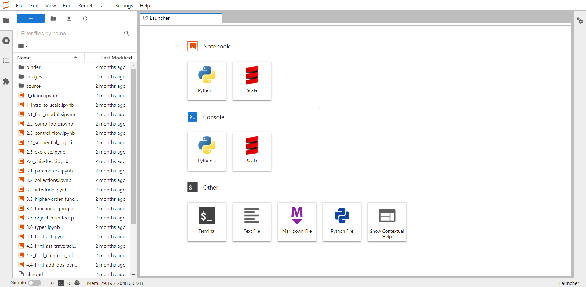
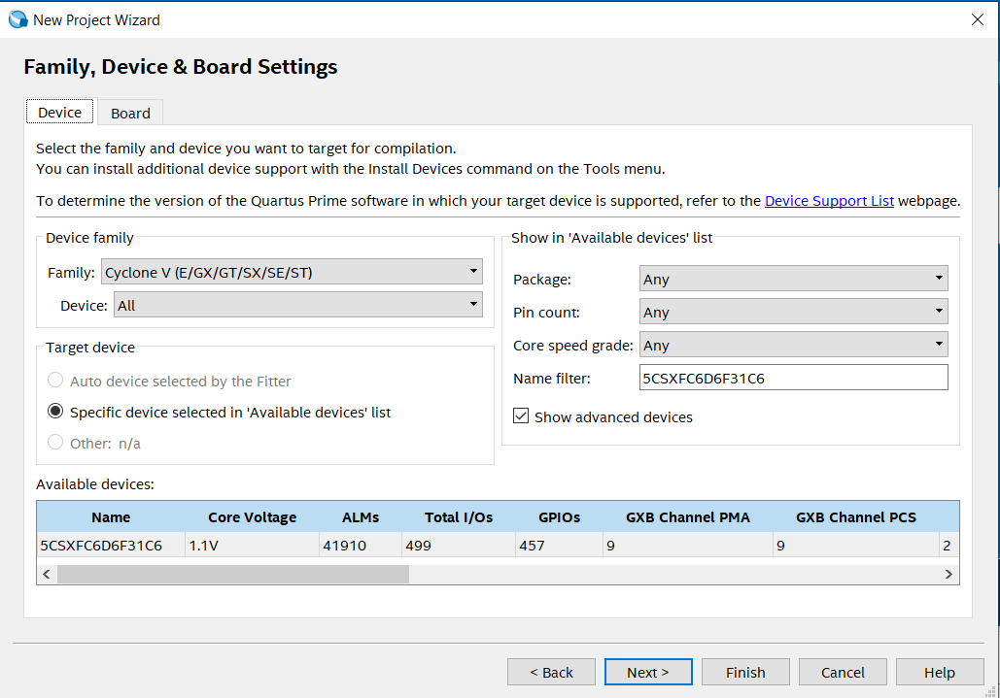
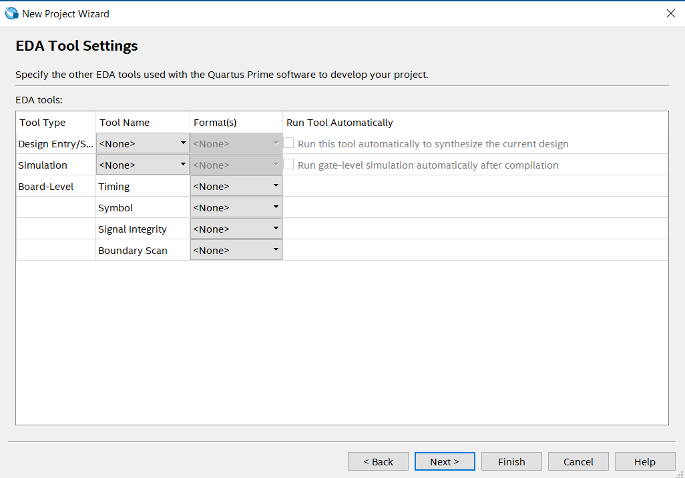
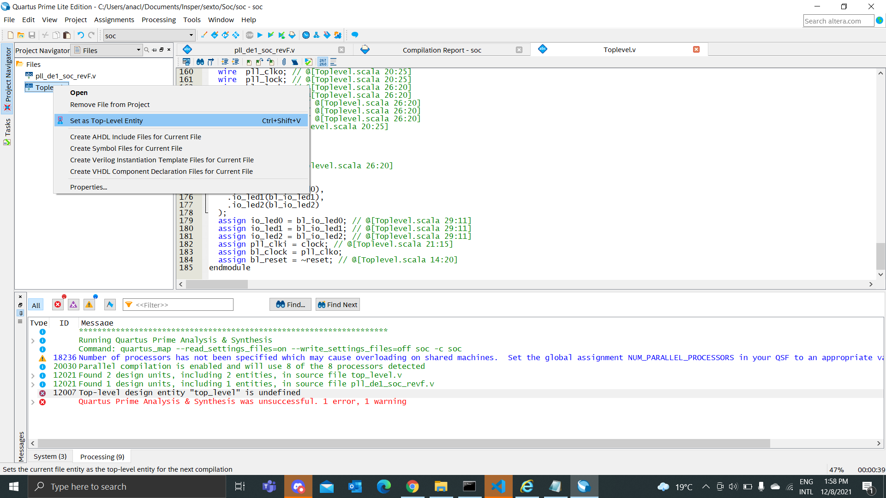
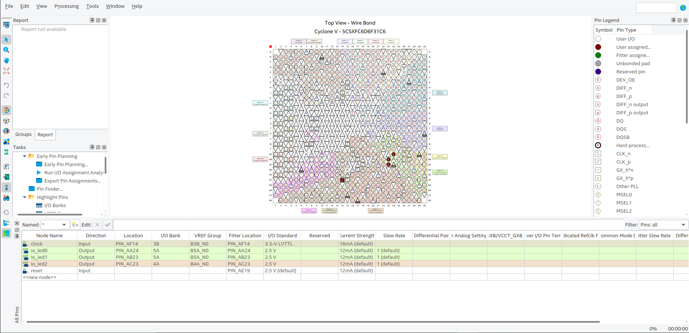
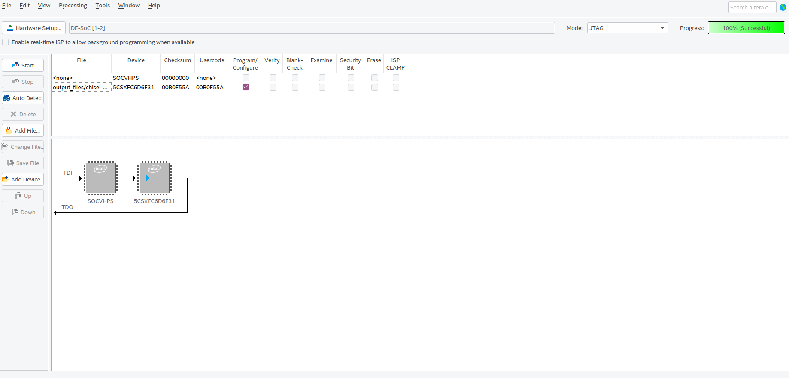

# Chisel

- **Alunes:** Victor Laperuta de Moura / Ana Clara Carneiro de Freitas
- **Curso:** Engenharia da Computação
- **Semestre:** 10 / 6
- **Contato:** victorlm2@al.insper.edu.br / anaccf5@al.insper.edu.br
- **Ano:** 2021

## Começando

Para seguir esse tutorial é necessário:

- **Hardware:** DE10-Standard e acessórios
- **Softwares:** Quartus 18.01, Java
- **Documentos:**
  - [DE10-Standard_User_manual.pdf](https://github.com/Insper/DE10-Standard-v.1.3.0-SystemCD/tree/master/Manual)

## Motivação

Esse tutorial foi realizado com o intuito de aprender e entender um pouco mais sobre uma das mais novas linguagens de design de hardware, Chisel, e apresentar sua infraestrutura, algumas formas de implementá-la e quais são suas possibilidades.

## Introdução sobre Chisel

Chisel é uma linguagem de design de hardware extremamente nova e que foi desenvolvida como uma alternativa às HDLs (Hardware Description Languages), como por exemplo Verilog e VHDL. O que diferencia a Chisel das mais clássicas é a possibilidade de realizar a programação por meio de uma linguagem mais atualizada, sendo essa o Scala, facilitando o desenvolvimento de circuitos e designs mais complexos.

Além disso, o Chisel se baseia na estrutura de compilador de hardware [FIRRTL (Flexible Intermediate Representation for RTL)](https://github.com/chipsalliance/firrtl), a qual permite uma compilação de circuitos mais otimizada, em menor tempo e mais otimizada.

Caso deseje saber um pouco mais sobre a linguagem:

- [Livro Design Digital com Chisel](http://www.imm.dtu.dk/~masca/chisel-book.html)

- [Documentação Chisel](https://www.chisel-lang.org/chisel3/docs/introduction.html)

- [Github Chisel](https://github.com/chipsalliance/chisel3)

## Chisel Tutorial (Sem necessidade de instalação)


Antes de continuar o tutorial, pode ser interessante executar este [notebook](https://mybinder.org/v2/gh/freechipsproject/chisel-bootcamp/master) para ter uma noção melhor da linguagem scala, caso não esteja familiarizado. Em especial, o arquivo "1_intro_to_scala.ipynb" pode ser bem útil, e os demais vão cobrir pontos que não abordaremos neste projeto, por exemplo como construir seus próprios módulos do zero no Chisel.

## Instalações

### Instalação no Ubuntu

- [Instalação do Java](https://adoptopenjdk.net/).

!!! info
A instalação do Scala e os projetos que usam o SBT assumem que o ambiente já possui um JDK instalado, por isso é preciso realizar a instalação do java.

- [Instalação do Scala](https://www.scala-sbt.org/download.html).

!!! info
O Chisel é baseado no Scala para compilar os arquivos dos seus projetos, ou seja, o Scala é uma "Domain Specific Language" - uma linguagem de programação
específica para uma determinada aplicação.

- [Instalação do Verilator](https://verilator.org/guide/latest/install.html).

!!! info
O Verilator é utilizado na etapa de compilação do código em Scala para Verilog.

### Instalação no Windows

- [Baixar arquivo do SBT](https://www.scala-sbt.org/download.html)

!!! info
É necessário baixar o SBT pois essa é a ferramenta que permite a execução e construção de projetos em Scala e Java.

- [Instalação do Chocolatey](https://community.chocolatey.org/packages/sbt)

!!! info
Foi escolhido o Chocolatey como ferramenta para instalar o SBT, mas outras, como o scoop, podem ser utilizadas para instalar o SBT no seu computador. Para instalar a ferramenta utilize o comando abaixo:

```
choco install sbt
```

---

## Clonando o repositório

Clonar o repositório: [Chisel Playground](https://github.com/carlosedp/chisel-playground).

Ir para a pasta "blinky", que é o projeto que vamos compilar e demonstrar o funcionamento na FPGA:

    cd chisel-playground/blinky

Nos arquivos do projeto, ao entrar na pasta `src/main/scala`, existem dois principais: "Blinky.scala" e "TopLevel.scala".

<ol>
    <li>O "Blinky.scala" é responsável por criar o módulo que controla 3 LEDs: o primeiro e o segundo piscam alternadamente duas vezes a cada frequência definida, e o terceiro LED realiza um "fade-in", através de um PWM definido no arquivo.</li>
    <li>O "TopLevel.scala" é responsável por mapear os inputs e outputs para o módulo do "Blinky" e converter o clock da FPGA para 25Mhz utilizando o pll selecionado.</li>
</ol>

!!! info
O clock utilizado na FPGA foi o de 50Mhz, mas um dos arquivos compilados pelo projeto é responsável por converter a frequência para 25Mhz.

Como o código que vamos compilar precisa de recursos específicos da placa na qual vai ser rodado, é preciso antes procurar pela placa nos arquivos do projeto. Para isso, é possível conferir as placas disponíveis na pasta `src/main/resources`, onde temos os plls que serão utilizados por cada uma.

Em seguida, podemos compilar o projeto para verilog. Como argumento do comando "make", é possível selecionar a placa em que queremos executar o código. No caso, como estamos usando uma placa DE-10 da Altera, a mais próxima seria a "de1_soc_revF".

    make chisel BOARD=de1_soc_revF

O output dos arquivos compilados se encontra na pasta `generated`. Dos arquivos gerados, vamos precisar de apenas dois para passar para a FPGA via quartus: o "Toplevel.v" e o pll gerado "pll_de1_soc_revF.v". Com ambos os arquivos gerados:

- Abra o quartus e crie um novo projeto.
<p align="center">
    
    
</p>

- Importe os dois arquivos e configure o "Toplevel.v" como toplevel do projeto.

<p align="center">
    
</p>

- Mapeie os LEDs e o clock no Pin Planner.

<p align="center">
    
</p>

- Compile e passe para a FPGA.

<p align="center">
    
</p>

## Vídeo de resultado

<figure class="video_container">
    <video controls="true" allowfullscreen="true" width="600" height="400">
        <source src = "video_projeto.mp4" type="video/mp4">
    </video>
</figure>
