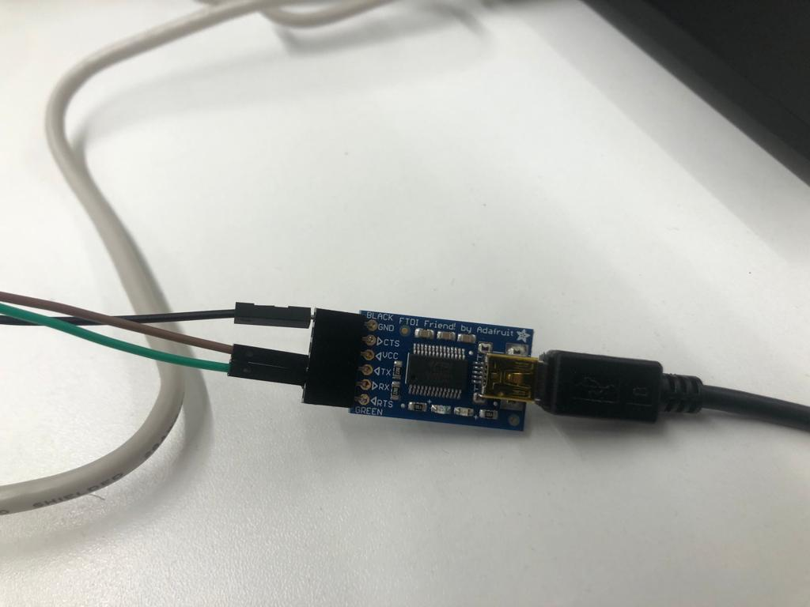
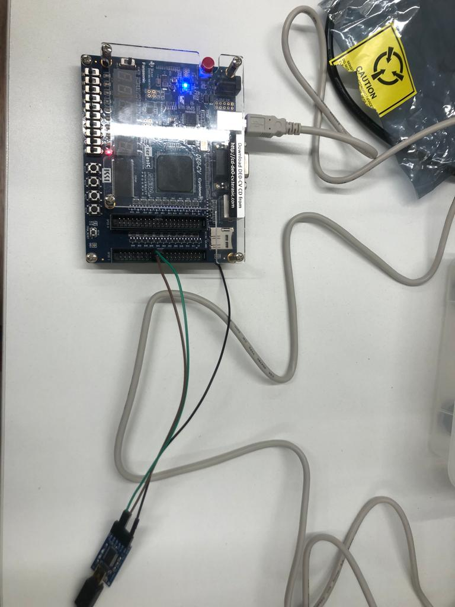

# Processador RISC-V na FPGA

- **Alunes:** Luis Filipe Carrete
- **Curso:** Engenharia da Computação
- **Semestre:** 7
- **Contato:** luisfsc@al.insper.edu.br
- **Ano:** 2022

## Começando

Para seguir esse tutorial é necessário:

- **Hardware:** DE0-C, FTDI Friend by Adafruit, 2 Jumpers Macho Femea e 1 Macho Macho
- **Softwares:** Quartus 18.01 Funcionando (Com o USB Blaster funcional)
- **Código Fonte:** [Arquivos VHDL utilizados](https://github.com/emb4fun/neorv32-examples)
- **Ferramenta para Compilação de programas:** [RISC-V GNU Compiler Toolchain](https://github.com/riscv-collab/riscv-gnu-toolchain)
- **Exemplos de códigos:** [Exemplos de códigos em C para testar na RISCV](https://github.com/stnolting/neorv32)

## Motivação

Expliquem porque quiseram fazer esse tutorial.

RISC (Rapid Instruction Set Computer) é uma arquitetura de processador, desenvolvida em 1981 na Universidade da Califórnia, Berkeley. Ela foi criada com a intenção de simplificar instruções individuais enviadas ao processador para resolver uma certa tarefa. Esse modelo foi criado para funcionar em contraste a arquitetura CISC (Complex Instruction Set Computer) que contém instruções mais robustas. Ou seja, uma instrução de uma arquitetura CISC faz muito mais que uma instrução do RISC, por isso um código para a arquitetura RISC tende a ser muito maior que um código para arquitetura CISC. Apesar disso, a arquitetura RISC tem como vantagem reduzir o tempo de processamento de cada instrução, pois as instruções são muito mais simples, ele utiliza estratégia de criar um pipeline no processador para que ele possa rodar múltiplas instruções em paralelo. 

O RISC V é a quinta versão que hoje está com alta demanda no mercado com um [crescimento de 36.9% de 2021 - 2022](https://riscv.org/blog/2022/02/semico-researchs-new-report-predicts-there-will-be-25-billion-risc-v-based-ai-socs-by-2027/#:~:text=Semico%20Research%20forecasts%20that%20RISC,more%20traditional%20CPU%20SIP%20types), e com previsão de 34.9% de crescimento no mercado até 2027 resultando em uma receita esperada de $291 bilhões de dólares no mesmo ano. Isso é resultado de grandes empresas optarem pelo RISC em vez de processadores tradicionais. Com isso em mente, fica claro a importância desta arquitetura em nosso cenário atual.

----------------------------------------------

# Iniciando o tutorial

## Clonando o repositório

Para iniciar o projeto a primeira coisa a ser feita é clonar o [repositório](https://github.com/emb4fun/neorv32-examples) , que contem o VHDL e todo código necessário para compilar um processador RISC V para a sua DE0-CV, para a sua máquina local.

Como podemos ver após o clone existem diversos diretórios onde cada um deles seria o código compatível com placas específicas, para mais informações ler o readme do repositório. No nosso caso como nossa placa é a DE0-CV iremos focar somente neste diretório. 

## Compilando o VHDL

Agora basta abrir o quartus, selecionar Abrir Projeto e selecionar o arquivo com extensão .qpf no diretório \de0-cv\de0cv-neorv32-sdram-qsys\hw. Após isso, agora só resta conectar a placa com a sua máquina local e apertar o botão de play azul para compilar o programa para a placa.

Caso os passos acima forem feitos com êxito podemos ir para a segunda parte.

## Passando para a DE0-CV

Agora que conseguimos criar e compilar o código devemos passá-lo para a placa. Como utilizaremos comunicação UART para transferir o binário, precisamos acrescentar algumas conexões físicas à nossa placa. No nosso caso utilizaremos a plaquinha FTDI friend para ser o homem do meio em nossa comunicação. Vamos conectá-la a nosso computador via USB, vamos agora pegar nosso jumper Macho Macho e conectar o ground da FTDI com o ground da CE0-CV. Agora pegamos os dois jumpers macho fêmea e vamos conectar um deles no pino TX da FTDI com o pino GPIO_1_D29 da DE0-CV e o outro jumper no pino RX da FTDI com o pino GPIO_1_D28 da DE0-CV. Assim nosso hardware está pronto para a transferência.

A montagem deve estar igual a imagem a baixo:

{width=500}
{width=500}   

## Compilando o Programa

Agora vamos baixar o repositório com exemplos de códigos C para testarmos e ver se realmente funciona o nosso processador RISC V. Vamos utilizar os exemplos dados por [este repositório](https://github.com/stnolting/neorv32). Então o primeiro passo seria cloná-lo para sua máquina local. Os exemplos a serem utilizados estão localizados no diretório /sw/example/. Podemos visualizar múltiplos exemplos, fique a vontade para testar os diferentes programas, mas para este tutorial vamos utilizar o exemplo demo_blink_led.

## RISC-V GNU Compiler Toolchain

A última ferramenta que precisamos instalar é o RISC-V GNU Compiler Toolchain. A instalação pode ser vista no próprio [repositório](https://github.com/riscv-collab/riscv-gnu-toolchain). A instalação consiste em clonar o repositório para sua máquina local, instalar as dependências listadas no repositório, e rodar um comando make para instalar a ferramenta. Isso tudo para conseguirmos compilar o nosso programa em C para um assembly para o nosso RISCV. 

## Ufa... Quanto setup... Agora vai!

