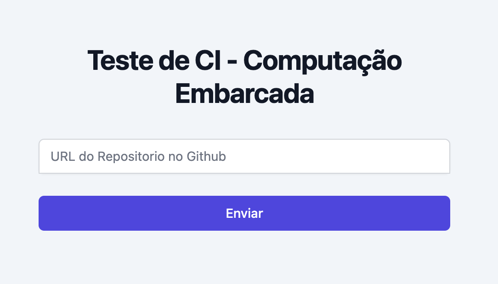

# Webserver com Servidor TFTP para automatização de deploy de testes de Embarcados na DE10-Standard

- **Alunos:** Francisco Pinheiro Janela / Wilgner Lopes / Marco Tulio Masselli
- **Curso:** Engenharia da Computação / Mecatrônica / Mecatrônica
- **Semestre:** 6
- **Contato:** francisco.pinheiro.janela@gmail.com / placeholder@gmail.com / mtmasselli@gmail.com
- **Ano:** 2022.2

## Começando

Para seguir esse tutorial é necessário:

- **Hardware:** 
    - DE10-Standard
    - NUC ou máquina para server Linux
    - Roteador (*modelo usado:* tp-link TL-R470T+)
    - Switch (*modelo usado:* D-Link DGS-1100-08P)
- **Softwares:** Quartus 18.01
- **Documentos:** [DE10-Standard_User_manual.pdf](https://github.com/Insper/DE10-Standard-v.1.3.0-SystemCD/tree/master/Manual), [U-Boot Script](https://ece453.engr.wisc.edu/u-boot-script/), [U-Boot TFTP e NFS](https://www.rocketboards.org/foswiki/Documentation/BootingAlteraSoCFPGAFromNetworkUsingTFTPAndNFS)
- **Laboratórios:** `Linux embarcado`, `Configurando infra`, `Extra: configurando rede`, `Compilando o kernel` e `Buildroot`.

### Montando a Infraestrutura

Para montar a infraestrutura para este roteiro vamos precisar de um ponto de acesso à rede via cabo. Além disso, como a rede do insper é protegida, o roteador que estará constituindo nosso kit precisa estar com o MAC Adress configurado na rede interna.

Com essas condições podemos, então, ligar toda a fiação:

- `Roteador` - Porta WAN1 deve estar conectada ao ponto de acesso, a porta LAN1 ao Switch e alimentá-lo com energia

- `Switch` - Mínimo de 4 portas, deve alimentá-lo com energia

- `NUC` - Conectar o cabo LAN ao Switch, ligar com Cabo USB a NUC à DE10-Standard e alimentá-la com energia

- `DE10-Standard` - Conectar via cabo LAN ao Switch, conectar o USB da NUC, inserir o SDCard configurado com linux kernel e buildroot como filesystem (laboratórios previamente feitos) e alimentá-la com energia

Após tudo conectado, com um palito ou objeto fino, clicar nos pontos de RESET tanto do Roteador, quanto do Switch. O resultado deve ficar similar ao esquema abaixo:

{width=250}

### Configurando a Infraestrtura

Com a infra montada, podemos começar a configurar todos os serviços. Vamos começar pela infraestrutura de Rede

#### Configurando a Rede

- Conecte seu computador ao switch e configure sua rede para aquela estabelecida no manual do fabricante do Roteador (no caso deste modelo, a rede é 192.168.0.0/24)

- Entre na dashboard do roteador em 192.168.0.1 e, acessando pelas credenciais padrões indicadas no manual, configure a mácara de rede (*Netmask*) para `255.255.240.0` ou `/20`

- Reconfigure seu computador agora para a rede padrão do Switch (no caso deste modelo é 10.0.0.0/8)

- Acesse o Dashboard (10.90.90.90) com as credenciais *default* e reconfigure o Switch com o **IP:** 192.168.0.2/20

#### Configurando a Máquina

Depois de configurar tudo de rede, podemos configurar a NUC:

- Conecte um monitor e um teclado à NUC para realizar a instalação do S.O.

- Instale o Ubuntu Server 20.04 LTS e durante as configurações preencher com as informações abaixo:
    - hostname: nucsoc
    - login: nucsoc
    - senha: socfpga
    - IP Fixo: 192.168.0.3/20

- Verifique se ele consegue *pingar* `8.8.8.8`. Se não conseguir, descubra como rotear os pacotes corretamente.

- Verifique se ele consegue *pingar* `www.google.com`. Se não conseguir, descubra como resolver as urls corretamente.

- Verifique se consegue conectar a ela via **ssh** do seu computador:
```cmd
ssh nucsoc@192.168.0.3
```

- Atualize o **apt**:
```cmd
sudo apt update && sudo apt upgrade -y
```

??? tip 
    Configure a **NAT** no roteador para poder acessar remotamente a NUC dentro da rede do Insper.
    Para isso, configure no roteador:

    - Porta externa: 22
    - Porta interna: 22
    - IP interno: 192.168.0.3

#### Configurando a Placa FPGA

Seguindo os tutoriais dos roteiros da matéria, configure o SDCard com todas as partições necessárias, são elas: **U-Boot** (configurado com a instalação do linux embarcado), **S.O.** e **Filesystem** (buildroot deve estar instalado com todas as dependências de python declaradas mais à frente).

Com tudo configurado, acesse o terminal da NUC via ssh e com o comando de `screen` acesse a Placa conectada a ela.
```cmd
sudo screen /dev/ttyUSB0 115200,cs8
```

Se você configurou NAT, é capaz de acessar a screen da FPGA à distância!

Com esse acesso, agora podemos configurar o ip fixo do S.O. da FPGA:

- Acesse a pasta `/etc/init.d/`

- Crie um arquivo chamado `S60MAC.sh`

!!! info
    Todo o arquivo dentro desta pasta que começa com **S** maiúsculo é executado durante o *boot* do S.O.

- Acessando o arquivo com `vi`, coloque o seguinte código:

``` bash
#!/bin/bash

case "$1" in
start)
    printf "Setting ip: "
    /sbin/ifconfig eth0 192.168.0.40 netmask 255.255.240.0 up
    [ $? = 0 ] && echo "OK" || echo "FAIL"
    route add default gw 192.168.0.1
    ;;
*)  
    exit 1
    ;;
esac
```

O código acima irá configurar a rede da placa para que esta tenha um ip fixo de acordo com as configurações de rede feitas.

- Transforme o arquivo acima em um executável
```cmd
chmod +x S60MAC.sh
```
- Reinicie a FPGA para aplicar as mudanças

**Pronto!** Agora temos toda a inffraestrutura configurada e podemos começar a construir nosso servidor de TFTP.

!!! warning
    Não continue para os próximos passos sem toda a infraestrutura montada e configurada

----------------------------------------------

## Servidor TFTP

Antes de começar a construção do servidor, é bom entender como ele funciona.
### Conceito e Diretório

Um servidor TFTP é um serviço disponível em um host que permite ao server buscar arquivos, baseado no protocolo de comunicação TFTP. Para esta aplicação, o servidor será utilizado como fonte dos arquivos principais para configurar a FPGA da DE10-Standard, mas poderia também ser usado para buscar as imagens dos Sistemas Operacionais e BootScripts, além de parear muito bem com o serviço de NFS (Network File System) para que o File System da DE10 pudesse ser remoto. Com tais funcionalidades, poderíamos chegar em uma construção de diretório assim:

```bash
/srv
├── nfs
│   ├── angstrom-v2014.12
│   │   └── root file system extracted from build tools .tar.gx archive
│   ├── ubuntu-core
│   │   └── root file system extracted from build tools .tar.gx archive
└── tftp
    ├── bootscripts
    │   ├── sockit-angstrom.scr
    │   ├── sockit-angstrom.script
    │   ├── sockit-ubuntu.scr
    │   └── sockit-ubuntu.script
    ├── kernel
    │   ├── kernel-3.10-ltsi
    │   │   └── zImage
    │   ├── kernel-4.4
    │   │   └── zImage
    ├── my-custom-board
    │   ├── my-custom.dtb
    │   └── my-custom.rbf    
    └── sockit
        ├── soc_system.dtb
        └── soc_system.rbf
```

Como neste tutorial só será usado o espaço destinado aos arquivos do quartus, abaixo está uma tabela onde estes se encontram no output de uma compilação do projeto criado pelo aplicativo:

| Item                               | Source             | File Location                            | Copy to server directory |
|------------------------------------|--------------------|------------------------------------------|--------------------------|
| Compressed FPGA configuration file | Quartus GHRD Build | /sockit_ghrd/output_files/soc_system.rbf | soc_system.rbf           |
| Device Tree Blob file              | Quartus GHRD Build | /sockit_ghrd/soc_system.dtb              | soc_system.dtb           |

### Setup do Servidor TFTP

Para começar com o setup, vamos instalar o próprio serviço de TFTP:

```cmd
sudo apt-get install tftpd-hpa
```

!!! note
    O servidor deve começar automáticamente após ser instalado, verifique por meio do seguinte comando:

    ```cmd
    sudo service tftpd-hpa status
    ```

    Caso não tenha iniciado, inicie-o com o comando:

    ```cmd
    sudo service tftpd-hpa start
    ```

Em seguida crie os repositórios necessários para armazenar os arquivos `.dtb` e `.rbf` como mostrado na árvore de diretórios acima.

Depois de ter organizado todo o diretório, precisa indicar para o servidor que são estas pastas que serão usadas. Para isso deve editar a variável `TFTP_DIRECTORY`, localizada em **/etc/default/tftpd-hpa**. Ela deve possuir um diretório padrão, mas deve configurá-lo para aquele criado acima.

```bash
TFTP_DIRECTORY="/srv/tftp/"
```

Verifique o status novamente. Se estiver rodadndo (*start/running*), pode proceguir para a próxima etapa, caso não, provavelmente o diretório configurado não foi encontrado pelo servidor.

Por último, copie os arquivos `.dtb` e `.rbf` para o repositório e reinicie o servidor:

```cmd
sudo service tftpd-hpa restart
```

## Carregando o U-Boot

Depois de configurar toda a infraestrutura da DE10-Standard com os laboratórios feitos em aula, vamos entender uma ferramenta essencial para o funcionamento do Linux Embarcado: o `U-Boot`.

Quando o kernel Linux é instalado, é criada uma partição no SDCard com esse serviço de *"pre-boot"*. Nele, são definidas as configurações iniciais da placa para receber e organizar tanto a imagem, os arquivos da FPGA e o File System e por meio de Scripts de boot, iniciar o S.O. adequadamente.

Esse *"pre-boot"* é extremamente poderoso para a nossa aplicação, pois podemos configurar toda a estrutura do S.O. sem necessidade de tirar o SDCard ou acessá-la fisicamente.

Antes de configurá-lo, é necessário entender seu funcionamento.

### Funcionamento do U-Boot

O U-Boot é muito simples. Ele funciona por meio de variáveis de ambiente, que podem ser funções ou caminhos, além de valores em si, que, quando construidos de um certo modo, conseguem construir a estrutura de boot necessária para ler os arquivos no servidor TFTP já configurado. Inclusive, já existem funções definidas para realizar o boot por meio de um servidor, só precisamos garantir que as variáveis estão corretamente definidas.

**Vamos começar devagar...**

Primeiro acesse o kernel com o u-boot. Como não existe nenhum Sistema Operacional, não temos acesso ao serviço de **ssh**, portanto precisamos acessar por `screen`, como foi feito anteriormente. 

Mas só isso não conseguimos entrar no painel do U-boot, precisamos reiniciar a placa, e no tempo antes de começar a inicialização automática apertar qualquer tecla. Isso deve parar o processo, e então você irá se deparar com esse terminal:

```cmd
SOCFPGA_CYCLONE5 #
```

Nele é possível visualizar os comandos já definidos com a função de `help` ou visualizar quais as variáveis de ambiente já predefinidas, usando `printenv`.

Outros comando muito importantes para configurar o ambiente são: `setenv` e `saveenv`, que irão, respectivamente, receber dois argumentos dizendo qual o nome da variável e seu valor e defini-la como variável de ambiente temporária e receber nenhum argumento e salvar todas as variáveis temporárias como permanetes naquela máquina.

Com essas informações em mãos, vamos partir para a etapa de experimentação manual de boot.

#### Experimentação Manual

- Em primeiro lugar, vamos configurar o servidor TFTP para que ele possa ser acessado pela placa. Para isso, precisamos definir o IP da placa e do servidor. Para isso, vamos usar o comando `setenv`:

```cmd
setenv ipaddr 192.168.0.4
```

- Agora configure o MAC-ADDRESS da placa na variável `ethaddr`;

??? Dica
    Para descobrir o MAC-ADDRESS da placa, basta acessar o terminal do Linux e executar o comando `ifconfig`. O MAC-ADDRESS deve ser o mesmo que aparece no terminal do Linux. 
    
    Para isso basta reiniciar a placa por completo, sem acessar o *U-Boot*. Volte e execute o passo acima, ou, antes de reiniciar, execute o comando `saveenv`.

- Teste a comunicação com a NUC, usando o comando `ping`:

```cmd
ping 192.168.0.3
```

- Se a comunicação for bem sucedida, salve a variável `serverip` com o IP da NUC.

- Agora salve o ambiente criado com o comando `saveenv`.

- Reinicie a placa e acesse novamente o *U-Boot*. Com o comando `printenv` é possível visualizar **todas as variáveis de ambiente criadas**.

### Boot em TFTP Server

Depois de entender o funcionamento do *U-Boot*, vamos crirar um **BootScript** para que a placa consiga iniciar o sistema carregando os arquivos do servidor TFTP sem a necessidade de nenhuma configuração manual.

- Crie um arquivo `boot_script.script`

- Adicione o seguinte conteúdo:

```cmd
echo -- Setting Network Variables --
setenv ipaddr [SEU_IP]
setenv ethaddr [SEU_MAC_ADDRESS]

echo -- Setting Server Ip --
setenv serverip [SEU_IP_DA_NUC]

echo -- Setting Server Location File --
setenv tftp-sockit-dir sockit

echo -- Setting Server SocKit File Names --
setenv fpga-image soc_system.rbf
setenv dtb-image soc_system.dtb

echo -- Setting file location in RAM --
setenv fpgadata 0x2000000
setenv fpgadatasize 0x700000
setenv dtbaddr 0x00000100

echo -- Setting FPGA TFTP run scripts --
setenv get-fpgadata 'tftp ${fpgadata} ${tftp-sockit-dir}/${fpga-image}'
setenv load-fpga 'fpga load 0 ${fpgadata} ${fpgadatasize}'
setenv get-dtb 'tftp ${dtbaddr} ${tftp-sockit-dir}/${dtb-image}'


echo -- Run tftp comands --
run get-fpgadata;
run load-fpga;
run get-dtb;
run bridge_enable_handoff;
run mmcload;
run mmcboot;
```

Depois do arquivo estar completo com as variáveis corretamente configuradas, vamos tornar o arquivo em um script que será executado no *U-Boot*.

- Inicie o *Intel Embedded Command Shell* com o seguinte comando:

```cmd
~/intelFPGA_lite/18.0/embedded/embedded_command_shell.sh
```

- Execute o próximo comando para compilar o boot_script para o arquivo `u-boot.scr`:

```cmd
mkimage -A arm -O linux -T script -C none -a 0 -e 0 -n "TFTP Boot Script" -d boot_script.script u-boot.scr
```

- Copie o arquivo `u-boot.scr` para a mesma partição do SDCard da FPGA que se localiza a imagem do linux (*zImage*) - vai ser necessário desligar a placa e remover o cartão de memória.

- Insira o SDCard e inicie a placa.

**Pronto!** Seu sistema deve estar funcionando. Agora, sempre que substituir os arquivos `.rbf`e `dtb` na NUC e reiniciar a placa, a FPGA será automáticamente reconfigurada com a nova aplicação no *boot*.


## FPGA
Como os GPIOs da Standard-DE10 estão conectados na FPGA e não na CPU, para que seja realizada a leitura dos pinos é necessário a habilitação da FPGA (servindo como uma interface fisica entre os pinos e a CPU), isso significa carregar um arquivo que irá descrever o hardware que ela deve formar. Esse arquivo é construído no software Quartus 

### No quartus 18.1:
Como base, foi utilizado o arquivo de demonstração da DE10_Standard localiado no repositótio: [DE10-Standard_GHRD](https://github.com/Insper/DE10-Standard-v.1.3.0-SystemCD/tree/master/Demonstration/SoC_FPGA/DE10_Standard_GHRD)
Este arquivo já descreve o hardware da FPGA para o HPS acessar todos os seus periféricos, entretanto é necessario criar o acesso aos GPIOs.

No quartus se deve abrir o arquivo DE10_Standard_GHRD.qpf, e em seguida:

1. No canto superior direito da tela: Installed IP > System > soc_system. Isso abrirá uma nova aba com o IP Parameter Editor, uma interface gráfica que permite a visaulização do hardware dos periféricos como blocos conectados pelos barramentos.
2. Criar um bloco de inputs/outputs
3. Conectar os barramentos de clock, data, ….
4. Retornar ao Qaurtus e adicionar no arquivo DE10_Standard_GHRD.qpf os pinos que serão utiliados no broco recém-criado no IP Parameter Editor
5. Compilar e gerar o .sof (imagem da FPGA)

### No terminal
- Gerar o .rbf (imagem compactada da FPGA para ser colocada no microSD)
    <pre><code>cd output_files</code></pre>
    <pre><code>quartus_cpf -c DE10_Standard_FB.sof -o bitstream_compression=on soc_system.rbf</code></pre>

- Gerar um novo arquivo .h, que conterá as alteracoes feitas no quartus, como os endereços de memória dos GPIOs criados 

Em seguida basta fazer o upload do arquivo soc_system.rbf e socfpga.dtb no microSD e coloca-lo na DE10-Standard

Conteúdo do repositório referente aos arquivos de descrição de hardware em [projeto-SoC-FPGA](https://github.com/marcotuliomrt/projeto-SoC-FPGA/tree/main):

- rootfs.tar: imagem do OS gerado pelo buildroot (posteriormente convertido para zImage no microSD)
- Pasta dependencies: Conteúdo do microSD da FPGA (imagem do OS, imagem da FPGA, file system e u-boot) 


## Driver para a leitura dos GPIOs
Agora, com o HPS capaz de acessar os periféricos da FPGA e seus GPIOs, é necessário um script para realizar a leitura dos pinos desejados.
O script main.c lê o registrador dos pinos do bloco de inputs criado, coloca uma máscara para extrair apenas o valor do pino 0 (escolhido arbitrariamente para teste), e caso aconteça um toggle deste pino ele executa uma ação: nesse caso, cria um arquivo .txt por 4 sequndos com a menssagem "approved"

Conteúdo do repositório referente aos arquivos do driver em [projeto-SoC-FPGA](https://github.com/marcotuliomrt/projeto-SoC-FPGA/tree/main):

- main.c: Código que roda na FPGA lendo os inputs recebidos 
- hps_0.h: Biblioteca com o mapeamento dos endereços de memória da FPGA
- main.o: Obj file gerada a partir da main.c pela Makefile
- HPS_FPGA_LED: Executável gerado a partir da main.c e hps_o.h pela Makefile
- Makefile: Scrip para compilar a main.c e hps_0.h


## Infraestrutura de integração

O objetivo da construção da infraestrutura de integração é baixar os arquivos de embarcados de um repositorio no github, coletar os arquivos necessarios e salvar em uma pasta dentro da nuc.

{width=500}

### Primeiros passos

Para começarmos, vamos primeiro criar um ambiente virtual com o python:

```cmd
virtualenv proj-env

source proj-env/bin/activate 
```

Nesse projeto utilizaremos flask, por isso precisamos instalar-lo:
```cmd
pip install flask
```

Crie uma pasta para o projeto e crie um arquivo app.py, dentro dele importe as seguintes bibliotecas:

```python
from flask import Flask, render_template, request
from os import mkdir, path, chdir, system, listdir, getcwd
from uuid import uuid4
import shutil
```

O passo a passo desse projeto será:

- Primeiro o usuario coloca a url do repositorio no formulario e clica no botao enviar
- Apos o click, o back-end em python realiza as seguintes operações:
    - Cria uma pasta repo-download e uma pasta com o nome do usuario
    - Clona o repositorio dentro dessa pasta
    - Dentro da pasta busca o arquivo que termina com a extensão .hex e copia para a pasta file-to-test

Para esse processo ocorrer é necessario criar uma rota dentro do flask. Alem disso todo o processo de criar pastas, entrar e sair de diretorios é utilizando a biblioteca OS do python, e a biblioteca shutil para realizar as copias do arquivo. Dentro do arquivo app.py, copie essa parte para criar a rota:

```python

app = Flask(__name__)

@app.route("/", methods=["GET", "POST"])
@app.route("/index", methods=["GET", "POST"])
def index():
    path_atual = getcwd()
    if request.method == "POST":
        url_repo = request.form.get("url")
        username = url_repo.split("/")[3]
        folder_name = f"{uuid4()}-{username}"
        
        if path.exists("./repos-downloaded/"):
            mkdir(path = f"./repos-downloaded/{folder_name}")
        else:
            mkdir(path="./repos-downloaded/")
            mkdir(path = f"./repos-downloaded/{folder_name}")
        
        chdir(f"./repos-downloaded/{folder_name}")
        system("echo 'Dentro da pasta'")
        system(f"git clone {url_repo}")
    
        for file in listdir("./"):
            chdir(file)
            for file2 in listdir("./"):
                if file2.endswith(".hex"):
                    if path.exists("../../../file-to-test/"):
                        shutil.copy(f"./{file2}", f"../../../file-to-test/{folder_name}.hex")
                    else:
                        mkdir(path="../../../file-to-test")
                        shutil.copy(f"./{file2}", f"../../../file-to-test/{folder_name}.hex")

        chdir(path_atual)
    return render_template("index.html")


if __name__ == '__main__':
	app.run(host="192.168.0.3", port=8080) 
```

Com a rota criada vamos criar o front-end da aplicação, na raiz do projeto crie uma pasta chamada **templates** e dentro dela crie um arquivo `index.html`. Alem disso rode o seguinte comando no terminal para instalar e iniciar o tailwindcss:

!!! warning
    Para essa parte é necessario ter o Node instalado no computador

```cmd
npm install -D tailwindcss
npx tailwindcss init
```

Os comandos anteriores devem ter criado um arquivo `tailwind.config.js`, dentro dele copie a seguinte configuração:

```js
/** @type {import('tailwindcss').Config} */
module.exports = {
  content: [
    "./templates/**/*.html",
    "./static/src/**/*.js"
  ],
  theme: {
    extend: {},
  },
  plugins: [],
}
```

Agora crie uma pasta chamada `static/src` e dentro dela o arquivo `input.css`. Copie a seguinte configuração para dentro desse arquivo:

```css
@tailwind base;
@tailwind components;
@tailwind utilities;
```

Dentro do arquivo `index.html` criado anteriormente, coloque o seguinte codigo html:

```html
<!DOCTYPE html>
<html lang="en">
<head>
    <meta charset="UTF-8">
    <meta http-equiv="X-UA-Compatible" content="IE=edge">
    <meta name="viewport" content="width=device-width, initial-scale=1.0">
    <title>Teste CI</title>
    <link rel="stylesheet" href="{{url_for('static',filename='dist/css/output.css')}}">
</head>
<body class="bg-slate-100">
    <div class="flex min-h-full items-center justify-center py-12 px-4 sm:px-6 lg:px-8">
        <div class="w-full max-w-md space-y-8">
          <div>
            <h2 class="mt-6 text-center text-3xl font-bold tracking-tight text-gray-900">Teste de CI - Computação Embarcada</h2>      
          </div>
          <form class="mt-8 space-y-6" action="/index" method="POST">
            <input type="hidden" name="remember" value="true">
            <div class="-space-y-px rounded-md shadow-sm">
              <div>
                <label for="url-github" class="sr-only">URL do Repositorio</label>
                <input id="url-github" name="url" type="text" autocomplete="text" required class="relative block w-full appearance-none rounded-none rounded-t-md border border-gray-300 px-3 py-2 text-gray-900 placeholder-gray-500 focus:z-10 focus:border-indigo-500 focus:outline-none focus:ring-indigo-500 sm:text-sm" placeholder="URL do Repositorio no Github">
              </div>
              
            </div>
      
            <div>
              <button type="submit" class="group relative flex w-full justify-center rounded-md border border-transparent bg-indigo-600 py-2 px-4 text-sm font-medium text-white hover:bg-indigo-700 focus:outline-none focus:ring-2 focus:ring-indigo-500 focus:ring-offset-2">
                Enviar
              </button>
            </div>

          </form>
        </div>
    </div>
</body>
</html>
```


Agora para rodar o back-end em flask rode os seguintes comandos

```cmd
npx tailwindcss -i ./static/src/input.css -o ./static/dist/css/output.css
flask run
```

Com isso temos nosso serviço de integração pronto e funcionando. O serviço rodando agora podemos colocalo dentro da NUC e assim iniciar a integração com a FPGA


## Motivação

A nossa motivação para realizar este projeto foi como ele é altamente aplicável a replicação de serviços construídos para SoC-FPGA e no nosso caso, auxiliar a matéria de Embarcados com a possibilidade de automatização dos testes de funcionamento em hardware dos laboratórios.

Além disso, entender sobre os serviços do **GitHub** para automatização de *hooks*, protocolos de transferência de arquivos como o **TFTP**, configuração e boot do DE10-Standard utilizando u-boot e programar no Quartus estavam entre temas de extremo interesse para todo o grupo.