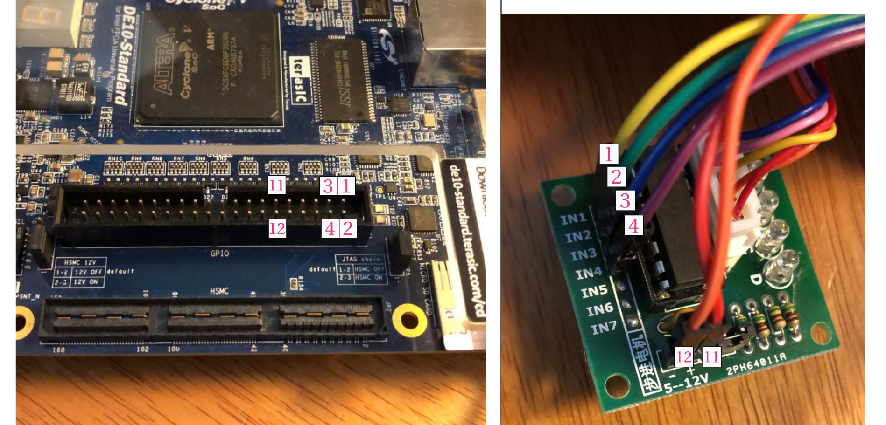
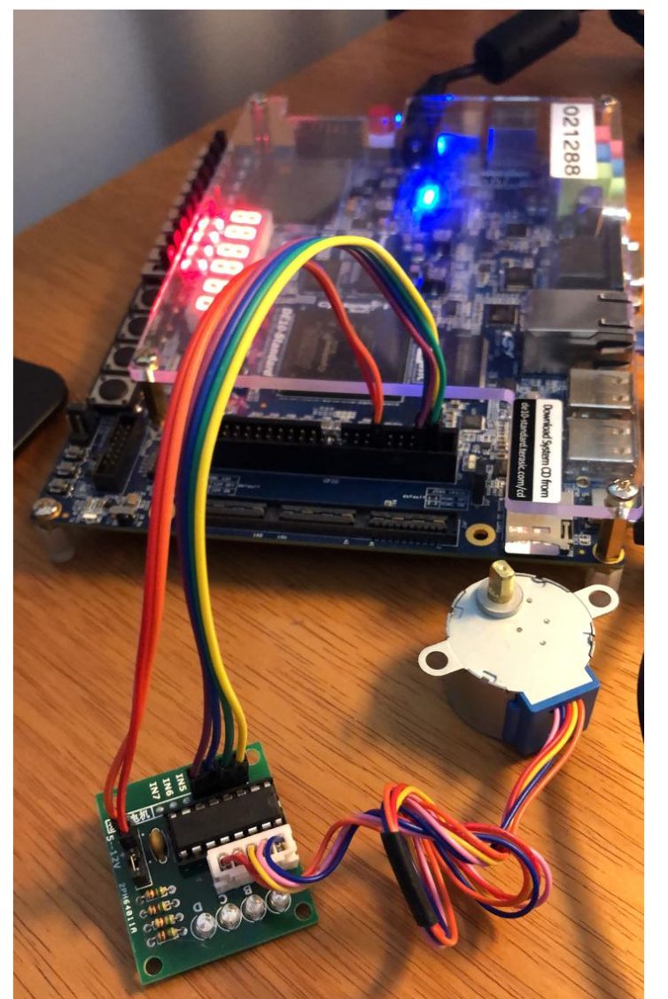
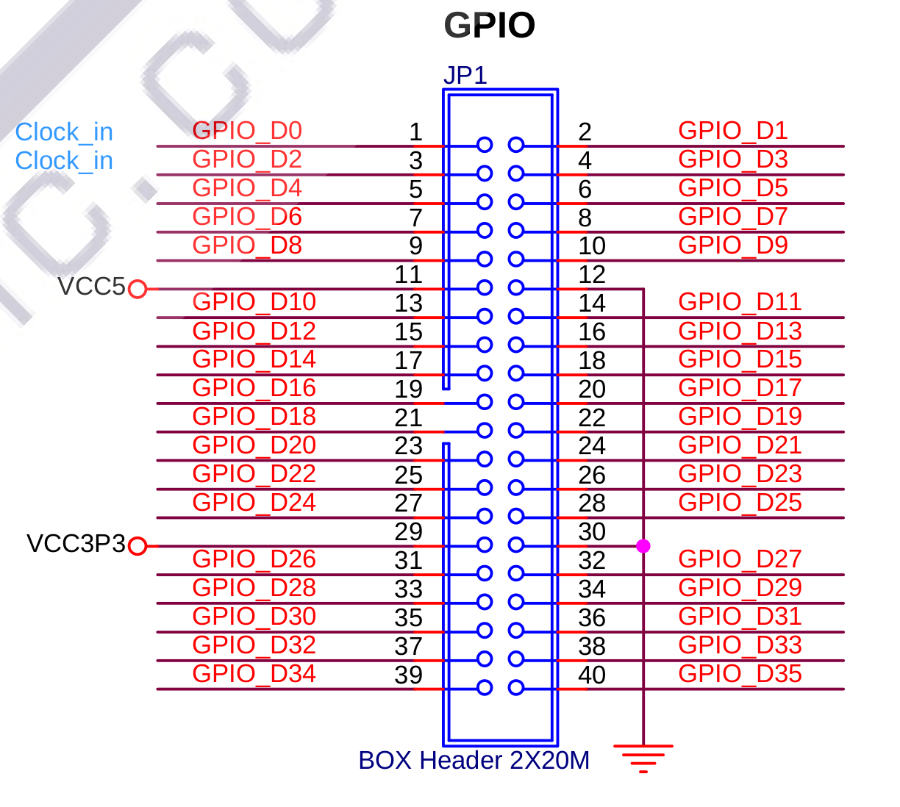

#  👁 Entrega 1

O que deve ser entregue?

- **Pasta:** `Entrega_1_FPGA_RTL`
- **Vídeo** do projeto funcionando com uma explicação (curto!)

A ideia dessa entrega é que vocês trabalhem um pouco mais com o VHDL e que também relembrem/aprendem como desenvolver um projeto de forma hierárquica. Nessa entrega vocês irão desenvolver um IP core (*intellectual property core*) dedicado para o controle de um motor de passos.

Esse componente deve controlar as quatro fases de um motor de passos (vocês receberam junto ao kit) de forma a girar o motor nos dois sentidos e com algumas velocidades diferentes.

## Exemplo

Para facilitar o desenvolvimento está disponível na pasta (`/Entrega1/`) no repositório da disciplina um projeto e um componente que controla o motor de passos, mas não realiza tudo o que está sendo pedido aqui. Nesse exemplo o motor de passos gira apenas para um sentido (`DIR` não funciona), o sinal de `EN` não controla se o motor vai estar ligado/desligar e o motor possui apenas duas velocidades (`VEL`).

Os pinos já foram mapeados e vocês devem conectar o motor como indicado a seguir!

!!! warning
    Faça com atenção para evitar queimar a placa.

Montagem final:

[{width=200}](figs/Entrega-1:montagem2.png)

>  Clique para ampliar

??? note "GPIO esquemático"
    Extraído do manual:

    

!!! example "TODO"
    Após montar, abra o projeto exemplo, compile e grave na FPGA. Você deve ver o motor girando.
    
    Mexa nas chaves 2 e 3, a velocidade do motor deve variar.

## Rubrica

!!! info
    Entregar no repositório criado pelo classroom:
    
    - https://classroom.github.com/g/NOdeF3Du

    Preencher o forms a seguir:
    
    - https://docs.google.com/forms/d/e/1FAIpQLSeBAJLAdo1_fcsrm2OYT62Wg12mCm96gUCrq4oHbjqUM46yGA/viewform?usp=sf_link

- A
    - aplica uma curva de aceleração na velocidade.
- B 
    - possuir número de passos a serem executados.
- C
    - aciona o motor de passos e possui um sinal de: 
        - EN (que liga e desliga o motor)
        - DIR (que controla a direção na qual o motor gira)
        - VEL[1:0] (quatro velocidades de rotação)
- D 
    - Entregou o tutorial
- I
    - Não entregou nada
