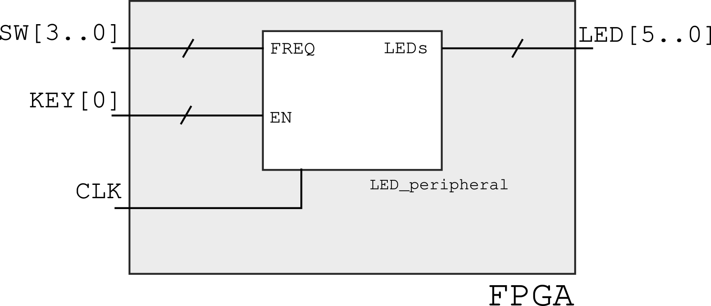

#  👁 Entrega 1

Entrega:

- Pasta `Entrega-1` no git
- Demonstração em sala

A ideia dessa entrega é que vocês trabalhem um pouco mais com o VHDL e com o Quartus e que também relembrem como desenvolver um projeto de forma hierárquica. A partir do tutorial, vocês devem modificar o projeto para que o controle do LED seja feito por um componente (chamado de `LED_peripheral`). 

Esse componente deve variar a frequência na qual os LEDs piscam com base um vetor de 4 bits, que será ao final atribuido as chaves SW. E também deve possuir um sinal de enable (EN), que só deve funcionar caso positivo. Esse sinal de EN será atribuido a botão KEY0.

Depois de criarem esse novo componente, vocês devem o utilizar no `topLevel` para controlar efetivamente os pinos. 

## Rubrica

- A
    - Entregue um testbench capaz de testar o projeto.
- A
    - Entregue um testbench capaz de testar o projeto.
- B 
    - O componente faz uso de generics para configuração interna.
- C
    - Criou um componente em VHDL que é responsável pelo controle do LED 
    - Esse componente possui um sinal de entrada de 4 bits que controla a frequência do LEDs, mapeado para as chaves SW.
    - Esse componente possui um sinal de EN, mapeado para o botão KEY0
- D 
    - Entregou o tutorial
- I
    - Não entregou nada

### Próximo passo 

:bangbang: Siga para o tutorial [Tutorial FPGA NIOS](Tutorial-FPGA-NIOS)
