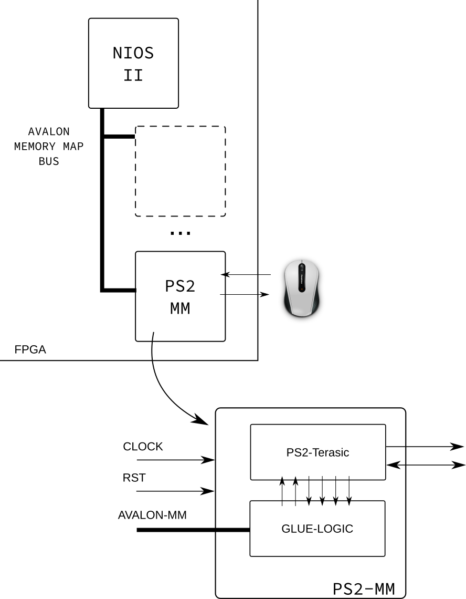

#  👁 Entrega 3

!!! success "2020-2"
    - Material atualizado.
    
 O que deve ser entregue?

- **Pasta:** `Entrega_3_FPGA_NIOS_IP`
- **Vídeo** do projeto funcionando com uma explicação (aprox 1.5 min)   

Nessa entrega iremos encapsular o periférico que criamos para controlar o motor de passos (`Entrega-1`) no Plataform Designer (criando um periférico mapeado em memória) a fim de possuirmos um componente dedicado para controlar o motor.

## Hardware

O diagrama a seguir é uma visão geral do que deve ser feito, nessa concepção iremos "encapsular" o IP da desenvolvido na `Entrega-1` em um "periférico mapeado em memória" (`StepMotor-MM`), para isso será necessário adicionar uma lógica extra, normalmente chamada de `Glue Logic` que realiza a interface entre o barramento e o IP.



### Glue Logic

A lógica de controle deve interfacear com o periférico do Motor de passos em todos os sinais de controle (menos nos de saída (pahse)) de maneira abstrair o acesso mapeado em memória para o periférico. A maneira mais fácil de fazer isso é definindo funcionalidades a endereços do periférico, por exemplo:

| Offset | Funcionalidade | Tipo |
|--------|----------------|------|
| 0      | EN             | R/W  |
| 1      | DIR            | R/W  |
| 2      | VEL            | R/W  |
| ...    | ...            |      |


A tabela anterior mapeia para cada endereço do periférico uma funcionalidade diferente, nesse exemplo, se o usuário deseja ativar o motor, deve fazer a escrita no endereço 0 desse periférico. 

> Note que alguns endereços são Read Only e outros Read/Write (tipo), isso se dá porque não tem sentido (nem é possível fisicamente) escrever me alguns endereços.

## (rubrica C) Software

??? tip "Entrega - google forms"
    <iframe src="https://docs.google.com/forms/d/e/1FAIpQLSfQisAY242qZ7YgpRIeHXcmg_bz1qhaXUZAPM-HOlPiyYbWFQ/viewform?embedded=true" width="700" height="300" frameborder="0" marginheight="0" marginwidth="0">Loading…</iframe>

Além da parte de HW, iremos desenvolver uma biblioteca em C que irá abstrair a interface com esse periférico. 
O periférico deve possuir um driver capaz de interagir com o periférico. Iremos padronizar algumas funções a fim de definirmos um padrão de interface:

``` c
// Para rubrica C
int motor_init( ..... );        // Inicializa o periférico
int motor_halt( ..... );        // Desativa o periférico 
int motor_en( ..... );  // retorna se houve algum click
```

## (rubrica A/B) Software (melhorando)

Adicionar as seguintes funções (cada uma + meio conceito):

``` c
// Para rubrica B/A
int motor_dir( ..... );      // configura direção
int motor_vel( ..... );    // condigura velocidade
```
Esse driver deve estar distribuído em dois arquivos: `motor.c` e `motor.h`. 
