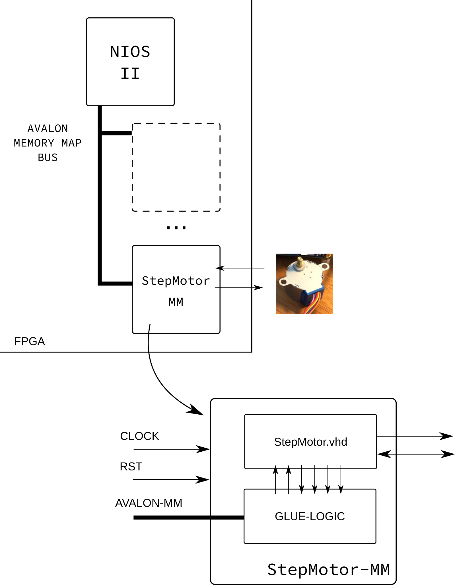
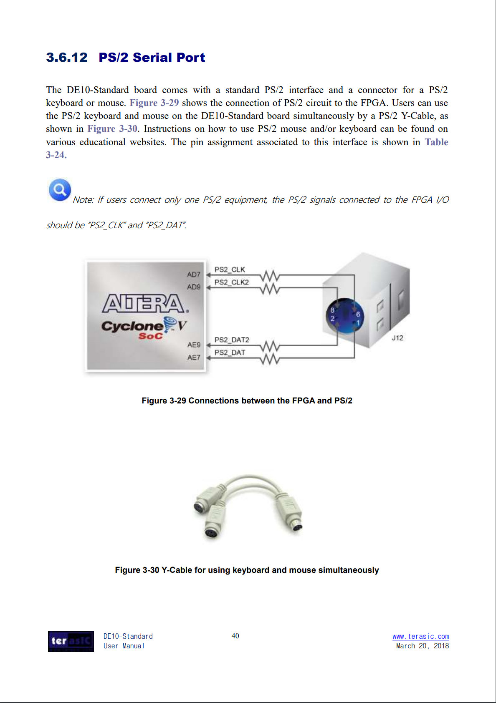

# Entrega 3

Nessa entrega iremos encapsular um periférico que é responsável pela leitura de um mouse pela interface PS/2 no Plataform Designer (criando um periférico mapeado em memória). Utilizaremos como código padrão o exemplo fornecido pela terasic para essa placa, disponível no CD do kit: [`Demonstration/FPGA/DE10_Standard_PS2/`](https://github.com/Insper/DE10-Standard-v.1.3.0-SystemCD/tree/master/Demonstration/FPGA/DE10_Standard_PS2). 

## Rubrica:

- I
    - Não entregou nada
- D 
    - Entregou somente tutorial
- C
    - PS2 mapeado em memória lendo X,Y e click Left
    - Funções: `PS2_init()`/ `PS2_halt()`/ `ps_read_clickLeft()`
- B
    - Aprimorado funções do PS2 + `ps2.c` e `ps2.h`
- A 
    - PS2 gera interrupção


## Hardware

O diagrama a seguir é uma visão geral do que deve ser feito, nessa concepção iremos "encapsular" o IP da Terasic em um "periférico mapeado em memória" (`PS2-MM`), para isso será necessário adicionar uma lógica extra, normalmente chamada de `Glue Logic` que realiza a interface entre o barramento e o IP.



### Periférico Terasic: PS2-Terasic

O periférico da Terasic está pode ser encontrado no link a seguir:

- https://github.com/Insper/DE10-Standard-v.1.3.0-SystemCD/blob/master/Demonstration/FPGA/DE10_Standard_PS2/v/ps2.v

O exemplo que é fornecido pela Terasic está em Verilog! mas não é preciso desespero, podemos usar no nosso projeto em VHDL, basta declarar o componente e usar normalmente:

```vhdl
  component ps2 is
   port(
    iSTART    : in    std_logic;                    -- press the button for tranxrdb -merge .Xdefaultssmitting instrucions to device;
    iRST_n    : in    std_logic;                    -- FSM reset signal;
    iCLK_50   : in    std_logic;                    -- clock source;
    PS2_CLK   : inout std_logic;                    -- ps2_clock signal inout;
    PS2_DAT   : inout std_logic;                    -- ps2_data  signal inout;
    oLEFBUT   : out   std_logic;                    -- left button press display;
    oRIGBUT   : out   std_logic;                    -- right button press display;
    oMIDBUT   : out   std_logic;                    -- middle button press display;
    oX        : out   std_logic_vector(7 downto 0); -- X axis.
    oY        : out   std_logic_vector(7 downto 0) -- Y axis.
    );
   end component ps2;
```

Esse exemplo está também documentando no manual do usuário: [DE10-Standard_User_manual.pdf](https://github.com/Insper/DE10-Standard-v.1.3.0-SystemCD/blob/master/Manual/DE10-Standard_User_manual.pdf) secção: 3.6.12.

??? note "Secção: 3.6.12:"
      Manual do usuário:
      
      


### Glue Logic

A lógica de controle deve interfacear com o periférico da Terasic em todos os sinais de controle (todos menos `PS2_CLK`/ `PS2_DATA`/ `iCLK_50` / 'iRST_n') de maneira abstrair o acesso mapeado em memória para o periférico. A maneira mais fácil de fazer isso é definindo funcionalidades a endereços do periférico, por exemplo:

| Offset | Funcionalidade | Tipo |
|--------|----------------|------|
|      0 | Controle       | R/W  |
|      1 | ox             | R    |
|      2 | oy             | R    |
|      3 | oLEFTBUT       | R    |
|    ... | ...            |      |


A tabela anterior mapeia para cada endereço do periférico uma funcionalidade diferente, nesse exemplo, se o usuário deseja ler a informação do deslocamento y: `oy`, deve fazer a leitura no endereço 2 desse periférico. A implementação disso pode ser feita por um simples `mux`.  O endereço de controle, pode ser usado por exemplo, para inicializar a leitura no periférico da terasic (via o sinal `iSTART`).

Note que alguns endereços são Read Only e outros Read/Write (tipo), isso se dá porque não tem sentido (nem é possível fisicamente) escrever me alguns endereços.

## (rubrica C) Software

Além da parte de HW, iremos desenvolver uma biblioteca em C que irá abstrair a interface com esse periférico. 
O periférico deve possuir um driver capaz de interagir com o periférico. Iremos padronizar algumas funções a fim de definirmos um padrão de interface:

``` c
// Para rubrica C
int PS2_init( ..... );        // Inicializa o periférico
int PS2_halt( ..... );        // Desativa o periférico 
int PS2_read_clickLeft( ..... );  // retorna se houve algum click
```

## (rubrica B) Software (melhorando)

Adicionar as seguintes funções:

``` c
// Para rubrica B/A
int PS2_read_x( ..... );      // retorna o valor do movimento X
int PS2_read_y( ..... );      // retorna o valor do movimento y
```


### (rubrica A) IRQ

Pode-se adicionar um sinal de interrupção ao periférico `PS2-MM` que servirá para alertar o uC (NIOS) de um evento novo. 

Será necessário adicionar as seguintes funções:

```c
int PS2_en_irq( ..... );      // Habilita interrupção
int PS2_disable_irq( ..... ); // Desabilita interrupção
```

Esse driver deve estar distribuído em dois arquivos: `PS2-MM.c` e `PS2-MM.h`. 

## Dicas

É sugerido os seguintes passos de execução da entrega:

1. Executar o exemplo PS2 da Terasic, e ver funcionar
1. Entender os sinais do toplevel desse exemplo
1. Desenhar um diagrama um pouco mais detalhado do PS2-MM, indicando quais sinais (nomes) serão conectados ao `Glue Logic` e quais deverão ser conectados aos pinos da FPGA (conduit no PD)
1. Implementar o 'PS2-MM', usando como base o periférico criado no tutorial.
    - Crie uma nova pasta para o componente dentro da pasta atual `IP` (exe: PS2-MM)
    - Copie o IP da terasic para essa pasta
    - Crie seu componente dentro dessa pasta
