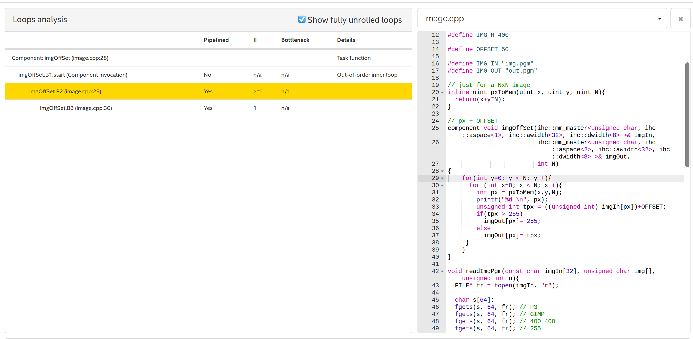

# Tutorial - Acelerando - HLS

HLS (High-Level Synthesis Compiler) é uma ferramenta de compilação que permite
criarmos um componente (hardware/ HDL) a partir de uma linguagem de programação
de alto nível (no caso c++). Essa ferramenta facilita muito o desenvolvimento, e
abstrai o hardware para software, porém ainda é preciso ter um conhecimento de
hardware para utilizar-lha.

## Intel

> The Intel® HLS Compiler is a high-level synthesis (HLS) tool that takes in untimed C++ as input and generates production-quality register transfer level (RTL) code that is optimized for Intel® FPGAs. This tool accelerates verification time over RTL by raising the abstraction level for FPGA hardware design. Models developed in C++ are typically verified orders of magnitude faster than RTL.

<iframe width="560" height="315" src="https://www.youtube.com/embed/hEbfAU_1x8k" frameborder="0" allow="accelerometer; autoplay; encrypted-media; gyroscope; picture-in-picture" allowfullscreen></iframe>

## centos

!!! warning
    Eu só consegui fazer funcionar no centos6, minha solução foi a de executar
    um docker com centos, e instalar as dependências nele. Eu executo o HLS via o
    docker CLI. 
    
!!! note
    Para facilitar a vida, vamos disponibilizar uma imagem do docker já configurada.
    Veja com o seu professor como conseguir.

## HLS

Vamos gerar um componente que aplica um offset (proc) em uma imagem, para isso, esse
componente terá duas interfaces avalon de acesso a memória (AVALON-MM), na
primeira interface, iremos acessar a imagem original e na outra iremos escrever
a imagem processada. 

O nosso hardware terá o seguinte formato:

```
    |-----|         AXI
    | ARM | ===========================
    |-----|            |             |
                       |             |
                   |-------|     |-------|
                   |  Min  |     |  Mout |
                   |-------|     |-------|
           AVALON-MM   |             ^
                       V             |
                   |-------|         |
                   |  Proc |---------- AVALON-MM
                   | (HLS) |
                   |-------|  
```

- Min: Memória da FPGA onde iremos salvar a imagem original
- Mout: Memória na FPGA onde iremos salvar a imagem processada
- TH: Periférico criado pelo HLS

Para isso, iremos utilizar um sintax própria do HLS que define como em C qual
tipo de interface será utilizada no componente (lembre das interfaces AVALON,
memmory maped e streaming).

O HLS permite que validemos o código em duas camadas distintas: a primeira é
compilando o mesmo código que será sintetizado para arquitetura x86, com isso
conseguimos validar o algorítimo de forma mais rápida, a segunda é gerando o HDL
do componente e simulando via modelsim, tudo isso é feito de forma transparente
e automática pela ferramenta.

!!! note
    A simulação do hardware é custosa em termos de tempo de processamento e
    poder computacional, ela deve ser a ultima coisa a ser feita, antes de usar
    o componente no hardware. Valide antes compilando para x86 e então simule.
    
## Offset

A função a ser acelerada é a seguinte (`imgOffSet`):

``` c
#define OFFSET 50

typedef ihc::mm_master<unsigned char, ihc::aspace<1>,
                       ihc::awidth<32>,
                       ihc::dwidth<8> > Master1;
typedef ihc::mm_master<unsigned char, ihc::aspace<2>,
                       ihc::awidth<32>,
                       ihc::dwidth<8> > Master2;


// just for a NxN image
inline uint pxToMem(uint x, uint y, uint N){
  return(x+y*N);
}

// px + OFFSET
hls_avalon_slave_component
component void imgOffSet(Master1& imgIn,
                         Master2& imgOut,
                         hls_avalon_slave_register_argument int offSet,
                         hls_avalon_slave_register_argument int N
                         ){
    for(int y=0; y < N; y++){
      #pragma unroll 8
      for (int x=0; x < N; x++){
        int px = pxToMem(x,y,N);
        unsigned int tpx = ((unsigned int) imgIn[px])+offSet;
        if(tpx > 255)
          imgOut[px]= 255;
        else
          imgOut[px]= tpx;
        }
    }
}

```

Note que a função `imgOffSet` possui quatro argumentos: `imgIn`, `imgOut`, `offSet` e `N`.
Os dois primeiros são ponteiros de memória, que é respectivamente onde o
componente vai fazer a leitura da imagem e onde ele vai fazer a escrita da
imagem. Já os argumentos `offSet` e `N` são: valor a ser aplicado de offSet no px e o tamanho
da imagem em pxs, esse argumentos são do tipo `hls_avalon_slave_register_argument`, que será
convertido para um banco de registradores.

Além dessas entradas e saídas, para cada interface do tipo `mm_master` o HLS vai
criar mais um `conduit`, que será o offset de endereço na qual ele deve acessar
o dado (para a função o endereço 0 é relativo). E mais dois `conduits`, um para
controlar o inicio do processamento (chamada de função/ `call`) e outro para
informar sobre o status do processamento (`return`).

### `imgIn` , `imgOut`

Os dois primeiros argumento são do tipo `ihc::mm_master< unsigned char,` que significa que serão
traduzidos para um barramento do tipo `Avalon` e que devem ser tradados como
`unsigned char`. 

- `ihc::aspace<n>`: e um identificador único do barramento (1,2,3,4,...)
- `ihc::awidth<32>`: Define o tamanho do barramento de endereço, nesse caso 32 bits
- `ihc::dwidth<8>`: Define o tamanho do barramento de dados, nesse caso 8
  (leitura de 8 bits)
- Existem outras configurações do barramento que podem ser feitas nessa
  declaração: latência/ waitrequest/ burst/ (`, ihc::latency<0>, ihc::maxburst<8>, ihc::waitrequest<true> `)...
  
### `pxToMem()`

Para facilitar o desenvolvimento, a função `pxToMem(x,y,N)` traduz um acesso a
px por endereço na matriz para o endereço de memória do px.

#### `printf()`

Essa função será removida quando a função for compilada para hardware, ela só
está disponível para simulação e testes.

### `offSet`, `n`

Precisamos lembrar que estamos criando um componente que resolverá um código em C, e a maneira de conseguirmos
passar argumentos para um componente é criando uma memória interna, que chamamos normalmente de banco de 
registrador e dando funcionalidade para eles. É dessa maneira, que os parâmetros `offSet` e `n` serão criados.
Na geração do componente, uma memória será inicializada e endereços serão reservados para o `offSet` e `n`, como
no exemplo a seguir:

```c
/******************************************************************************/
/* Memory Map Summary                                                         */
/******************************************************************************/

/*
  Register  | Access  |   Register Contents      | Description
  Address   |         |      (64-bits)           | 
------------|---------|--------------------------|-----------------------------
        0x0 |       R |         {reserved[62:0], |     Read the busy status of
            |         |               busy[0:0]} |               the component
            |         |                          |  0 - the component is ready
            |         |                          |       to accept a new start
            |         |                          |    1 - the component cannot
            |         |                          |          accept a new start
------------|---------|--------------------------|-----------------------------
        0x8 |       W |         {reserved[62:0], |  Write 1 to signal start to
            |         |              start[0:0]} |               the component
------------|---------|--------------------------|-----------------------------
       0x10 |     R/W |         {reserved[62:0], |      0 - Disable interrupt,
            |         |   interrupt_enable[0:0]} |        1 - Enable interrupt
------------|---------|--------------------------|-----------------------------
       0x18 |  R/Wclr |         {reserved[61:0], | Signals component completion
            |         |               done[0:0], |       done is read-only and
            |         |   interrupt_status[0:0]} | interrupt_status is write 1
            |         |                          |                    to clear
------------|---------|--------------------------|-----------------------------
       0x20 |     R/W |         {reserved[31:0], |             Argument offSet
            |         |            offSet[31:0]} |                            
------------|---------|--------------------------|-----------------------------
       0x28 |     R/W |         {reserved[31:0], |                  Argument N
            |         |                 N[31:0]} |                            

``

### main.c

A fim de validarmos o projeto, devemos criar uma função main (que não será
compilada para o hardware). Nessa função, abrimos um arquivo de imagem no
formato `.pgm` ("in.pgm")  e geramos outro arquivo de imagem, com a imagem
original processada ("out.pgm"). A fim de validarmos o componente a ser gerado (
`offSetImg()` ) devemos alocar duas regiões de memórias contínuas (`in[M_SIZE]`
e `out[M_SIZE)` que serão utilizadas como input do componente (simulando o
barramento AVALON).

```c
int main(void) {

  int N = IMG_W;
  int M_SIZE = N*N;

  // create memorys
  unsigned char in[M_SIZE];
  unsigned char out[M_SIZE];
  memset(out,0,sizeof(out));

  /* -------------------------- */
  /* reading img to mem */
  /* -------------------------- */
  printf("loading img\n");
  readImgPgm(IMG_IN, in, M_SIZE);

  /* -------------------------- */
  /* create fake memorys components*/
  /* -------------------------- */
  Master1 mm_in(in, M_SIZE);
  Master2 mm_out(out, M_SIZE);

  /* -------------------------- */
  /* process with kernel */
  /* -------------------------- */
  printf("kernel\n");
  imgOffSet(mm_in, mm_out, N);

  /* -------------------------- */
  /* img out */
  /* -------------------------- */
  printf("outputing \n");
  writeImgPgm(IMG_OUT, out)

  return 0;
}
```

!!! note
     Quando formos executar a função `imgOffSet` no nosso hardware, não será tão simples 
     quanto apenas uma chamada de função.

### Testando (x86)

!!! note
    Deve ser feito no centos (docker)

Para testar, vamos compilar o nosso projeto para `x86` (não será um hardware) e validar 
se nossa lógica está correta. Se funcionar, compilamos para hardware.

Para compilar basta usarmos o compilador `i++` como no exemplo a seguir:

```bash
$ i++ image.cpp -march=x86-64 -o image_x86
```

E testar o programa gerado:

```bash
$ ./image_x86
```

O resultado deve ser a belíssima foto `img.ppm` do seu professor, processada com um offset (`out.ppm`):


!!! tip 
    Para gerar uma imagem do tipo `ppm` você pode usar o Gimp

!!! note
    Essa execução é como se tivéssemos compilado com gcc, só serve para validar lógica
    
| input     | output             |
| -----     | ---------          |
| img.pgm   | image    (binário) |
| image.cpp | out.pgm            |
    
## Acelerando na FPGA

Para acelerar na FPGA, vamos compilar novamente a aplicação, porém agora com a flag `-march=CycloneV ` 
que representa a nossa FPGA

```bash
$ i++ image.cpp -march=CycloneV -o image-CycloneV
```

!!! note
    Isso pode bastante tempo, o que ele vai fazer é:
    
    1. Gerar um HDL a partir da sua função
    1. Criar um componente para o Platform Designer
    
| input   | output            |
| -----   | ---------         |
| img.pgm | image-CycloneV.prj (pasta) |
    
### image-CycloneV.prj (pasta)

Se reparar na pasta do projeto, deve ter uma pasta nova: **image-CycloneV.prj**, com o seguinte conteúdo:

- **components**: Pasta com o componente criado (para ser usado no Platform designer)
- **quartus**: Pasta do projeto Quartus utilizado para compilar o componente, **não vamos usar**
- **report**: Pasta com reports gerado pela ferramenta (html)
- **report**: Pasta para simular o projeto

### testando

Agora podemos testar nossa aplicação utilizando o hardware criado pelo HLS, para isso basta executar
o novo binário criado quando compilamos para a arquitetura `CycloneV`. 

```bash
$ ./image-CycloneV
```

!!! warning
    Isso vai levar muito tempo! No monstrinho do lab de Arquitetura, levou mais de 1 hora!
    
Essa simulação é realizada no modelsim! A nível de hardware. O resultado será o esperado quando formos embarcar
na FPGA. Com essa simulação conseguimos verificar erros de arredondamento, acesso a memória, entre outros.

!!! tipa
    A imagem `out-CycloneV.pgm` que está na pasta do projeto, é o resultado dessa simulação.

### report

O HLS gera um relatório da compilação do hardware, ele pode ser encontrado em: [`reports/report.html`](/Tutorial-Acelerando-HLS-reports/report.html). Um report interessante de se analisar é o **Loops analysis**, que demonstra os loops do programa:



### Otimizando

Podemos aplicar diversas técnicas de paralelização no software que irá impactar no hardware criado (área e performance), no manual do HLS ([Intel High Level Synthesis Compiler: Reference Manual](https://www.intel.com/content/www/us/en/programmable/documentation/ewa1462824960255.html#ewa1462826976357)) tem a documentação que descreve cada uma das técnicas.

Vamos utilizar a do **Loop Unrolling**, que permite executarmos um loop paralelo:

```c
 #pragma unroll <N>
 for (int i = 0; i < M; ++i) {
     // Some useful work
 }
```

!!! tip
    **N** é a quantidade de loops a serem executado em //.

Vamos paralelizar a varredura da linha em 8 execuções em paralelo, para isso adicione no for que varre a linha (x):

```c
 for(int y=0; y < N; y++){
      #pragma unroll 8
      for (int x=0; x < N; x++){
```

### Criando um hardware

Agora com o componente criado é necessário adicionarmos ele no hardware, isso será feito via Plataform Design.
Para facilitar o desenvolvimento, vamos usar o projeto de hw exemplo da `Terasic`: `DE10_Standard_FB` e modificar
inserindo o componente e duas memórias, como indicado a seguir:


