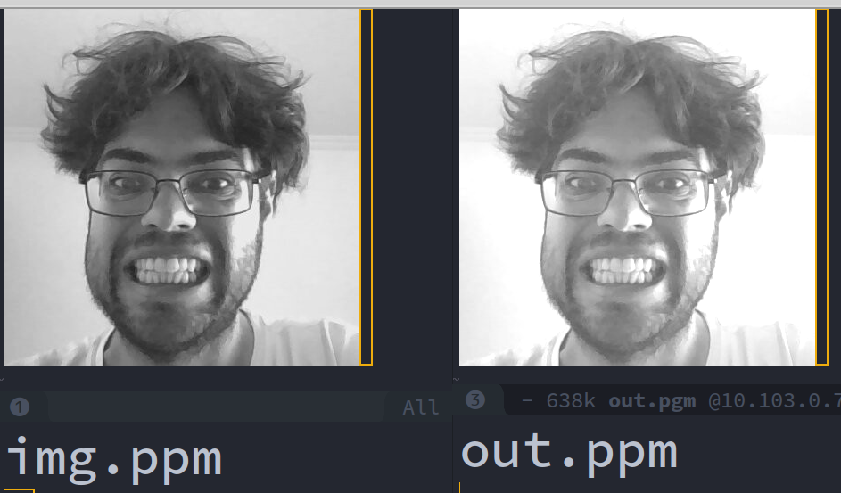

# Accelerating - HLS

HLS (High-Level Synthesis Compiler) is a compilation tool that allows us to create a component (hardware/HDL) from a high-level programming language (in this case, C++). This tool greatly facilitates development and abstracts hardware for software, but you still need hardware knowledge to use it.

## Intel

> The Intel® HLS Compiler is a high-level synthesis (HLS) tool that takes in untimed C++ as input and generates production-quality register transfer level (RTL) code that is optimized for Intel® FPGAs. This tool accelerates verification time over RTL by raising the abstraction level for FPGA hardware design. Models developed in C++ are typically verified orders of magnitude faster than RTL.

<iframe width="560" height="315" src="https://www.youtube.com/embed/hEbfAU_1x8k" frameborder="0" allow="accelerometer; autoplay; encrypted-media; gyroscope; picture-in-picture" allowfullscreen></iframe>

## centos

!!! warning
    I was only able to get it working on centos6; my solution was to run
    a docker with centos and install the dependencies there. I run HLS via the
    docker CLI. 
    
!!! note
    To make things easier, we will provide a pre-configured docker image.
    Check with your instructor on how to get it.

## HLS

We will generate a component that applies an offset (proc) to an image. For this, the
component will have two Avalon memory access interfaces (AVALON-MM): on the
first interface, we will access the original image, and on the other, we will write
the processed image.

Our hardware will have the following format:

```
    |-----|         AXI
    | ARM | ===========================
    |-----|            |             |
                       |             |
                   |-------|     |-------|
                   |  Min  |     |  Mout |
                   |-------|     |-------|
           AVALON-MM   |             ^
                       V             |
                   |-------|         |
                   |  Proc |---------- AVALON-MM
                   | (HLS) |
                   |-------|  
```

- Min: FPGA memory where we will save the original image
- Mout: FPGA memory where we will save the processed image
- TH: Peripheral created by HLS

For this, we will use a specific HLS syntax that, as in C, defines what type of interface will be used in the component (remember the Avalon interfaces, memory mapped, and streaming).

HLS allows us to validate the code on two distinct layers: the first is by compiling the same code that will be synthesized for the x86 architecture, with this we can validate the algorithm much faster, the second is by generating the HDL of the component and simulating it via ModelSim, all of this is done transparently and automatically by the tool.

!!! note
    Simulating the hardware is costly in terms of processing time and computational power, it should be the last thing to be done before using the component on the hardware. Validate by compiling for x86 and then simulating.
    
## Offset

The function to be accelerated is as follows (`imgOffSet`):

``` c
#define OFFSET 50

typedef ihc::mm_master<unsigned char, ihc::aspace<1>,
                       ihc::awidth<32>,
                       ihc::dwidth<8> > Master1;
typedef ihc::mm_master<unsigned char, ihc::aspace<2>,
                       ihc::awidth<32>,
                       ihc::dwidth<8> > Master2;


// just for a NxN image
inline uint pxToMem(uint x, uint y, uint N){
  return(x+y*N);
}

// px + OFFSET
hls_avalon_slave_component
component void imgOffSet(Master1& imgIn,
                         Master2& imgOut,
                         hls_avalon_slave_register_argument int offSet,
                         hls_avalon_slave_register_argument int N
                         ){
    for(int y=0; y < N; y++){
      #pragma unroll 8
      for (int x=0; x < N; x++){
        int px = pxToMem(x,y,N);
        unsigned int tpx = ((unsigned int) imgIn[px])+offSet;
        if(tpx > 255)
          imgOut[px]= 255;
        else
          imgOut[px]= tpx;
        }
    }
}

```

Note that the `imgOffSet` function has four arguments: `imgIn`, `imgOut`, `offSet`, and `N`.
The first two are memory pointers, which are respectively where the
component will read the image and where it will write the
image. The `offSet` and `N` arguments are the value to be applied as an offset to the px and the size
of the image in pxs, these arguments are of the type `hls_avalon_slave_register_argument`, which will be
converted to a register bank.

In addition to these inputs and outputs, for each interface of the type `mm_master`, HLS will create
one more `conduit`, which will be the address offset at which it should access
the data (for the function, the address 0 is relative). And two more `conduits`, one to
control the start of processing (function call/ `call`) and another to
inform about the processing status (`return`).

### `imgIn` , `imgOut`

The first two arguments are of the type `ihc::mm_master< unsigned char,` which means they will be
translated to a bus of the type `Avalon` and that they should be treated as
`unsigned char`. 

- `ihc::aspace<n>`: is a unique identifier of the bus (1,2,3,4,...)
- `ihc::awidth<32>`: Defines the size of the address bus, in this case, 32 bits
- `ihc::dwidth<8>`: Defines the size of the data bus, in this case, 8
  (reading 8 bits)
- There are other bus configurations that can be made in this
  declaration: latency/ waitrequest/ burst/ (`, ihc::latency<0>, ihc::maxburst<8>, ihc::waitrequest<true> `)...
  
### `pxToMem()`

To facilitate development, the function `pxToMem(x,y,N)` translates an access to
px by address in the matrix to the memory address of the px.

#### `printf()`

This function will be removed when the function is compiled for hardware; it is only
available for simulation and testing.

### `offSet`, `n`

We need to remember that we are creating a component that will resolve a C code, and the way we can
pass arguments to a component is by creating an internal memory, which we normally call a register bank,
and giving functionality to them. This is how the `offSet` and `n` parameters will be created.
When the component is generated, a memory will be initialized and addresses will be reserved for `offSet` and `n`, as
in the following example:

```c
/******************************************************************************/
/* Memory Map Summary                                                         */
/******************************************************************************/

/*
  Register  | Access  |   Register Contents      | Description
  Address   |         |      (64-bits)           | 
------------|---------|--------------------------|-----------------------------
        0x0 |       R |         {reserved[62:0], |     Read the busy status of
            |         |               busy[0:0]} |               the component
            |         |                          |  0 - the component is ready
            |         |                          |       to accept a new start
            |         |                          |    1 - the component cannot
            |         |                          |          accept a new start
------------|---------|--------------------------|-----------------------------
        0x8 |       W |         {reserved[62:0], |  Write 1 to signal start to
            |         |              start[0:0]} |               the component
------------|---------|--------------------------|-----------------------------
       0x10 |     R/W |         {reserved[62:0], |      0 - Disable interrupt,
            |         |   interrupt_enable[0:0]} |        1 - Enable interrupt
------------|---------|--------------------------|-----------------------------
       0x18 |  R/Wclr |         {reserved[61:0], | Signals component completion
            |         |               done[0:0], |       done is read-only and
            |         |   interrupt_status[0:0]} | interrupt_status is write 1
            |         |                          |                    to clear
------------|---------|--------------------------|-----------------------------
       0x20 |     R/W |         {reserved[31:0], |             Argument offSet
            |         |            offSet[31:0]} |                            
------------|---------|--------------------------|-----------------------------
       0x28 |     R/W |         {reserved[31:0], |                  Argument N
            |         |                 N[31:0]} |                            
*/

```

### main.c

In order to validate the project, we must create a main function (which will not be
compiled for the hardware). In this function, we open an image file in the
`.pgm` format ("in.pgm") and generate another image file with the
original image processed ("out.pgm"). In order to validate the component to be generated (
`offSetImg()` ) we must allocate two continuous memory regions (`in[M_SIZE]`
and `out[M_SIZE)` that will be used as the component's input (simulating the
AVALON bus).

```c
int main(void) {

  int N = IMG_W;
  int M_SIZE = N*N;

  // create memorys
  unsigned char in[M_SIZE];
  unsigned char out[M_SIZE];
  memset(out,0,sizeof(out));

  /* -------------------------- */
  /* reading img to mem */
  /* -------------------------- */
  printf("loading img\n");
  readImgPgm(IMG_IN, in, M_SIZE);

  /* -------------------------- */
  /* create fake memorys components*/
  /* -------------------------- */
  Master1 mm_in(in, M_SIZE);
  Master2 mm_out(out, M_SIZE);

  /* -------------------------- */
  /* process with kernel */
  /* -------------------------- */
  printf("kernel\n");
  imgOffSet(mm_in, mm_out, N);

  /* -------------------------- */
  /* img out */
  /* -------------------------- */
  printf("outputing \n");
  writeImgPgm(IMG_OUT, out)

  return 0;
}
```

!!! note
     When we execute the `imgOffSet` function on our hardware, it will not be as simple 
     as just a function call.

### Testing (x86)

!!! note
    Must be done on centos (docker)

To test, we will compile our project for `x86` (it will not be hardware) and validate 
if our logic is correct. If it works, we compile for hardware.

To compile, just use the `i++` compiler as in the following example:

```bash
$ i++ image.cpp -march=x86-64 -o image_x86
```

And test the generated program:

```bash
$ ./image_x86
```

The result should be the beautiful `img.ppm` photo of your instructor, processed with an offset (`out.ppm`):



!!! tip 
    To generate a `ppm` type image you can use Gimp

!!! note
    This execution is like compiling with gcc, it only serves to validate logic
    
| input     | output             |
| -----     | ---------          |
| img.pgm   | image    (binary) |
| image.cpp | out.pgm            |
    
## Accelerating on the FPGA

To accelerate on the FPGA, we will compile the application again, but now with the `-march=CycloneV ` flag 
which represents our FPGA

```bash
$ i++ image.cpp -march=CycloneV -o image-CycloneV
```

!!! note
    This may take a long time, what it will do is:
    
    1. Generate an HDL from your function
    1. Create a component for the Platform Designer
    
| input   | output            |
| -----   | ---------         |
| img.pgm | image-CycloneV.prj (folder) |
    
### image-CycloneV.prj (folder)

If you notice in the project folder, there should be a new folder: **image-CycloneV.prj**, with the following content:

- **components**: Folder with the created component (to be used in the Platform designer)
- **quartus**: Quartus project folder used to compile the component, **we will not use this**
- **report**: Folder with reports generated by the tool (html)
- **report**: Folder to simulate the project

### testing

Now we can test our application using the hardware created by HLS, for that just execute
the new binary created when we compiled for the `CycloneV` architecture. 

```bash
$ ./image-CycloneV
```

!!! warning
    This will take a long time! On the monster lab Architecture, it took over 1 hour!
    
This simulation is performed on ModelSim! At the hardware level. The result will be as expected when we embed
on the FPGA. With this simulation, we can check for rounding errors, memory access, among others.

!!! tipa
    The image `out-CycloneV.pgm` that is in the project folder, is the result of this simulation.

### report

HLS generates a report of the hardware compilation, it can be found in: [`reports/report.html`](/Tutorial-Acelerando-HLS-reports/report.html). An interesting report to analyze is the **Loops analysis**, which demonstrates the program loops:


### Optimizing

We can apply several parallelization techniques in the software that will impact the created hardware (area and performance), in the HLS manual ([Intel High Level Synthesis Compiler: Reference Manual](https://www.intel.com/content/www/us/en/programmable/documentation/ewa1462824960255.html#ewa1462826976357)) there is documentation that describes each of the techniques.

We will use the **Loop Unrolling** one, which allows us to execute a loop in parallel:

```c
 #pragma unroll <N>
 for (int i = 0; i < M; ++i) {
     // Some useful work
 }
```

!!! tip
    **N** is the number of loops to be executed in //.

We will parallelize the line scanning by 8 executions in parallel, for that add in the for that scans the line (x):

```c
 for(int y=0; y < N; y++){
      #pragma unroll 8
      for (int x=0; x < N; x++){
```

### Creating a hardware

Now with the component created, we need to add it to the hardware, this will be done via Platform Design.
To facilitate development, we will use the example hw project from `Terasic`: `DE10_Standard_FB` and modify
inserting the component and two memories, as indicated below:


