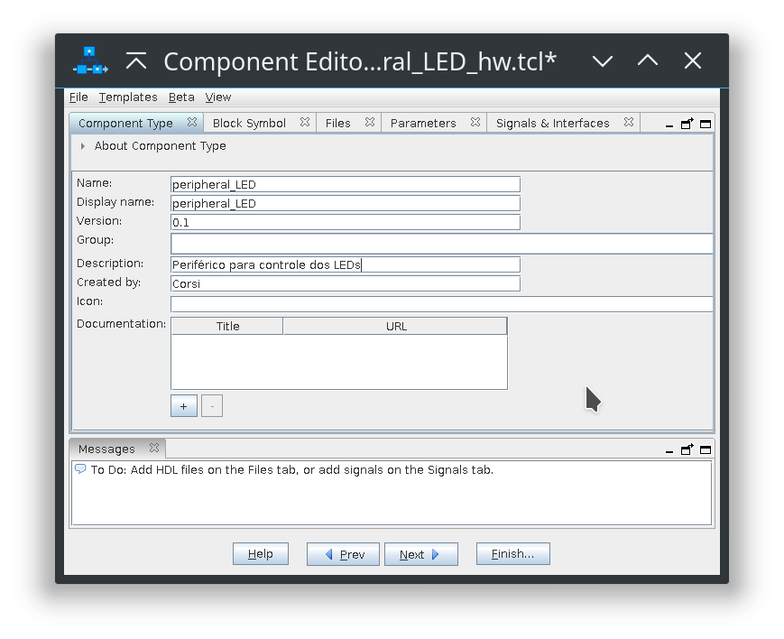
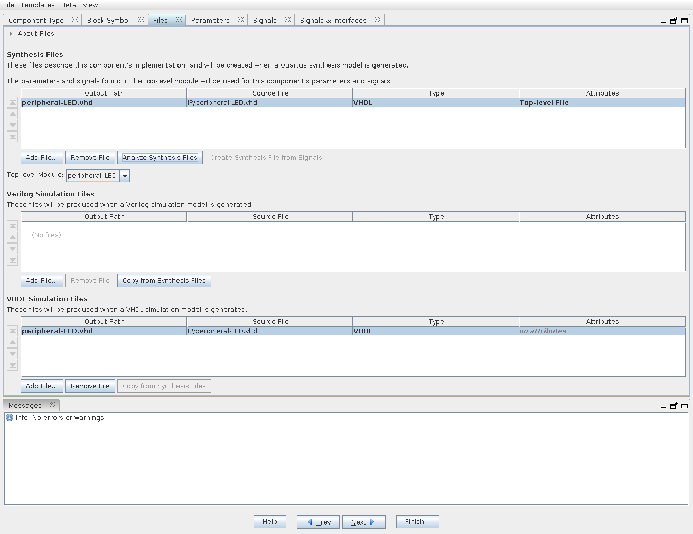
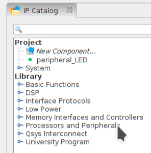
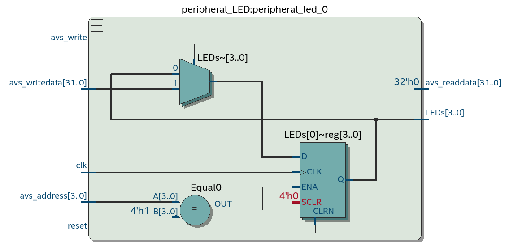
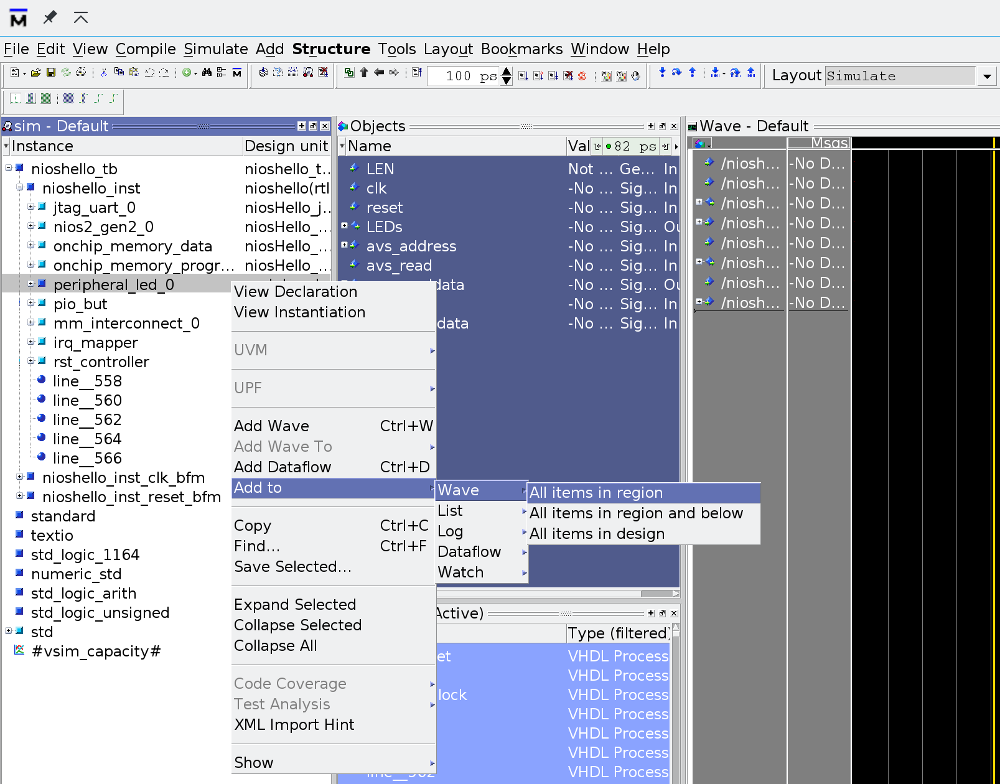
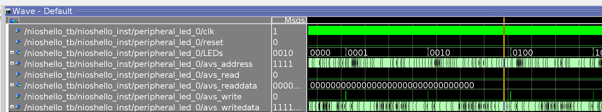

# IP Core

In this tutorial, we will develop a custom peripheral for the NIOS processor, dedicated to controlling the board's LEDs. The peripheral will have an internal register bank for its control, and a "memory-mapped I/O" interface so we can control it from NIOS (using C code).

## Getting Started

To follow this tutorial, you need:

- **Hardware:** DE10-Standard and accessories 
- **Software:** Quartus 18.01 
    - Modelsim Simulator

Submission on git:

- **Folder:** `Lab3_FPGA_IP/`

## IP Cores

Intellectual Property Core ([IP Core](https://www.xilinx.com/support/documentation/sw_manuals/xilinx11/cgn_c_ip_overview.htm)) are components described in HDL that can be used in multiple hardware projects. Platform Designer (PD) provides, in addition to the visual interface for connecting these IPs, a communication standard between components, making it easier to use these IPs.

Besides hundreds of projects spread across the internet (github), there is a very complete repository of open-source IP cores with a wide variety of projects:

- [opencores](http://opencores.org/projects)

Companies also provide IPs, both paid and free:

- [Intel-FPGA IP cores](https://www.altera.com/products/intellectual-property/ip.html)

## Platform Designer 

PD is a tool for integrating IPs, making it very simple to insert and create components that will be used to form a more complete system. As in the previous tutorial, where we used a series of components to create our project. These components are, in a way, IPs (simple like PIO and complex like NIOS).

The integration of IPs in PD is due to the standardization of communication between these components, which is provided via the bus.

## Buses

Intel-FPGA defines two categories of data buses for PD: **Avalon** and **AXI**. The Avalon bus is the main way to connect a peripheral to NIOS (processor), while AXI is the ARM bus standard, also used in Platform Designer.

### Avalon

!!! info 
    Complete documentation for the AVALON bus:

    - https://www.intel.com/content/dam/www/programmable/us/en/pdfs/literature/manual/mnl_avalon_spec.pdf

The Avalon bus basically defines two types of modules: **Memory Mapped (MM)** and **Avalon Streaming Interface (ST)**, as described below, extracted from the documentation:

-  **Avalon Streaming Interface (Avalon-ST)** — an interface that supports the unidirectional flow of data, including multiplexed streams, packets, and DSP data.

-  **Avalon Memory Mapped Interface (Avalon-MM)** — an address-based read/write interface typical of master–slave connections.

-  **Avalon Conduit Interfae** — an interface type that accommodates individual signals or groups of signals that do not fit into any of the other Avalon types. You can connect conduit interfaces inside a Platform Designer system. Or, you can export them to make connections to other modules in the design or to FPGA pins.

-  **Avalon Tri-State Conduit Interface** - (an interface to support connections to off-chip peripherals. Multiple peripherals can share pins through signal multiplexing, reducing the pin count of the FPGA and the number of traces on the PCB.

-  **Avalon Interrupt Interface** — an interface that allows components to signal events to other components.
-  **Avalon Clock Interface*** — an interface that drives or receives clocks.
-  **Avalon Reset Interface** — an interface that provides reset connectivity.

!!! tip
    We will work with the type: **Avalon-MM** as a way to connect the peripheral to NIOS.

## Project 

!!! note
    Let's improve the previous project, make a copy of the project folder: `Lab2_FPGA_NIOS/` and rename it to: `Lab3_FPGA_IP/`. We will now work in this new folder.

### Creating a peripheral 

Let's create a new component that will be able to control the LEDs with more autonomy. 

Follow the script below:

1. Specification
1. Generate HDL that represents the peripheral with Avalon interface
1. Create the component in Platform Designer 
    - Associate files with the component
    - General definitions
    - Associate the component ports with the bus signals
1. Use component in the project
1. Create driver (`.c` and `.h`)
1. Simulate
1. Implement/ Test
1. Review specification (1.)

First, we need to define the main role of this peripheral and its data flow. With this, it will be possible to define whether the peripheral is of the type: **Master** or **Slave** and whether its interface is of the type **Memory Mapped** or **Streaming**.

A peripheral can have more than one interface, for example: A peripheral that will process audio in real-time may have up to three interfaces: It will receive the audio via the **streaming** interface and return the data through another **streaming** interface, however, a third interface will be needed to control this peripheral, most likely of the **Memory Mapped** type.

!!! note ""
    It is possible to transmit command packets over the streaming interface, but this makes the project more complex.

Our simple peripheral will simply receive configurations to activate the LED, without any continuous or intense data flow, being the most appropriate interface of the **memory-mapped peripheral** type. Furthermore, our exclusive peripheral for LED control is a **slave** of the system, as it must be controlled by another part of the system (in our case, the uC) to act as needed.

#### Avalon Slave Memory Mapped

For our peripheral to communicate with the processor, we need to implement the communication standard used by NIOS. We can choose to implement the complete standard or just part of its specification. For example, if our peripheral does not use `waitrequest` or `byteenable`, we can choose not to implement these signals.

Below is an example of the signals of a memory-mapped peripheral that has as interface the `Avalon-MM-Slave`.

```vhdl
entity peripheral_MM is
    port (
        -- Gloabals
        clk                : in  std_logic                     := '0';             
        reset              : in  std_logic                     := '0';             

        -- Avalon Memmory Mapped Slave
        avs_address     : in  std_logic_vector(3 downto 0)  := (others => '0'); 
        avs_read        : in  std_logic                     := '0';             
        avs_readdata    : out std_logic_vector(31 downto 0) := (others => '0'); 
        avs_write       : in  std_logic                     := '0';           
        avs_writedata   : in  std_logic_vector(31 downto 0) := (others => '0')  
	);
end entity peripheral_MM;
```

Note that the first part of the component defines a clock signal (`clk`) and a reset signal (`reset`), remember that digital projects in FPGA must mostly be synchronous. The second part is the definition of the signals that will be connected to the bus for access by other peripherals.

Remember that we are creating a memory-mapped component, so it must have behavior and interface similar to that of a memory. 

- `avs_address`: Access address to the component, in this case, 4 bits.
- `avs_read`: Indicates that it is a read access
- `avs_readdata`: Data that will be returned to the Master given a read access.
- `avs_write`: Indicates that it is a write access
- `avs_writedata`: Data that is transmitted to the component given a write access.

The word size of `avs_readdata` and `avs_writadata` is defined by the component and is not fixed at 32 bits as in the example, it can take other values.

A write to the peripheral is done as follows:

1. Master addresses peripheral 
2. Absolute address is translated to relative
     - The address that the master writes to the peripheral is composed of: **addr** :heavy_plus_sign:	**offset** but the slave only has access to the **offset**. 
3. Peripheral receives: `avs_address`, `avs_write = '1'` and `avs_writedata`.


A read from the peripheral is done as follows:

1. Master addresses peripheral 
2. Absolute address is translated to relative
3. Peripheral receives: `avs_adddress` and `avs_read = '1'`
4. Peripheral updates: `avs_readdata`


!!! question "Questions"
    The `AVALON` bus defines other signals, answer the following about some of these signals:

    waitrequest:

    - What is the role of waitrequest? 
    - Who triggers the waitrequest (Slave or Master)?
    
    byteenable:
    
    - What is the role of byteenable? 
    - Who triggers the byteenable (Slave or Master)?

### Specification

Our peripheral will initially be very simple, just to understand the entire process of developing a peripheral and its use. The peripheral that we will develop will be a substitute for the PIO peripheral provided by Intel-FPGA, used in the LED blink project with NIOS.

Our peripheral will be memory-mapped and will have a conduit (output) where the LED activation will be performed:


Access to our peripheral will be through a 32-bit word (to maintain a standard with NIOS) and will have two registers `REG_CONFIG` and `REG_DATA`:

- `REG_CONIFG`: Register that controls the peripheral, in our case, it will have only one bit: `Enable`/`Disable` (`bit0` :arrow_right:  `Enable/Disable`)
- `REG_DATA`: Register that has the value of each LED (`bit0` :arrow_right: `LED0`; `bit1` :arrow_right: `LED1` ....).

### Generate HDL that represents the peripheral with Avalon interface

Starting from the provided entity (`peripheral_MM`), we can create a component that partially implements the previous specification, in this implementation we do not have the two registers (`REG_CONFIG` and `REG_DATA`), we only have the functionality of the `REG_DATA`. Note that the implementation uses a generic to define the number of LEDs that this peripheral controls. This generic can be configured through the graphical interface of the Platform Designer, making it a customized component.


!!! info
    Create a file called: `peripheral_LED.vhd` and save it in the project folder : `Lab3_FPGA_IP/IP/`

    !!! warning ""
        It will be necessary to create the IP folder

```vhdl
library IEEE;
use IEEE.std_logic_1164.all;
use IEEE.std_logic_unsigned.all;
use IEEE.numeric_std.all;
use work.all;

entity peripheral_LED is
    generic (
        LEN  : natural := 4
    );
    port (
        -- Gloabals
        clk                : in  std_logic                     := '0';             
        reset              : in  std_logic                     := '0';             

        -- I/Os
        LEDs               : out std_logic_vector(LEN - 1 downto 0) := (others => '0');

        -- Avalion Memmory Mapped Slave
        avs_address     : in  std_logic_vector(3 downto 0)  := (others => '0'); 
        avs_read        : in  std_logic                     := '0';             
        avs_readdata    : out std_logic_vector(31 downto 0) := (others => '0'); 
        avs_write       : in  std_logic                     := '0';             
        avs_writedata   : in  std_logic_vector(31 downto 0) := (others => '0')
	);
end entity peripheral_LED;

architecture rtl of peripheral_LED is
begin

  process(clk)
  begin
    if (reset = '1') then
      LEDs <= (others => '0');
    elsif(rising_edge(clk)) then
        if(avs_address = "0001") then                  -- REG_DATA
            if(avs_write = '1') then
              LEDs <= avs_writedata(LEN - 1 downto 0);
            end if;
        end if;
    end if;
  end process;

end rtl;
```

!!! note "Limitations of this implementation"
    - Does not have a configuration register: `REG_CONFIG`
    - It is not possible to read: `REG_DATA` via **Avalon** bus 

We could already at this stage test the component, creating a `testbench` to excite the module and check its behavior. A large part of the development of a hardware project is spent on testing, which can be as complex as the module itself. Let's skip this step here, we will simulate at a higher level.

### Configuring path

Now we will add our peripheral in **Platform Designer**, this new component to be created will be incorporated into the tool, for that:

We need to indicate to the PD the location it should search to find source codes that are not part of the standard catalog, for that:

1. `Tools` :arrow_right: `Options` :arrow_right: `IP Search Path`
1. Add the `IP` folder recently created.

And now remove the PIO component:

1. Remove the PIO that controlled the LEDs (now we will control it with our component)

### Creating component

Just adding the HDL file (`.vhd` or `.v`) is not enough for the PD to recognize the component, we need to create a second file (`*_hw.tcl`) that is read by the PD, this file will have all the configurations and descriptions of the new component. For that:

- `File` :arrow_right: `New Component` :ok:

And a graphical interface for configuring the component will be displayed. The first part refers to the description of the component itself. Name this component: `peripheral_LED` and fill in its description.



Already in the `Files` tab we have the information of which files belong to the component. 

#### Files

In the Files tab add the `peripheral_LED.vhd` file:

1. `Files` :arrow_right: `Syntesis Files` :arrow_right: `add file` :arrow_right: **`peripheral_LED.vhd`**
1. Click on :arrow_right: `Analyze Synthesis Files` : this will make the tool briefly analyze the HDL files and detect the interfaces of the component.

Note the attribute of the file: `Top-level File`, this indicates that `peripheral_LED.vhd` is the main file of this component, if we had a hierarchical development of the component, at this stage we would add several files and we should configure which one is the toplevel.

- In the `VHDL Simulation Files`  :arrow_right: **Copy from Synthesis Files** :ok:

Note that if we do not add this file in this section, when simulating the project the component would be empty. Why don't we automatically copy the synthesis files to simulation? Because we cannot always simulate what will be synthesized. Think about the case of this component being a memory controller, if we simulate we will not have the physical memory for the controller to access and the simulation will not work. A solution would be to have two components, one for simulation (which imitates the memory) and another for synthesis.



#### Signals & Interfaces

In this section, we will configure the interfaces of our component, and how the PD will interpret them when we connect them to the rest of the system. Note that some interfaces have already been detected by the PD, however, we have an error that will be corrected.

In the standard interfaces note that the `Component Editor` has already detected an interface: 

- **avalon_slave_0**
- **clock**
- **reset**

This happened because of the names of the `peripheral_led` entity.

Let's first edit the `avalon_slave_0`. Click on the interface and note that the tool indicates an error : 

!!! failure
    ```
    Error: avalon_slave_0_1: Interface must have an associated reset
    ```

We will have to associate a reset signal to the interface (next part of the IP), for that :

- `avalon_slave_0` :arrow_right: `Associated Reset` :arrow_right: `reset` :ok:

We can still note from the block diagram that the PD assigns this output as part of the Avalon bus: **writerequestvalid_n**, which is not true. To correct this, we need a new tab that is not standard display, in the `component builder` click on:

- **Component builder** :arrow_right: `View` :arrow_right: `Signals` :ok:

This new tab allows us to check (and associate) the inputs and outputs of the entity (toplevel) with signals and signal types defined by the PD.

We will now indicate to the tool that the `LEDs` signal should be interpreted as a `conduit`, edit the signals as in the figure below :


#### Finalizing

Check the signals and the block diagram before proceeding and click on **Finish**. When the component is generated, it will automatically appear in the catalog of components that can be inserted into the SoC:



However, the configuration file for this component (.tcl) was saved in the root folder of the Quartus project: 

- `Lab3_FPGA_IP/peripheral_LED_hw.tcl`

This `.tcl` file describes all the configurations made earlier in the component. The most natural thing is that this file is in the same location (IP folder) as the HDL codes. Move this file to:

- `Lab3_FPGA_IP/IP/peripheral_LED_hw.tcl`

Now we need to edit the `.tcl` file to update the location of the `peripheral_LED.vhd` file, look for the **files set** section:

- Before 

```tcl
add_fileset_file peripheral_LED.vhd VHDL PATH IP/peripheral_LED.vhd TOP_LEVEL_FILE
...
add_fileset_file peripheral_LED.vhd VHDL PATH IP/peripheral_LED.vhd
```

And edit to:

```tcl
add_fileset_file peripheral_LED.vhd VHDL PATH peripheral_LED.vhd TOP_LEVEL_FILE
...
add_fileset_file peripheral_LED.vhd VHDL PATH peripheral_LED.vhd
```

### Using the component in PD

Now add the component to the project and make the correct connections (as if it were another component), export the LED signal, the final result should be something like:


Generate the component: Click on `Generate` :arrow_right: `Generate`. 

!!! warning ""
    Check the option: ✅ `Create a Simulation Model`


### Using the component in `topLevel.vhd`

We now need to modify the component inserted in the topLevel, for that in the PD regenerate the template for use :

- In Platform Designer: `Generate` :arrow_right:  `Show Instatiation Template` :arrow_right: `VHDL`

In my case the result was:

``` vhd
    component niosHello is
        port (
            buts_export   : in  std_logic_vector(2 downto 0) := (others => 'X'); -- export
            clk_clk       : in  std_logic                    := 'X';             -- clk
            reset_reset_n : in  std_logic                    := 'X';             -- reset_n
            leds_name     : out std_logic_vector(3 downto 0)                     -- name
        );
    end component niosHello;

    u0 : component niosHello
        port map (
            buts_export   => CONNECTED_TO_buts_export,   --  buts.export
            clk_clk       => CONNECTED_TO_clk_clk,       --   clk.clk
            reset_reset_n => CONNECTED_TO_reset_reset_n, -- reset.reset_n
            leds_name     => CONNECTED_TO_leds_name      --  leds.name
        );
```

We must now insert this component with the new interface (**leds_name**) in `Lab3_FPGA_IP.vhd`.

> You must do this step carefully. These names may change between tool versions.

Editing the `Lab3_FPGA_IP.vhd`:

``` vhdl
library IEEE;
use IEEE.std_logic_1164.all;

entity Lab3_FPGA_IP is
    port (
        -- Gloabals
        fpga_clk_50        : in  std_logic;             -- clock.clk
		  
        -- I/Os
        fpga_led_pio       : out std_logic_vector(3 downto 0);
        fpga_button_pio    : in  std_logic_vector(2 downto 0)

	);
end entity Lab3_FPGA_IP;

architecture rtl of Lab3_FPGA_IP is

   component niosHello is
        port (
            buts_export   : in  std_logic_vector(2 downto 0) := (others => 'X'); -- export
            clk_clk       : in  std_logic                    := 'X';             -- clk
            reset_reset_n : in  std_logic                    := 'X';             -- reset_n
            leds_name     : out std_logic_vector(3 downto 0)                     -- name
        );
    end component niosHello;

begin

	u0 : component niosHello port map (
		clk_clk       => fpga_clk_50,     --  clk.clk
		reset_reset_n => '1',             --  reset.reset_n
		leds_name     => fpga_led_pio ,   --  leds.export
        buts_export   => fpga_button_pio  --  buts.export	
	);
	 
	 
end rtl;
```
!!! success "Recompile"
    Save, compile the project and program the FPGA

We can now analyze the RTL of the project and more specifically the component created:



We verify that the tool inferred a 4-bit register to store the value of the LEDs, a Mux to indicate whether the registers will be updated with a new value or not, and a comparator to check if the address is equivalent to `0x01`.

## Firmware

We must now write a firmware that will be executed on the NIOS and that accesses and controls our peripheral. For that, we will need to create a BSP for the project. Open the **NIOS II Software Build ...** and redo the tutorial step with the new SoC and add the code below:

``` c
#include <stdio.h>
#include "system.h"
#include <alt_types.h>
#include <io.h> /* Leiutura e escrita no Avalon */

//#define SIM

// LED Peripheral
#define REG_DATA_OFFSET 1

int main(void){
  unsigned int led = 0;
  unsigned int *p_led = (unsigned int *) PERIPHERAL_LED_0_BASE;

#ifndef SIM
  printf("Embarcados++ \n");
#endif

  while(1){
	  if (led < 4){
		  *(p_led+REG_DATA_OFFSET) = (0x1 << led++);
#ifndef SIM
          usleep(500000); // remover durante a simulação
#endif
	  }
	  else{
		  led = 0;
	  }
  };

  return 0;
}
```

The firmware uses the `peripheral_LED` to control the board LEDs, note that the access this time is done by the pointer `p_led` and not by the Alteara function `IOWR_32DIRECT` (should work too).

### Running 

Run the firmware on the development kit and check if its functionality is correct. Remember that the HW must already be programmed (via quartus), otherwise it will not work.

## Simulating

One of the great advantages of working with SoftProcessor is that we have access to its source code (encrypted or not) and this allows us to simulate the entire system, checking its internal functionalities, communication of the CPU with the peripherals, interface of the firmware with the rest of the system. In this step, we will simulate the NIOS interface with our peripheral and check if everything is right.

Note that in the previous code, the printf was commented, as well as the delay of 50000 us, which was replaced by a 1us one. This was done to speed up the simulation and quickly check the NIOS access to the peripheral, which happens in the line :

```c
    *(p_led+REG_DATA_OFFSET) = (0x1 << led++);
```

At this moment, the NIOS sends a command to the bus at the address **PERIPHERAL_LED_0_BASE + REG_DATA_OFFSET**, the command loads the message: **0x01 << led**, writing in the `REG_DATA` register which LED should be turned on.

### Configuring the bsp

To obtain a faster result, it is possible to activate an option in the bsp called: **enable_sim_opitimize**. When activated, the compiled binary can only be used for simulation, **cannot be embedded in HW!**. With this option, we have a significant gain in the execution time of the model in modelsim.

In addition to configuring the optimization during simulation, we will disable **stdin, stdout, stderr** so that the simulation is even faster, otherwise we will have to wait a long time to check the result of the code. Note that the simulation covers the entire HW from the processor to the bus and peripherals.

!!! note
    To simulate 1 ms of HW execution we will need much more than 1 ms of computational effort! The time can take hours!!


### ModelSim

In **Eclipse**, after compiling the project:

- `Run` :arrow_right: `Run configuration` :arrow_right: `Nios II ModelSim`

The simulator to be used is the modelsim from Mentor, the most complete on the market and provided with some customizations by Intel-FPGA. In modelsim, we will add the signals that we want to visualize, for that, follow what the figure below indicates:



After adding all the signals that are part of the `led_peripheral` peripheral, we will execute 500 us of simulation:


After the simulation ends, note the values of the `avs_write`, `avs_writedata`, `avs_LEDs` signals and how they change over time regarding what was done in the code.



## Practicing

1. Make the peripheral have 6 outputs (6 LEDs)
1. Make the LEDs blink by HW, add a register to control the frequency.
1. How to put the switches in the peripheral so that the NIOS has access to them?

## Delivery 3

Proceed to the third delivery:

- [Entega 3](/Entrega-3)
1. Faça o periférico ter 6 saídas (6 LEDs)
1. Faça os LEDs piscarem por HW, adicione um registrador para controlar a frequência.
1. Como colocar as chaves no periférico para que o NIOS tenha acesso a elas?

## Entrega 3

Siga para a terceira entrega:

- [Entega 3](/Entrega-3)
