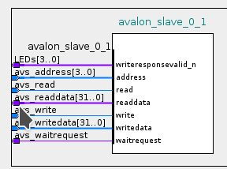
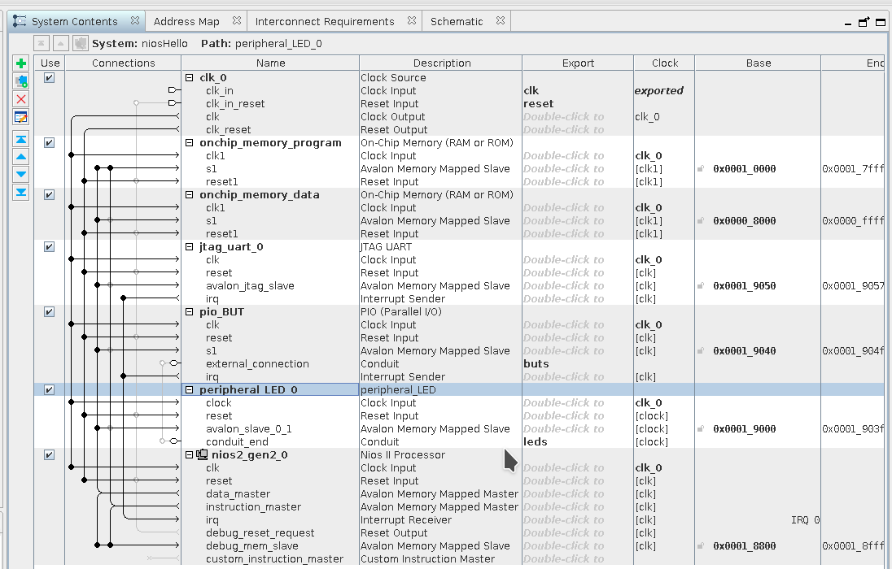

# Tutorial 3 - FPGA - IP

!!! success "Revisão 2020-2"
    - [x] quartus 20.01
    - [x] teoria/ texto
    - [ ] passos validados 
    - [x] spellcheck

    Melhorar especificação de componente (mapa de registradores?)

Nesse tutorial iremos desenvolver um periférico customizado para o processador NIOS, esse periférico será dedicado ao controle dos LEDs da placa. O periférico terá um banco de registradores interno para seu controle, e interface de "I/O mapeado em memória" para que possamos controlar-lo do NIOS (pelo código em C).

## Começando

Para seguir esse tutorial, é necessário:

- **Hardware:** DE10-Standard e acessórios 
- **Softwares:** Quartus 18.01 
    - Modelsim Simulator

Entrega no git:

- **Pasta:** `Lab3_FPGA_IP/`

## IP Cores

Intelectual Proprety Core ([IP Core](https://www.xilinx.com/support/documentation/sw_manuals/xilinx11/cgn_c_ip_overview.htm)) são componentes descritos em HDL que podem ser utilizados em múltiplos projetos de Hardware. O Platform Designer (PD) fornece além da interface visual de conexão entre esses IPs um padrão de comunicação entre os componentes, facilitando assim o uso desses IPs.

Além das centenas de projetos espalhados pela internet (github), existe um repositório muito completo de IP cores opensource que concentra grande variedade de projeto:

- [opencores](http://opencores.org/projects)

As empresas também disponibilizando IPs, pagos e gratuitos:

- [Intel-FPGA IP cores](https://www.altera.com/products/intellectual-property/ip.html)

## Platform Desginer 

O PD é uma ferramenta integradora de IPs, com ela é muito simples inserirmos e criarmos componentes que serão utilizados para formar um sistema mais completo. Como no caso do tutorial passado onde usamos uma série de componentes para criar nosso projeto. Esses componentes são de certa forma IPs (simples como o PIO e complexo como o NIOS).

A integração dos IPs no PD se da devido à padronização da comunicação entre esses componentes, que é dada via o barramento.

## Barramentos

A Intel-FPGA define duas categorias de barramento de dados para o PD: **Avalon** e **AXI**. O barramento Avalon é a principal maneira de conectar um periférico ao NIOS (processador), já o AXI é o padrão de barramento do ARM, que também é utilizado no platform designer.

### Avalon

!!! info 
    Documentação completa dos barramento AVALON:

    - https://www.intel.com/content/dam/www/programmable/us/en/pdfs/literature/manual/mnl_avalon_spec.pdf

O barramento Avalon define basicamente dois tipos de módulos: **Memory Mapped (MM)** e **Avalon Streaming Interface (ST)**, conforme descrição a seguir extraído da documentação:

-  **Avalon Streaming Interface (Avalon-ST)** — *an interface that supports the unidirectional flow of data, including multiplexed streams, packets, and DSP data.*

-  **Avalon Memory Mapped Interface (Avalon-MM)** — *an address-based read/write interface typical of master–slave connections.*

-  **Avalon Conduit Interfae** — *an interface type that accommodates individual signals or groups of signals that do not fit into any of the other Avalon types. You can connect conduit interfaces inside a Platform Designer system. Or, you can export them to make connections to other modules in the design or to FPGA pins.*

-  **Avalon Tri-State Conduit Interface** - *(an interface to support connections to off-chip peripherals. Multiple peripherals can share pins through signal multiplexing, reducing the pin count of the FPGA and the number of traces on the PCB.*

-  **Avalon Interrupt Interface** — *an interface that allows components to signal events to other components.*
-  **Avalon Clock Interface*** — *an interface that drives or receives clocks.*
-  **Avalon Reset Interface** — *an interface that provides reset connectivity.*

!!! tip
    Iremos trabalhar com o tipo: **Avalon-MM** como maneira de conectar o periférico ao NIOS.

## Projeto 

!!! note
    Vamos melhorar o projeto passado, faça uma cópia da pasta do projeto: `Lab2_FPGA_NIOS/` e renomeei para: `Lab3_FPGA_IP/`. Iremos agora trabalhar nessa nova pasta.

### Criando um periférico 

Vamos criar um novo componente que será capaz de controlar os LEDs com maior autonomia. 

Roteiro a ser seguido:

1. Especificação
1. Gerar HDL que representa o periférico com interface Avalon
1. Criar o componente no Platform Designer 
    - Associar arquivos ao componente
    - Definições gerais
    - Associar as portas do componente com os sinais do barramento
1. Usar componente no projeto
1. Criar driver (`.c` e `.h`)
1. Simular
1. Implementar/ Testar
1. Rever especificação (1.)

Primeiramente precisamos definir o papel principal desse periférico e seu fluxo de dados. Com isso será possível definir se o periférico é do tipo: **Master** ou **Slave** e se sua interface é do tipo **Memory Mapped** ou **Streaming**.

Um periférico pode possuir mais de uma interface, por exemplo: Um periférico que irá processar um áudio em tempo real pode ter até três interfaces: O mesmo irá receber o áudio via a interface **streaming** e retornar o dado por outra interface de **streaming**, porém será necessária uma terceira interface para controle desse periférico, muito provavelmente do tipo **Memory Mapped**.

!!! note ""
    É possível transmitir pacotes de comando pela interface streaming, mas isso torna o projeto mais complexo.

O nosso simples periférico irá simplesmente receber configurações para acionar o LED, sem nenhum fluxo contínuo ou intenso de dados, sendo a interface mais apropriada a do **periférico mapeado em memória**. Além disso, nosso periférico exclusivo para controle do LED é um **slave** do sistema, já que ele deve ser controlado por outra parte do sistema (no nosso caso o uC) para agir conforme necessário.

#### Avalon Slave Memory Mapped

Para nosso periférico se comunicar com o processador precisamos implementar o padrão de comunicação utilizado pelo NIOS. Podemos optar por implementar o padrão completo ou apenas uma parte de sua especificação. Por exemplo, se nosso periférico não faz uso do `waitrequest` ou `byteenable` podemos optar por não implementar esses sinais.

A seguir um exemplo dos sinais de um periférico mapeado em memória que possui como interface com o `Avalon-MM-Slave`.

```vhdl
entity peripheral_MM is
    port (
        -- Gloabals
        clk                : in  std_logic                     := '0';             
        reset              : in  std_logic                     := '0';             

        -- Avalon Memmory Mapped Slave
        avs_address     : in  std_logic_vector(3 downto 0)  := (others => '0'); 
        avs_read        : in  std_logic                     := '0';             
        avs_readdata    : out std_logic_vector(31 downto 0) := (others => '0'); 
        avs_write       : in  std_logic                     := '0';           
        avs_writedata   : in  std_logic_vector(31 downto 0) := (others => '0')  
	);
end entity peripheral_MM;
```

Note que a primeira parte do componente define um sinal de clock (`clk`) e um sinal de reset (`reset`), lembre que projetos digitais em FPGA devem ser na maioria das vezes síncronos. A segunda parte é a definição dos sinais que irão ser conectados no barramento para acesso de outros periféricos.

Lembrem que estamos criando um componente mapeado em memória, logo o mesmo deve ter comportamento e interface similar ao de uma memória. 

- `avs_address`: Endereço de acesso ao componente, no caso, 4 bits.
- `avs_read`: Indica que é um acesso de leitura
- `avs_readdata`: Dado que será retornado ao Master dado um acesso de leitura.
- `avs_write`: Indica que é um acesso de escrita
- `avs_writedata`: Dado que é transmitido ao componente dado um acesso de escrita.

O tamanho da palavra do `avs_readdata` e do `avs_writadata` é definido pelo componente e não é fixo em 32 bits como no exemplo, pode assumir outros valores.

Uma escrita ao periférico é dada da seguinte forma:

1. Master endereça periférico 
2. Endereço absoluto é traduzido em relativo
     - O endereço que o master escreve no periférico é composto por: **addr** :heavy_plus_sign:	**offset** porém o slave só possui acesso ao **offset**. 
3. Periférico recebe: `avs_address`, `avs_write = '1'` e `avs_writedata`.


Uma leitura ao periférico é dada da seguinte forma:

1. Master endereça periférico 
2. Endereço absoluto é traduzido em relativo
3. Periférico recebe: `avs_adddress` e `avs_read = '1'`
4. Periférico atualiza: `avs_readdata`


!!! question "Perguntas"
    O barramento `AVALON` define outros sinais, responda a seguir sobre alguns desses sinais:

    - waitrequest
      - Qual o papel do waitrequest? 
      - Quem aciona o waitrequest (Slave ou Master)?
    - byteenable
      - Qual o papel do byteenable? 
      - Quem aciona o byteenable (Slave ou Master)?

### Especificação

Nosso periférico será no começo bem simples, apenas para entendermos todo o processo de desenvolvimento de um periférico e o seu uso. O periférico que iremos desenvolver será um substituto ao periférico PIO fornecido pela Intel-FPGA, utilizado no projeto do pisca LED com o NIOS.

Nosso periférico será mapeado em memória e possuirá um conduit (saída) onde será realizada o acionamento dos LEDs:


O acesso ao nosso periférico será por uma palavra de 32 bits (para mater um padrão com o NIOS) e  terá dois registradores `REG_CONFIG` e `REG_DATA`:

- `REG_CONIFG`: Registrador que controla o periférico, no nosso caso, irá ter somente um bit de: `Enable`/`Disable` (`bit0` :arrow_right:  `Enable/Disable`)
- `REG_DATA`: Registrador que possui o valor de cada LED (`bit0` :arrow_right: `LED0`; `bit1` :arrow_right: `LED1` ....).

### Gerar HDL que representa o periférico com interface Avalon

Partindo da entidade fornecida (`peripheral_MM`), podemos criar um componente que implementa parcialmente a especificação anterior, nessa implementação não temos os dois registradores (`REG_CONFIG` e `REG_DATA`), temos apenas a funcionalidade do `REG_DATA`. Note que a implementação faz uso de um generic para definir a quantidade de LEDs que esse periférico controla. Esse genérico poderá ser configurado pela interface gráfica do Plataform Designer, tornando um componente customizado.


!!! info
    Crie um arquivo chamado: `peripheral_LED.vhd` e salve na pasta do projeto : `Lab3_FPGA_IP/IP/`

    !!! warning ""
        Será necessário criar a pasta IP

```vhdl
library IEEE;
use IEEE.std_logic_1164.all;
use IEEE.std_logic_unsigned.all;
use IEEE.numeric_std.all;
use work.all;

entity peripheral_LED is
    generic (
        LEN  : natural := 4
    );
    port (
        -- Gloabals
        clk                : in  std_logic                     := '0';             
        reset              : in  std_logic                     := '0';             

        -- I/Os
        LEDs               : out std_logic_vector(LEN - 1 downto 0) := (others => '0');

        -- Avalion Memmory Mapped Slave
        avs_address     : in  std_logic_vector(3 downto 0)  := (others => '0'); 
        avs_read        : in  std_logic                     := '0';             
        avs_readdata    : out std_logic_vector(31 downto 0) := (others => '0'); 
        avs_write       : in  std_logic                     := '0';             
        avs_writedata   : in  std_logic_vector(31 downto 0) := (others => '0')
	);
end entity peripheral_LED;

architecture rtl of peripheral_LED is
begin

  process(clk)
  begin
    if (reset = '1') then
      LEDs <= (others => '0');
    elsif(rising_edge(clk)) then
        if(avs_address = "0001") then                  -- REG_DATA
            if(avs_write = '1') then
              LEDs <= avs_writedata(LEN - 1 downto 0);
            end if;
        end if;
    end if;
  end process;

end rtl;
```
 
!!! note "Limitações dessa implementação"
    - Não possui um registrador de configuração: `REG_CONFIG`
    - Não é possível ler: `REG_DATA` via barramento **Avalon** 
      - impede a aplicação de máscaras!

 Poderíamos já nessa etapa testar o componente, criando um `testbench` para excitar o módulo e verificar seu comportamento. Grande parte do desenvolvimento de um projeto de hardware é gasto nos testes, que podem ser tão complexos quanto o próprio módulo. Vamos pular essa etapa aqui, iremos simular em um nível mais alto.

### Configurando path

Agora iremos adicionar o nosso periférico no **Platform Designer**, esse novo componente que será criado será incorporado na ferramenta, para isso:

Precisamos indicar para o PD o local que ele deve buscar para encontrar por códigos fonte que não fazem parte do catálogo padrão, para isso:

1. `Tools` :arrow_right: `Options` :arrow_right: `IP Search Path`
1. Adicione a pasta `IP` recém criada.

E agora remova o componente PIO:

1. Remova o PIO que controlava os LEDs (agora iremos fazer o controle pelo nosso componente)

### Criando componente

Só adicionar o arquivo HDL (`.vhd` ou `.v`) não é suficiente para o PD reconhecer o componente, precisamos criar um segundo arquivo (`*_hw.tcl`) que é lido pelo PD, esse arquivo possuirá todas as configurações e descrições do novo componente. Para isso:

- `File` :arrow_right: `New Component` :ok:

E uma interface gráfica de configuração do componente será exibida. A primeira parte é referente a descrição do próprio componente. De o nome desse componente de : `peripheral_LED` e preencha sua descrição.


Já na aba `Files` temos as informações de quais arquivos pertencem ao componente. 

#### Files

Na aba Files adicione o arquivo `peripheral_LED.vhd`:

1. `Files` :arrow_right: `Syntesis Files` :arrow_right: `add file` :arrow_right: **`peripheral_LED.vhd`**
1. Clique em :arrow_right: `Analyze Synthesis Files` : isso fará com que a ferramenta faça uma breve análise dos arquivos HDL e detecte as interfaces do componente.

Note o atributo do arquivo: `Top-level File`, isso indica que o `peripheral_LED.vhd` é o arquivo principal desse componente, se tivéssemos um desenvolvimento hierárquico do componente, nessa etapa adicionaríamos vários arquivos e deveríamos configurar qual deles é o toplevel.

- Na secção `VHDL Simulation Files`  :arrow_right: **Copy from Synthesis Files** :ok:

Note que se não adicionarmos esse arquivo nessa secção, na hora de simular o projeto o componente estaria vazio. Porquê o padrão não é o de automaticamente copiar os arquivos da síntese para a simulação? Pois nem sempre conseguimos simular o que será sintetizado. Pense no caso desse componente ser um controlador de memória, se formos simular não teremos a memória física para o controlador acessar e a simulação não funcionará. Uma solução seria de ter dois componentes, um para simulação (que imita a memória) e outro para síntese.


#### Signals & Interfaces

Nessa secção iremos configurar as interfaces do nosso componente, e como o PD irá interpretá-las quando formos conectar ao resto do sistema. Note que algumas interfaces já foram detectadas pelo PD, porém temos um erro que será corrigido.

Nas interfaces padrões note que o `Component Editor` já detectou uma interface: 

- **avalon_slave_0**
- **clock**
- **reset**

Isso aconteceu pelos nomes da entidade do `peripheral_led`.

Vamos primeiramente editar o `avalon_slave_0`. Clique na interface e note que a ferramenta indica um erro : 

!!! failure
    ```
    Error: avalon_slave_0_1: Interface must have an associated reset
    ```

Vamos associar ter que associar um sinal der reset a interface (parte sequência do IP), para isso :

- `avalon_slave_0` :arrow_right: `Associated Reset` :arrow_right: `reset` :ok:

Podemos notar ainda pelo diagrama (e pela mensagem de erro) que a ferramenta interpretou de forma errada o nosso sinal `LEDs`, pertencente a entidade do componente: 

``` vhd
-- I/Os
LEDs : out std_logic_vector(LEN - 1 downto 0) := (others => '0');
```



Note pelo diagrama de blocos que o PD atribui essa saída como sendo parte do barramento Avalon: **writerequestvalid_n**, o que não é verdade. Para corrigir isso, precisamos de uma nova aba que não é padrão de exibição, no `component builder` clique em:

- **Component builder** :arrow_right: `View` :arrow_right: `Signals` :ok:

Essa nova aba permite verificarmos (e associarmos) as entradas e saídas da entidade (toplevel) com sinais e tipos de sinais definido pelo PD.

Iremos indicar agora para a ferramenta que o sinal `LEDs` deve ser interpretado como um `conduite`, edite os sinais como na figura a seguir :


#### Finalizando

Verifique os sinais e o diagrama de bloco antes de continuar e clique em **Finish**. Quando o componente for gerado, ele automaticamente irá aparecer no catálogo de componentes que podem ser inseridos no SoC:


Porém o arquivo de configuração desse componente (.tcl) foi salvo na pasta raiz do projeto do Quartus: 

- `Lab3_FPGA_IP/peripheral_LED_hw.tcl`

Esse arquivo `.tcl` descreve todas as configurações realizadas anteriormente no componente. O mais natural é que esse arquivo esteja na mesma localidade (pasta IP) que os códigos HDL. Mova essa arquivo para:

- `Lab3_FPGA_IP/IP/peripheral_LED_hw.tcl`

Agora precisamos editar o arquivo `.tcl` para atualizarmos o local do arquivo `peripheral_LED.vhd`, procure pela secção **files set**:

- Antes 

```tcl
add_fileset_file peripheral_LED.vhd VHDL PATH IP/peripheral_LED.vhd TOP_LEVEL_FILE
...
add_fileset_file peripheral_LED.vhd VHDL PATH IP/peripheral_LED.vhd
```

E edite para:

```tcl
add_fileset_file peripheral_LED.vhd VHDL PATH peripheral_LED.vhd TOP_LEVEL_FILE
...
add_fileset_file peripheral_LED.vhd VHDL PATH peripheral_LED.vhd
```

### Utilizando o componente no PD

Agora adicione o componente no projeto e faça as conexões corretas (como se fosse outro componente), exporte o sinal dos LEDs, o resultado final deve ser algo como:



Gere o componente: Clique em `Generate HDL` :arrow_right: `Generate`. 

!!! warning ""
    Marque a opção: ✅ `Create a Simulation Model`


### Utilizando o componente no `topLevel.vhd`

Precisamos agora modificar o componente inserido no topLevel, para isso no PD gere novamente o template de utilização :

- No Platform Designer: `Generate` :arrow_right:  `Show Instatiation Template` :arrow_right: `VHDL`

No meu caso o resultado foi:

``` vhd
    component niosHello is
        port (
            buts_export   : in  std_logic_vector(2 downto 0) := (others => 'X'); -- export
            clk_clk       : in  std_logic                    := 'X';             -- clk
            reset_reset_n : in  std_logic                    := 'X';             -- reset_n
            leds_name     : out std_logic_vector(3 downto 0)                     -- name
        );
    end component niosHello;

    u0 : component niosHello
        port map (
            buts_export   => CONNECTED_TO_buts_export,   --  buts.export
            clk_clk       => CONNECTED_TO_clk_clk,       --   clk.clk
            reset_reset_n => CONNECTED_TO_reset_reset_n, -- reset.reset_n
            leds_name     => CONNECTED_TO_leds_name      --  leds.name
        );
```

Devemos inserir agora esse componente com a nova interface (**leds_name**) no `Lab3_FPGA_IP.vhd`.

> Você deve fazer essa etapa com cuidado. Esses nomes podem alterar entre versões da ferramenta.

Editando o `Lab3_FPGA_IP.vhd`:

``` vhdl
library IEEE;
use IEEE.std_logic_1164.all;

entity Lab3_FPGA_IP is
    port (
        -- Gloabals
        fpga_clk_50        : in  std_logic;             -- clock.clk
		  
        -- I/Os
        fpga_led_pio       : out std_logic_vector(3 downto 0);
        fpga_button_pio    : in  std_logic_vector(2 downto 0)

	);
end entity Lab3_FPGA_IP;

architecture rtl of Lab3_FPGA_IP is

   component niosHello is
        port (
            buts_export   : in  std_logic_vector(2 downto 0) := (others => 'X'); -- export
            clk_clk       : in  std_logic                    := 'X';             -- clk
            reset_reset_n : in  std_logic                    := 'X';             -- reset_n
            leds_name     : out std_logic_vector(3 downto 0)                     -- name
        );
    end component niosHello;

begin

	u0 : component niosHello port map (
		clk_clk       => fpga_clk_50,     --  clk.clk
		reset_reset_n => '1',             --  reset.reset_n
		leds_name     => fpga_led_pio ,   --  leds.export
        buts_export   => fpga_button_pio  --  buts.export	
	);
	 
	 
end rtl;
```
!!! success "Recompile"
    Salve, compile o projeto e programe a FPGA

Podemos analisar agora o RTL do projeto e mais especificamente o do componente criado:


Verificamos que a ferramenta inferiu um registrador de 4 bits para armazenar o valor dos LEDs, um Mux para indicar se os registradores serão ou não atualizados com um novo valor e um comparador para verificar se o endereço é equivalente a `0x01`.

## Firmware

Devemos agora escrever um firmware que será executado no NIOS e que acesse e controle nosso periférico. Para isso será necessário criarmos um BSP para o projeto. Abra o **NIOS II Software Build ...** e refaça a etapa do tutorial anterior com o novo SoC e adicione o código a seguir:

``` c
#include <stdio.h>
#include "system.h"
#include <alt_types.h>
#include <io.h> /* Leiutura e escrita no Avalon */

//#define SIM

// LED Peripheral
#define REG_DATA_OFFSET 1

int main(void){
  unsigned int led = 0;
  unsigned int *p_led = (unsigned int *) PERIPHERAL_LED_0_BASE;

#ifndef SIM
  printf("Embarcados++ \n");
#endif

  while(1){
	  if (led < 4){
		  *(p_led+REG_DATA_OFFSET) = (0x1 << led++);
#ifndef SIM
          usleep(500000); // remover durante a simulação
#endif
	  }
	  else{
		  led = 0;
	  }
  };

  return 0;
}
```

O firmware utiliza o `peripheral_LED` para controlar os LEDs da placa, note que o acesso dessa vez é feito pelo ponteiro `p_led` e não mais pela função da Alteara `IOWR_32DIRECT` (deveria funcionar também).

### Executando 

Execute o firmware no kit de desenvolvimento e verifique se sua funcionalidade está correta. Lembre que o HW já deve estar programado (via quartus), caso contrário não funcionará.

## Simulando

Uma das grandes vantagens de trabalharmos com SoftProcessor é que temos acesso ao seu código fonte (criptografado ou não) e isso possibilita que possamos simular todo o sistema, verificando suas funcionalidades internas, comunicação da CPU com os periféricos, interface do firmware com o resto do sistema. Vamos nessa etapa simular a interface do NIOS com o nosso periférico e verificar se está tudo certo.

Note que no código anterior, o printf foi comentando, assim como o delay de 50000 us, que no lugar foi inserido um de 1us. Isso foi feito para acelerar a simulação e verificarmos mais rapidamente o acesso do NIOS ao periférico, que acontece na linha :

```c
    *(p_led+REG_DATA_OFFSET) = (0x1 << led++);
```

Nesse momento, o NIOS envia um comando ao barramento no endereço **PERIPHERAL_LED_0_BASE + REG_DATA_OFFSET**, o comando carrega a mensagem: **0x01 << led**, gravando no registrador `REG_DATA` qual LED deve ser acionado.

### Configurando o bsp

Para obtermos um resultado mais rápido é possível ativarmos uma opção no bsp chamada de: **enable_sim_opitimize**. Quando ativada, o binário compilado só poderá ser usado para simulação, **não pode ser embarcado no HW!**. Com essa opção temos um ganho significativo no tempo de execução do modelo no modelsim.

Além de configurarmos a otimização durante a simulação, iremos desativar o **stdin, stdout, stderr** para a simulação ficar ainda mais rápida, caso contrário teremos que esperar por muito tempo até verificarmos o resultado do código. Note que a simulação abrange todo o HW desde o processador até o barramento e periféricos.

!!! note
    Para simularmos 1 ms de execução do HW será necessário muito mais que 1 ms de esforço computacional! O tempo pode chegar a unidades de hora!!


### ModelSim

No **Eclipse**, após ter compilado o projeto:

- `Run` :arrow_right: `Run configuration` :arrow_right: `Nios II ModelSim`

O simulador a ser utilizado é o modelsim da Mentor, o mais completo do mercado e fornecido com algumas customizações pela Intel-FPGA. No modelsim, iremos adicionar os sinais que desejamos visualizar, para isso, siga o que indica a figura a seguir:


Após adicionar todos os sinais que fazem parte do periférico `led_peripheral` iremos executar 500 us de simulação:


Após a simulação finalizar, note os valore dos sinais `avs_write`, `avs_writedata`, `avs_LEDs` e como eles mudam no tempo em respeito ao que foi feito no código.


## Entrega 3

Siga para a terceira entrega:

- [Entega 3](/Entrega-3)
