# NIOS V

In this tutorial, we will create and customize a soft processor with NIOS (an embedded system with a processor and peripheral), embed it in the FPGA, and write a code for it. By the end, we'll have the same LEDs as in the previous project, with a similar operation, but now they're controlled by a program rather than dedicated hardware.

## Getting Started

To follow this tutorial you need:

- **Hardware:** DE10-Standard and accessories
- **Software:** Quartus 25.01, RiscFree IDE for Altera FPGAs
- **Documents:** [DE10-Standard_User_manual.pdf](https://github.com/Insper/DE10-Standard-v.1.3.0-SystemCD/tree/master/Manual)

## Soft processor

HDL (VHDL, Verilog, ...) projects aren't very flexible, each project modification implies hardware modifications, which isn't straightforward. Besides the difficulty of implementing changes, we also have the testing and compilation time of the project, which isn't immediate.

One solution to make the project more flexible is to have the LEDs controlled not by a dedicated logic but by hardware that can execute a series of instructions: a microcontroller.

Since the FPGA can implement digital logic circuits, it's possible to synthesize a microcontroller in the FPGA and make this uC control the LEDs (Yes!! the uC is hardware described in HDL). Now the change in the control logic depends on the program that will be executed on the uC, making the project much more flexible.

::: info
The ARM is also a hardware in HDL, but proprietary:

-  https://www.arm.com/about/newsroom/arm-offers-free-access-to-cortex-m0-processor-ip-to-streamline-embedded-soc-design.php

:::
Processors that can be synthesized in programmable logic devices (FPGA, ...) are called [Soft Processors](https://en.wikipedia.org/wiki/Soft_microprocessor). Several Soft Processors are commercially available or open-source:

- [NIOS II: Intel](https://www.intel.com/content/www/us/en/programmable/products/processors/support.html)
- [MicroBlazer: Xilinx](https://www.xilinx.com/products/design-tools/microblaze.html)
- :point_right: [LEON: Gaisler](https://www.gaisler.com/index.php/products/ipcores/soclibrary) (aerospace/ SPARCV8)
- among others

Adding peripherals and extra functionalities to the Soft Processor (for example, we can add a memory manager, timers, network controller, ...) causes the system to be called a [System On Chip](https://en.wikipedia.org/wiki/System_on_a_chip) (SoC).

### Platform Designer (**PD**)

::: info
The Platform Designer was called **QSYS**, you can still find many things with this reference

:::
The Platform Designer is a software provided by Intel and integrated into Quartus that enables us to develop complex systems in a simple and visual way. With it, we can add and connect **Intellectual property cores** (IP Core) to develop an application quickly and visually.

The IP cores can be from [Intel](https://www.intel.com/content/www/us/en/products/programmable/intellectual-property.html), third parties, or proprietary.

::: info Going beyond
There's an online course from Intel that shows how PlatformDesign works: [Introduction to Platform Designer](https://www.intel.com/content/www/us/en/programmable/support/training/course/iqsys101.html)

:::

## NIOS V - Hardware

[NIOS V](https://www.altera.com/products/ip/po-3098/nios-v-processors) is the soft processor provided by Altera-Intel and integrated into the tool. NIOS is based on the architecture of RISC-V (is the new generation of NIOS processor) exception control, communication bus, memory control, ... . The following figure describes the essential components of NIOS-V:

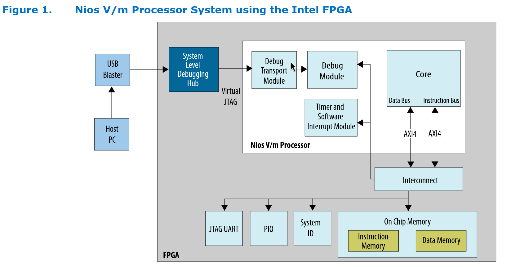

- Reference: [Processor Architecture]( https://cdrdv2-public.intel.com/709273/ug20343-683632-679983.pdf)

<YouTube id="kceY84fx0N0"/>

### Creating a Simple SoC

In this step, we will add a processor and the necessary minimum infrastructure for its operation. We will include the following in the project:

- A clock interface
- A memory (data and program)
- The processor (NIOS II)
- A PIO peripheral (for managing digital outputs)
- A JTAG-UART for supporting debug via print.

To begin:

1. Copy the `Lab1_FPGA_RTL/` folder and rename it to `Lab2_FPGA_NIOS/`.
2. Open the project in this new folder `Lab1_FPGA_RTL/` in Quartus.
3. Open the Platform Designer:
    - **Quartus** :arrow_right: `Tools` :arrow_right: `Platform Designer`
4. Add the following peripherals and their configurations:
    - `On-Chip Memory (RAM or ROM Intel FPGA IP)`
        - Type: **RAM**
        - Total Memory size: **256000 bytes**
    - `JTAG UART Intel FPGA IP`
        - **Default**
    - `PIO (Parallel I/O) Intel FPGA IP`
        - Width: **6**
        - Direction: **Output**
    - `NIOS V/g General Purpose Processor IP`

::: info
Memory RAM shall initialy have 256000 bytes of memory.

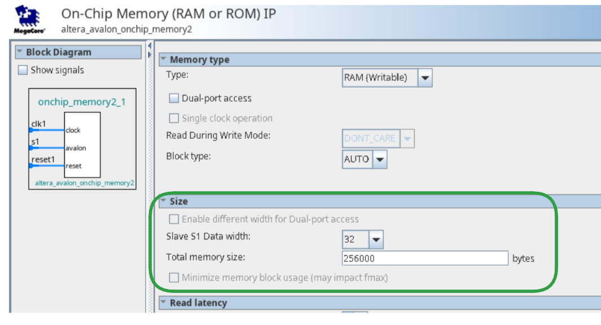
:::

::: tip
You can use the search box to find the IPs
:::

You should obtain something similar to:

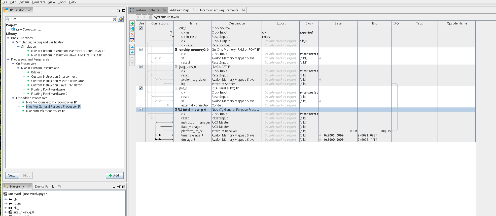

### Connecting Clock and Reset

The peripherals of the **PD** (Platform Designer) are like independent systems (think of each block as a chip) that need to be connected at least to a Clock and a Reset. The system can operate in different clock and reset domains, so this connection must be made by the developer.

Think of this step as similar to the `port map` in VHDL, but at a higher level of abstraction. The **PD** will be responsible for making the signals compatible for us. Connect all the clock and reset signals to the `clk` and `clk_rst` signals of the `clk_0` peripheral, and also connect the `debug_reset` of NIOS, as shown in the following figure:

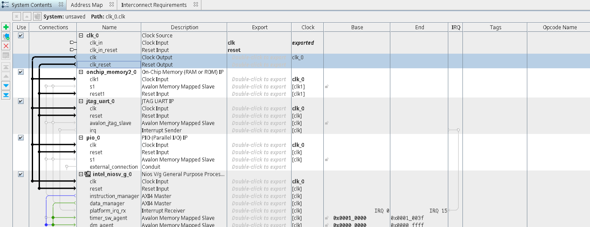

::: tip
To connect, click on the gray circle at the intersection of the buses or signals.
:::

### Connecting the Bus

Platform Designer supports two principal Intel FPGA interface families: **Avalon** and **AXI**.

Connect the components as follows:

* (Green) Connect `on_chip_memory`, the PIO peripherals, and the UART peripheral to `data_manager`.
* (Blue) Connect only `on_chip_memory` to `instruction_manager`.

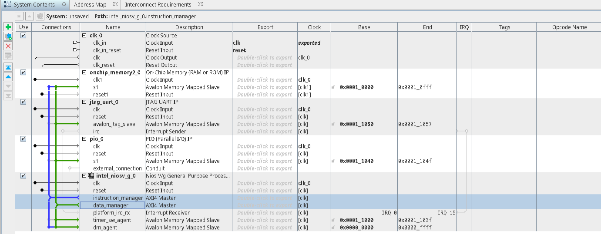

::: tip Understaing
Avalon is Altera’s native interface architecture for FPGA systems, while AXI is an industry-standard interface originally defined by Arm and widely used by Arm- and RISC-V-based processors.

Avalon defines several interface types, of which the most common are:

* **Avalon Memory-Mapped (Avalon-MM)**, used to access memories and peripheral registers through an address space.
* **Avalon Streaming (Avalon-ST)**, used to transfer continuous streams of data between components without using addresses.


For additional details, refer to the [Avalon Interface Specifications](https://www.altera.com/content/dam/altera-www/global/en_US/pdfs/literature/manual/mnl_avalon_spec.pdf).

Nios V uses memory-mapped interfaces for instruction fetches, memory accesses, and accesses to peripheral registers. Its processor interfaces use the **AXI protocol**, although Platform Designer can automatically insert adapters when connecting the processor to Avalon-MM memories and peripherals.

As a result, a custom peripheral does not necessarily need to implement AXI directly. It can expose an Avalon-MM agent interface and be connected to the Nios V processor through the Platform Designer interconnect.

> In Tutorial 3, we will develop a custom memory-mapped peripheral and connect it to the processor through this interconnect.

Nios V provides two separate memory-mapped manager interfaces:

* `data_manager`, used for data-memory accesses and reads and writes to memory-mapped peripherals.
* `instruction_manager`, used to fetch program instructions.

These separate interfaces reflect a Harvard-style processor organization, in which instruction and data accesses use independent paths.

In our initial hardware topology, both interfaces are connected to a single memory component, `on_chip_memory`. The memory therefore stores both the program instructions and the program data.

Because both interfaces share the same physical memory, simultaneous instruction and data accesses may contend for the memory port. Platform Designer handles the arbitration, but this contention can reduce performance. We will improve this architecture later.

The resulting topology allows Nios V to fetch instructions from the on-chip memory while also using that memory for data storage and accessing the memory-mapped peripheral registers.

Note that older Nios II systems use the interface names `data_master` and `instruction_master`. In Nios V, the corresponding interfaces are named `data_manager` and `instruction_manager`.
:::

### Address Map

After making the connections, we need to assign a memory address to each peripheral. This can be done either manually or automatically.

With manual assignment, you can place each peripheral at an address of your choice, provided that the assigned address ranges do not overlap. With automatic assignment, Platform Designer selects valid base addresses for the connected components.

On this tutorial we will manualy deffine RAM address and let the tool to automatic place the other peripherals memorys.

#### RAM

On the plataform desing interface set inital RAM address to:

- `0x0004_0000`

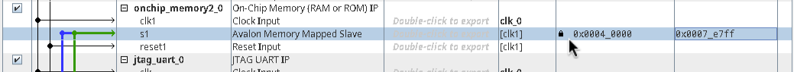

::: info lock address
You will have to lock the RAM, so tool will not be allow to automatically change this address (🔓).
:::

#### Automatic address

To assign the addresses automatically, select `System` :arrow_right: `Assign Base Addresses`. Then open the `Address Map` tab to inspect the resulting address assignments.

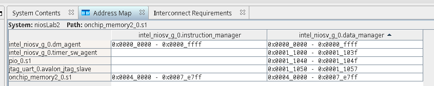

::: info
Addresses may vary between projects, so do not assume that your setup will match the one shown in this image.

An important detail is that the `data_manager` address space contains two distinct regions:

* RAM region: `0x0004_0000` to `0x0007_E7FF`
* Peripheral region: `0x0001_1000` to `0x0001_1057`

This distinction will be important in the next step.

Identify the address range assigned to the peripherals in your project. The peripherals must occupy a contiguous address region.
:::

### Configuring NIOS V

Now we need to configure NIOS to use the newly connected memory. Double-click on the NIOS to open the **Parameters** window.

In `Parameters` :arrow_right: `Vector`, configure:

- Traps, Exceptions, and Interrupts:
  - Reset Agent:  **onchip_memory2_0.s1**
        
Isso vai congigurar para onde o program counter (PC) deve apontar quando a CPU acordar, como nosso programa vai estar na memória RAM devemos configurar a CPU para ir buscar a instrucao nesse local, isso define o endereco do instruction fetch.
        
- Peripheral Region A:
  - Size: **4k**
  - Base Address: 0x0001_1000
  
Isso define onde a regiao de memória dos nosso periféricos
  
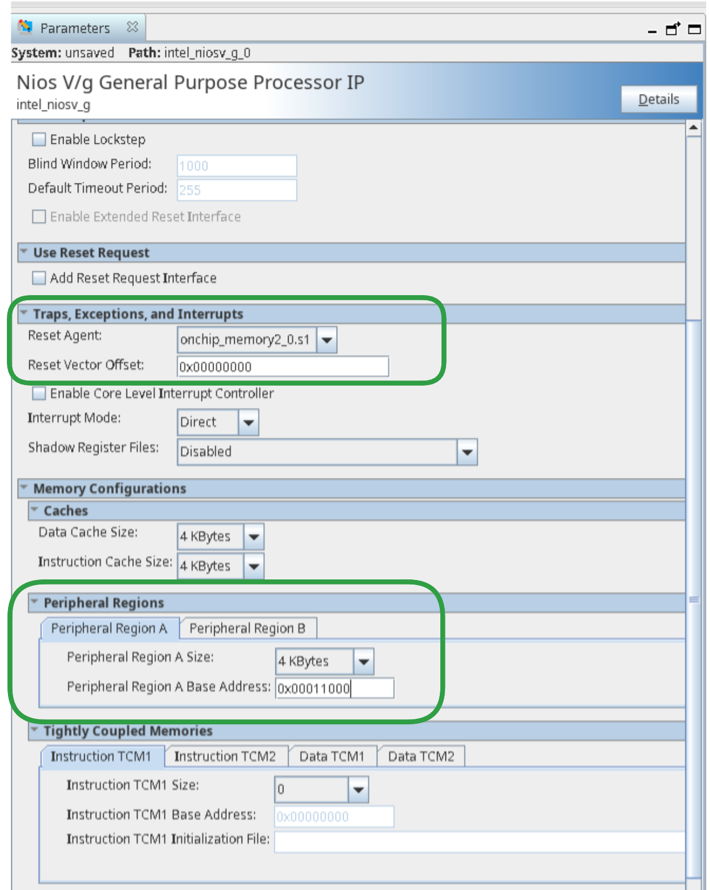

::: tip Tip
The name **onchip_memory** may vary depending on your project, and the address may also vary (this depends on the order in which the components were added).
:::

### Export

The export column in **Platform Designer** indicates which signals will be exported from the system. Think of these signals as the ones that will have contact with the external world (they will be mapped to pins in the `topLevel`).

Double-click on the export column in the row of the signal **external_connection** of the **PIO** component and name this signal as ==`leds`==.

::: info
Notice that the `Clock Source` component also has the export of signals: `clk` and `reset`. This was done automatically when creating the project.
:::

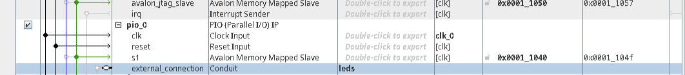

### Generating source codes

Save the project as `niosLab2.qsys` in the project folder, and click on `Generate HDL`  for the **PD** to generate the project.

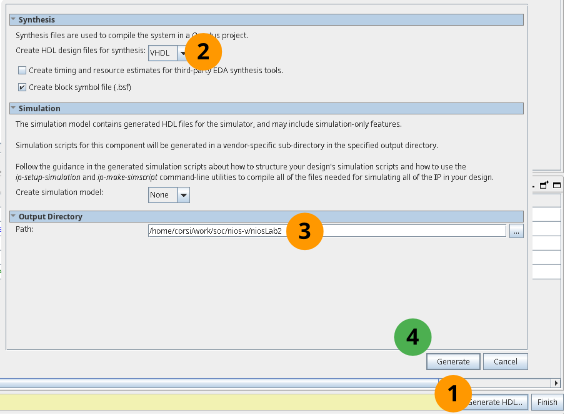

This process creates all the files required to integrate the Platform Designer system into the Quartus project. 

### Using the Component

Still in the **PD**, click on: `Generate` :arrow_right: `Show Instantiation Template`, select VHDL as the HDL language. You should obtain something like this:

::: tip Tip
Save this somewhere, we will use it in the next step!
:::

``` vhdl
component niosLab2 is
    port (
        clk_clk       : in  std_logic                    := 'X'; -- clk
        reset_reset_n : in  std_logic                    := 'X'; -- reset_n
        leds_export   : out std_logic_vector(7 downto 0)         -- export
    );
end component niosLab2;

u0 : component niosLab2
    port map (
        clk_clk       => CONNECTED_TO_clk_clk,       --   clk.clk
        reset_reset_n => CONNECTED_TO_reset_reset_n, -- reset.reset_n
        leds_export   => CONNECTED_TO_leds_export    --  leds.export
    );
```

This is a shortcut for how we should use this component in our project. This code snippet indicates that the newly created project in the **PD** has three external interfaces: `clk_clk`, `reset_reset_n`, and `leds_export`. These signals will need to be mapped in the topLevel to their respective pins.

::: tip
These names may vary in your project!
:::

The schematic (generated by `Platform Designer` :arrow_right: `View` :arrow_right: `Schematic`) illustrates the newly created SoC and its interfaces:

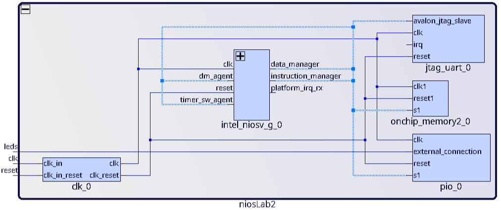

### Finishing

Click on finish and leave everything as default. Now Qsys will create the system and all the components configured in it. Quartus will give a warning indicating that some files need to be added to Quartus in order for it to access the newly created project in the **PD**:

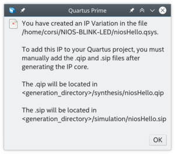

In Quartus: `Project` :arrow_right: `Add/remove files in project` and add the file:

- `niosLab2/synthesis/niosLab2.qip`

Resulting in:

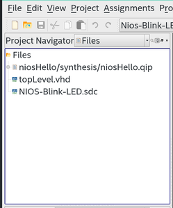

### Creating the Top-Level

Now we need to create a VHDL file that will be our top-level `LAB2_FPGA_NIOS.vhd` to include the newly created `niosLab2` component.

1. Create a new VHDL file named: `LAB2_FPGA_NIOS.vhd`
2. Insert the following `VHDL` code:
3. Compile the project and analyze the RTL to verify if it is as expected.
4. Program the project onto the FPGA.

::: info Top-Level
``` vhdl
library IEEE;
use IEEE.std_logic_1164.all;

entity LAB2_FPGA_NIOS is
    port (
        -- Globals
        fpga_clk_50        : in  std_logic;             -- clock.clk

        -- I/Os
        fpga_led_pio       : out std_logic_vector(7 downto 0)
  );
end entity LAB2_FPGA_NIOS;

architecture rtl of LAB2_FPGA_NIOS is

component niosLab2 is port (
  clk_clk       : in  std_logic                    := 'X'; -- clk
  reset_reset_n : in  std_logic                    := 'X'; -- reset_n
  leds_export   : out std_logic_vector(7 downto 0)         -- export


);
end component niosLab2;

begin

u0 : component niosLab2 port map (
  clk_clk       => fpga_clk_50,    --  clk.clk
  reset_reset_n => '1',            --  reset.reset_n
  leds_export   => fpga_led_pio    --  leds.export
);

end rtl;
```

:::
::: info
Note that we are not using the reset signal (the `_n` indicates that the reset is active-low, i.e., 0). 

:::

## Programming the NIOS - Soft Processor

Now that we have the **project programmed onto the FPGA**, with the hardware that includes the NIOS processor, we need to generate and program a software that controls the LEDs. To do this, we will use the **RiscFree IDE for Altera FPGAs**, which has all the necessary toolchain to develop firmware for NIOS V (RISC-V).

When developing projects for SoC systems, we have a problem: the hardware is not standardized. Since everything is customized, there is an issue that needs to be addressed, which is the interface between the created hardware and the software toolchain (compiler, linker, etc.).

Altera solved this by creating a Hardware Abstraction Layer (HAL), or as Intel calls it, Board Support Package (BSP), which extracts information from the Platform Designer to be used by the compilation toolchain (GCC). When we create a project in **RiscFree IDE**, two projects will be created: one containing the firmware to be programmed into the NIOS V, and another (BSP) containing relevant information about the hardware for use in the firmware and toolchain.


### Creating the bsp

We will start by creating the Board Support Package (BSP).

First, create a folder named `software` inside your Quartus project directory. This folder will contain the BSP and the application files.

To create the BSP, launch the Nios V BSP Editor from the command line.

Start the shell provided by Altera:

```bash
$ ./altera/25.1std/niosv/bin/niosv-shell
```

::: info
The installation path may be different on your system.
:::

Then launch the BSP Editor:

```bash
$ niosv-bsp-editor
```

Them click File -> New bsp an gui will open and them you shall locate the harwdare desgin from your soft process:

- `niosLab2.sopcinfo`

> This file contains the hardware configuration and address map required to generate the BSP.


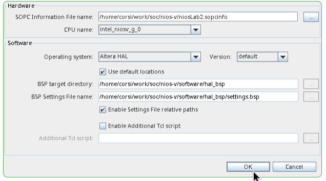

- Click on OK so it will open a new window.

We will not change any configurations on the BSP, we just need to generate the necessary files, on the new window click on Generate button on botton left of this window.

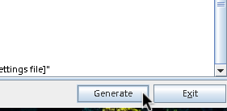

This shall create a new folder inside the `software` folder that we just created:


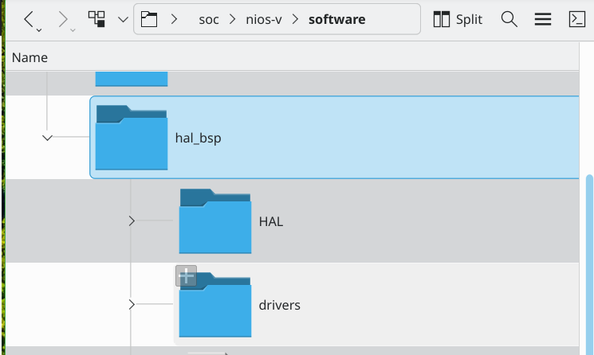

Here is a polished and technically clearer version of the section:

### Creating the Application

Now we will create the application firmware that will run on the Nios V processor and use the BSP we just generated.

Create a new folder named `app` inside the `software` directory. Your project structure should now contain:

* `software/hal_bsp`
* `software/app`

Inside the `app` folder, create a file named `main.c` with the following contents:

```c
#include <stdint.h>
#include <stdio.h>
#include "system.h"

static void delay(void)
{
    for (volatile uint32_t i = 0; i < 1000000; i++) {
        // Busy-wait
    }
}

int main(void)
{
    while (1) {
        printf("Hello from Nios V!\n");

        PIO_0_DATA = 0xFFFFFFFF;  // LEDs on
        delay();

        PIO_0_DATA = 0x00000000;  // LEDs off
        delay();
    }

    return 0;
}
```

::: info
The value of `PIO_0_BASE` depends on the address assigned to the PIO peripheral in your Platform Designer system. Verify the address in the Address Map instead of assuming that `0x11040` is correct for your project.
:::

This application performs two simple tasks:

* Prints `Hello from Nios V!` through the JTAG UART.
* Toggles the PIO output, causing the FPGA LEDs connected to that peripheral to blink.

Next, we need to create the build configuration for the application.

From the `software` directory, run the following command inside `niosv-shell`:

```bash
niosv-app -a=app -b=hal_bsp -s=app/main.c
```

This command generates the files required to build the application and links it against the previously created BSP.

### Modifying `CMakeLists.txt`

Before building the firmware, edit `app/CMakeLists.txt` and add the BSP folder to the include paths:

```diff
target_include_directories(app2.elf
    PRIVATE
+        ../hal_bsp
    PUBLIC
)
```

This lets the compiler find BSP-generated headers such as `system.h` in the hal_bsp folder.

### Compiling the Application

Create a `build` directory inside the `app` folder:

```bash
mkdir app/build
```

Then navigate to the build directory:

```bash
cd app/build
```

Configure the project with CMake:

```bash
cmake ..
```

Finally, compile the application:

```bash
make
```

After a successful build, an ELF executable named `app.elf` will be generated.

The ELF file contains the compiled firmware that will be loaded into the Nios V processor.

### Running the Application

Open a new `niosv-shell` terminal and start the JTAG UART terminal:

```bash
juart-terminal
```

This terminal listens for output sent through the JTAG UART, including the messages produced by `printf()`.

In another `niosv-shell` terminal, navigate to the directory containing `app.elf` and run:

```bash
niosv-download -g -r app.elf
```

The `niosv-download` command transfers the ELF executable to the Nios V system. The `-g` option starts program execution after the download completes.

You should now see:

```text
Hello from Nios V!
```

repeatedly printed in the JTAG UART terminal, while the LEDs connected to the PIO peripheral blink on and off.
