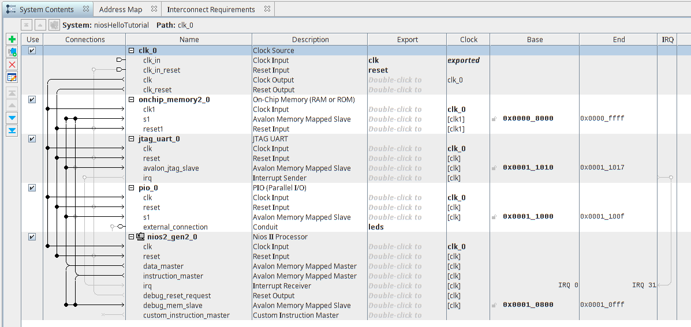
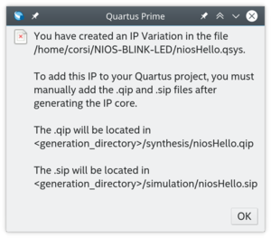
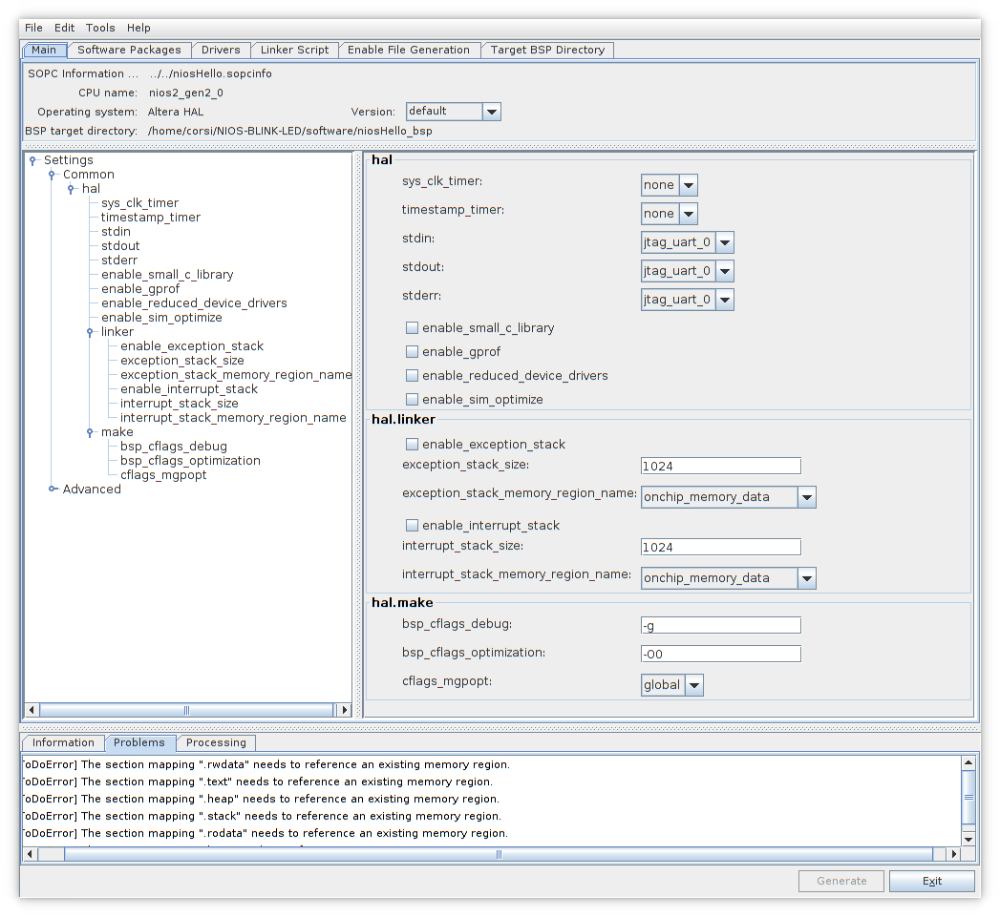
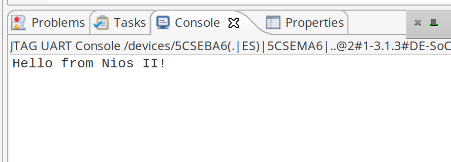

# Tutorial 2 - FPGA - NIOS

!!! success "2020-2"
    - Material atualizado.

Nesse tutorial iremos criar e customizar um soft processor com o NIOS (sistema embarcado com um processador e periférico), embarcar na FPGA e escrever um código para ele. Ao final, vamos ter os mesmos LEDs que do projeto anterior, com operação simular, mas agora sendo controlados por um programa e não por um hardware dedicado.

## Começando

Para seguir esse tutorial é necessário:

- **Hardware:** DE10-Standard e acessórios
- **Softwares:** Quartus 18.01
- **Documentos:** [DE10-Standard_User_manual.pdf](https://github.com/Insper/DE10-Standard-v.1.3.0-SystemCD/tree/master/Manual)

Entrega no git:

- **Pasta:** `Lab2_FPGA_NIOS`

## Soft processor

Projetos em HDL (VHDL, Verilog, ... ) não são muito flexíveis, cada alteração no projeto implica na modificação do Hardware o que não é algo tão simples. Além da dificuldade de implementar as modificações, temos o tempo de teste e compilação do projeto que não é nada imediato.

Uma solução para tornar o projeto mais flexível é o de tornar os LEDs controlados não por uma lógica dedicada mas sim por um hardware que possa executar uma série de instruções: um microcontrolador.

Como a FPGA pode implementar circuitos lógicos digitais, é possível sintetizarmos um microcontrolador na FPGA e fazermos esse uC controlar os LEDS (Sim!! o uC é um hardware descrito em HDL). Agora a alteração na lógica de controle depende do programa que será executado no uC, tornando o projeto muito mais flexível.

!!! note ""
    O ARM também é um hardware em HDL, só que proprietário:

    -  https://www.arm.com/about/newsroom/arm-offers-free-access-to-cortex-m0-processor-ip-to-streamline-embedded-soc-design.php

Processadores que são sintetizáveis em dispositivos lógicos programáveis (FPGA, ...) são chamados de [Soft Processor](https://en.wikipedia.org/wiki/Soft_microprocessor). Diversos são os Soft Processors disponíveis comercialmente ou open source:

- [NIOS II: Intel](https://www.intel.com/content/www/us/en/programmable/products/processors/support.html)
- [MicroBlazer: Xilinx](https://www.xilinx.com/products/design-tools/microblaze.html)
- :point_right: [LEON: Gaisler](https://www.gaisler.com/index.php/products/ipcores/soclibrary) (aerospacial/ SPARCV8)
- dentre outros

A adição de periféricos e funcionalidades extras ao Soft Processor (podemos por exemplo colocar um gerenciador de memória, timers, controlador de rede, ...) faz com que o sistema passe a ser chamado de [System On Chip](https://en.wikipedia.org/wiki/System_on_a_chip) (SoC).

!!! note ""
    Hard Processor são os microprocessadores tradicionais, que não sofrem alteração de HW.

Existem SoCs que não são implementados em FPGAs, mas ainda assim concentram uma série de outros componentes em um único chip, é o caso dos SoCs utilizados em celulares. Esses dispositivos, muitas vezes utilizam SoCs que possuem além da parte de processamento, sistemas responsáveis pela comunicação pela: interface gráfica; gestão des câmeras; comunicação 4g; .... A Qualcomm é uma das empresas lideres do setor com o dispositivo [SnapDragon](https://www.qualcomm.com/snapdragon/processors/comparison).

## Plataform Designer (**PD**)

!!! note ""
    O Platform Designer era chamado de **PD**, ainda da para achar muitas coisas com essa referência

O Platform Designer é um software disponível pela Intel e integrado no Quartus que possibilita desenvolvermos sistemas complexos de forma simples e visual. Com ele podemos adicionar e conectar **Intellectual property cores** (IP Core) para desenvolvermos uma aplicação de maneira rápida e visual.

Os IP cores podem ser da própria [Intel](https://www.intel.com/content/www/us/en/products/programmable/intellectual-property.html), de terceiros ou proprietários.

??? note "Quer se aprofundar?"
    Tem um curso online que mostra como o PD funciona: [Introduction to Platform Designer](https://www.intel.com/content/www/us/en/programmable/support/training/course/iqsys101.html)

## NIOS

[NIOS](https://en.wikipedia.org/wiki/Nios_II) é o soft processor fornecido pela Altera-Intel e integrado na ferramenta. O NIOS é baseado na arquitetura do MIPS com [arquitetura de 32 bits](https://www.intel.com/content/www/us/en/programmable/documentation/iga1420498949526.html#iga1409259423560) e controle de exceções, barramento de comunicação, controle de memória, ... .

A figura a seguir descreve os componentes essenciais do NIOS (azul) e o que é customizável (cinza).


- Referência: [Processor Architecture](https://www.intel.com/content/www/us/en/programmable/documentation/iga1420498949526.html#iga1409259423560)

O NIOS suporta que novas instruções sejam adicionadas a seu instruction set, essas instruções são implementadas em HDL e inseridas no core de forma transparente ao desenvolvedor. Existem graus de instruções customizadas: Combinacional; Multiciclo; Estendidas; Que faz uso do banco de registradores original ou aquelas que adicionam novos registradores. Para maiores detalhes consulte o documento:

- [Nios II Custom Instruction User
Guide](https://www.intel.com/content/dam/altera-www/global/en_US/pdfs/literature/ug/ug_nios2_custom_instruction.pdf)

## Criando um simples SoC

Nessa etapa iremos adicionar um processador e a infraestrutura mínima necessária para sua operação, iremos incluir no projeto:

- Uma interface de clock
- Uma memória (de dados e programa)
- O processador (NIOS II)
- Um periférico PIO (para gerenciar saídas digitais)
- Um JTAG-UART, para suportar debug via print.

Para começarmos:

1. Copie a pasta da `Lab1_FPGA_NIOS/` renomeando para `Lab2_FPGA_NIOS/`
2. Abra o projeto dessa nova pasta `Lab2_FPGA_NIOS/` no Quartus
3. Abra o Platform Designer:
    - **Quartus** :arrow_right: `Tools` :arrow_right: `Platform Designer`
4. Adicione os seguintes periféricos e suas configurações:
    - `On-Chip Memmory (RAM or ROM Intel FPGA IP)`
          - Type: **RAM**
          - Total Memory size: **32768 bytes**
    - `JTAG UART Intel FPGA IP`
        - **Default**
      - `PIO (Parallel I/O) Intel FPGA IP`
        - Width: **6**
        - Direction: **Output**
    - `NIOS II`
        - Type: **NIOS II/e**

Você deve obter algo similar a:


### Conectando Clock e Reset

Os periféricos do **PD** são como sistemas independentes (pensem em cada bloco como um chip), que necessitam ser conectados no mínimo a um Clock e a um Reset. O sistema pode operar em diversos domínios de clocks e resets diferentes, portanto essa conexão deve ser feita pelo desenvolvedor.

Pense nessa etapa como sendo similar ao `port map` do VHDL, porém em um nível superior. O **PD** será responsável por fazer a compatibilidade dos sinais para nós. Conecte todos os sinais de clocks  e reset aos sinais `clk` e `clk_rst` do periférico `clk_0` e também o `debug_reset` do NIOS, conforme figura a seguir:


### Conectando barramento

A Altera define dois tipos de barramento de dados para o **PD**: Avalon e AXI. O barramento Avalon é a principal maneira de conectar um periférico ao NIOS (processador), já o AXI é o padrão de barramento do ARM, que será utilizado posteriormente.

O barramento Avalon define basicamente dois tipos de comunicação: **Memory Mapped (MM)** e **Avalon Streaming Interface (ST)**. Para mais informações acesse o documento [Avalon Interface Specifications](https://www.altera.com/content/dam/altera-www/global/en_US/pdfs/literature/manual/mnl_avalon_spec.pdf).

O principal barramento do NIOS é o [memory mapped](https://en.wikipedia.org/wiki/Memory-mapped_I/O), e todo periférico conectado ao **NIOS** (processador) deverá possuir esse barramento. A Altera disponibiliza conversores e adaptadores para podermos transformar uma forma de comunicação na outra.

> No tutorial 3 iremos desenvolver um periférico proprietário que será conectado nesse barramento.

Note que o NIOS possui dois barramentos do tipo **MM**: `data_master` e `intruction_master`. Como o NIOS II é um processador baseado na arquitetura  [harvard](http://infocenter.arm.com/help/index.jsp?topic=/com.arm.doc.faqs/ka3839.html) ele possui dois barramentos: um para dados e outro para o programa (instrução).

Nessa nossa topologia de hardware só possuímos uma única memória (**on_chip_memory**) que será a princípio compartilhada entre o dado e programa (temos uma perda de eficiência aqui, já que a memória só poderá ser acessada por um barramento por vez), **depois vamos melhorar isso!**

Vamos, portanto conectar todos os periféricos (**PIO**, **UART** e **OnChip Memory**) ao barramento `data_master` e vamos conectar somente a memória (**OnChip Memory**) ao barramento de instrução (`instruction_master`), resultando na montagem a seguir:



### Mapa de memória

Após realizarmos as conexões, devemos especificar o endereço de memória de cada periférico. São duas as maneiras de realizarmos isso: manual ou automática.

Na manual, pode-se alocar os periféricos em endereços de memória a sua escolha, tomando os cuidados para não haver sobreposição dos endereços. Na automática, deixamos para a ferramenta alocar os periféricos nos endereços corretos.

Para realizar a alocação automática: `System` :arrow_right: `Assign Base Addrress`. Para visualizar o resultado, clique na aba: `Address Map`


### Configurando NIOS

Agora precisamos configurar o NIOS para utilizar a memória recém conectada a ele, de um clique duplo no NIOS, para abrir a janela de **Parameters**.

Em `Vector` :arrow_right: `configure`:

- Configure:
    - Reset vector memory: **onchip_memory**
    - Execption vector memory: **onchip_memory**


!!! tip "Dica"
    O nome **onchip_memory** pode alterar de acordo com o seu projeto e o endereço também (isso depende da ordem na qual os componentes foram inseridos).

### Export

A coluna export do **Platform Designer** indica quais sinais serão exportados do sistema, pense nesses sinais como sendo os que terão contato com o mundo externo (serão mapeados para os pinos no `topLevel`).

De um clique duplo na coluna export na linha do sinal **external_connection** do component **PIO** e de o nome de LEDs para esse sinal.

### Finalizando

Ao final de tudo você deve obter algo como a figura a seguir:


Salve o projeto com o nome `niosLab2.qsys` na pasta do projeto e clique em `Generate HDL`, para o Qsys gerar o projeto.

### Utilizando o componente

Ainda no **PD**, clique em: `Generate` :arrow_right: `Show Instatiation Template`, selecione VHDL como linguagem HDL. E você deve obter algo como:

!!! tip "Dica"
    Salve isso em algum lugar iremos utilizar na próxima etapa!

``` vhdl
component niosLab2 is
    port (
        clk_clk       : in  std_logic                    := 'X'; -- clk
        reset_reset_n : in  std_logic                    := 'X'; -- reset_n
        leds_export   : out std_logic_vector(5 downto 0)         -- export
    );
end component niosLab2;

u0 : component niosLab2
    port map (
        clk_clk       => CONNECTED_TO_clk_clk,       --  clk.clk
        reset_reset_n => CONNECTED_TO_reset_reset_n, --  reset.reset_n
        leds_export   => CONNECTED_TO_leds_export    --  leds.export
    );
```

Isso é um atalho de como devemos utilizar esse componente no nosso projeto. Esse trecho de código indica que o projeto recém criado no **PD** possui três interfaces externas: `clk_clk`, `reset_reset_n` e `leds_export`. Esse sinais terão que ser mapeados no topLevel para seus respectivos pinos.

!!! tip ""
    Esse nomes podem mudar no seu projeto!

O esquemático (gerado pelo `Platform Designer` :arrow_right: `View` :arrow_right: `Schematic`) ilustra o SoC recém criado e suas interfaces:


### Finalizando

Clique em finish e deixe tudo como o padrão, agora o qsys irá criar o sistema e todos os componentes que nele foi configurado. O Quartus dará uma alerta indicando que é necessário incluir alguns arquivos no Quartus para que ele tenha acesso ao projeto recém criado no Qsys:



No Quartus: `Project` :arrow_right: `Add/remove files in project` e adicione o arquivo:

- `niosLab2/synthesis/niosLab2.qip`

Resultando em:


### Criando o toplevel

Agora é necessário criar um vhdl que vai ser nosso toplevel `LAB2_VHDL_NIOS.vhd` para incluir o componente `niosLab2` recém criado. 

1. Crie um novo arquivo VHDL com nome: `LAB2_FPGA_NIOS.vhd`
1. Insira o `VHDL` a seguir:
1. Compile o projeto e analise o RTL, verifique se está de acordo com o esperado.
1. Grave o projeto na FPGA.

!!! example "TopLevel"
    ``` vhdl
    library IEEE;
    use IEEE.std_logic_1164.all;

    entity LAB2_FPGA_NIOS is
        port (
            -- Gloabals
            fpga_clk_50        : in  std_logic;             -- clock.clk

            -- I/Os
            fpga_led_pio       : out std_logic_vector(5 downto 0)
      );
    end entity LAB2_FPGA_NIOS;

    architecture rtl of LAB2_FPGA_NIOS is

    component niosLab2 is port (
      clk_clk       : in  std_logic                    := 'X'; -- clk
      reset_reset_n : in  std_logic                    := 'X'; -- reset_n
      leds_export   : out std_logic_vector(5 downto 0)         -- export
    );
    end component niosLab2;

    begin

    u0 : component niosLab2 port map (
      clk_clk       => fpga_clk_50,    --  clk.clk
      reset_reset_n => '1',            --  reset.reset_n
      leds_export   => fpga_led_pio    --  leds.export
    );

    end rtl;
    ```
     
!!! note
    Note que não estamos utilizando o sinal de reset (o `_n` indica que o reset é negativo, ou seja, em `0`). 


## Programando o NIOS - Soft processor

Agora que temos o projeto criado e a FPGA gravada com o novo hardware, que inclui o processador NIOS. Precisamos gerar e gravar um programa que realiza o controle dos LEDs. Para isso iremos abrir a IDE **NIOS Software Build for Eclipse** (SBT) que possui todo o toolchain necessário para desenvolvermos firmware para o NIOS.

No Quartus: `Tools` :arrow_right: `Nios II Software Build ...` e uma interface do eclipse será aberta.

Quando desenvolvemos projetos para sistemas SoCs temos um problema: o hardware não é padronizado. Como tudo é customizado existe um problema que deve-se ser tratado, a interface entre o hardware criado e o toolchain de software (compilador, linker...).

A Altera resolveu isso criando uma camada de abstração de hardware ( **H** ardware **A** bstraction **L** ayer - HAL) ou como a Intel chama: **B** oard **S** uport **P** ackage (BSP), na qual extraem-se informações do Platform Designer para ser utilizado pela toolchain de compilação (GCC). Quando formos criar um projeto no **NIOS II - Eclipse**, dois projetos serão criados: um que contém o firmware a ser gravado no NIOS e outro (BSP) que contém informações relevantes sobre o Hardware para uso no firmware e toolchain.


!!! note "Para mais informações:"
     - https://www.altera.com/products/processors/design-tools.html#SBT

### Criando o projeto

1. No **Quartus** :arrow_right: `Tools` :arrow_right: `Nios II Software Build for Eclipse`
1. No **NIOS II Software Build for Eclipse** :arrow_right: `File` :arrow_right: `NIOS II Application and BSP from template`

- `SOPC Information File Name`:
     - Na pasta do projeto, procure pelo arquivo : **niosLab2.sopc**
        - Esse arquivo é criado pelo Qsys quando o projeto é compilado, e está na pasta do projeto.
- `Project name`: **niosLab2**

- `Project template`: **Hello World**

??? tip
    {width=500}

- Após avançar o SBT irá criar duas pastas de projeto :
    - `niosLab2`: firmware a ser embarcado
    - `niosLab2_bsp`: Board support package para o firmware

Você deve obter algo como:


### Analisando e configurando o bsp

Vamos analisar o BSP gerado:

- `Project Explorer` :arrow_right: `niosLab2_bsp` :arrow_right: `NIOS II` :arrow_right: `bsp Editor`

??? tip 
    {width=500}

Isso abrirá uma interface de configuração para o bsp. Diversas são as opções de configurações, algumas delas:

- `sys_clk_timer`: periférico utilizado para bibliotecas de delay (não inserimos no Platform Designer)
- `timestamp_timer`: periférico que seria utilizado pelo timestamp
- `stdin`, `stdout`, `sterr`: periférico utilizado pelo **stantard IO** do C, no nosso caso: `jtat_uart_0` (poderia ser outro).

!!! note
    Note que a região de memória do stack já está configurada para a `onchip_memory`. Aqui teríamos a opção de mapear para outro local (no caso do sistema possuir outras memórias, tais como memórias DDR externas a FPGA).



### Jtag-UART small driver

Note que no nosso projeto no **PD** o periférico jtag-uart não teve seu sinal de interrupção conectado no NIOS, isso dificulta o acesso a uart, já que o firmware não será interrompido caso um novo dado chegue (gets) ou na transmissão (puts). O driver deve ficar fazendo um polling no periférico para verificar o envio e recepção dos dados. Para isso funcionar, devemos ativar uma opção no driver do jtag_avalon no bsp:

- `BSP Editor` :arrow_right: `Drivers` :arrow_right: `jtag_uart` :arrow_right: `enable_small_driver`


### Gerando o bsp

Toda vez que o bsp for editado ou o hardware alterado (qsys) deve-se regenerar o bsp :

De volta no eclipse, devemos gerar os arquivos bsp. Para isso clique em: `niosLab2_bsp` :arrow_right: `NIOS II` :arrow_right: `Generate BSP`

### Embarcando!

Com o bsp editado abra agora a pasta `niosLab2` e note que existe inicializada com um arquivo: `hello_world.c` que imprime via JTAG-UART uma string. Insira o código a seguir no eclipse:

```c
#include <stdio.h>

int main()
{
  printf("Hello from Nios II!\n");

  return 0;
}
```

Com o `hello_word.c` aberto (é necessário para o eclipse saber qual projeto você quer embarcar), clique em: `Run` :arrow_right: `Run` :arrow_right: `NIOS II Hardware`. Isso fará com que a aplicação seja descarregada na memória do Qsys que alocamos para o Nios e que o hardware seja, reiniciado para executar o firmware. Quando o firmware for executado, abra a aba do eclipse **NIOS II console**:

{width=500}

### Blink LED

Edite main para conter o código a seguir:

```c
#include <stdio.h>
#include "system.h"
#include <alt_types.h>
#include <io.h> /* Leiutura e escrita no Avalon */

int delay(int n){
	  unsigned int delay = 0 ;
	  while(delay < n){
		  delay++;
	  }
}

int main(void){
  unsigned int led = 0;

  printf("Embarcados++ \n");

  while(1){
	  if (led <= 5){
		  IOWR_32DIRECT(PIO_0_BASE, 0, 0x01 << led++);
		  usleep(50000);
	  }
	  else{
		  led = 0;
	  }
  };

  return 0;
}
```

> Embarque no NIOS e veja o resultado nos LEDS!

## Entrega 2

Siga para a [Entrega 2](/Entrega-2/)
