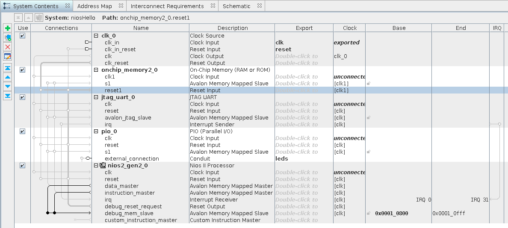
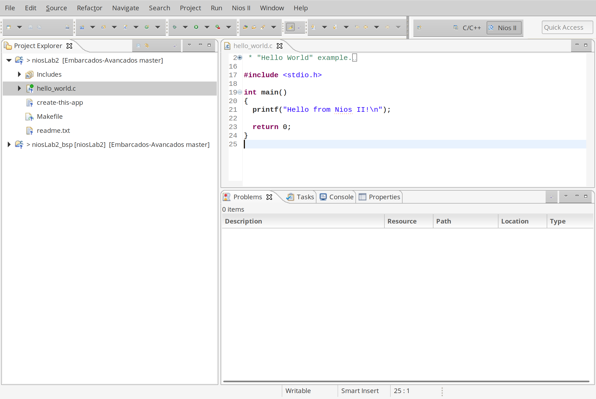
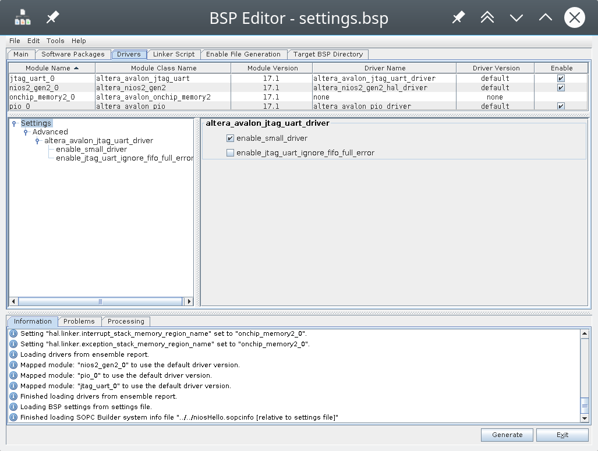

# NIOS

In this tutorial, we will create and customize a soft processor with NIOS (an embedded system with a processor and peripheral), embed it in the FPGA, and write a code for it. By the end, we'll have the same LEDs as in the previous project, with a similar operation, but now they're controlled by a program rather than dedicated hardware.

## Getting Started

To follow this tutorial you need:

- **Hardware:** DE10-Standard and accessories
- **Software:** Quartus 18.01
- **Documents:** [DE10-Standard_User_manual.pdf](https://github.com/Insper/DE10-Standard-v.1.3.0-SystemCD/tree/master/Manual)

## Soft processor

HDL (VHDL, Verilog, ...) projects aren't very flexible, each project modification implies hardware modifications, which isn't straightforward. Besides the difficulty of implementing changes, we also have the testing and compilation time of the project, which isn't immediate.

One solution to make the project more flexible is to have the LEDs controlled not by a dedicated logic but by hardware that can execute a series of instructions: a microcontroller.

Since the FPGA can implement digital logic circuits, it's possible to synthesize a microcontroller in the FPGA and make this uC control the LEDs (Yes!! the uC is hardware described in HDL). Now the change in the control logic depends on the program that will be executed on the uC, making the project much more flexible.

!!! note ""
    The ARM is also a hardware in HDL, but proprietary:

    -  https://www.arm.com/about/newsroom/arm-offers-free-access-to-cortex-m0-processor-ip-to-streamline-embedded-soc-design.php

Processors that can be synthesized in programmable logic devices (FPGA, ...) are called [Soft Processors](https://en.wikipedia.org/wiki/Soft_microprocessor). Several Soft Processors are commercially available or open-source:

- [NIOS II: Intel](https://www.intel.com/content/www/us/en/programmable/products/processors/support.html)
- [MicroBlazer: Xilinx](https://www.xilinx.com/products/design-tools/microblaze.html)
- :point_right: [LEON: Gaisler](https://www.gaisler.com/index.php/products/ipcores/soclibrary) (aerospace/ SPARCV8)
- among others

Adding peripherals and extra functionalities to the Soft Processor (for example, we can add a memory manager, timers, network controller, ...) causes the system to be called a [System On Chip](https://en.wikipedia.org/wiki/System_on_a_chip) (SoC).

### Platform Designer (**PD**)

!!! note ""
    The Platform Designer was called **QSYS**, you can still find many things with this reference

The Platform Designer is a software provided by Intel and integrated into Quartus that enables us to develop complex systems in a simple and visual way. With it, we can add and connect **Intellectual property cores** (IP Core) to develop an application quickly and visually.

The IP cores can be from [Intel](https://www.intel.com/content/www/us/en/products/programmable/intellectual-property.html), third parties, or proprietary.

!!! note "Going beyond"
    There's an online course from Intel that shows how PlatformDesign works: [Introduction to Platform Designer](https://www.intel.com/content/www/us/en/programmable/support/training/course/iqsys101.html)

## NIOS

[NIOS](https://en.wikipedia.org/wiki/Nios_II) is the soft processor provided by Altera-Intel and integrated into the tool. NIOS is based on the architecture of MIPS with a [32-bit architecture](https://www.intel.com/content/www/us/en/programmable/documentation/iga1420498949526.html#iga1409259423560), exception control, communication bus, memory control, ....

The following figure describes the essential components of NIOS (blue) and what is customizable (grey).


- Reference: [Processor Architecture](https://www.intel.com/content/www/us/en/programmable/documentation/iga1420498949526.html#iga1409259423560)

NIOS supports the addition of new instructions to its instruction set, these instructions are implemented in HDL and inserted into the core in a way that is transparent to the developer. There are degrees of customized instructions: combinational; multi-cycle; extended; That makes use of the original register bank or those that add new registers.

!!! note "Going beyond"
    For more details on how to customize NIOS, refer to the document:

    - [Nios II Custom Instruction User Guide](https://www.intel.com/content/dam/altera-www/global/en_US/pdfs/literature/ug/ug_nios2_custom_instruction.pdf)

## Creating a Simple SoC

!!! success ""
    Getting started with implementation.

In this step, we will add a processor and the necessary minimum infrastructure for its operation. We will include the following in the project:

- A clock interface
- A memory (data and program)
- The processor (NIOS II)
- A PIO peripheral (for managing digital outputs)
- A JTAG-UART for supporting debug via print.

To begin:

1. Copy the `Lab1_FPGA_RTL/` folder and rename it to `Lab2_FPGA_NIOS/`.
2. Open the project in this new folder `Lab1_FPGA_RTL/` in Quartus.
3. Open the Platform Designer:
    - **Quartus** :arrow_right: `Tools` :arrow_right: `Platform Designer`
4. Add the following peripherals and their configurations:
    - `On-Chip Memory (RAM or ROM Intel FPGA IP)`
        - Type: **RAM**
        - Total Memory size: **32768 bytes**
    - `JTAG UART Intel FPGA IP`
        - **Default**
    - `PIO (Parallel I/O) Intel FPGA IP`
        - Width: **6**
        - Direction: **Output**
    - `NIOS II Processor`
        - Type: **NIOS II/e**

You should obtain something similar to:



!!! progress
    I've reached this point!

### Connecting Clock and Reset

The peripherals of the **PD** (Platform Designer) are like independent systems (think of each block as a chip) that need to be connected at least to a Clock and a Reset. The system can operate in different clock and reset domains, so this connection must be made by the developer.

Think of this step as similar to the `port map` in VHDL, but at a higher level of abstraction. The **PD** will be responsible for making the signals compatible for us. Connect all the clock and reset signals to the `clk` and `clk_rst` signals of the `clk_0` peripheral, and also connect the `debug_reset` of NIOS, as shown in the following figure:


!!! tip
    To connect, click on the gray circle at the intersection of the buses or signals.

!!! progress
    I've reached this point!

### Connecting the Bus

Intel defines two types of data buses for the **PD**: Avalon and AXI (this is an inheritance from Altera). The Avalon bus is the main way to connect a peripheral to NIOS (the processor), while the AXI is the standard bus for ARM, which will be used later.

The Avalon bus basically defines two types of communication: **Memory Mapped (MM)** and **Avalon Streaming Interface (ST)**.

!!! note "Going further"
    For more information, refer to the document [Avalon Interface Specifications](https://www.altera.com/content/dam/altera-www/global/en_US/pdfs/literature/manual/mnl_avalon_spec.pdf).

The main bus of NIOS is the [memory-mapped](https://en.wikipedia.org/wiki/Memory-mapped_I/O) one, and every peripheral connected to the **NIOS** (processor) must have this bus. Altera provides converters and adapters to transform one communication form into another.

> In tutorial 3, we will develop a proprietary peripheral that will be connected to this bus.

Note that NIOS has two **MM** type buses: `data_master` and `instruction_master`. Since NIOS II is a processor based on the [Harvard architecture](http://infocenter.arm.com/help/index.jsp?topic=/com.arm.doc.faqs/ka3839.html), it has two separate paths for accessing memory: one for data and another for program (instruction).

In our hardware topology, we only have a single memory (**on_chip_memory**) that will be initially shared between data and program (there is an efficiency loss here since the memory can only be accessed by one bus at a time). **We'll improve this later!**

We should connect all the peripherals (**PIO**, **UART**, and **OnChip Memory**) to the `data_master` bus, and connect ==only the memory== (**OnChip Memory**) to the instruction bus (`instruction_master`), resulting in the following assembly:


## Memory Map

After making the connections, we need to specify the memory address for each peripheral. There are two ways to do this: manual or automatic.

In the manual method, you can allocate the peripherals at memory addresses of your choice, taking care to avoid overlapping addresses. In the automatic method, we let the tool allocate the peripherals at the correct addresses.

To perform automatic allocation: `System` :arrow_right: `Assign Base Address`. To view the result, click on the `Address Map` tab.


### Configuring NIOS

Now we need to configure NIOS to use the newly connected memory. Double-click on the NIOS to open the **Parameters** window.

In `Parameters` :arrow_right: `Vector`, configure:

- Reset vector memory: **onchip_memory**
- Exception vector memory: **onchip_memory**


!!! tip "Tip"
    The name **onchip_memory** may vary depending on your project, and the address may also vary (this depends on the order in which the components were added).

### Export

The export column in **Platform Designer** indicates which signals will be exported from the system. Think of these signals as the ones that will have contact with the external world (they will be mapped to pins in the `topLevel`).

Double-click on the export column in the row of the signal **external_connection** of the **PIO** component and name this signal as LEDs.

!!! note
    Notice that the `Clock Source` component also has the export of signals: `clk` and `reset`. This was done automatically when creating the project.

### Saving

At the end of everything, you should have something like the following figure:


==Save the project as `niosLab2.qsys` in the project folder, and click on `Generate HDL` for the **PD** to generate the project.==

!!! tip
    `File` :arrow_right: `Save_as`: `niosLab2.qsys`

### Using the Component

Still in the **PD**, click on: `Generate` :arrow_right: `Show Instantiation Template`, select VHDL as the HDL language. You should obtain something like this:

!!! tip "Tip"
    Save this somewhere, we will use it in the next step!

``` vhdl
component niosLab2 is
    port (
        clk_clk       : in  std_logic                    := 'X'; -- clk
        reset_reset_n : in  std_logic                    := 'X'; -- reset_n
        leds_export   : out std_logic_vector(5 downto 0)         -- export
    );
end component niosLab2;

u0 : component niosLab2
    port map (
        clk_clk       => CONNECTED_TO_clk_clk,       --  clk.clk
        reset_reset_n => CONNECTED_TO_reset_reset_n, --  reset.reset_n
        leds_export   => CONNECTED_TO_leds_export    --  leds.export
    );
```

This is a shortcut for how we should use this component in our project. This code snippet indicates that the newly created project in the **PD** has three external interfaces: `clk_clk`, `reset_reset_n`, and `leds_export`. These signals will need to be mapped in the topLevel to their respective pins.

!!! tip ""
    These names may vary in your project!

The schematic (generated by `Platform Designer` :arrow_right: `View` :arrow_right: `Schematic`) illustrates the newly created SoC and its interfaces:


### Finishing

Click on finish and leave everything as default. Now Qsys will create the system and all the components configured in it. Quartus will give a warning indicating that some files need to be added to Quartus in order for it to access the newly created project in the **PD**:


In Quartus: `Project` :arrow_right: `Add/remove files in project` and add the file:

- `niosLab2/synthesis/niosLab2.qip`

Resulting in:


### Creating the Top-Level

Now we need to create a VHDL file that will be our top-level `LAB2_FPGA_NIOS.vhd` to include the newly created `niosLab2` component.

1. Create a new VHDL file named: `LAB2_FPGA_NIOS.vhd`
2. Insert the following `VHDL` code:
3. Compile the project and analyze the RTL to verify if it is as expected.
4. Program the project onto the FPGA.

!!! example "Top-Level"
    ``` vhdl
    library IEEE;
    use IEEE.std_logic_1164.all;

    entity LAB2_FPGA_NIOS is
        port (
            -- Globals
            fpga_clk_50        : in  std_logic;             -- clock.clk

            -- I/Os
            fpga_led_pio       : out std_logic_vector(5 downto 0)
      );
    end entity LAB2_FPGA_NIOS;

    architecture rtl of LAB2_FPGA_NIOS is

    component niosLab2 is port (
      clk_clk       : in  std_logic                    := 'X'; -- clk
      reset_reset_n : in  std_logic                    := 'X'; -- reset_n
      leds_export   : out std_logic_vector(5 downto 0)         -- export


    );
    end component niosLab2;

    begin

    u0 : component niosLab2 port map (
      clk_clk       => fpga_clk_50,    --  clk.clk
      reset_reset_n => '1',            --  reset.reset_n
      leds_export   => fpga_led_pio    --  leds.export
    );

    end rtl;
    ```
     
!!! note
    Note that we are not using the reset signal (the `_n` indicates that the reset is active-low, i.e., 0). 

## Programming the NIOS - Soft Processor

Now that we have the **project programmed onto the FPGA**, with the hardware that includes the NIOS processor, we need to generate and program a software that controls the LEDs. To do this, we will open the **NIOS Software Build for Eclipse** (SBT) IDE, which has all the necessary toolchain to develop firmware for NIOS.

In Quartus: `Tools` :arrow_right: `Nios II Software Build...`, and an eclipse interface will open.

When developing projects for SoC systems, we have a problem: the hardware is not standardized. Since everything is customized, there is an issue that needs to be addressed, which is the interface between the created hardware and the software toolchain (compiler, linker, etc.).

Altera solved this by creating a Hardware Abstraction Layer (HAL), or as Intel calls it, Board Support Package (BSP), which extracts information from the Platform Designer to be used by the compilation toolchain (GCC). When we create a project in **NIOS II - Eclipse**, two projects will be created: one containing the firmware to be programmed into the NIOS, and another (BSP) containing relevant information about the hardware for use in the firmware and toolchain.

<!---->

<!--!!! note "For more information:"
    - https://www.altera.com/products/processors/design-tools.html#SBT-->

### Creating the Project

1. In **Quartus**: `Tools` :arrow_right: `Nios II Software Build for Eclipse`
2. In **NIOS II Software Build for Eclipse**: `File`  :arrow_right:  `New`  :arrow_right:  `NIOS II Application and BSP from template`

- `SOPC Information File Name`:
    - In the project folder, search for the file: **niosLab2.sopcinfo**
        - This file is created by the **PD** when the project is compiled and is located in the project folder.
- `Project name`: **niosLab2**

- `Project template`: **Hello World**

??? tip
    {width=500}

- After clicking Next, SBT will create two project folders:
    - `niosLab2`: firmware to be embedded
    - `niosLab2_bsp`: Board support package for the firmware

You should obtain something like this:



### Analisando e configurando o bsp

Vamos analisar o BSP gerado:

- `Project Explorer` :arrow_right: `niosLab2_bsp` :arrow_right: `NIOS II` :arrow_right: `bsp Editor`

??? tip 
    {width=500}

Isso abrirá uma interface de configuração para o bsp. Diversas são as opções de configurações, algumas delas:

- `sys_clk_timer`: periférico utilizado para bibliotecas de delay (não inserimos no Platform Designer)
- `timestamp_timer`: periférico que seria utilizado pelo timestamp
- `stdin`, `stdout`, `sterr`: periférico utilizado pelo **stantard IO** do C, no nosso caso: `jtat_uart_0` (poderia ser outro).

!!! note
    Note que a região de memória do stack já está configurada para a `onchip_memory`. Aqui teríamos a opção de mapear para outro local (no caso do sistema possuir outras memórias, tais como memórias DDR externas a FPGA).


!!! progress
    Cheguei aqui!

### Jtag-UART small driver

Note que no nosso projeto no **PD** o periférico jtag-uart não teve seu sinal de interrupção conectado no NIOS, isso dificulta o acesso a uart, já que o firmware não será interrompido caso um novo dado chegue (gets) ou na transmissão (puts). O driver deve ficar fazendo um polling no periférico para verificar o envio e recepção dos dados. Para isso funcionar, devemos ativar uma opção no driver do jtag_avalon no bsp:

- `BSP Editor` :arrow_right: `Drivers` :arrow_right: `jtag_uart` :arrow_right: `enable_small_driver`



!!! progress
    Cheguei aqui!

### Gerando o bsp

Toda vez que o bsp for editado ou o hardware alterado (**Platform Designer**) deve-se regenerar o bsp :

De volta no eclipse, devemos gerar os arquivos bsp. Para isso clique em: `niosLab2_bsp` :arrow_right: `NIOS II` :arrow_right: `Generate BSP`

### Embarcando!

Com o bsp editado abra agora a pasta `niosLab2` e note que existe inicializada com um arquivo: `hello_world.c` que imprime via JTAG-UART uma string. Insira o código a seguir no eclipse:

```c
#include <stdio.h>

int main()
{
  printf("Hello from Nios II!\n");

  return 0;
}
```

Com o `hello_word.c` aberto (é necessário para o eclipse saber qual projeto você quer embarcar), clique em: `Run` :arrow_right: `Run` :arrow_right: `NIOS II Hardware`. Isso fará com que a aplicação seja descarregada na memória do Qsys que alocamos para o Nios e que o hardware seja, reiniciado para executar o firmware. Quando o firmware for executado, abra a aba do eclipse **NIOS II console**:

{width=500}

!!! tip "Programando"
    <video width="660" height="360" controls>
      <source src="http://54.162.111.146/shared/soc/SoC-Tutorial-FPGA-NIOS.mp4" type="video/mp4">
    </video> 

!!! progress
    Cheguei aqui!

### Blink LED

Edite main para conter o código a seguir:

```c
#include <stdio.h>
#include "system.h"
#include <alt_types.h>
#include <io.h> /* Leiutura e escrita no Avalon */

int delay(int n){
	  unsigned int delay = 0 ;
	  while(delay < n){
		  delay++;
	  }
}

int main(void){
  unsigned int led = 0;

  printf("Embarcados++ \n");

  while(1){
	  if (led <= 5){
		  IOWR_32DIRECT(PIO_0_BASE, 0, 0x01 << led++);
		  usleep(50000);
	  }
	  else{
		  led = 0;
	  }
  };

  return 0;
}
```

Embarque no NIOS e veja o resultado nos LEDS!

!!! progress
    Cheguei aqui!
