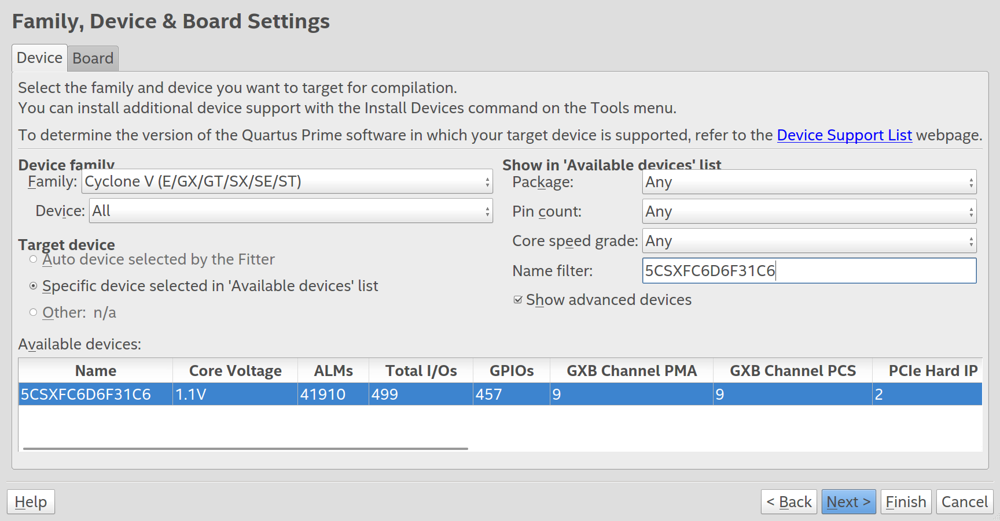
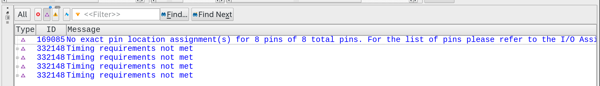
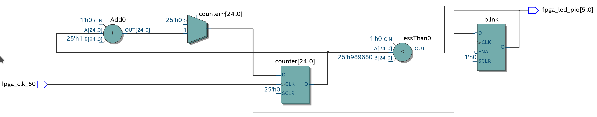

# RTL / VHDL

This first delivery is an introduction/warm-up to VHDL and FPGA, we will create a dedicated hardware on the FPGA to control the board's LEDs based on the input signals from the buttons. The idea is to go through the entire process of developing a hardware in FPGA and with VHDL.

## Getting Started

To follow this tutorial you will need:

- **Hardware:** DE10-Standard and accessories 
- **Software:** Quartus 18.01
- **Documents:** [DE10-Standard_User_manual.pdf](https://github.com/Insper/DE10-Standard-v.1.3.0-SystemCD/tree/master/Manual)

## Quartus

First, we must create a new project in the Quartus software. 

!!! exercise
    In Quartus: `File` ➡️`New Project Wizard`

    - **Directory, Name, Top-Level Entity**
        - Choose the destination as your repository. Name the project as `Lab1_FPGA_RTL`
    - **Project Type** 
        - Empty Project
    - **Add Files**
        - We won't add any files for now.
    - **Family, Device & Board Settings**
        - Look for the FPGA: 
            - Family: `Cyclone V`
            - Name: `5CSXFC6D6F31C6`
    - 🆗 Finalize the Wizard 

    

!!! note "**Other references**"
    If you need other reference material, there's a Terasic tutorial: [DE10-Standard_My_First_Fpga.pdf	](https://github.com/Insper/DE10-Standard-v.1.3.0-SystemCD/tree/master/Manual)


## Creating the topLevel

TopLevel is the name of the topmost module in [hierarchical](https://www.intel.com/content/www/us/en/programmable/support/support-resources/design-examples/design-software/vhdl/v_hier.html) development where, generally, the entity signals (in/out,...) will be mapped to hardware pins (connection with the external world).

!!! exercise
    Let's add a file to the newly created project:

    - `File` :arrow_right:  `New` :arrow_right:  `VHDL File`
    - `File` :arrow_right:  `save as` :arrow_right:   
      - name: `Lab1_FPGA_RTL.vhd` 
    - 🆗
     
!!! exercise "toplevel source file"
    Initialize the file with the following content ( this code could be more elegant, but we'll keep it simple for the sake of understanding. )
    
    ``` vhdl
    library IEEE;
    use IEEE.std_logic_1164.all;

    entity Lab1_FPGA_RTL is
        port (
            -- Gloabals
            fpga_clk_50   : in  std_logic;        
          
            -- I/Os
            fpga_led_pio  : out std_logic_vector(5 downto 0)
      );
    end entity Lab1_FPGA_RTL;

    architecture rtl of Lab1_FPGA_RTL is

    -- signal
    signal blink : std_logic := '0';

    begin

      process(fpga_clk_50) 
          variable counter : integer range 0 to 25000000 := 0;
          begin
            if (rising_edge(fpga_clk_50)) then
                      if (counter < 10000000) then
                          counter := counter + 1;
                      else
                          blink <= not blink;
                          counter := 0;
                      end if;
            end if;
      end process;

      fpga_led_pio(0) <= blink;
      fpga_led_pio(1) <= blink;
      fpga_led_pio(2) <= blink;
      fpga_led_pio(3) <= blink;
      fpga_led_pio(4) <= blink;
      fpga_led_pio(5) <= blink;

    end rtl;
    ```
    

## Configuring the topLevel

In Quartus, we need to specify which entity is the topLevel. As VHDL does not define a standard for this, any entity can be configured as the top. 

!!! exercixe 
    In Quartus:

  - `Project` :arrow_right:  `Set as Top-Level Entity`

This command will set the current file as the topLevel of the project. Note that Quartus assigns the entity's name as the file's name to the topLevel. If for any reason (which happens) the file's name is not the same as the entity's, this will not work.

!!! tip
    As we saved the file with the same name as the project and the entity has the same name as well, Quartus recognizes this entity as the TopLevel by default.

## Verifying

Let's make sure everything is fine so far by doing a complete compilation of the project.

!!! exercise 
    To full complile the project on quartus:10000000
    
    :arrow_right: `Processing` :arrow_right:  `Start Compilation`.
 
    > Please wait! Hardware compilations can take quite a long time.

### I/Os

Remember that the topLevel is the entity that will be mapped with the external world. In this case, the signals: `fpga_clk_50`; `fpga_led_pio`; should be connected to the FPGA pins that are connected to these devices (50 MHz clock; Six LEDs).

Notice the error that Quartus generated when we asked it to compile the project (**"Show Critical Warnings Messages"**):

!!! failure
    ```
    Critical Warning (169085): No exact pin location assignment(s) 
    for 6 pins of 6 total pins. For the list of pins please refer 
    to the I/O Assignment Warnings table in the fitter report.
    ```

    

==This error indicates that from the topLevel 6 signals were not mapped to their corresponding pins.==

#### Pins

We must indicate to the tool which pins and which signal standard it should use for each of the signals defined in the topLevel entity. 

#### LEDs

On page 22 of the board manual, we have the definitions of how the FPGA pins were used on the board:

> There are also ten user-controllable LEDs connected to the FPGA. Each LED is driven directly and
> individually by the Cyclone V SoC FPGA; driving its associated pin to a high logic level or low
> level to turn the LED on or off, respectively. Figure 3-17 shows the connections between LEDs and
> Cyclone V SoC FPGA. Table 3-6, Table 3-7 and Table 3-8 list the pin assignment of user
> push-buttons, switches, and LEDs.

{width=500}

#### CLOCK

From the manual:

> Figure 3-13 shows the default frequency of all external clocks to the Cyclone V SoC FPGA. A
> clock generator is used to distribute clock signals with low jitter. The four 50MHz clock signals
> connected to the FPGA are used as clock sources for user logic. One 25MHz clock signal is
> connected to two HPS clock inputs, and the other one is connected to the clock input of Gigabit
> Ethernet Transceiver. Two 24MHz clock signals are connected to the clock inputs of USB
> Host/OTG PHY and USB hub controller. The associated pin assignment for clock inputs to FPGA
> I/O pins is listed in Table 3-5.


#### Pin Assignment

We will use the `Pin Planner` to insert these pins informations.

!!! exercise
    To edit the pin assgiments:

    :arrow_right: `Assignments` :arrow_right: `Pin Planner`. 

The `Pin Planner` interface displays the available FPGA pins/banks to be allocated to the TopLevel signals. Note that the `Fitter Location` column already has pins allocated to the signals, this was automatically generated by Quartus in the `Filter` step, however they do not correspond to the actual pins we want to use.

!!! exercise
     Edit the `Location` column using the previous figure that relates the LEDs on the board with the FPGA pins.
     
     Note:
     
     1. In our project, we only have 6 LEDs, out of the total 10 available.
     1. The I/O Standard does not reflect the one defined in the manual, which is `3.3V CMOS`. You should change this column from `2.5V CMOS (Default)` to **`3.3-V LVTTL`**.

    

!!! info "FPGA Flexibility"
     We normally attribute logical flexibility to the FPGA, but notice the flexibility it has in terms of defining the signal level of each pin. This gives the hardware developer countless usage options and new configurations.

!!! exercise "Assignment Editor"
    Close the tool and open the `Assignment Editor`:
    
    :arrow_right: `Assignments` :arrow_right:  `Assignments Editor`. 
    
    Note that the same information entered previously is in this editor. In fact, all FPGA configurations are displayed in the `Assignments Editor`, and only some in the `Pin Planner`.

!!! exercise "Recompile"
    Recompile the project and note that there are no longer allocation errors.

The error you're encountering pertains to not having indicated the operating frequency of your system to Quartus. Since the frequency isn't defined, the `Fitter and Assembler` phase can't correctly optimize the project, leading to this error. Note tha in this context, "Assembler" refers to a different process than the assembler used in a program like **C**. For more details, refer to this [resource](https://people.ece.cornell.edu/land/courses/ece5760/Quartus/Quartus_compile.html).

### Synopsys Design Constraints File (`.sdc`)

We need to add a new file to the project that outlines the boundary conditions of the project for the tool.

!!! exercise
    To do this: `File` :arrow_right: `New File` :arrow_right: `Synopsys Design Constraints File` :arrow_right: `Save As`:

    - `Lab1_FPGA_RTL.sdc`

!!! exercise
    Add the following content to the file:

    ```
    # 50MHz board input clock
    create_clock -period 20 [get_ports fpga_clk_50]

    # Automatically apply a generate clock on the output of phase-locked loops (PLLs) 
    derive_pll_clocks
    ```

These lines instruct the tool that the signal `fpga_clk_50` is a clock signal with a frequency of 50MHz (20 ns period) and to infer other automatic clocks (e.g., in case a PLL is used).

!!! success "Recompile"
    Recompile the project and note that there are no longer any critical errors in the project.

### RTL Viewer 

The RTL Viewer provides a graphical way to verify if the HDL code has been correctly interpreted by the tool. It's an excellent way to check if the hardware description is correct.

!!! exercise
    To open the RTL   Viewer:

    :arrow_right: `Tools` :arrow_right: `NetList Viewers` :arrow_right: `RTL Viewer`.
  
    You should see a diagrama similar to this one:
    
    

## Programming

Connect the FPGA to the Host via the USB Blaster connector

Once the project compiles, Quartus generates a binary file in the output_files folder with the `*.sof` extension. This file will be loaded onto the FPGA to run the project. 

!!! exercise
    To programmer the FPGA:
    
    `Tools` :arrow_right: ` Programmmer`.

    At this stage, click on Auto Detect. This will read via JTAG all devices connected to the **JTAG chain**. You will notice that two devices appear:

    - `SOCVHPS`: ARM Cortex A7
    - `5CSXFC6D6`: FPGA

    > You might need to configure Linux to recognize the JTAG. Follow the steps at: [Configuring USB Blaster Linux](https://github.com/Insper/Z01.1/wiki/Infraestrutura-Detalhada#configurando-o-usb-blaster).

    

## Exercises

Lets practical a little bit:

1. :beginner: Make the LEDs blink more slowly
1. :beginner: Add buttons to the project and make them control the LEDs
1. Make switches control the frequency at which the LEDs blink
1. Add a PWM to the LEDs to control their intensity 
