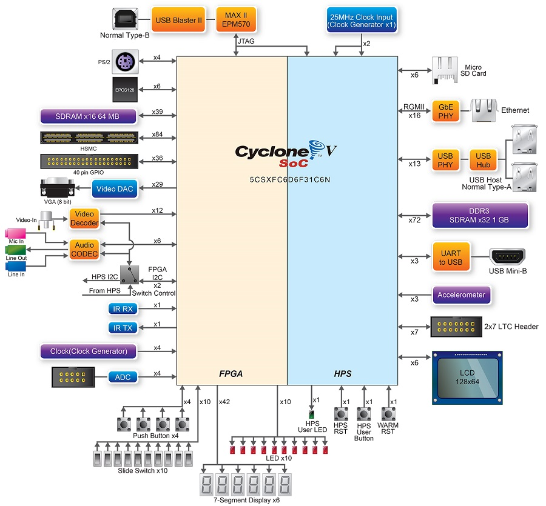

# Tutorial 6 - HPS - BlinkLED

Nesse tutorial iremos compilar um programa para o HPS (Arm Cortex A) que será capaz de controlar os LEDs e ler os botões da placa que estão conectados ao HPS.



Note pelo diagrama anterior extraído do manual do usuário, existem LEDs e botões conectados diretamente ao HPS, e outros conectados a FPGA. Duas são as possíveis abordagens para programarmos o HPS: 

## baremetal

Faríamos um programa que seria executado no ARM HPS sem nenhum sistema operacional. Como detalhado no diagrama :


!!! note ""
    - [Altera Bare Metal User Guide](https://www.intel.com/content/www/us/en/programmable/documentation/lro1424280108409.html)

Nessa maneira, a aplicação deve ser capaz de realizar toda a inicialização de HW necessária para que o processador rode corretamente. Se a aplicação for executada sobre um sistema operacional, toda essa etapa é de compilação é responsabilidade do SO. Para isso é aconselhável utilizar a IDE da ARM chamada de [DS-5](https://developer.arm.com/tools-and-software/embedded/legacy-tools/ds-5-development-studio)

## Sistema operacional

Diversas são as alternativas de sistema operacional para embarcado, tudo irá depender da especificação da aplicação. É necessário saber se existem requisitos de tempo real, se sim, deve-se considerar utilizar um RTOS ou algum sistema operacional com essa funcionalidade (existe um patch no kernel do linux que o torna mais ou menos real time). Se é uma aplicação que demanda rede, vídeo, processamento de dados, é de se considerar utilizar um Linux da vida (ou BSD, Androuid), já que a facilidade de desenvolvimento de aplicações nessa plataforma é mais fácil (já tem muita coisa pronta e uma comunidade gigantesca).

Com o uso de um sistema operacional a parte referente ao HW é responsabilidade do kernel (ou dos desenvolvedores que estão adequando o kernel ao HW, que é o caso de vocês). Diversos são os ganhos de utilizar um sistema operacional do tipo Linux (as perdas também são grandes: maior ocupação de memória, maior latências, **boot lento**...) tais como:

- Device drivers 
- Portabilidade
- Segurança
- Rede

# Linux

Nesse tutorial iremos compilar um programa e executar no Linux Embarcado. esse programa será executado no [user space](http://www.linfo.org/kernel_space.html). Para isso iremos utilizar a toolchain definida no [tutorial anterior](Tutorial-HPS-BuildSystem).

Iremos utilizar como base o código exemplo da Terasic que está localizado no CD do kit: [DE10-Standard-v.1.3.0-SystemCD/Demonstration/SoC/my_first_hps](https://github.com/Insper/DE10-Standard-v.1.3.0-SystemCD/tree/master/Demonstration/SoC/my_first_hps)

E crosscopilar esse código para o nosso HPS utilizando o Makefile da pasta.

!!! note
    Esse Makefile só funciona porque configuramos o nosso bashrc com as variáveis de sistemas que ele utiliza.
    Por exemplo, a linha `SOCEDS_ROOT ?= $(SOCEDS_DEST_ROOT)` usa a variável `SOCEDS_DEST_ROOT` que foi configurara no tutorial anterior, assim como o `arm-linux-gnueabihf-`...

## Executando no `target`

Agora basta  copiar o binário criado pela compilação para o cartão de memória e testar o nosso programa no `target` (HPS).

!!! note 
    Com o cartão de memória no `host` copie o arquivo binário: `hps_gpio` para a pasta: `/root/` do cartão de memória.

    Sempre que manipular um dispositivo de memória externo, será necessário fazer um flush do cache para forçar o linux alterar o dispositivo externo, caso contrário a alteração poderá ficar só local ao PC.

    ```bash
    $ sync
    ```
    
    > A função sync é blocante, ficará travada enquanto o linux faz o flush dos dados.


!!! example "Modificando o código"
    Faça o programa ler apenas duas vezes o botão, e depois disso termina a aplicação !

## Fluxo de desenvolvimento

Esse fluxo de desenvolvimento não é dos melhores né? É bom programar no `host`, mas esse esquema de ter que ficar tirando e colocando cartão de memória, esperar o linux do target subir, logar e testar não faz bem para ninguém. Existem várias soluções para melhorar isso, cada qual com sua vantagem/desvantagem:

- build no próprio target (ruim para o programador, ótimo para dependências, fácil de debugar, lento)
- criar uma vmw arm e compilar nela (bom para o programador, ótimo para dependências, +- fácil de debugar, rápido)
- crosscompilar (bom para o programador, ruim para dependências, difícil de debugar, rápido)

Na entrega 4 vamos aprimorar nosso sistema de compilação e testes. 
