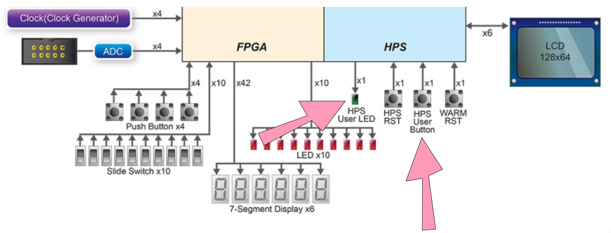
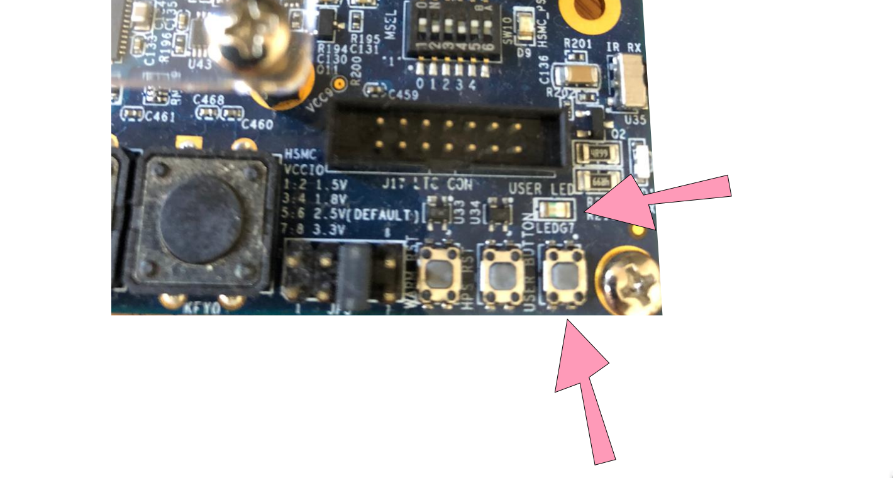
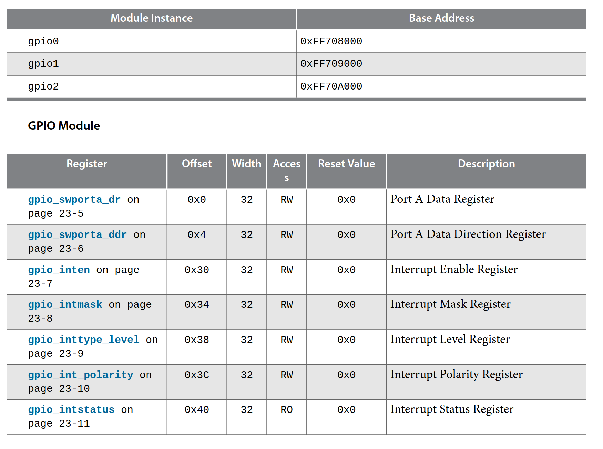

# ARM BlinkLED

In this tutorial, we will compile a program for the HPS (Arm Cortex A) that will be able to control the LEDs and read the buttons on the board that are connected to the HPS.


Notice from the previous diagram extracted from the user manual, there are LEDs and buttons directly connected to the HPS, and others connected to the FPGA. There are two possible approaches to programming the HPS:

## baremetal

We would create a program that would run on the ARM HPS without any operating system. As detailed in the diagram:


!!! note ""
    - [Altera Bare Metal User Guide](https://www.intel.com/content/www/us/en/programmable/documentation/lro1424280108409.html)

In this way, the application must be able to perform all the necessary HW initialization for the processor to run correctly. If the application is executed on an operating system, this entire compilation stage is the responsibility of the OS. For this, it is advisable to use the ARM IDE called [DS-5](https://developer.arm.com/tools-and-software/embedded/legacy-tools/ds-5-development-studio)

## Operating System

There are several alternatives for embedded operating systems, everything will depend on the application specification. It is necessary to know if there are real-time requirements, if so, consider using an RTOS or some operating system with this functionality (there is a patch in the Linux kernel that makes it more or less real-time). If it is an application that requires network, video, data processing, it is worth considering using a Linux (Android), as there are tools that facilitate application development on this platform (there is a lot already done and a gigantic community).

With the use of an operating system, the part referring to HW is the responsibility of the kernel (or the developers who are adapting the kernel to HW, which is our case). There are several gains from using a Linux-type operating system, we can list some:

- Device drivers 
- Portability
- Security
- Network

The losses are also significant: greater memory occupation, greater latencies, **slow boot**...

### Blink LED Software

We will compile a program and run it on Embedded Linux, this program will be executed in the [user space](http://www.linfo.org/kernel_space.html). For this, we will use the toolchain from the [previous tutorial](Tutorial-HPS-BuildSystem). We will use as a basis the example code from Terasic available in the repository: [DE10-Standard-v.1.3.0-SystemCD/Demonstration/SoC/my_first_hps](https://github.com/Insper/DE10-Standard-v.1.3.0-SystemCD/tree/master/Demonstration/SoC/my_first_hps). And cross-compile this code for our HPS using the Makefile in the folder.

### About the program

This program controls an LED that is connected to the ARM part of the chip:




The pins are controlled by the [GPIO peripheral](https://www.intel.com/content/dam/www/programmable/us/en/pdfs/literature/hb/cyclone-v/cv_54006.pdf) of the HPS (ARM), for this it is necessary to access this peripheral from Linux, this is done in a similar way as we did in Embedded Computing, a pointer that points to the memory region of the component and configures its registers:



In baremetal systems, we can simply create a pointer that points to the memory region we want to change, in Linux we cannot do this directly (via userspace) as operating systems work with memory maps where the 'virtual' address does not represent the real address (remember Sys-HW-SW). In Linux, to access real memory we must map real memory to virtual using the `mmap` command:

```c
int main(int argc, char **argv) {
 	void *virtual_base; 
    int fd; 
    //...

	// map the address space for the LED registers into user space so we can interact with them.
	// we'll actually map in the entire CSR span of the HPS since we want to access various registers within that span
	if( ( fd = open( "/dev/mem", ( O_RDWR | O_SYNC ) ) ) == -1 ) {
		printf( "ERROR: could not open \"/dev/mem\"...\n" );
		return( 1 );
	}
	virtual_base = mmap( NULL, HW_REGS_SPAN, ( PROT_READ | PROT_WRITE ), MAP_SHARED, fd, HW_REGS_BASE );
```

Now that the `virtual_base` pointer points to the GPIO peripheral, and we can manipulate this address just like we did in Embedded Computing:

```c
while(1){
  scan_input = alt_read_word( ( virtual_base + ( ( uint32_t )(  ALT_GPIO1_EXT_PORTA_ADDR ) & ( uint32_t )( HW_REGS_MASK ) ) ) );		
  if(~scan_input&BUTTON_MASK)
    alt_setbits_word( ( virtual_base + ( ( uint32_t )( ALT_GPIO1_SWPORTA_DR_ADDR ) & ( uint32_t )( HW_REGS_MASK ) ) ), BIT_LED );
  else    
    alt_clrbits_word( ( virtual_base + ( ( uint32_t )( ALT_GPIO1_SWPORTA_DR_ADDR ) & ( uint32_t )( HW_REGS_MASK ) ) ), BIT_LED );
}	
```

!!! note
    This Makefile only works because we configured our `bashrc` with the system variables it uses.
    For example, the line `SOCEDS_ROOT ?= $(SOCEDS_DEST_ROOT)` uses the variable `SOCEDS_DEST_ROOT` that was configured in the previous tutorial, as well as the `arm-linux-gnueabihf-`...

!!! exercise "Task"
    1. Clone the repository: https://github.com/Insper/DE10-Standard-v.1.3.0-SystemCD
    1. Enter the folder `Demonstration/SoC/hps_gpio`
    1. Execute the command `make`
    
    Expected result:
    
    ```
    arm-linux-gnueabihf-gcc -g -Wall   -Dsoc_cv_av
    -I/media/corsi/dados/intelFPGA/20.1/embedded/ip/altera/hps/altera_hps/hwlib/include/soc_cv_av
    -I/media/corsi/dados/intelFPGA/20.1/embedded/ip/altera/hps/altera_hps/hwlib/include/
    -c main.c -o main.o
    arm-linux-gnueabihf-gcc -g -Wall    main.o -o my_first_hps 
    ```
    
    If you get something like:
    
    ```
    make: arm-linux-gnueabihf-gcc: Command not found
    Makefile:19: recipe for target 'main.o' failed
    make: *** [main.o] Error 127
    ```
    
    It's because you didn't correctly configure gcc in the previous step.

### Running on `target`

Now just copy the binary created by the compilation to the memory card and test our program on the `target` (HPS). With the memory card on the `host` (your computer), copy the binary file: `hps_gpio` to the folder: `/home/root/` on the memory card. Note that there are two partitions, you should copy to the one that has the `root`.

!!! note
    You may have to copy using sudo, in my case I run:
    
    ```
    $ sudo cp hps_gpio /media/corsi/847f4797-311c-4286-8370-9d5573b201d7/home/root 
    ```

!!! note
    Whenever you handle an external memory device, it is advisable to flush the cache to force Linux to change the external device, otherwise the change may only stay in the local memory to the PC.

    ```bash
    $ sync
    ```
    
    > The sync function is blocking, it will be locked while Linux flushes the data.

!!! exercise "Task"
    1. Put the SDCARD back in the FPGA.
    1. Access via terminal and run the program (`/home/root/hps_gpio`) with the command `./hps_gpio`.
    1. The `HPS User LED` of the Intel FPGA should flash twice initially, after this it will light up as the user clicks on the `HPS User Button`.
       
!!! exercise "Practicting"
    Make the program read the button only twice, and after that end the application!

### Development Flow

This development flow isn't the best, right? It's good to program on the `host`, but this scheme of having to keep removing and inserting memory cards, waiting for the target's Linux to boot, logging in, and testing is not good for anyone. There are several solutions to improve this, each with its advantage/disadvantage:

- build on the target itself (bad for the programmer, great for dependencies, easy to debug, slow)
- create an ARM VM and compile on it (good for the programmer, great for dependencies, +- easy to debug, fast, hard to configure)
- cross-compile (good for the programmer, bad for dependencies, hard to debug, fast)

==In Assigment 1 we will improve our compilation and testing system.==
