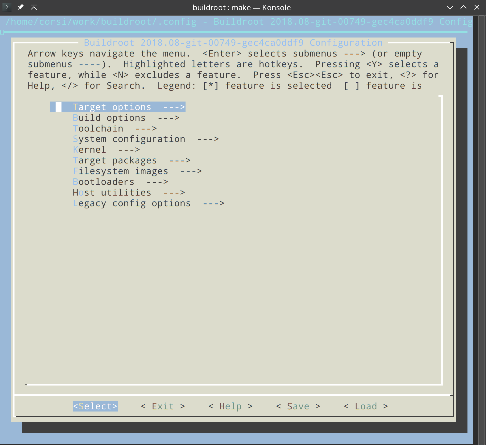
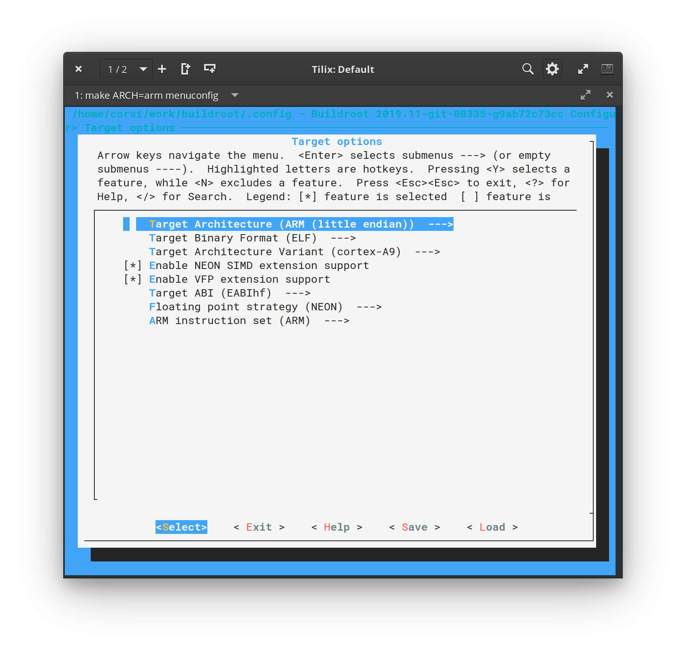
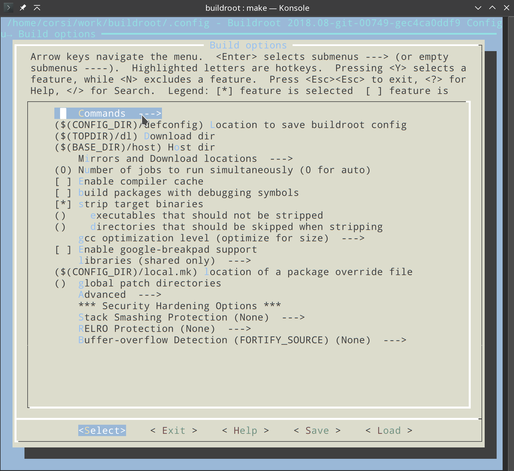
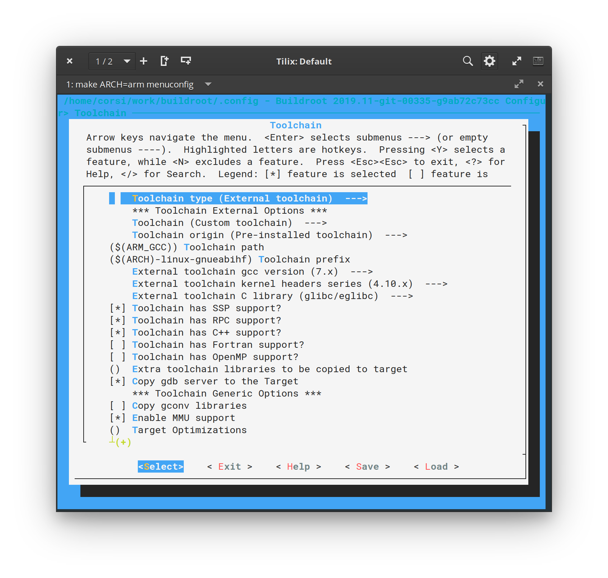
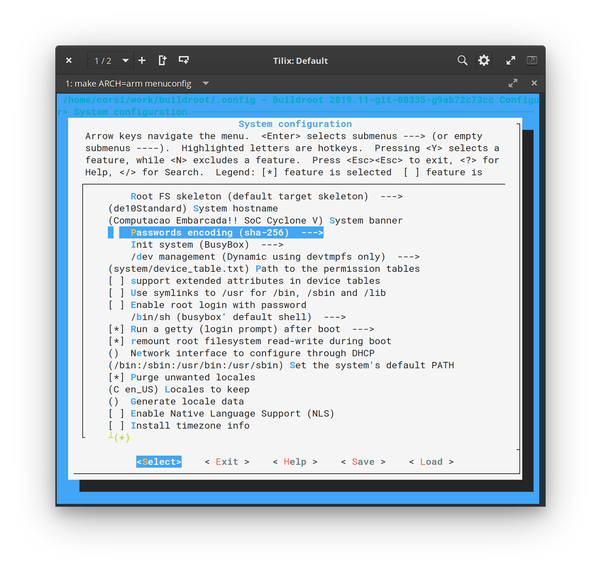
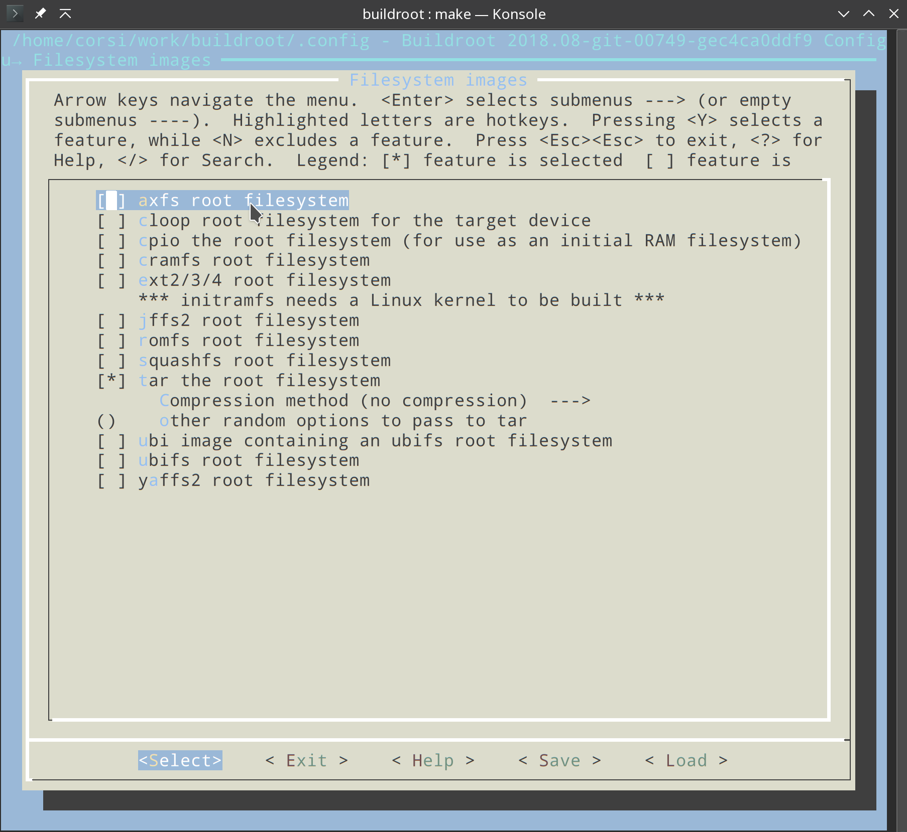
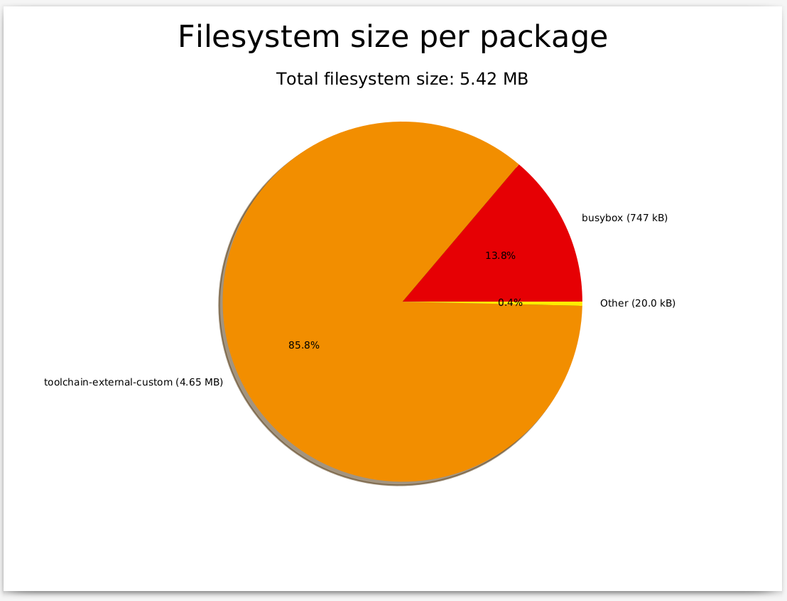

# Tutorial 8 - HPS -Buildroot

!!! note "Buildroot wikipidia"
    Buildroot is a set of Makefiles and patches that simplifies and automates the process of building a complete and bootable Linux environment for an embedded system, while using cross-compilation to allow building for multiple target platforms on a single Linux-based development system. Buildroot can automatically build the required cross-compilation toolchain, create a root file system, compile a Linux kernel image, and generate a boot loader for the targeted embedded system, or it can perform any independent combination of these steps. For example, an already installed cross-compilation toolchain can be used independently, while Buildroot only creates the root file system

    - ref: https://en.wikipedia.org/wiki/Buildroot
    
<iframe width="560" height="315" src="https://www.youtube.com/embed/0LJHx09RF80" frameborder="0" allow="accelerometer; autoplay; encrypted-media; gyroscope; picture-in-picture" allowfullscreen></iframe>

Iremos utilizar o [buildroot](https://buildroot.org/) para gerar o filesystem (`/bin`, `/etc`, ...) do nosso sistema embarcado. No buildroot teremos a opção de configurar quais softwares queremos no dispositivo. Por exemplo, se desejarmos acessar o HPS via ssh, teremos que no buildroot adicionar um ssh server para ser compilado e adicionado ao filesystem e executado no boot.

O buildroot é uma alternativa a outro projeto bem conhecido: Yocto. O vídeo a seguir são dois desenvolvedores, um de cada projeto, fazendo a comparação entre as duas ferramentas:

!!! note
    O Yocto está se consolidando como ferramenta padrão da industria, tomando o lugar do buildroot. A escolha pelo buildroot na eletiva é pela facilidade de criar um sistema, o yocto é mais complexo e cheio de terminologias. Nessa eletiva iremos trabalhar com o buildroot, mas para quem quer se aprofundar/especializar no tema, tem que aprender o yocto.
    
    <iframe width="560" height="315" src="https://www.youtube.com/embed/wCVYQWFIvBs" frameborder="0" allow="accelerometer; autoplay; encrypted-media; gyroscope; picture-in-picture" allowfullscreen></iframe>

# buildroot

!!! note "Leitura recomendada"
    - https://buildroot.org/downloads/manual/manual.html#_getting_started

## Download

Primeiramente devemos fazer o download do `buildroot`:

```bash
$ git clone https://github.com/buildroot/buildroot
$ cd buildroot/
```

O buildroot possui uma ferramenta de configuração similar ao do kernel do linux (`menuconfig` / `nconfig`) iremos utilizar-la para configurar o filesystem assim como quais programas serão compilados e inseridos no `/root/`. Lembre que já possuímos um toolchain (o que compilamos o kernel) configurado no `.bashrc`, iremos o utilizar para a compilação de todos os programas que iremos carregar no embarcado. 

O buildroot tem a opção de fazer o download do toolchain (ele também pode compilar o kernel e gerar o uboot, é uma ferramenta bem completa), mas dessa vez iremos utilizar o que já temos (para manter a compatibilidade).

## Configurando

Na pasta do buildroot recém clonada, execute o seguinte comando:

```bash
$ make ARCH=arm menuconfig
```

!!! tip
    Se ser algum erro, talvez seja necessário instalar o `libncurses-dev` via apt.

Ele irá abrir uma tela de configuração a seguir:



!!! note ""
    para voltar para essa tela, basta aperta duas vezes a tecla `<ESC>`

----------------

### 1. Target Options 

A primeira parte que iremos configurar é o alvo da geração do filesystem (*Target options*), devemos informar para o buildroot que ele está gerando arquivos para um ARM e indicar algumas opções do nosso compilador. Para isso:

!!! note "Config. final"
    

- Menu principal :arrow_right: Target Options
    - Target Architecture: **ARM (little endian)**  
        - Essa opção já deve estar certa pois passamos via a chamada do make (make ARCH=ARM ...)
    - Target Architecture Variant: **cortex-A9**
    - **Enable** NEON SIMD extension support
    - **Enable** VFP extension support
    - Floating point strategy: **NEON**
        - https://developer.arm.com/technologies/neon
    - Target ABI: **EABIhf**
        - Indicamos ao buildroot que nossa arquitetura possui ponto flutuante em HW.

----------------

### 2. Build options

!!! note "Config. Final"
    

Deixe padrão como o padrão.
    
----------------

### 3. Toolchain

!!! note "config. Final"
    

Vamos indicar agora para o buildroot qual toolchain que ele deve utilizar e suas configurações:

- Menu principal :arrow_right: Toolchain
    - Toolchain type: **External toolchain**
        - o buildroot irá usar o toolchain que especificarmos. Note que dentro dessa opção existe a : *Buildroot toolchain*, que se ativada faria com que o buildroot baixasse de forma automática todo o toolchain.
    - Toolchain: **Custom toolchain**
    - Toolchain path: **$(ARM_GCC)**
        - o buildroot irá usar essa variável do sistema como path do toolchain. Temos duas opções aqui :
            1. Podemos declarar essa variável no bash
            2. Podemos editar essa opção já com o path do nosso toolchain
            - Vamos escolher por hora a opção 1.
    - Toolchain prefix: **$(ARCH)-linux-gnueabihf**
        - o prefix é como o toolchain irá ser chamado, por exemplo para acessar o gcc:
            - `$(ARM_GCC)/bin/$(ARCH)-linux-gnueabihf-gcc`
            - Sendo :
                - ARM_GCC = `/home/corsi/work/gcc-linaro-7.2.1-2017.11-x86_64_arm-linux-gnueabihf`
                - ARCH = arm (passado no call do make)
            - Resulta em: `/home/corsi/work/gcc-linaro-7.1-2017.11-x86_64_arm-linux-gnueabihf/bin/arm-linux-gnueabihf-gcc`
    - Toolchain gcc version: **7.x**
    - Toolchain kernel headers series: **4.10.x**
    - External toolchain C library: **glibc/eglibc**
    - **Ativar**: Toolchain has SSP support
    - **Ativar**: Toolchain has SSP support
    - **Ativar**: Toolchain has RCP support
    - **Ativar**: Toolchain has C++ support 
 
----------------
 
### 4. System Configuration

!!! note "config. Final"
    

Nessa etapa vamos configurar informações como: hostname, user, password gerenciador de inicialização (init)...

- Menu principal :arrow_right: System Configuration
    - System hostname: **SoC-Corsi** (escolha o que preferir) 
    - System banner: **Embarcados Avancados!! SoC Cyclone V**
    - Init system: **BusyBox**
        - systemd é uma alternativa, só que mais complexa!
    - Root password: **1234** (escolha o que preferir)
    - /bin/sh: **busybox** 
        - O shell a ser inserido no sistema, temos várias outras opções: bash, zsh. Todas elas irão aumentar o tamanho e a complexidade da imagem. 


----------------

### 5. Kernel / bootloader 

O busybox pode baixar e compilar o kernel e o uboot para nós.

!!! nonte
    Não vamos usar essa configuração. **Deixe não checado!**

- Menu principal :arrow_right: Kernel

----------------

### 6. Target packages

Nesse menu temos a opção de quais programas e sistemas serão inseridos na imagem para o target. Se quisermos por exemplo inserir um webserver (apache ?) no nosso linux embarcado, devemos selecionar aqui.

Vamos deixar como padrão por hora. Mais tarde iremos voltar a essa etapa mais tarde.
 
----------------
 
### 7. Filesystem images

!!! note ""
    

- Menu principal :arrow_right: Filesystem images
    - Selecionar: **tar the root filesystem**
    
Esse menu descreve para o busybox como deve ser a saída final da imagem do filesystem gerada. O busybox necessita gerar filesystem que é capaz de configurar as permissões dos arquivos corretamente (ele não pode simplesmente gerar uma pasta com todos os arquivos e programas). 

----------------

## 8. Finalizando

Salve a sua configuração (ESC ESC save) e volte ao terminal. Vamos agora gerar a imagem do nosso filesystem.

### Compilando

Para compilar e gerar o filesystem :

``` bash
$ make ARCH=arm all -j 4
```

Nessa etapa o buildroot irá baixar da web todos os pacotes e programas que foram
selecionados no menu de configuração, 
e irá compilar o source code com o toolchain que passamos para ele. **Isso pode levar um tempinho**.

### Gráficos !

Uma vez acabado o processo de geração do FS, podemos gerar alguns gráficos muito importantes:

- https://buildroot.org/downloads/manual/manual.html#_graphing_the_filesystem_size_contribution_of_packages

- Dependência dos pacotes: `make graph-depends`
- Tempo de compilação: `make graph-build`
- Contribuição do tamanho do FS de cada pacote: `make graph-size`

Os gráficos são salvos na pasta: `output/graphs/`

!!! tip
    Instale as dependências
    
    ``` bash
    sudo apt install graphviz python-matplotlib python-numpy
    ```

!!! example ""
    Gere os três gráficos e analise os resultados

!!! note "Exemplo do gráfico do tamanho dos pacotes no fs:"
    

### Outputs

Existem duas saídas do buildroot na pasta: `buildroot/output/**`

1. O arquivo `./images/rootfs.tar`: que contém o fileSystem do target (com as permissões corretas)
1. A pasta `./images/target/`: com os arquivos contidos no `.tar` mas sem as
 permissões corretas para
 executar no target. Inclusive essa pasta possui um arquivo:


!!! warning
    **THIS_IS_NOT_YOUR_ROOT_FILESYSTEM**
    
    Warning!

    This directory does *not* contain the root filesystem that you can use on your embedded system. Since Buildroot does not run as root, it    cannot create device files and set the permissions and ownership of    files correctly in this directory to make it usable as a root    filesystem.
    ....

Para testarmos no nosso sistema embarcados, temos que extrair o arquivo `rootfs.tar` para o nosso cartão de memória. 

## Testando 

Siga o tutorial em [SDCard - FileSystem](/info-SDcard/).
Lá está comentando como extrair o `rootfs.tar` para o nosso cartão de memória.


!!! example ""
    1. o boot ficou mais rápido?
    1. Tente plugar um pendrive, funciona?

## Estudando

!!! example "Responda:"
    - descreva o que é o root file system
    - initd process
    - para que serve e como funciona o /linuxrc
    - para que serve  o /proc

## Referências

- dtb : https://rocketboards.org/foswiki/Documentation/HOWTOCreateADeviceTree
- Generating and Compiling the Preloader : https://rocketboards.org/foswiki/Documentation/GSRD141Preloader
- Compilando o kernel : https://rocketboards.org/foswiki/Documentation/EmbeddedLinuxBeginnerSGuide#8
