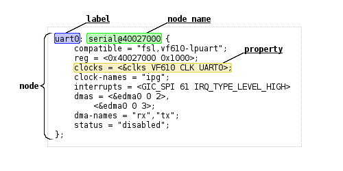

# Device Driver 

In this tutorial, we will develop a device driver for the Linux kernel. This device will abstract the control of the LED and the access to the SW key on the development kit.

## Kernel

Linux is a [monolithic kernel](https://en.wikipedia.org/wiki/Monolithic_kernel), where all code related to the operating system occurs in kernel space. 

{width=500}

The Linux kernel is responsible, among other things, for:

- Managing processes and tasks
- Scheduling
- Virtualization, controlling groups/users
- Memory management/pagination
- Inter-process communication
- Input/output
- File management
- Device drivers
- Hardware abstraction

{width=500}

> Map of the internal architecture of the Linux kernel

!!! info "Microkernel"
    The microkernel is an alternative to the monolithic kernel. In this architecture, the kernel implements the bare minimum.
    {width=300}
    
!!! info "GNU"
    The Linux kernel uses various software created and made available by the [GNU](https://www.gnu.org) community (such as gcc, gdb, make, and [many others](https://www.gnu.org/software/software.html), so it is often known as GNU/Linux.
    
    {width=100}

## Userspace vs Kernel Space

> Most of this section was translated from https://www.ctrlinux.com/blog/?p=40

Userspace is a region of virtual memory where all user programs are executed. The programs that are part of userspace run in a CPU operating mode called *unprivileged*, where not all instructions and registers are available.

ARM supports a total of 7 execution modes, with only user mode being unprivileged:

1. User mode – All user level applications run in this mode.
2. FIQ Fast Interrupt Mode – Used to handle interrupts classified as “fast”, get in and get out type of interrupts.
3. IRQ Mode – Used to handle device interrupts and non FIQ interrupts.
4. Supervisor mode (default CPU boot mode). Used by the OS and software interrupts (SWIs).
5. Abort – Used to handle violations caused by erroneous memory accesses
6. Undefined – Used to handle undefined instructions
7. System – A privileged mode with the same register set as user mode, used to run exception handlers.

> Material taken from: https://www.ctrlinux.com/blog/?p=40

### Userspace

To better understand userspace, let's imagine what happens when a program tries to access a region of memory that belongs to the kernel (privileged mode).

When we create a pointer and access memory, this command is translated into a LOAD type instruction in assembly. The LOAD instruction enters the CPU pipeline and at the execution stage, the CPU passes the instruction address to the hardware responsible for managing memory: Memory Management Unit (MMU). The MMU translates the virtual memory address to the physical address (memory page), at this point the MMU checks the current execution mode of the CPU and if the memory region can be accessed by the current mode. In our case, the CPU will change the processor mode to *Abort* and handle the unauthorized memory address access, causing the program to terminate with a `seg fault`. 

Programs in userspace communicate with the kernel via system calls[^1], these calls turn into software interruptions that will be processed by the kernel.

[^1]: http://www.linux.it/~rubini/docs/ksys/

### Kernel Space

The advantages of working with kernel space are: being able to directly manipulate hardware peripherals, being able to handle hardware interruptions. With great powers comes great responsibilities, errors in this mode can cause kernel panic and freeze the entire system.

## Kernel Module / Device driver

A kernel module is a compiled code that can be linked with the kernel at runtime (like changing the wing of a moving airplane), a module can be a device driver, but not necessarily.

### Device driver

Device drivers are responsible for implementing the low-level part of hardware configuration, communication, and management (peripherals, memory, CPU). In the Linux kernel repository, drivers are located in: `linux/drivers/` and are organized by category:

```
accessibility  dca         ide         mfd              pnp         spmi
acpi           devfreq     idle        misc             power       ssb
amba           dio         iio         mmc              powercap    staging
android        dma         infiniband  modules.builtin  pps         target
ata            dma-buf     input       mtd              ps3         tc
atm            edac        iommu       net              ptp         thermal
auxdisplay     eisa        ipack       nfc              pwm         thunderbolt
base           extcon      irqchip     ntb              rapidio     tty
bcma           firewire    isdn        nubus            ras         uio
block          firmware    Kconfig     nvdimm           regulator   usb
bluetooth      fmc         leds        nvme             remoteproc  uwb
built-in.a     fpga        lguest      nvmem            reset       vfio
built-in.o     gpio        lightnvm    of               rpmsg       vhost
bus            gpu         macintosh   oprofile         rtc         video
cdrom          hid         mailbox     parisc           s390        virt
char           hsi         Makefile    parport          sbus        virtio
clk            hv          mcb         pci              scsi        vlynq
clocksource    hwmon       md          pcmcia           sfi         vme
connector      hwspinlock  media       perf             sh          w1
cpufreq        hwtracing   memory      phy              sn          watchdog
cpuidle        i2c         memstick    pinctrl          soc         xen
crypto         i3c         message     platform         spi         zorro
```

In Linux, drivers can be developed/classified into basically [three types](https://tldp.org/LDP/tlk/dd/drivers.html): `char module`, `block module`, `network module`.

- **character device**: It is used in the case that the driver can be accessed with a stream of bytes (like a file). It must implement at least the following system calls: `open/close/read/write`. The `/dev/console` and `/dev/tty` are examples of this type of device. A difference between a file and a `char dev` is that in the file you can move the pointer forward and backward, but in this type of device you can't, you can only move forward.

- **block device**: Used to implement physical disk access, this type of driver operates with blocks of bytes (usually 512 bytes).

- **network device**: Used to implement a network interface (like `loopback/ wlan0/ ...`). This interface is capable of receiving and sending data packets, controlled by the kernel's network system.

## Device Tree (dts)

How does the Linux kernel know what devices and drivers are associated with them? A configuration file called the device tree is passed by the boot to the Linux kernel indicating the peripherals, and what drivers are associated with them.

## U-boot

The programming of the FPGA is carried out by u-boot, before the initialization of the Linux Kernel. In our case, the u-boot has been pre-configured to read the file `soc_system.rbf`. FPGA hardawre programming is performed by U-boot, before Linux Kernel initialization. In our case, U-boot was preconfigured to read the `soc_system.rbf` file located in the SDCARD partition along with the kernel (`zImage`).

!!! video
  

Before initializing the Linux kernel, U-boot fetches this file from the SDCARD partition, extracts it, and ["magically"](https://github.com/u-boot/u-boot/blob/94905e1db8d8d42c4f39f14dbee2f9788390db5e/drivers/fpga/socfpga.c) programs the FPGA. In this same partition, we have two more files: `u-boot.scr` and `socfpga.dtb`. The first one is a boot initialization script that U-boot reads to know which steps it should execute (whether it needs to load the fpga, where the kernel is, etc., these are the initialization steps). The `socfpga.dtb` is the **Linux device tree**, the dtb is a binary, which was created from another file, the `.dts`, and it contains information about the hardware that is passed to the kernel at startup.

!!! video
  

### `dtb` (compiled dts)

The `dtb` is used as a tool to indicate to the kernel what the available hardware configurations are. You do not need to recompile the kernel if the memory address of some peripheral changes, just inform it in the `dts`. This tool is very important for embedded systems, in which, each hardware has its specificity.

The `dtb` is generated from a text file in `dts` format, which is then generated by the hardware information extracted from the **Platform Designer** and saved in the `.sopcinfo` file. This is the same file used by Eclipse-NIOS to generate the BSP in the previous tutorials. The Linux BSP is called `dts` and has a standard format that must be followed!

### Understanding the DTS



- ref: https://developer.toradex.com/device-tree-customization

The start of our `.dts` has the definition of the CPUs that are available on the CHIP:

```dts
cpus {
  #address-cells = <1>;
  #size-cells = <0>;
  enable-method = "altr,socfpga-smp";	/* appended from boardinfo */

  hps_0_arm_a9_0: cpu@0x0 {
    device_type = "cpu";
    compatible = "arm,cortex-a9-16.1", "arm,cortex-a9";
    reg = <0x00000000>;
    next-level-cache = <&hps_0_L2>;	/* appended from boardinfo */
  }; //end cpu@0x0 (hps_0_arm_a9_0)

  hps_0_arm_a9_1: cpu@0x1 {
    device_type = "cpu";
    compatible = "arm,cortex-a9-16.1", "arm,cortex-a9";
    reg = <0x00000001>;
    next-level-cache = <&hps_0_L2>;	/* appended from boardinfo */
  }; //end cpu@0x1 (hps_0_arm_a9_1)
}; //end cpus
```

Let's look at `hps_0_uart0` from our `dts` in more detail:

``` dts
  hps_0_uart0: serial@0xffc02000 {
    compatible = "snps,dw-apb-uart-16.1", "snps,dw-apb-uart";
    reg = <0xffc02000 0x00000100>;
    interrupt-parent = <&hps_0_arm_gic_0>;
    interrupts = <0 162 4>;
    clocks = <&l4_sp_clk>;
    reg-io-width = <4>;	/* embeddedsw.dts.params.reg-io-width type NUMBER */
    reg-shift = <2>;	/* embeddedsw.dts.params.reg-shift type NUMBER */
    status = "okay";	/* embeddedsw.dts.params.status type STRING */
  }; //end serial@0xffc02000 (hps_0_uart0)
}; //end serial@0x100020000 (jtag_uart)
```

It indicates that in our hardware, we have a serial component at address `0xffc02000` that is compatible with the drivers: `snps,dw-apb-uart-16.1` and/or `snps,dw-apb-uart`, which is implemented in the 8250 driver in the Linux kernel: https://github.com/torvalds/linux/blob/master/drivers/tty/serial/8250/8250_dw.c.
And this driver is configured as active in our kernel:

{width=600}

And it is because of this that we can access the kit with USB (screen).

```
CONFIG_SERIAL_8250_CONSOLE:                                                 │  
│                                                                             │  
│ If you say Y here, it will be possible to use a serial port as the          │  
│ system console (the system console is the device which receives all         │  
│ kernel messages and warnings and which allows logins in single user         │  
│ mode). This could be useful if some terminal or printer is connected        │  
│ to that serial port.                                                        │  
│                                                                             │  
│ Even if you say Y here, the currently visible virtual console               │  
│ (/dev/tty0) will still be used as the system console by default, but        │  
│ you can alter that using a kernel command line option such as               │  
│ "console=ttyS1". (Try "man bootparam" or see the documentation of           │  
│ your boot loader (grub or lilo or loadlin) about how to pass options        │  
│ to the kernel at boot time.)                                                │  
│                                                                             │  
│ If you don't have a VGA card installed and you say Y here, the              │  
│ kernel will automatically use the first serial line, /dev/ttyS0, as         │  
│ system console.                                                             │  
│                                                                             │  
│ You can set that using a kernel command line option such as                 │  
│ "console=uart8250,io,0x3f8,9600n8"                                          │  
│ "console=uart8250,mmio,0xff5e0000,115200n8".                                │  
│ and it will switch to normal serial console when the corresponding          │  
│ port is ready.                                                              │  
│ "earlycon=uart8250,io,0x3f8,9600n8"                                         │  
│ "earlycon=uart8250,mmio,0xff5e0000,115200n8".                               │  
│ it will not only setup early console.                                       │  
│                                                                             │  
│ If unsure, say N.                                                           │  
│                                                                             │  
│ Symbol: SERIAL_8250_CONSOLE [=y]                                            │  
│ Type  : boolean                                                             │  
│ Prompt: Console on 8250/16550 and compatible serial port              
│   Location:                                                                 │  
│     -> Device Drivers                                                       │  
│       -> Character devices                                                  │  
│         -> Serial drivers                                                   │  
│           -> 8250/16550 and compatible serial support (SERIAL_8250 [=y])    │  
│   Defined at drivers/tty/serial/8250/Kconfig:60                             │  
│   Depends on: TTY [=y] && HAS_IOMEM [=y] && SERIAL_8250 [=y]=y              │  
│   Selects: SERIAL_CORE_CONSOLE [=y] && SERIAL_EARLYCON [=y]                 │  
│                                                                        
``` 

For more information about the `dts`: 

- https://elinux.org/Device_Tree_Usage
- https://elinux.org/Device_Tree_Reference
- https://developer.toradex.com/device-tree-customization#Device_Tree_Anatomy
- https://bootlin.com/pub/conferences/2014/elc/petazzoni-device-tree-dummies/petazzoni-device-tree-dummies.pdf
