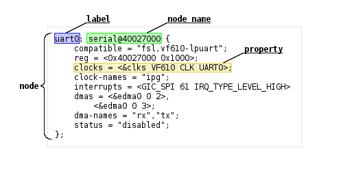

# Tutorial - HPS + FPGA - Blink LED

Nesse tutorial vamos ver como interfacear o ARM com a FPGA (fabric). Nesse
tutorial,  optei por deixar vocês seguirem o tutorial oficial da Terasic:
`Examples for using both HPS SoC and FGPA` [capítulo 7], que se encontra 
no manual do usuário, no CD do kit.

!!! note 
    Retomar a essa página quando acabar o tutorial da Terasic, ele não cobre tudo.

- https://github.com/Insper/DE10-Standard-v.1.3.0-SystemCD/tree/master/Manual

!!! example "Execute"
    Copie o binário compilado no tutorial `HPS_FPGA_LED` para o SDCard

## Entendendo o HW

Muito importante você parar e refletir o que aconteceu, para isso segue algumas
perguntas:

1. Quais são as interfaces ente o ARM e a FPGA? (são 4 no total)
1. Qual a diferença entre elas?
1. Como o HPS aparece no Platform Designer (PD)?
    - Você abriu as configurações do HPS no PD? O que pode ser configurado?
1. Como essa interface é utilizada no Platform Designer?
1. Porque no projeto ele utilizou um `clock bridge?`

## Parte 2

Esse tutorial não é completo, ele pula uma coisa muito importante:

1. Como programar a FPGA automaticamente para quando o Linux inicializar, 
o hardware já estar programando  para poder executar o programa `HPS_FPGA_LED`.

2. Como o Kernel do linux sabe em qual hardware ele está sendo executado?
   (Possui vídeo? Ethernet? ...)

A programação da FPGA é realizada pelo u-boot, antes da inicialização do
Kernel do Linux.  No nosso caso, o u-boot foi pré configurado para ler o arquivo
`soc_system.rbf` que está na partição do SDCARD junto com o kernel (`zImage`).

!!! note  "Explicação do processo de boot - até 1:50 minutos"
    <iframe width="560" height="315" src="https://www.youtube.com/embed/vS7pvefsbRM" frameborder="0" allow="accelerometer; autoplay; encrypted-media; gyroscope; picture-in-picture" allowfullscreen></iframe>

O u-boot antes de inicializar o kernel do Linux, busca esse arquivo na partição do SDCARD, o extraí e programa ["magicamente"](https://github.com/u-boot/u-boot/blob/94905e1db8d8d42c4f39f14dbee2f9788390db5e/drivers/fpga/socfpga.c) a FPGA. Nessa mesma partição temos mais dois arquivos: `u-boot.scr` e `socfpga.dtb`. O primeiro é um script de inicialização do boot na qual o u-boot lê para saber quais passos ele deve executar (se precisa carregar a fpga, onde está o kernel, ..., são os passos de inicialização), já o `socfpga.dtb` é o **device tree do Linux**, o dtb é um binário, que foi criado a partir de outro arquivo, o `.dts`, e ele contém informações sobre o hardware que é passado para o kernel no momento de inicialização.

!!! note "Device Tree for Dummies! - Thomas Petazzoni, Free Electrons"
    <iframe width="560" height="315" src="https://www.youtube.com/embed/m_NyYEBxfn8" frameborder="0" allow="accelerometer; autoplay; encrypted-media; gyroscope; picture-in-picture" allowfullscreen></iframe>

## Gerando o `.rbf` (imagem da FPGA)

O `rbf` é o arquivo `.sof` gerado pelo Quartus na compilação só que comprimido e
com algumas modificações.  Para gerar o arquivo `.rbf`  a partir do `.sof`
basta executarmos na pasta `output_files`:

!!! note
    Você deve executar esse comando na pasta `output_files` do seu projeto Quartus!

```bash
$ cd output_files
$ quartus_cpf -c DE10_Standard_FB.sof -o bitstream_compression=on soc_system.rbf
```

!!! note
    note que o arquivo gerado pelo Quartus chama `DE10_Standard_FB.sof`,
    você deve editar para o seu caso.

Com o arquivo `soc_system.rbf` criado, é só copiarmos ele para o SDCARD,
substituindo o anterior.

!!! example "Execute"
    - Gere o `soc_system.rbf` do projeto (COMPILAR O QUARTUS!)
    - Grave o novo `rbf` no SDCard (mesma partição do kernel)
    
## `dtb` (informações de hardware para o Kernel)

O `dtb` é utilizado como ferramenta para indicar ao kernel quais são as
configurações de hardware disponíveis, você não precisa recompilar o kernel caso
o endereço de memória de algum periférico mudar, basta informar no `dts`. Essa
ferramenta é muito importante para sistemas embarcados, na qual, cada hardware
possui sua especificidade.

O `dtb` é gerado a partir de arquivo texto no formato `dts` que é então gerado
pelas informações  de hardware extraída do **Platform Designer** que são salvas
no arquivo: `.sopcinfo`, o mesmo arquivo que é utilizado pelo Eclipse-NIOS para
gerar o BSP nos tutoriais passados. O BSP no Linux é chamado de `dts`  e
possui um formato padrão que deve ser seguido!

Será necessário seguir os passos a seguir:

1. Gere o `.sopcinfo` (platform designer) (**já está pronto, não precisa mexer**)
2. Gere o `dts`
3. Compile o `dts` para `dtb`

### Gerando o `dts` 

!!! note ""
    Eu consegui esse comando via trocado com engenheiros da Terasic, os exemplos
    que encontrava nos tutorias da internet não funcionavam.

!!! note
    Para funcionar é necessário realizar o comando via o shell do embedded

Execute os seguintes comandos:

```bash
$ # Devemos executar os comandos dentro do shell do embedded (quartus)
$ embedded_command_shell.sh
$ sopc2dts --input soc_system.sopcinfo --output soc_system.dts --type dts --board soc_system_board_info.xml --board hps_common_board_info.xml --bridge-removal all --clocks
```

!!! note
    Você deve executar esse comando na pasta raiz do seu projeto Quartus!

Agora com o `.dts` gerado, vamos dar uma olhada em seu conteúdo e como o
interpretar. O `dts` possui a anatomia a seguir: 



- ref: https://developer.toradex.com/device-tree-customization

O começo do nosso `.dts` tem a definição das CPUs que estão
disponíveis no CHIP:

```dts
	cpus {
		#address-cells = <1>;
		#size-cells = <0>;
		enable-method = "altr,socfpga-smp";	/* appended from boardinfo */

		hps_0_arm_a9_0: cpu@0x0 {
			device_type = "cpu";
			compatible = "arm,cortex-a9-16.1", "arm,cortex-a9";
			reg = <0x00000000>;
			next-level-cache = <&hps_0_L2>;	/* appended from boardinfo */
		}; //end cpu@0x0 (hps_0_arm_a9_0)

		hps_0_arm_a9_1: cpu@0x1 {
			device_type = "cpu";
			compatible = "arm,cortex-a9-16.1", "arm,cortex-a9";
			reg = <0x00000001>;
			next-level-cache = <&hps_0_L2>;	/* appended from boardinfo */
		}; //end cpu@0x1 (hps_0_arm_a9_1)
	}; //end cpus
```

Vamos ver em mais detalhes o `hps_0_uart0` do nosso `dts`:

``` dts
		hps_0_uart0: serial@0xffc02000 {
			compatible = "snps,dw-apb-uart-16.1", "snps,dw-apb-uart";
			reg = <0xffc02000 0x00000100>;
			interrupt-parent = <&hps_0_arm_gic_0>;
			interrupts = <0 162 4>;
			clocks = <&l4_sp_clk>;
			reg-io-width = <4>;	/* embeddedsw.dts.params.reg-io-width type NUMBER */
			reg-shift = <2>;	/* embeddedsw.dts.params.reg-shift type NUMBER */
			status = "okay";	/* embeddedsw.dts.params.status type STRING */
		}; //end serial@0xffc02000 (hps_0_uart0)
}; //end serial@0x100020000 (jtag_uart)
```

Ele indica que no nosso hardware, temos um componente serial no endereço
`0xffc02000` que é compatível com os drivers: `snps,dw-apb-uart-16.1` e.ou
`snps,dw-apb-uart`, que é implementado no Driver: 8250 no kernel do Linux:
https://github.com/torvalds/linux/blob/master/drivers/tty/serial/8250/8250_dw.c.
E esse driver está configurado como ativo no nosso kernel:


E é por conta disso que conseguimos acessar o kit com USB (screen).

??? note "Parâmetro CONFIG_SERIAL_8250_CONSOLE"
    ```
     CONFIG_SERIAL_8250_CONSOLE:                                                 │  
      │                                                                             │  
      │ If you say Y here, it will be possible to use a serial port as the          │  
      │ system console (the system console is the device which receives all         │  
      │ kernel messages and warnings and which allows logins in single user         │  
      │ mode). This could be useful if some terminal or printer is connected        │  
      │ to that serial port.                                                        │  
      │                                                                             │  
      │ Even if you say Y here, the currently visible virtual console               │  
      │ (/dev/tty0) will still be used as the system console by default, but        │  
      │ you can alter that using a kernel command line option such as               │  
      │ "console=ttyS1". (Try "man bootparam" or see the documentation of           │  
      │ your boot loader (grub or lilo or loadlin) about how to pass options        │  
      │ to the kernel at boot time.)                                                │  
      │                                                                             │  
      │ If you don't have a VGA card installed and you say Y here, the              │  
      │ kernel will automatically use the first serial line, /dev/ttyS0, as         │  
      │ system console.                                                             │  
      │                                                                             │  
      │ You can set that using a kernel command line option such as                 │  
      │ "console=uart8250,io,0x3f8,9600n8"                                          │  
      │ "console=uart8250,mmio,0xff5e0000,115200n8".                                │  
      │ and it will switch to normal serial console when the corresponding          │  
      │ port is ready.                                                              │  
      │ "earlycon=uart8250,io,0x3f8,9600n8"                                         │  
      │ "earlycon=uart8250,mmio,0xff5e0000,115200n8".                               │  
      │ it will not only setup early console.                                       │  
      │                                                                             │  
      │ If unsure, say N.                                                           │  
      │                                                                             │  
      │ Symbol: SERIAL_8250_CONSOLE [=y]                                            │  
      │ Type  : boolean                                                             │  
      │ Prompt: Console on 8250/16550 and compatible serial port              
      │   Location:                                                                 │  
      │     -> Device Drivers                                                       │  
      │       -> Character devices                                                  │  
      │         -> Serial drivers                                                   │  
      │           -> 8250/16550 and compatible serial support (SERIAL_8250 [=y])    │  
      │   Defined at drivers/tty/serial/8250/Kconfig:60                             │  
      │   Depends on: TTY [=y] && HAS_IOMEM [=y] && SERIAL_8250 [=y]=y              │  
      │   Selects: SERIAL_CORE_CONSOLE [=y] && SERIAL_EARLYCON [=y]                 │  
      │                                                                        
    ```

!!! note "Para mais informações sobre o `dts`:"
      - https://elinux.org/Device_Tree_Usage
      - https://elinux.org/Device_Tree_Reference
      - https://developer.toradex.com/device-tree-customization#Device_Tree_Anatomy
      - https://bootlin.com/pub/conferences/2014/elc/petazzoni-device-tree-dummies/petazzoni-device-tree-dummies.pdf
    
### Gerando o `dtb`
 
Execute os seguintes comandos (ainda dentro do embedded shell)

```bash
$ dtc -I dts -O dtb -o soc_system.dtb soc_system.dts
$ #Agora você pode sair do embedded shell:
$ exit
```

!!! example "Execute"
    - Gere o `soc_system.dtb` do projeto 
    - Grave o novo `soc_system.dtb` no SDCard (mesma partição do kernel)
    
## Testando

Agora plugue o SDcard no kit de desenvolvimento, e após inicialização do kernel
execute o programa `blink led` e veja os LEDs da FPGA piscarem!

Interessante né? Agora vamos fazer algo mais útil com isso..

