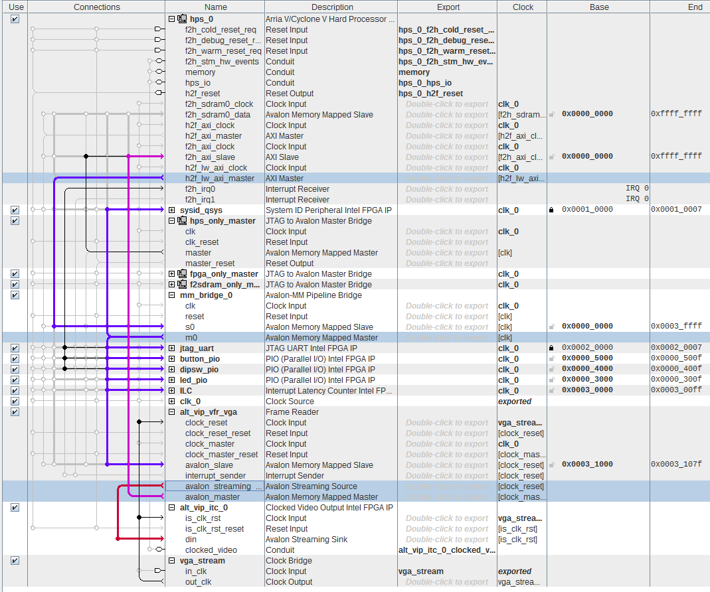

# VGA

If you take a look at our hardware, you will notice that it has a VGA video output. However, the VGA signals were connected to the FPGA pins! This means we need to create hardware and connect it to the HPS in order to enable video output in our Linux system.


To achieve video output in our embedded system, we need to follow these steps:

1. Configure FPGA to handle VGA, using an the [alt_vip_vga](https://www.intel.com.br/content/www/br/pt/programmable/products/intellectual-property/ip/dsp/m-alt-vipsuite.html) IP core to generate the VGA signals. 
2. Add a device driver to the kernel to manage this hardware.
3. Configure the kernel to add the framebuffer (FB) driver.
4. Configure a program in Buildroot that can manipulate the FB and display an image.

## Frame Buffer

Before we work with the hardware, let's take a look at how Linux handles video output. Have you heard of a [frame buffer](https://en.wikipedia.org/wiki/Framebuffer) (FB)? Check that your PC has one (Linux/Mac):

```bash
$ ls /dev | grep fb
```

The FB is a reserved region of the RAM that contains a bitmap (if you have a graphics card, this memory may be located in it). This bitmap is converted (either by hardware or software) into the corresponding video output. The bitmap-to-video conversion depends on the video driver that was loaded to manage (and create) the FB. For Intel graphics cards, the [vesa driver](https://www.kernel.org/doc/html/latest/fb/vesafb.html) is commonly used.

However, not everything that is displayed goes directly through the FB. Some programs may require higher performance and access the display directly using [Direct Graphics Access](https://en.wikipedia.org/wiki/Direct_Graphics_Access), as shown in the following diagram:


 
!!! note "Framebuffer Console"
   Linux has a driver called `fbcon` that displays a console on a framebuffer. To use it, you just need to activate it in the kernel configuration:

   - Device Drivers -> Graphics Support -> Frame buffer Devices -> Console display driver support -> Framebuffer Console Support

   - For more details, refer to the [Framebuffer Console documentation](https://www.kernel.org/doc/html/latest/fb/fbcon.html).
 
## Hardware

In order to save time, we will use a hardware design provided by Terasic that already has the FPGA part configured to work with VGA. Copy the folder [DE10-Standard-v.1.3.0-SystemCD/Demonstration/SoC_FPGA/DE10_Standard_FB/](https://github.com/Insper/DE10-Standard-v.1.3.0-SystemCD/tree/master/Demonstration/SoC_FPGA/DE10_Standard_FB) to your repository.

Once you have copied the `DE10_Standard_FB` project, open it in Quartus and analyze the `soc_system.qsys` file in Platform Designer. You should see something like this:

!!! note ""
    I'm only showing the parts related to video!



### Understanding the Hardware

The hardware design includes two components to handle VGA: `alt_vip_vfr_vga` and `alt_vip_itc_0`. These components are part of the 'Video and Image Processing Suite Intel FPGA' IP package, which is specifically designed for video processing (supporting up to 8K and +60Hz).

!!! info "From intel website" 
    
    The Intel® FPGA Video and Image Processing Suite is a collection of Intel FPGA IP functions that you can use to facilitate the development of custom video and image processing (VIP) designs. These Intel FPGA IP functions are suitable for use in a wide variety of image processing and display applications, such as video surveillance, broadcast, video conferencing, and medical and military imaging.

    The Video and Image Processing Suite features cores that range from simple building block functions, such as color space conversion to sophisticated video scaling functions that can implement programmable polyphase scaling. 

    - All the VIP cores use an open, low-overhead Avalon® Streaming (Avalon-ST) interface standard so that they can be easily connected
    - You can use VIP cores to quickly build a custom video processing signal chain using the Intel Quartus® Prime Lite or Standard Edition software and the associated Platform Designer
    - You can mix and match VIP cores with your own proprietary intellectual property (IP)
    - You can use the Platform Designer to automatically integrate embedded processors and peripherals and generate arbitration logic
    - Capable of supporting 8K video at 60fps and above

    - https://www.intel.com.br/content/www/br/pt/programmable/products/intellectual-property/ip/dsp/m-alt-vipsuite.html

    

### alt_vip_vfr_vga

The `alt_vip_vfr_vga` is a peripheral of the **Frame Reader** type and is responsible for reading a Frame Buffer allocated in memory (`avalon_master`) and converting it into a **Streaming** format (`avalon_streaming`).

Most VIP IP cores operate on the `avalon_streaming` data bus, so it is necessary to read the Frame Buffer (which is allocated in the DDR3 memory connected to the ARM). The data from DDR3 is transferred to the `alt_vip_vfr_vga` via DMA by the ARM/Linux, which is initialized by the device driver loaded in Linux.

#### alt_vip_itc

The `alt_vip_itc` is a video peripheral that converts the pixel streaming into the desired video output format (in this case, VGA). VGA is a DIGITAL video output format that consists of 5 signals: HSYNC, VSYNC, R, G, and B.

- HSYNC: Indicates the end of a line.
- VSYNC: Indicates the end of the screen.
- R/G/B: Represent the pixel values.

!!! note
    The VGA signal is relatively simple, and you can even generate it using an Arduino. Here's an example: [Generating Color VGA Signal with Arduino](http://labdegaragem.com/profiles/blogs/gerando-sinal-vga-colorido-com-arduino-completo)

### Compilation

Now that we have analyzed the hardware, we can compile it and use it in our SoC!

!!! exercise
    1. Generate the `soc_system.dtb` file for your project.
        - Write the new `soc_system.dtb` file to the SD Card (in the same partition as the kernel).
    1. Generate the `soc_system.rbf` file for your project (COMPILE THE QUARTUS PROJECT!).
        - Write the new `rbf` file to the SD Card (in the same partition as the kernel).

## Driver

We need to load a device driver into the Linux kernel in order to use the newly created video output. However, the driver for the `alt_vip_vfr_vga` IP is not included in the official kernel. Therefore, we will need to add it manually!

### Device Tree (dts)

But how does Linux know that there is a video output? In our case, it is through the *device tree* (.dtb) that is passed by u-boot during kernel initialization. If we look at the new `.dts` file generated with the hardware that includes the video output, we can see a new component called `alt_vip_vfr_vga`, which is compatible with the `vip-frame-reader-9.1` driver:

```dts
alt_vip_vfr_vga: vip@0x100031000 {
	compatible = "ALTR,vip-frame-reader-14.0", "ALTR,vip-frame-reader-9.1";
	reg = <0x00000001 0x00031000 0x00000080>;
	clocks = <&clk_0>;
	max-width = <1024>;	/* MAX_IMAGE_WIDTH type NUMBER */
	max-height = <768>;	/* MAX_IMAGE_HEIGHT type NUMBER */
	bits-per-color = <8>;	/* BITS_PER_PIXEL_PER_COLOR_PLANE type NUMBER */
	colors-per-beat = <4>;	/* NUMBER_OF_CHANNELS_IN_PARALLEL type NUMBER */
	beats-per-pixel = <1>;	/* NUMBER_OF_CHANNELS_IN_SEQUENCE type NUMBER */
	mem-word-width = <128>; /* MEM_PORT_WIDTH type NUMBER */
}; //end vip@0x100031000 (alt_vip_vfr_vga)
```

### Kernel

!!! info
    In this step, we will add a video driver to our Linux kernel. The driver will not be loaded as a dynamic module but will be inserted into the Linux kernel during compilation. To do this, you will need to:
    
    1. Add a driver to the Linux source code.
    2. Inform the kernel about the existence of this driver and activate it.
    3. Recompile the kernel.

The `vip-frame-reader-9.1` driver is not officially part of the Linux kernel, so we will need to use an implementation provided by Altera. The drivers in the Linux repository are located in the `linux/drivers` folder. For video/framebuffer drivers, they are in `linux/drivers/video/fbdev`.

!!! exercise "Adding the altvipfb driver"
    Follow the instructions in this guide: [Adding the altvipfb driver](https://github.com/Insper/Embarcados-Avancados/blob/master/driver/altvipfb/README.md), and then come back to this page!

!!! note
    This tutorial includes adding the framebuffer driver to the kernel. Another option would be to create a module that could be loaded as needed.

!!! exercise
    1. Compile the kernel.
    2. Copy the new `zImage` to the SD Card.
    3. Connect a VGA monitor.
    4. Boot up the embedded Linux.

If everything goes well, you should see two penguins in the top left corner of the monitor. Each penguin represents a system core. Since our ARM is a dual-core, we have two penguins. These penguins appear because we enabled this option in the kernel:

```
CONFIG_LOGO=y
CONFIG_LOGO_LINUX_MONO=y
CONFIG_LOGO_LINUX_VGA16=y
CONFIG_LOGO_LINUX_CLUT224=y
```

### Testing

Now, connect a monitor to our board and power on the system. The kernel log should appear on the monitor. Note that during the boot process, you will see two penguins. The number of penguins indicates the number of cores in the system.

!!! note
    It's possible to edit the penguin image and, for example, use your own faces! The `ppm` files are located in the `/drivers/video/logo/` folder and are compiled into the kernel during the kernel compilation process.
    
    You can use GIMP to generate this images!

Want to do something cool with the framebuffer? Try the following:

- Display a random image on the framebuffer:

```bash
sudo cat /dev/urandom > /dev/fb0
```

> Ref: [Writing to the Framebuffer](http://seenaburns.com/2018/04/04/writing-to-the-framebuffer/)

Now let's do something more useful with our video output. To do that, we need to modify Buildroot and include graphical programs.

## Buildroot

There are various solutions for developing graphical interfaces for embedded Linux, and not all of them involve a window manager. Here is a list of tools that can be used:

- GUI:
    - LittlevGL: https://littlevgl.com/
    - Qt: https://www.qt.io/
    - emWin (commercial): https://www.segger.com/products/user-interface/emwin/
    - ...

There are other solutions available, but we will use one of them to display an image on our screen. When I was working on this guide, I wanted something simpler. During a (not very quick) search on the internet (using the keyword "linux frame buffer show image"), I found this program: `fbv`, which luckily is included in Buildroot.

!!! note "fbv"
    ```
    1. OVERVIEW
        fbv (FrameBuffer Viewer) is a simple program to view
        pictures on a linux framebuffer device. In 2000,
        when fbv was created, there were no other suitable
        programs performing the same task, so the authors
        decided to follow the rule: 
        'If you need a tool - write it yourself!' :-)
    ```
    
    > https://github.com/smokku/fbv

!!! exercise "Step-by-step"
    To show a png image on the fb.

    1. Add the `fbv` program to Buildroot.
    2. Compile the new file system.
    3. Write it to the SD Card.
    4. Write an image (in .png format) to the SD Card.
    5. On the target system, display the image on the HDMI using `fbv`.
