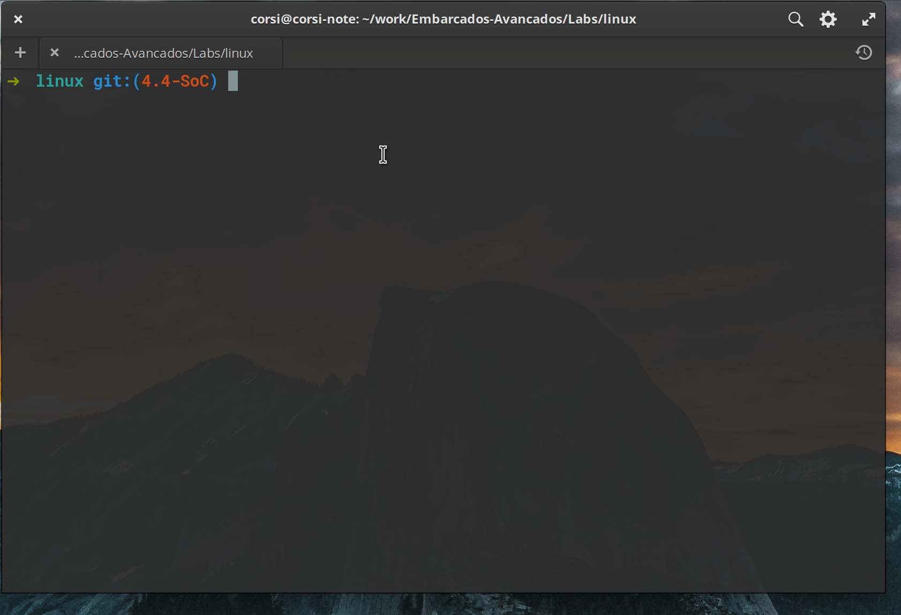

# Compiling the Kernel

In this tutorial, we will compile the Linux kernel for our SoC's ARM using the toolchain we already have configured.

=== "Linus"
    <iframe width="560" height="315" src="https://www.youtube.com/embed/SOXeXauRAm0" frameborder="0" allow="accelerometer; autoplay; encrypted-media; gyroscope; picture-in-picture" allowfullscreen></iframe>
=== "Hans"
    <iframe width="560" height="315" src="https://www.youtube.com/embed/FEfSlk1EHNI" frameborder="0" allow="accelerometer; autoplay; encrypted-media; gyroscope; picture-in-picture" allowfullscreen></iframe>


## Kernel 4.4

Clone the Linux kernel:

``` bash
$ git clone https://github.com/torvalds/linux 
$ cd linux
```

> This might take a while, the kernel is a large project.

!!! tip
    The official repository of the Linus kernel is: https://git.kernel.org/pub/scm/linux/kernel/git/torvalds/linux.git however cloning from it is usually much slower than from GitHub (which is just a mirror of the official repository).

We will work with version `4.4` of the kernel which is a version with: `Long Time Support` (LTS), i.e., it will be maintained for much longer than other versions. Version 4.4 was released on January 10 and will be officially maintained until 2021, it is also a version called Super LTS, with extended support until 2036. Think that a developer of an embedded system, who is going to create a whole dedicated infrastructure, doesn't want to have to adjust and validate everything again just to have the newest version of the kernel. The idea of using a version with more support is to minimize efforts with new resources.

The kernel uses the `tag` system of git:

```bash
$ git tag
...
v2.6.11
v2.6.11-tree
v2.6.12
v2.6.12-rc2
v2.6.12-rc3
v2.6.12-rc4
v2.6.12-rc5
v2.6.12-rc6
v2.6.13-rc2
v2.6.14-rc2
v2.6.14-rc3
...
```

Note that odd revisions are for Kernel in development stage, and even numbers for production version, example:

- **Linux 2.4.x** - Production
- **Linux 2.5.x** - Development 
- **Linux 2.6.x** - Production
- ....

!!! exercise

    Let's createa branch of version v4.4, for this execute the following command:

    ``` bash
    $ git checkout -b 4.4-SoC v4.4
    ```

## Configuring the Kernel 

Once in the `4.4-SoC` branch we need to configure the kernel for our processor (ARM) and make the necessary configurations in the kernel. First, we will generate a standard configuration file `.config` for Altera ARM SoCs.

!!! exercise
    ``` bash
    $ export ARCH=arm        # indicates the architecture of the Kernel
    $ make socfpga_defconfig # generates the standard configuration file for SoC
    ```
 
    The kernel configuration is saved in the file: `.config` at the root of the repository. When we execute the command `make socfpga_defconfig`, it is initialized with some default settings. You can take a look at the folder: [linux/arch/arm/configs/socfpga_defconfig](https://github.com/torvalds/linux/blob/master/arch/arm/configs/socfpga_defconfig).

!!! exercise
    Now we will configure some specific parameters of the Kernel for our application:

    ``` bash
    $ make ARCH=arm menuconfig 
    ```

    You may need to install the **libncurses5-dev** package
    
    ```bash
    $ sudo apt install libncurses5-dev
    ```

This command will open the Linux Kernel configuration interface (there are other options: `make xconfig`; `make config`; `make gconfig`, ...). This interface allows us to select various Kernel configurations. Now we will follow the script proposed in the following tutorial, translated in a reduced way here. 

- https://rocketboards.org/foswiki/Documentation/EmbeddedLinuxBeginnerSGuide

### Configuring 

Now lets configure the kernel:

!!! note "Exclude/ Include" 
    To **Disable** use the letter `N` on the keyboard, to include the letter `Y`
 
!!! note "Doubts?" 
    Most parameters have an explanation, just press `?` to read about it.

 

### Automatically append version information to the version string

- Go to general Setup :arrow_right:
    - **Disable**: Automatically append version information to the version string
 
??? note "Automatically append version information to the version string" 
    - ref :  https://rocketboards.org/foswiki/Documentation/EmbeddedLinuxBeginnerSGuide#8
    
    Go into the “General Setup” menu. Uncheck “Automatically append version information to the version string”. This will prevent the kernel from adding extra “version” information to the kernel. Whenever we try to dynamically load a driver (also called kernel modules, as discussed in a later section) the kernel will check to see if the driver was built with the same version of the source code as itself. If it isn’t, it will reject to load that driver. For development, it’s useful to disable these options to make it easier to test out different versions of drivers. In a production system however, it’s recommend to keep this option enabled and only use drivers that were compiled with the correct version of the kernel.
    I encourage you to peruse the options in the General Setup menu and see what’s available to you (hitting “?” to view the help info for the highlighted option). Of particular importance to us is the “Embedded System” option (turns on advanced features) and the type of SLAB allocator used (determines how memory will be dynamically allocated in the kernel). If you want to use an initial ram disk or ram filesystem that would be enabled here as well (these will be explained in the next section).
    (text extracted from the reference)

-------------------------------------

#### Enable loadable module support

- Go back to the main menu (`<ESC>` `<ESC>`) :arrow_right:
    - Note that *Enable loadable module support* is enabled.
    
!!! note ""
    This allows the kernel to be modified (by loading drivers) after its execution. This will be useful when we develop our own device driver, without the need to recompile the kernel every time we want to test a modification in the code. This is the configuration that allows us to use USBs, SSDs, network cards via the possibility of dynamically loading drivers by the operating system.

-------------------------------------

#### Support for large (2TB+) block devices and files

- In the main menu :arrow_right: Enable the block layer :arrow_right:
    - **Enable**: `Support for large (2TB+) block devices and files

`

!!! note ""
    This option will allow the use of EXT4 type partitions. If you forget this option and the kernel is on an EXT4 partition, it will be mounted as READ-ONLY.

-------------------------------------

#### The Extended 4 (ext4) filesystem 

- Main menu :arrow_right: File systems :arrow_right: 
    - Note that it is already selected: `The Extended 4 (ext4) filesystem`
    
!!! note ""
    This option will enable the kernel to mount devices formatted in EXT4. We intend to use this on the SDCARD.

-------------------------------------

#### Altera SOCFPGA family

- Main menu :arrow_right: System Type :arrow_right:
    - Note that it is already selected: `Altera SOCFGPA family`
    
!!! note ""
    This indicates to the kernel which will be the device that it will be executed on, note that this option has a new menu where we can enable or not the suspension to RAM.

-------------------------------------

#### Symmetric Multi-Processing
    
- Main menu :arrow_right: Kernel Features :arrow_right:
    - Note that it is already selected: `Symmmetric Multi-Processing`
    
!!! note ""
    This option indicates to the kernel that it should use the two cores present in the ARM HPS of the FPGA. 

-------------------------------------

#### Device Drivers

- Main menu :arrow_right: Device Drivers :arrow_right: 
    - Analyze the available drivers...

!!! note ""
    Indicates which drivers will be compiled along with the kernel, note that we already have configured network drivers (Network device support); GPIO (GPIO Support); RTC; DMA; ... . Remember that we already initialized the `.config` with a default configuration for Altera SoCs.

### Saving

!!! exercise "Saving"
    Press ESC twice (`<ESC>`  `<ESC>`) and save the settings in the `.config` file

### .config

!!! note
    Take a look at the generated `.config` file! Sometimes it's easier to edit directly in it, than having to open the configuration menu and find the place to activate a module.
    
## Compiling

The makefile uses the `CROSS_COMPILE` variable to define the toolchain that will compile the kernel, let's define it as the Linaro GCC recently downloaded and than compile the Linux kernel.

!!! exercise 
    Define crosscompile:
    
    ```bash
    export CROSS_COMPILE=$GCC_Linaro/arm-linux-gnueabihf-
    ```
    
    Compile the kernel:

    ```bash
    make ARCH=arm LOCALVERSION= zImage -j 8
    ```

    > `-j 8` runs the compilation in  4 threads, you can adjust this value to suit your processor.

!!! note "Tip"
    Add the `export CROSS_COMPILE=....` to your `.bashrc` so you don't have to keep typing it every time you have to compile the kernel.

!!! warning
    If you get the error:
    
    `"/usr/bin/ld: scripts/dtc/dtc-parser.tab.o:(.bss+0x10): multiple definition of 'yylloc'; scripts/dtc/dtc-lexer.lex.o:(.bss+0x0): first defined here".` 
    
    It's because there is an incompatibility of the version we are compiling 4.5 with the GCC (from version 9 onwards). There are two solutions:
    
    1. Use gcc9: https://www.soughttech.com/front/article/17085/viewArticle
    2. Apply a patch to the linux kernel that removes the multiple declaration of the variable `yylloc`, in the root of the kernel:
    
    ``` bash
    $ wget https://github.com/Tomoms/android_kernel_oppo_msm8974/commit/11647f99b4de6bc460e106e876f72fc7af3e54a6.patch
    $ git am 11647f99b4de6bc460e106e876f72fc7af3e54a6.patch
    ```
    
!!! fail
    If a build error occurs, you should check the path of `CROSS_COMPILE` or if there is a dependency that has not been met.

This command causes the Linux kernel to be compiled into a compressed version that is self-extracting. Other options would be:

- Image: Kernel binary
- zImage: compressed version that has *self-extracting*
- uImage: a version that already has the uboot bootloader

1^: https://stackoverflow.com/questions/22322304/image-vs-zimage-vs-uimage 

!!! tip "Compiled Kernel"
    The zImage is saved in:

    - `arch/arm/boot/zImage`

!!! note "zImage"
    This file is the binary that contains the Linux kernel and will be executed on the embedded system.
 
## Testing 
  
Now we need to update the kernel that is on the SDCard so we can test if it is working.
 
!!! exercise "Updating the SDCARD"
    
    1. insert the sdcard into the pc
    1. mount partition 1
    1. replace the zImage that is on the SDCARD by the one generated inside the `arch/arm/boot/zImage` folder
    1. eject the sdcard or execute the `sync` command
    1. put the SDCARD in the board and turn on the FPGA

To check if everything is correct, just put the memory card in the kit and check the version of the running kernel:

```bash
$ uname -a
Linux buildroot 4.14.0 #1 SMP Mon Jul 16 21:22:58 -03 2018 armv7l GNU/Linux
```

## Mouse/ Keyboard?

Do mouse and keyboard work right away? Try plugging a USB mouse into the board, is it recognized by Linux? It shouldn't be. To work you should go back to the Linux kernel settings and insert the drivers that manage USB and HID. Compile, replace the zImage on the sdcard and test again.

!!! info "How to check if the mouse is working?"
    1. Type 'lsusb', it should show that it recognized a mouse
    1. After connecting the mouse, type `tail dmesg`, it should show that it recognized a new USB device and associated it with a mouse
    1. The mouse in linux is mounted on `/dev/input/mice`, to see if it is working you can execute: `cat /dev/input/mice`, move the mouse to see if anything appears on the screen

!!! tip "Human Interface Devices (HID)"
    HID is a type of device recognized by the Linux Kernel as a user interface device, this type of device is usually automatically recognized by the kernels, as they implement a communication standard.
    
    - https://www.kernel.org/doc/html/latest/hid/index.html
    
    USB also has a classification of HID type devices, which facilitates their use by the kernel:
    
    - https://en.wikipedia.org/wiki/USB_human_interface_device_class
