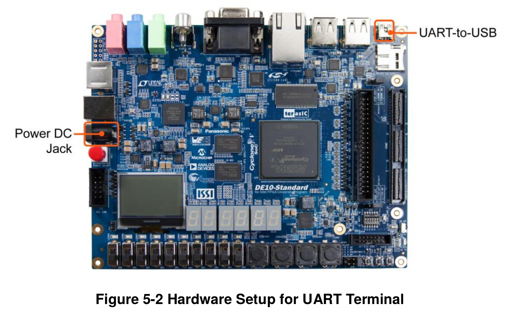

# Embedded Linux

!!! danger
    In this tutorial, we are working with disk writing; if you choose the wrong device, you might corrupt your files!!!

In this step, we will execute a sample Linux provided by Terasic. For this, we will need to program an SD card with the image. Let's perform the following steps for this:

1. Download and write the Terasic Image (`.iso`) to the SD card
2. Insert the SD card into the FPGA
3. Connect the USB to the UART port (near the Ethernet port)
4. Connect the power supply
5. Connect to the terminal via UART
6. Run commands

## Getting Started

To follow this tutorial, you will need:

- **Hardware:** DE10-Standard and SD card
- **Software:** Quartus 18.01
- **Git submission:** folder `Lab1_HPS_Infra`

## Standard Image (SD card)

We will use an already generated image (`.iso`) for the board's ARM, which already has the entire system necessary to run Linux on the HPS (including bootloader, kernel, and filesystem). This image was created with the [Linaro](https://www.linaro.org/) distribution.

!!! exercise "Download"
    Download the **Linux Console (Kernel 4.5)** image from the Terasic website:
   
    - [Linux BSP (Board Support Package): MicroSD Card Image](https://www.terasic.com.tw/cgi-bin/page/archive.pl?Language=English&CategoryNo=205&No=1081&PartNo=4)

Extract the `de10_standard_linux_console.img` file from the zipped file, this `.img` is a bit by bit copy of what should be saved to the SD card. Now we have to copy the `img` to the memory card.

!!! exercise "SDcard"
    Insert the memory card into the computer, if need use the provided adapter.

When we insert an external disk into Linux, it associates it with a 'device' in the `/dev/` directory. To know the name of the device assigned to the SD card, we can use the `dmesg` command, which displays the operating system log, and there we can see what the last detected hardware was and which device was assigned:

!!! warning ""
    Be careful, I'm assuming that no device was inserted after the SD card

```bash
$ dmesg | tail
[ 4789.207972] mmc0: new ultra high speed SDR50 SDHC card at address aaaa
[ 4789.211680] mmcblk0: mmc0:aaaa SL16G 14.8 GiB 
[ 4789.215857]  mmcblk0: p1 p2 p3
[ 4988.443942]  mmcblk0: p1 p2 p3
```

The `dmesg` log shows that my SDCARD was allocated to: `/dev/mmclk0`, your Linux may use a different name!

!!! warning 
    This may vary from PC to PC! 

Now let's transfer the `.iso` to the SD card (this is different from copying the file to the SD card!)

!!! danger
    Be careful, if you get the device wrong (in my case: `of=/dev/mmcblk0`) very bad things could happen to your data

!!! exercise "dd"
    Execute:

    ```bash
    $ sudo dd bs=4M if=de10_standard_linux_console.img of=DEVICE conv=fsync status=progress
    $ sync
    ```

!!! note "dd"
    The `dd` command executes a bit by bit copy from an **input file** (if) to an **output file** (of). 

The `sync` command is necessary so that the kernel can flush the cache, actually writing all the data that was addressed to it on the SD card. This step may take some time.

Now just mount the newly written SD card on your Linux, and we should see two visible partitions:

- 524 MiB: FAT32
    - Uboot configuration script; Compressed Kernel; Device Tree Blob file
    - u-boot.scr; zImage; socfpga.dtb
- 3.3 GiB:  
    - Filesystem (`/`)

And another partition that is not visible (contains the preloader and the uboot), to view:

```bash
$ sudo fdisk -l /dev/mmcblk0 
...
Device         Boot   Start     End Sectors  Size Id Type
/dev/mmcblk0p1         4096 1028095 1024000  500M  b W95 FAT32
/dev/mmcblk0p2      1028096 7376895 6348800    3G 83 Linux
/dev/mmcblk0p3         2048    4095    2048    1M a2 unknown
...
```

Note that partition 3 (`mmcblk0p3`) is of the *unknown* type (a2) and has 1M of space. This is where the **preloader** and the **uboot** are saved.

!!! exercise "Done"
    Now remove the SD card and insert it into the FPGA

## USB - UART

The **UART-to-USB** port is a connector that allows access to the HPS serial output via the serial port. On Linux, the driver is recognized automatically, while on Windows, you will need to manually install the serial driver.



Once connected on the Linux host, we verify that it was mapped to a device of the serial type (in my case, named **ttyUSB0**):

```
$ dmesg | tail 
....
[80473.426308] ftdi_sio 1-2:1.0: FTDI USB Serial Device converter detected
[80473.426333] usb 1-2: Detected FT232RL
[80473.426456] usb 1-2: FTDI USB Serial Device converter now attached to ttyUSB0
...
```

!!! warning 
    This can change from PC to PC! 

To connect to this port, we need to use a terminal emulator program. In this case, we will use **screen** (check if it's installed). Note that the following command should be modified for the device (`/dev/ttyxxx`) to which your Linux associated the UsSB-Serial port, extracted from dmesg.


!!! exercise "scree"
    Execute in terminal:
    
    ```bash
    $ screen /dev/ttyUSB0 115200,cs8
    ```

!!! tip
    - To exit the screen: <kbd>ctr</kbd>+<kbd>A</kbd> : quit
    - If you use an editor (emacs/ vscode/ ...), look for plugins that make serial connections (`serial-term`), so you don't need to use `screen`.

## Linux

Now we can log in to the Linux running on the device, for this use:

- user: `root`
- pass: 

Great! Now let's discover how to create programs for this Linux!
