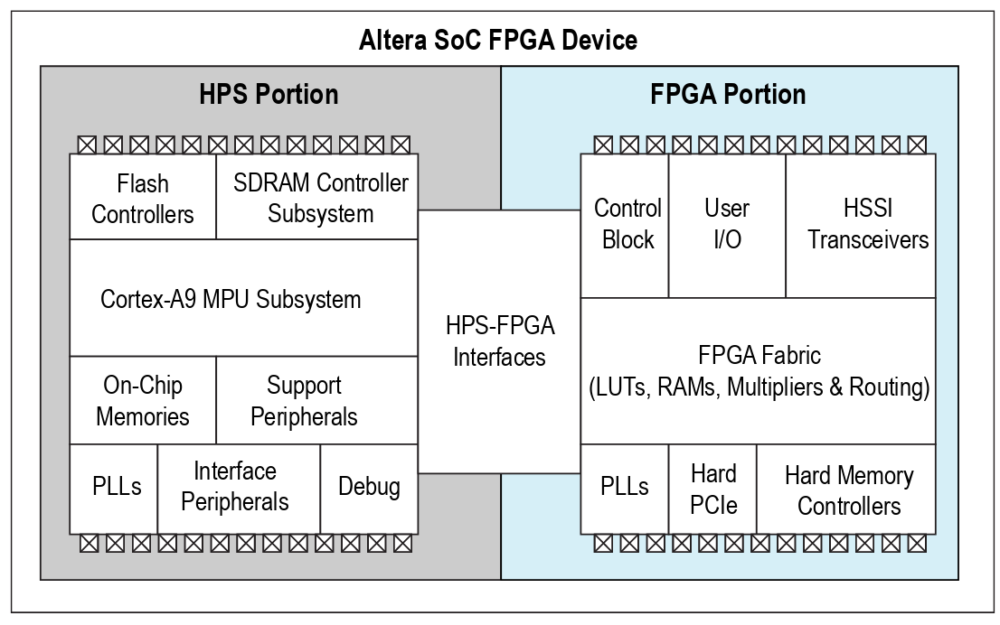

# Overview

The FPGA contained in the DE10-Standard kit is a SoC chip that has two distinct hardwares in a single device: an FPGA and a Hardware Process System (HPS). HPS is the term used by Intel-Altera to define the processing unit, which in our chip is an ARM A9 processor (which can be another ARM depending on the FPGA family).

The HPS has a processing unit with one or two cores (depending on the chip, in our case it is dual core) and some peripherals connected to its bus (DMA, UART, USB, EMACS, ...). In addition to the peripherals already included in the HPS, it is possible to connect new peripherals synthesized in the FPGA via the **HPS FPGA Interfaces**.

!!! exercise
    Take a look at Intel's official document: [1 Introduction to Cyclone V Hard Processor System (HPS)](https://people.ece.cornell.edu/land/courses/ece5760/DE1_SOC/HPS_INTRO_54001.pdf)

## FPGA Families

Altera has four families of [FPGAs-SoC](https://www.intel.com/content/www/us/en/products/programmable/soc.html):

- Stratix 10 SoC: High end, 14nm with ARM-Cortex-A53 64-bit quad-core
- Arria 10 SoC: 20nm, Cortex A9 dual-core with high FPGA capacity 
    - We have a kit in the lab
- Arria V SoC: 28nm, Cortex A9 focused on telecommunications
- **Cyclone V SoC**: Low-end family with lower value and lower power.

## Cortex A9

The Cortex A9 in the Cyclone V HPS has the following characteristics (taken from the [datasheet](https://www.intel.com/content/dam/www/programmable/us/en/pdfs/literature/hb/cyclone-v/cv_5v2.pdf)):

- ARM Cortex-A9 MPCore
   - One or two ARM Cortex-A9 processors in a cluster
   - [NEON SIMD coprocessor](https://en.wikipedia.org/wiki/ARM_architecture#Advanced_SIMD_(NEON)) and [VFPv3](https://en.wikipedia.org/wiki/ARM_architecture#Floating-point_(VFP)) per processor 
   - [Snoop Control Unit (SCU)](http://infocenter.arm.com/help/index.jsp?topic=/com.arm.doc.ddi0434c/CJHBABIC.html) to ensure coherency within the cluster
   - Accelerator coherency port (ACP) that accepts coherency memory access requests
   - Interrupt controller
   - One general-purpose timer and one watchdog timer per processor •
   - Debug and trace features
   - 32 KB instruction and 32 KB data level 1 (L1) caches per processor
   - Memory management unit (MMU) per processor
- ARM L2-310 level 2 (L2) cache
   - Shared 512 KB L2 cache

Below is a detailed diagram of the HPS:

## Connection between HPS and FPGA

Note that in the previous diagram, there are some interfaces defined in the "FPGA Portion". These interfaces allow the bridge between the FPGA Fabric and the ARM hard core of the chip. The interfaces are, briefly:

- FPGA to HPS: Bus on which a **Master** on the FPGA (Platform Designer) accesses the ARM
- HPS to FPGA: Bus through which ARM accesses a peripheral (slave) on the FPGA
- Lightweight HPS to FPGA: Bus with lower bandwidth that connects ARM to a peripheral on the FPGA (slave)
- 1-6 Masters SDRAM Controller: Allows the FPGA to read and write to the external SDRAM memory of the chip
 
### AXI

The buses are all of the type [AXI](https://en.wikipedia.org/wiki/Advanced_Microcontroller_Bus_Architecture), a standard defined by ARM and used in its microcontrollers. 

!!! note "AXI - AVALON"
    Via Platform Designer, we can connect peripherals with the Avalon (mm) bus to the ARM's AXI bus, which is possible due to a “magic” that PD performs by converting one bus to the other transparently to the user.

### SDRAM

SDRAM should be used with caution, as it will be shared with Linux running on ARM. If an FPGA peripheral accesses SDRAM "randomly," it can overwrite important kernel data and cause system failures. This allocation should be made at Linux boot, where we will tell which memory region the kernel can use.

!!! note 
    This memory accessible by both Linux and FPGA is a good way of sharing data to be processed.

## Applications

Now it is possible to combine the best of both worlds: FPGA flexibility and parallelism with the best of embedded processors: ARM.

Let's do a mental exercise and imagine an application that will process an image on an embedded system. With the SoC, we can have the image processed by the FPGA in order to increase the throughput of the system. This image would be read, for example, by a USB camera connected to the HPS (ARM). Since the HPS usually runs Linux, we have easy access to the driver for this device.

The image will then be read via the driver and allocated in SDRAM, the memory address as well as the processing properties will be transferred to a custom peripheral in the Fabric of the FPGA via the LT-AXI interface. The peripheral that is in wait mode, after being configured, starts reading the image in SDRAM, processing it, and saving the result in its own memory. At the end of the conversion, an interruption is generated and Linux will handle the data.

While the peripheral processes the image, the application can concurrently read a new image and allocate it to a new memory address, as the processing and acquisition now work simultaneously. This is called *ping-pong buffer*.

## Next steps

Now let's run Linux on the ARM. At this point, we'll work with an image that's already provided by the kit manufacturer. Go to the next tutorial, where we will configure our infrastructure to be able to generate code for ARM.
