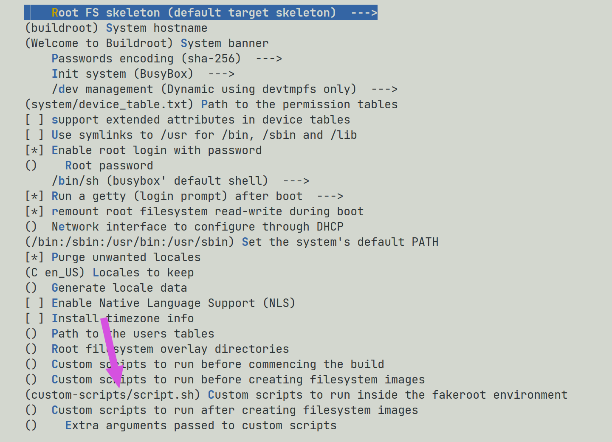

# Extra: buildroot scripts

Buildroot has a series of mechanisms to assist in the customization of the generated image:

- https://buildroot.org/downloads/manual/manual.html#_support_scripts

We will look at two types: 

- Using the overlay feature
- Modifying the files before generating the tar `fakeroot`

## overlay

It will copy files to the `/etc/init.d` folder, for this:

- Create a folder called `overlay` in the root of the buildroot
- Create a new file `S41static`
- Configure the `buildroot`:
    - `System Configuration` -> *Root filesystem overlay directories*: `overlay`
    
```bash title="overlay/S41static"
#!/bin/bash

case "$1" in
start)
    printf "Setting ip: "
    /sbin/ifconfig eth0 169.254.0.13 netmask 255.255.0.0 up
    [ $? = 0 ] && echo "OK" || echo "FAIL"
    ;; 
*)
    exit 1
    ;;
esac
```

Done, now every time we generate a new buildroot it will copy the script to initialize the network.

!!! tip
    Do the same with dropbear! 

## fakeroot

!!! info
    Not recommended for this case, but serves as an example

Let's create a script that will be executed before buildroot creates the `.tar`:

> Post-fakeroot scripts (BR2_ROOTFS_POST_FAKEROOT_SCRIPT)
>    When aggregating the final images, some parts of the process require root rights: creating device nodes in /dev, setting permissions or ownership to files and directories… To avoid requiring actual root rights, Buildroot uses fakeroot to simulate root rights. This is not a complete substitute for actually being root, but is enough for what Buildroot needs.

Create a folder in buildroot called `custom_script` and add two files:

```bash title="custom_script/script.sh"
#!/bin/sh

INIT=$1/etc/init.d/
FILE=S41static

echo "--------------------------------"
echo "BUILDROOT SCRIPT"

# static ip
cp custom-scripts/S41staticIp $INIT
chmod +x $INIT/S41staticIp

echo "--------------------------------"
```

```bash title="custom_script/S41static"
#!/bin/bash

case "$1" in
start)
    printf "Setting ip: "
    /sbin/ifconfig eth0 169.254.0.13 netmask 255.255.0.0 up
    [ $? = 0 ] && echo "OK" || echo "FAIL"
    ;; 
*)
    exit 1
    ;;
esac
```

Now we need to configure the buildroot to execute `script.py`, in:

- `System configuration/Custom scripts to run inside the fakeroot environment`
- `custom-scripts/script.sh`



Every time the `.tar` is generated, buildroot will create the network configuration file. 
