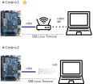
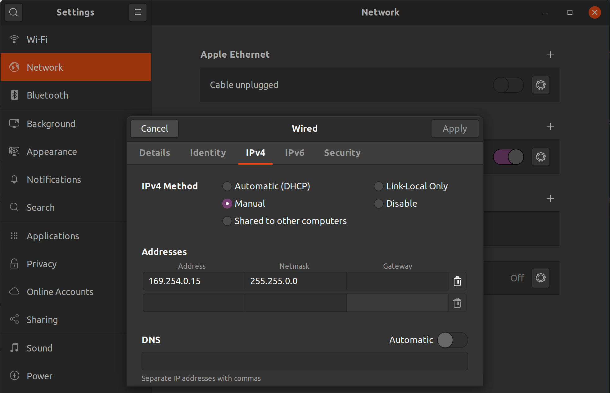

# Ethernet 

!!! note "Cyclone V Hard Processor System Technical Reference Manual"
    https://www.intel.com/content/dam/www/programmable/us/en/pdfs/literature/hb/cyclone-v/cv_54001.pdf

There are two possible scenarios: 

1. Connect the DE10-Standard to a router via network cable
1. Connect the DE10-Standard to your PC via a NIC (included with the kit)
 
{width=600}
    
## Scenario 1 - router

!!! tip
    If possible, choose this scenario.
     
{width=500}

Connect the board to the router and the PC to the router via wifi or cable.

Follow the steps below:

1. Connect the DE10-Standard via network cable to the router
1. Connect to the board via the USB-Serial port (screen)
1. Turn on the board (with the SDCARD)
1. Configure the target

### Configuring target

With an ethernet cable connected to the RJ45, we need to configure Linux to use this "port". On the `target`, check if Linux detects the network card, with the command: `ifconfig eth0 up`, and then `ifconfig all`. 

!!! note 
    Later we will understand how Linux knows there is an ethernet port.

### Requesting IP (DHCP)

Now we need to get an IP from the DHCP server (which is on your router), for this we will use the `udhcpc` program, with the following command:

``` bash
$ udhcpc eth0
```

To see the IP

```bash
$ ifconfig
```

### Testing

To test:21985

1. Ping ==Host --> Target== / ==Target --> Host== / ==Target --> internet==.
1. Check the IP with the `ifconfig` command and try to ping some site `ping google.com`.

## Scenario 2 - NIC

{width=500}

Connect the board to the computer via the NIC adapter:

1. Connect the DE10-Standard to the NIC 
1. Connect the NIC to your PC's USB
1. Connect to the board via the USB-Serial port (screen)
1. Turn on the board (with the SDCARD)
1. Configure your PC
1. Configure the target

### Configuring PC

We will have to configure a fixed IP on the ethernet port that the NIC creates on your PC's Linux.



### Configuring Target

Now on the target we will configure the network port to have a fixed IP:

```bash
$ ifconfig eth0 up
$ ifconfig eth0 169.254.0.13 netmask 255.255.0.0 up
```
 
### Testing

To test, let's ping Host --> Target and Target --> Host.

!!! tip
    It's important to validate before proceeding.

## Automating at boot

These settings are not persistent, if you restart the embedded Linux you will have to do everything again. To make our life easier, we will execute this at boot.

### RC

Have you noticed the `/etc/rc*` folders in your operating system? That's where most of the scripts that are executed at boot/reboot/halt reside. Each distribution uses the scripts differently, for example, Debian uses them in the following way:

- https://wiki.debian.org/BootProcess

| runlevel | directory           | meaning                                                                                                                                     |
|----------|---------------------|---------------------------------------------------------------------------------------------------------------------------------------------|
| N        | none                | System bootup (NONE). There is no `/etc/rcN.d/` directory.                                                                                    |
| 0        | `/etc/rc0.d/`         | Halt the system.                                                                                                                            |
| S        | `/etc/rcS.d/`         | Single-user mode on boot. The lower case s can be used as alias.                                                                            |
| 1        | `/etc/rc1.d/`         | Single-user mode switched from multi-user mode.                                                                                             |
| 2 .. 5   | `/etc/rc{2,3,4,5}.d/` | Multi-user mode. The Debian system does not pre-assign any special meaning differences among these.                                         |
| 6        | `/etc/rc6.d/`         | Reboot the system.                                                                                                                          |
| 7 .. 9   | `/etc/rc{7,8,9}.d/`   | Valid multi-user mode but traditional Unix variants don’t use. Their `/etc/rc?.d/` directories are not populated when packages are installed.  |

Inside each `rc.x` folder, the scripts have names that dictate the sequence in which the scripts in the folder will be called.

## Adding script to boot - systemd

Create a script named `S60MAC.sh` in the `/etc/init.d` folder and add the following code (depends on which scenario you will use):

=== "Scenario 1"
    ```bash
    #!/bin/sh

    case "$1" in
    start)
            start
            ifconfig eth0 up
            ifconfig eth0 169.254.0.13 netmask 255.255.0.0 up
            ;;
    stop)
            stop
            ifconfig eth0 down
            ;;
    restart|reload)
            restart
            ;;
    *)
            echo "Usage: $0 {start|stop|restart}"
            exit 1
    esac
    ```
    
=== "Scenario 2"
    ```bash
    #!/bin/bash
    
    case "$1" in
    start)
        printf "Setting ip: "
        /sbin/ifconfig eth0 169.254.0.13 netmask 255.255.0.0 up
        [ $? = 0 ] && echo "OK" || echo "FAIL"
        ;; 
    *)
        exit 1
        ;;
    esac
    ```

Make the script is executable: `chmod +x S60MAC.sh`. Once the script is created, it will need to be added to the system startup,
for this we must call (when the iso uses systemd, which is the case of Amstrong, but not buildroot):

```bash
$ systemctl enable S60MAC.sh
```

- ref: https://forums.kali.org/showthread.php?21985-How-to-make-mac-address-random-at-each-boot-up

## Changing the MAC

It may necessary to change the MAC address to connect to the lab's network, it will be necessary to edit the board's MAC, otherwise it will not be able to connect. To do this, execute the following commands:

```bash
$ ifconfig eth0 down
$ ifconfig eth0 hw ether 02:01:02:03:04:08
$ ifconfig eth0 up
```

!!! note
    You will need to edit the MAC  `02:01:02:03:04:08` to the one provided by the professor

!!! warning
    This MAC should only be used on the development kit and during the development of the projects. Misuse will be considered a breach of ethics.

