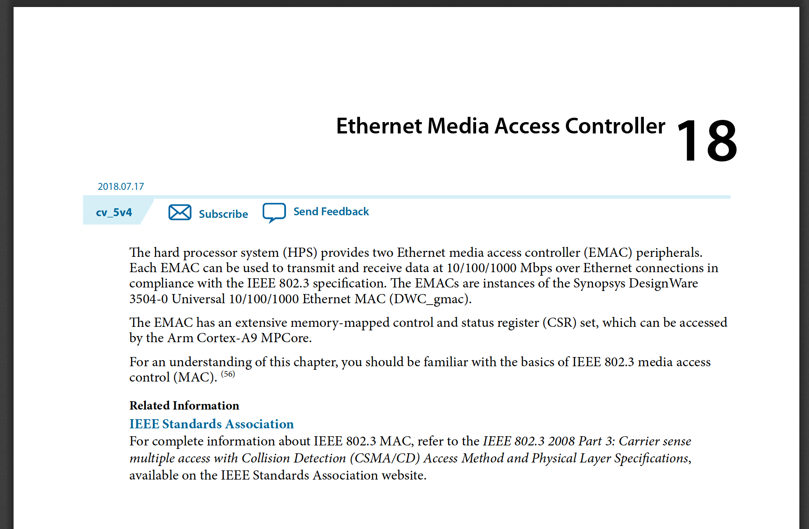

# Info - HPS - Ethernet 

!!! note "Cyclone V Hard Processor System Technical Reference Manual"
    https://www.intel.com/content/dam/www/programmable/us/en/pdfs/literature/hb/cyclone-v/cv_54001.pdf

## Hardawre

O ARM do nosso HPS possui um periférico Ethernet: 



E o nosso kit possui toda a parte eletrônica que conecta o periférico ao conector Ethernet:


## Linux

Com o HW da terasic preparado, e com um cabo ethernet conectado ao RJ45, precisamos configurar o Linux para utilizar essa "porta".

No `target`, verifique que o linux detecta a placa de rede, com o comando `ifconfig`: 


### Alterando o MAC

Para conectar na rede do laboratório de Arq. será necessário editar o MAC da placa, caso contrário o mesmo não poderá se conectar. Para isso, execute os comandos a seguir:

```bash
$ ifconfig eth0 down
$ ifconfig eth0 hw ether 02:01:02:03:04:08
$ ifconfig eth0 up
```

!!! note
    Será necessário editar o MAC  `02:01:02:03:04:08` para o que foi fornecido pelo professor

!!! warning
    Esse MAC só deverá ser utilizado no kit de desenvolvimento e durante o desenvolvimento dos projetos. O uso indevido será considerado código de ética.
    
### Requisitando IP (DHCP)

Com o MAC configurado é necessário buscar um IP no servidor de DHCP, para isso utilizaremos o programa `udhcpc`

``` bash
$ udhcpc eth0
```

Verifique o IP com o comando `ifconfig` e tente pingar algum site `ping google.com`.

## Automatizando no boot

Essas configurações não são persistentes, se reiniciar o linux embarcados terá que fazer tudo novamente. Para facilitar nossa vida, vamos executar isso no boot.

### RC

Já reparou nas pastas `/etc/rc*` do seu sistema operacional? É lá que reside grande parte dos scripts que são executados no boot/ reboot/ halt. Cada distribuição utiliza de forma diferente os scripts, por exemplo, o debian utiliza da seguinte forma:

- https://wiki.debian.org/BootProcess

| runlevel | directory           | meaning                                                                                                                                     |
|----------|---------------------|---------------------------------------------------------------------------------------------------------------------------------------------|
| N        | none                | System bootup (NONE). There is no `/etc/rcN.d/` directory.                                                                                    |
| 0        | /etc/rc0.d/         | Halt the system.                                                                                                                            |
| S        | /etc/rcS.d/         | Single-user mode on boot. The lower case s can be used as alias.                                                                            |
| 1        | /etc/rc1.d/         | Single-user mode switched from multi-user mode.                                                                                             |
| 2 .. 5   | /etc/rc{2,3,4,5}.d/ | Multi-user mode. The Debian system does not pre-assign any special meaning differences among these.                                         |
| 6        | /etc/rc6.d/         | Reboot the system.                                                                                                                          |
| 7 .. 9   | /etc/rc{7,8,9}.d/   | Valid multi-user mode but traditional Unix variants don’t use. Their `/etc/rc?.d/` directories are not populated when packages are installed.  |

Dentro de cada pasta `rc.x` os scripts possuem nomes que ditam a sequência na qual os scripts da pasta serão chamados.

## Adicionando script ao boot

1. Crie um script com o nome `S60MAC.sh` na pasta `/etc/init.d` e adicione:

```bash
### Change mac
#!/bin/bash

case "$1" in
  start)
    ifconfig eth0 down
    ifconfig eth0 hw ether 02:01:02:03:04:08
    ifconfig eth0 up
    udchpc eth0
    ;;
  *)
    exit 1
    ;;
```

!!! note ""
    O script deve ser executável: `chmod +x S60MAC.sh`

Uma vez criado o script será necessário adicionar a inicialização do sistema,
para isso devemos chamar (quando a iso utiliza systemd, que é o caso do
Amstrong, mas não do buildroot):

```bash
$ systemctl enable S60MAC.sh
```

- ref: https://forums.kali.org/showthread.php?21985-How-to-make-mac-address-random-at-each-boot-up
